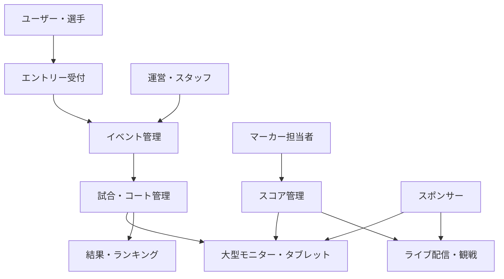

# プロジェクト概要

## 1. プロジェクト名

**Squash Platform**

- 日本語表記: `スカッシュ　プラットフォーム`
- 英語表記: `Squash Platform`
- 提供元表示: 日本語画面では`提供：株式会社未来創社`をフッター等へ控えめに表示する。英語画面は`Provided by Miraisosha Co., Ltd.`を初期案とし、正式な英文商号を確認した場合はその表記へ統一する。提供元名はシステム名や大会情報より前面に出さない。
- 画面、文書、通知等でシステム名を表示する場合は、表示言語に応じて上記の名称を使用する。
- リポジトリ名、ドメイン、既存の内部識別子はシステム表示名とは分けて扱い、名称変更だけを理由に変更しない。

- GitHubリポジトリ: `Miraisosha/S-NICK-Platform`
- 大会運営システム: `platform.s-nick.com`

## 2. 目的

Squash Platformは、スカッシュ大会の企画、運営、試合進行、スコア管理、ライブ配信、結果公開までを一元的に支援する統合プラットフォームです。

運営者による情報の重複入力を減らし、選手、スタッフ、観客へ同じ情報を適切な画面で届けることを目指します。

## 3. 想定する利用者

| 利用者 | 主な利用内容 | 状態 |
|---|---|---|
| 一般ユーザー | ユーザー登録、ログイン、イベント閲覧 | 構想あり |
| 参加者・選手 | エントリー、通知確認、ドロー・試合状況確認 | 構想あり |
| 運営 | イベント、カテゴリ、選手、ドロー、試合の管理 | 構想あり |
| スタッフ | 招待されたイベントの運営業務 | 構想あり |
| マーカー担当者 | 試合スコアの入力 | 構想あり |
| 観客 | 試合状況、得点、ライブ配信、結果の閲覧 | 構想あり |
| スポンサー | ロゴ等の掲出 | 登録・表示機能を構想 |

認証は共通アカウントで行い、同一人物がイベントごとに所有者、運営者、スタッフ、マーカー、選手等の複数の役割を持てるようにします。スタッフ権限は登録済みユーザーへのイベント単位の招待・本人承諾・固定ロール・担当範囲によって付与します。

## 4. サービス全体像

## 5. サービスドメイン

| URL | 役割 |
|---|---|
| `platform.s-nick.com` | 大会運営システム |
| `entry.s-nick.com` | エントリー受付 |
| `live.s-nick.com` | ライブ配信・観戦 |
| `ranking.s-nick.com` | ランキング |
| `insurance.s-nick.com` | 保険申込 |
| `api.s-nick.com` | API |

初期構成は単一アプリケーション・単一データベースとします。CakePHPバックエンドと共通のイベント・試合・得点データを利用し、URL、メニュー、権限、Vue.js画面を利用者別に分けます。利用者別画面ごとに独立した試合状態やデータベースを持たせません。

## 6. フェーズ1の目標

フェーズ1では、次の成果を目標とします。

- イベント運営に必要な基本情報を管理できる
- マーカーが試合の得点を入力できる
- 観客がタブレットまたは大型モニターでリアルタイム得点を確認できる
- 運営者が選手を手動登録し、ドロー、スケジュール、試合結果まで管理できる
- マーカーが通信断中も操作を継続し、ブラウザを閉じた後に状態を復元できる

## 7. 成功条件

詳細な数値目標は検討中です。初期実証では、少なくとも次を確認します。

- 2コートを同時に運用できること
- 得点入力と表示・配信オーバーレイが実用的な時間で同期すること
- 大会時間帯に長時間の配信を継続できること
- 一時的な通信障害があってもローカル録画が残ること
- 運営者が無理なく設定・切替できること
