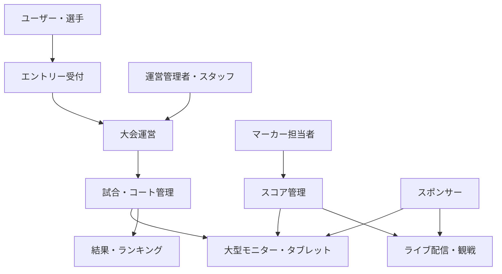

# プロジェクト概要

## 1. プロジェクト名

**S-NICK Platform**

- GitHubリポジトリ: `Miraisosha/S-NICK-Platform`
- 大会運営システム: `platform.s-nick.com`

## 2. 目的

S-NICK Platformは、スカッシュイベント・大会の企画、運営、試合進行、スコア管理、ライブ配信、結果公開までを一元的に支援する統合プラットフォームです。

運営者による情報の重複入力を減らし、選手、スタッフ、観客へ同じ情報を適切な画面で届けることを目指します。

## 3. 想定する利用者

| 利用者 | 主な利用内容 | 状態 |
|---|---|---|
| 一般ユーザー | ユーザー登録、ログイン、イベント閲覧 | 構想あり |
| 参加者・選手 | エントリー、通知確認、ドロー・試合状況確認 | 構想あり |
| イベント運営管理者 | イベント、カテゴリー、選手、ドロー、試合の管理 | 構想あり |
| スタッフ | 担当イベントの運営業務 | 構想あり |
| マーカー担当者 | 試合スコアの入力 | 構想あり |
| 観客 | 試合状況、得点、ライブ配信、結果の閲覧 | 構想あり |
| スポンサー | ロゴ等の掲出 | 登録・表示機能を構想 |

利用者ごとの権限、承認手順、同一人物が複数の役割を持つ場合の扱いは検討中です。

## 4. サービス全体像

## 5. サービスドメイン

| URL | 役割 |
|---|---|
| `platform.s-nick.com` | 大会運営システム |
| `entry.s-nick.com` | エントリー受付 |
| `live.s-nick.com` | ライブ配信・観戦 |
| `ranking.s-nick.com` | ランキング |
| `insurance.s-nick.com` | 保険申込 |
| `api.s-nick.com` | API |

各サブドメインを別アプリケーションとして実装するか、単一アプリケーションの機能として提供するかは検討中です。

## 6. 初期目標

初期リリースでは、次の成果を目標とします。

- イベント運営に必要な基本情報を管理できる
- マーカーが試合の得点を入力できる
- 観客がタブレットまたは大型モニターでリアルタイム得点を確認できる
- 2コートをそれぞれ独立したYouTubeライブとして同時配信できる
- OBS映像に得点、選手名、ゲーム数、大会ロゴ、スポンサーを表示できる

## 7. 成功条件

詳細な数値目標は検討中です。初期実証では、少なくとも次を確認します。

- 2コートを同時に運用できること
- 得点入力と表示・配信オーバーレイが実用的な時間で同期すること
- 大会時間帯に長時間の配信を継続できること
- 一時的な通信障害があってもローカル録画が残ること
- 運営者が無理なく設定・切替できること
