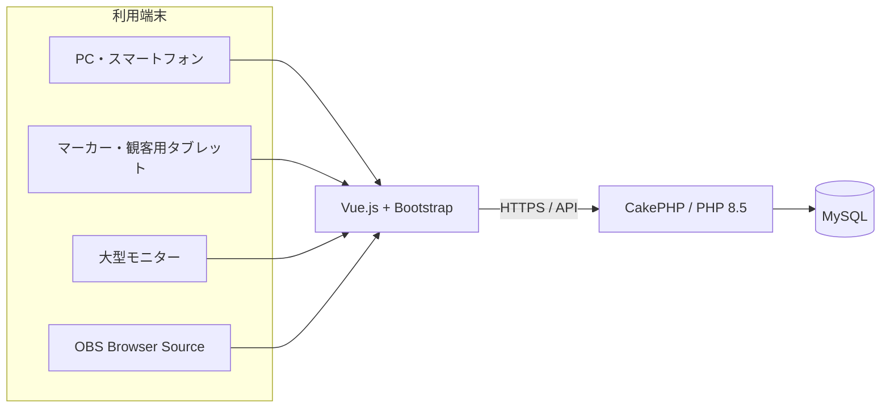
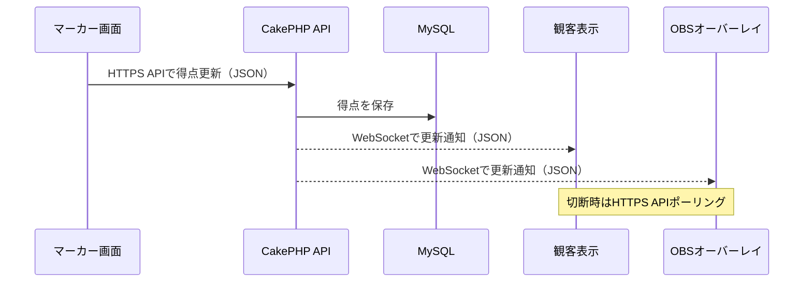

# システム構成

## 1. 決定済みの技術構成

| 区分 | 採用内容 |
|---|---|
| 本番ホスティング | お名前.com レンタルサーバー RSプラン |
| サーバー接続 | SSH（接続確認済み） |
| バックエンド | PHP 8.5 / CakePHP 5.4 |
| フロントエンド | Vue.js 3.5 / Bootstrap 5.3 / Vite 8 |
| データベース | MySQL |
| 地図・位置情報 | Google Maps Platform Map Tiles API／Geocoding APIまたはPlaces API／OpenLayers |
| ソース管理 | GitHub |
| リポジトリ | `Miraisosha/S-NICK-Platform` |

ローカル開発ではNode.js 24、MySQL 8.4 LTSを使用します。本番MySQLのバージョンは接続試験後に確定します。

Google Maps PlatformのMap Tiles APIをGoogle背景地図として使用し、画面の描画・操作にはOpenLayersを使用します。住所検索・座標取得にはGeocoding APIまたはPlaces APIを使用し、結果を同じGoogle背景地図上へ表示します。Googleロゴとデータ帰属表示、キャッシュ制限、APIキー制限等のポリシーを遵守し、実装前に料金と最新の利用条件を再確認します。

## 2. 論理構成

バックエンドはCakePHP1つ、MySQLデータベース1つからなる単一APIアプリケーションとします。`public`、`operator`、`marker`、`player`、`admin`は利用者別のURL・画面・権限区分であり、別々の業務データや試合状態を持つ独立システムではありません。

FRONT（ブラウザ画面、Vue.js）とAPI（JSON、CakePHP）は同一リポジトリで管理しつつ、ソース・ビルド・配備を分離します。APIはCakePHPプロジェクトとして`app/`に配置し、`/api/v1/...`のJSON APIのみを提供します（API Controllerは`app/src/Controller/Api/V1`）。FRONTはリポジトリ直下の`frontend/`にNode.js/Viteで独立したVue.jsプロジェクトとして配置し、Node.jsでコンパイル・最適化した静的ファイルとして配備します。本番では`platform.s-nick.com`（FRONT）と`api.s-nick.com`（API）のサブドメイン分離を前提とし、CORSとセッションCookieの共有ドメイン設定（`.s-nick.com`）でAPI呼び出しを許可します。詳細な配置規約は[システムアーキテクチャ仕様](specifications/010_SystemArchitecture.md#ディレクトリとapifrontの分離)を正本とします。

## 3. 画面の用途

同じ試合データを、用途別の画面で表示します。

| 画面 | 主な利用者 | 特徴 |
|---|---|---|
| 管理画面 | 運営・スタッフ | イベント、カテゴリ、選手、試合、コート等の設定 |
| マーカー画面 | マーカー担当者 | タップしやすい得点入力 |
| 観客表示画面 | 観客 | タブレット・大型モニター向け全画面表示 |
| OBSオーバーレイ | 配信担当者 | 背景透過、映像上に重ねる情報だけを表示 |
| 公開画面 | 選手・観客 | エントリー、ドロー、結果、ライブ情報 |

## 4. リアルタイム更新

リアルタイム更新は、WebSocketを基本方式、HTTPS APIポーリングを代替方式とします。WebSocket上で送受信するアプリケーションデータにはJSONを使用します。

- マーカーの得点・判定操作は、通常のHTTPS APIへJSONで送信し、サーバーで保存・確定します。
- 保存後、サーバーはWebSocketでJSON形式の更新通知を大型表示、OBS、一覧画面等へ配信します。
- WebSocketが切断または利用できない場合、表示側は数秒間隔のHTTPS APIポーリングへ自動的に切り替えます。
- WebSocket再接続時はHTTPS APIから最新状態を再取得し、通知の欠落や重複を補正します。
- 本番では暗号化された`wss://`接続を使用します。
- 採用ライブラリ、常駐プロセスまたは外部配信基盤、お名前.com RSプランでの利用可否は、基本設計時の接続試験で確定します。

マーカーは完全オフライン対応とし、事前取得した試合、選手、競技設定と確定状態を端末へ保持します。得点等の操作は端末内へ永続保存し、通信復旧後に順序を維持してHTTPS APIへ同期します。ブラウザを閉じても、同じ端末・ブラウザで直前状態から再開できるようにします。WebSocketは更新通知に使用し、得点データの唯一の保存先にはしません。オフライン競合制御と許容遅延の詳細は基本設計で確定します。

## 5. 本番配置

- 本番URLは `platform.s-nick.com` を使用します。
- SSH接続は、既存のS-NICKイベント保険加入フォームで確認済みの方法を参考にします。
- SSH鍵、ユーザー名、パス、データベース接続情報などの秘密情報はリポジトリへ保存しません。
- Vue.jsはGitHub Actionsでビルドし、PHP依存関係とともにSSH・rsyncでRSプランへ同期します。詳細は[GitHub Actionsによる本番デプロイ](08_deployment.md)を参照します。
- 開発・検証・本番環境の分離方法は検討中です。

## 6. 非機能要件として検討する事項

- 認証と権限管理
- 個人情報・パスワードの保護
- バックアップと復旧（紙記録の一括登録と指定時点復旧の高度化は将来導入）
- 操作履歴・監査ログ
- 同時アクセス数と性能
- 障害監視
- アクセシビリティ
- タブレット・大型モニターへのレスポンシブ対応
- OBS Browser Sourceでの安定動作
