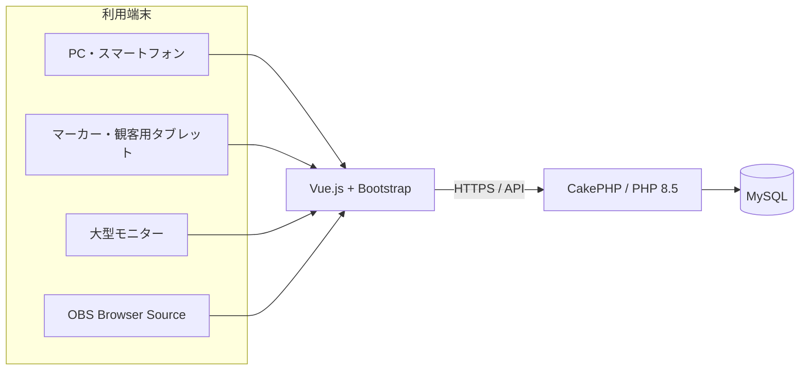
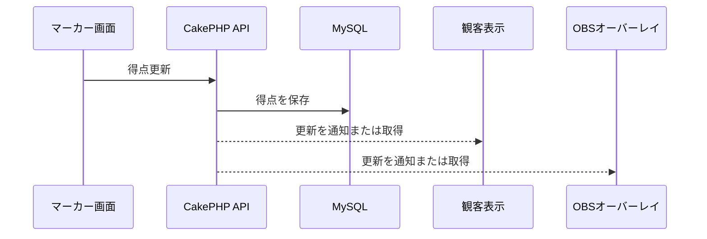

# システム構成

## 1. 決定済みの技術構成

| 区分 | 採用内容 |
|---|---|
| 本番ホスティング | お名前.com レンタルサーバー RSプラン |
| サーバー接続 | SSH（接続確認済み） |
| バックエンド | PHP 8.5 / CakePHP |
| フロントエンド | Vue.js / Bootstrap |
| データベース | MySQL |
| ソース管理 | GitHub |
| リポジトリ | `Miraisosha/S-NICK-Platform` |

CakePHP、Vue.js、Bootstrap、MySQL、Node.jsなどの詳細バージョンは検討中です。

## 2. 論理構成

## 3. 画面の用途

同じ試合データを、用途別の画面で表示します。

| 画面 | 主な利用者 | 特徴 |
|---|---|---|
| 管理画面 | 運営管理者・スタッフ | イベント、選手、試合、コート等の設定 |
| マーカー画面 | マーカー担当者 | タップしやすい得点入力 |
| 観客表示画面 | 観客 | タブレット・大型モニター向け全画面表示 |
| OBSオーバーレイ | 配信担当者 | 背景透過、映像上に重ねる情報だけを表示 |
| 公開画面 | 選手・観客 | エントリー、ドロー、結果、ライブ情報 |

## 4. リアルタイム更新

得点入力から表示までの候補は次のとおりです。採用方式は、お名前.com RSプランの常駐プロセス等の制約を確認して決定します。

1. WebSocket
2. Server-Sent Events
3. 1秒程度のAPIポーリング
4. 外部リアルタイムサービス

更新方式、競合制御、オフライン時の扱い、許容遅延は検討中です。

## 5. 本番配置

- 本番URLは `platform.s-nick.com` を使用します。
- SSH接続は、既存のS-NICKイベント保険加入フォームで確認済みの方法を参考にします。
- SSH鍵、ユーザー名、パス、データベース接続情報などの秘密情報はリポジトリへ保存しません。
- Vue.jsのビルド場所、CakePHPとの統合方法、GitHubから本番へのデプロイ方法は検討中です。
- 開発・検証・本番環境の分離方法は検討中です。

## 6. 非機能要件として検討する事項

- 認証と権限管理
- 個人情報・パスワードの保護
- バックアップと復旧
- 操作履歴・監査ログ
- 同時アクセス数と性能
- 障害監視
- アクセシビリティ
- タブレット・大型モニターへのレスポンシブ対応
- OBS Browser Sourceでの安定動作
