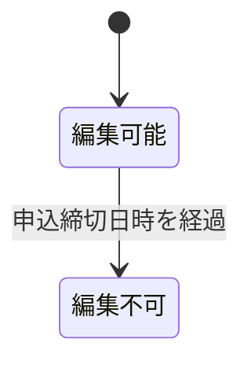
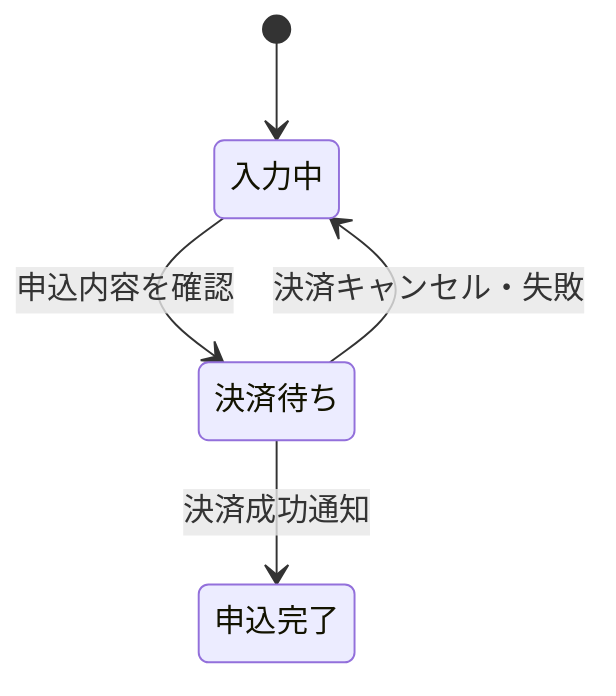
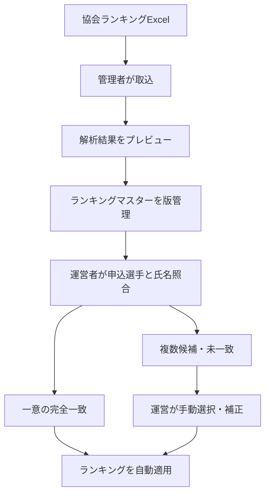
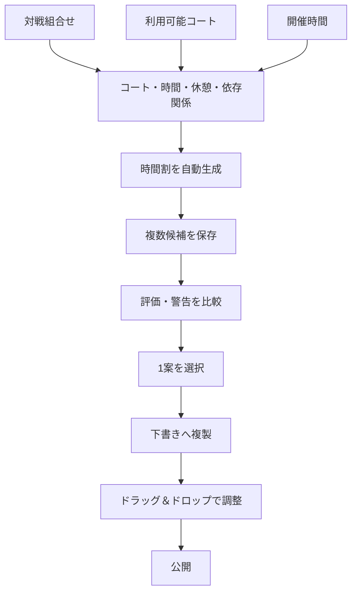
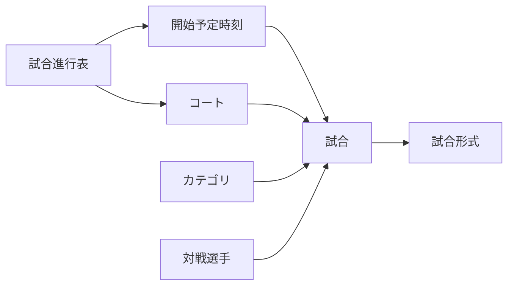
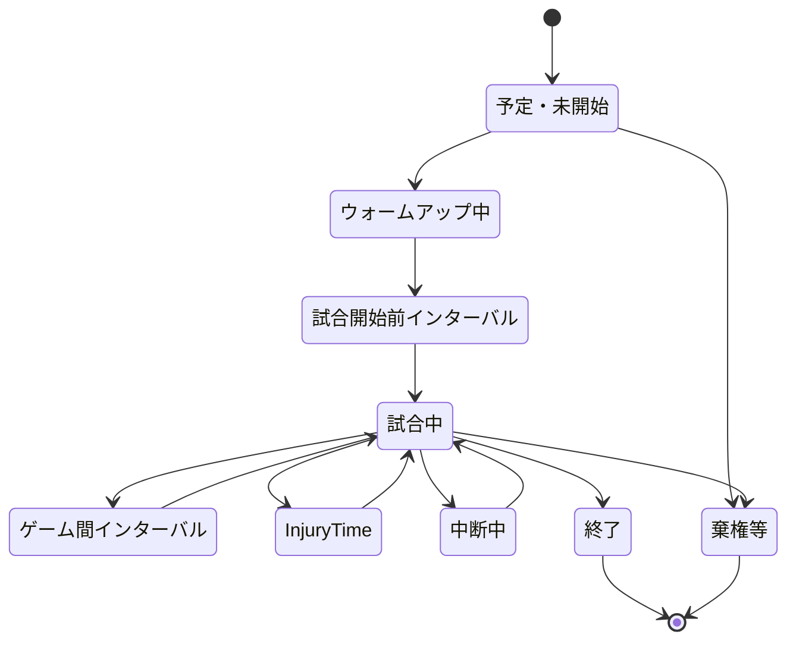
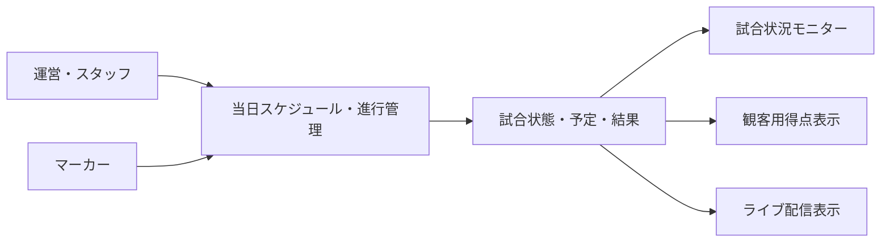
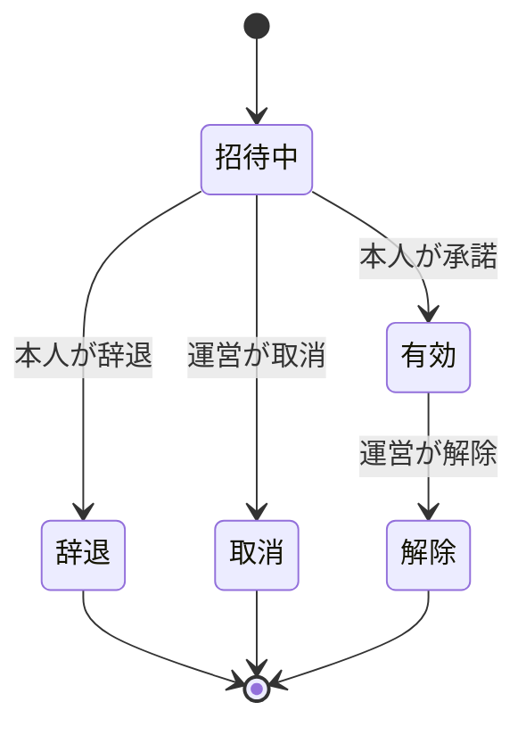
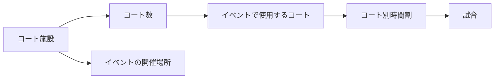

# サービス・業務領域計画

## 1. 方針

本書は、現在想定している機能を業務領域ごとに整理したものです。画面、データ項目、権限、処理手順の詳細は検討中です。

### 1.1 用語定義

業務データの階層を次のように定義します。大会・開催単位を表す最上位データと画面表示名は「イベント」に統一します。

| 用語 | 定義 | 例 |
|---|---|---|
| イベント | 一つの大会・開催単位を表す最上位データ | S-NICK OPEN 2026 |
| カテゴリ | イベント内の競技区分 | 選手権男子、フレンドシップ女子 |
| 試合 | カテゴリ内で選手同士が対戦する単位 | 選手権男子 予選1試合目 Aさん vs Bさん |
| ゲーム | 一つの試合を構成する得点単位 | 5ゲームマッチを構成する各ゲーム |
| 施設 | 試合を実施する場所 | 施設名（例：ダブルブルー） |
| コート | 施設が所有するコート | Aコート/Bコート |


関係は次のとおりです。

- 一つのイベントは複数のカテゴリを持ちます。
- 一つのカテゴリは複数の試合を持ちます。
- 一つの試合は複数のゲームを持ちます。
- 一つの試合には、実施するコートと開始予定時刻を割り当てます。
- 5ゲームマッチ等の試合形式は、試合に設定します。

例:

```text
イベント
└─ 選手権男子
   └─ 予選1試合目: Aさん vs Bさん
      ├─ 試合形式: 5ゲームマッチ
      └─ 施設: ルネサンス蕨
         └─ コート: Aコート
             └─ ゲーム: 最大5ゲーム
```

## 2. ユーザー・認証

| 機能 | 目的・概要 | 状態・検討事項 |
|---|---|---|
| ユーザー登録 | メールアドレスとパスワードで登録し、確認メールで本人確認する | 内部ユーザーIDは自動生成 |
| パスワードを忘れた方 | メールアドレスへ使い捨て再設定URLを送信する | URLの有効期限は60分 |
| ログイン認証 | 確認済みメールアドレスとパスワードで認証する | 5回連続失敗時は30分停止 |
| 自動ログイン | 次回以降のログイン操作を簡略化 | 有効期間は30日 |

二要素認証は導入方針とします。ただしPCだけに要求すると端末種別の偽装で回避されるため、適用条件は引き続き検討します。スマートフォン・タブレットでは、初回または未信頼端末で二要素認証を行い、その後は取消可能な信頼済み端末として一定期間入力を省略する方式を推奨候補とします。外部認証の利用は検討中です。

ログイン停止中に同じアカウントへの認証がさらに失敗した場合は、その失敗時刻から30分後まで停止期限を延長します。接続元単位のレート制限を併用し、第三者による意図的な停止の継続を抑制します。

### 2.1 アカウント設定

すべての利用者は共通のユーザーアカウントでログインします。選手専用の認証情報は作成せず、イベントごとの参加・運営・スタッフの関係に応じた機能を表示します。

- プロフィール編集
- メールアドレス変更
- パスワード変更
- パスワードを忘れた場合
- 自動ログインの管理
- ログイン端末管理
- 退会申請

パスワードを忘れた場合の再設定は、選手、運営、スタッフで共通の機能を使用します。

運営者向けユーザー設定と選手画面の両方から共通の退会画面を利用できるようにします。退会時は再認証と最終確認を行い、全端末セッションと自動ログインを無効化します。退会アカウントは論理削除し、過去の申込、試合結果、操作履歴と当時の表示名等は大会記録・監査履歴として保持します。同じメールアドレスによる再登録方法と具体的な保存期間は将来検討とします。管理者による利用停止は退会と分け、管理者画面からのみ実行します。

同一アカウントではPC、スマートフォン、タブレット等の最大5件の端末セッションを同時に利用できます。6件目のログインでは、利用者が既存セッションを1件選んでログアウトした後に新しいセッションを開始します。同一ブラウザの複数タブは1件として扱います。通常セッションは最後の操作から9時間で無操作タイムアウトとし、最大継続時間は引き続き検討します。

セッション一覧には取得可能な範囲で端末種別、OS、ブラウザ、初回ログイン、最終利用、IPアドレス、IPアドレスから推定する国・地域、現在端末、自動ログイン状態を表示します。正確な端末名や位置を取得できない場合は不明または概算と表示し、GPS等の正確な位置や永続的な端末指紋はこの目的だけには取得しません。

### 2.2 プロフィール編集

プロフィールはユーザー本人だけが編集できます。サイト管理者によるユーザーの停止・削除は、プロフィール編集とは別の管理機能として扱います。

| 項目 | 必須 | 仕様 |
|---|:---:|---|
| プロフィール写真 | - | 顔写真等をアップロード可能 |
| マイカラー | - | カラーピッカーから選択 |
| 氏名 | ○ | 姓名を分割せず、本人の言語・文化に合った順序と文字で入力 |
| 表示名 | - | ドロー、得点表示、ライブ配信等に使用。未入力時は氏名を使用 |
| 氏名読み | - | 読み方・発音の補助。カタカナに限定しない |
| メールアドレス | ○ | 登録済み情報を表示し、専用画面から変更 |
| 性別 | ○ | 男性、女性、その他、回答しない |
| 国・地域 | - | 住所を入力する場合に選択 |
| 郵便番号 | - | 国・地域ごとの形式を文字列で保持 |
| 住所 | - | 市区町村、番地、建物名等を複数行入力 |
| 電話番号 | - | 国番号を含めて入力可能 |
| 緊急連絡先氏名 | - | 緊急時の連絡相手 |
| 緊急連絡先との関係 | - | 続柄・関係 |
| 緊急連絡先電話番号 | - | 国番号を含めて入力可能 |

氏名、表示名、氏名読みには特定言語の文字種や姓名順を強制しません。住所はプロフィール登録時の必須項目にせず、イベントの申込で必要な場合だけ申込フォームで必須化します。

メールアドレス変更とパスワード変更は、プロフィール編集とは別画面で行います。新しいメールアドレスは確認用URLによる確認が完了してから有効にし、それまでは現在のメールアドレスを維持します。

メールアドレス変更にはユーザー登録と同じ重複判定、60分の確認URL、60秒の再送間隔、直近24時間5回までの送信上限を適用します。未確認の変更要求は24時間後に取消状態として論理削除し、利用者がそれ以前に取り消した場合も確認URLを無効化します。

#### プロフィール写真

- 端末内の画像選択またはカメラ撮影から登録できます。
- 正方形に切り抜き、プレビューしてから保存します。
- 画像の変更と削除ができます。
- JPEG、PNG、WebPを対応候補とし、最大ファイルサイズは5MBを候補とします。
- サーバー側で画像形式とサイズを検証し、表示用の縮小画像を生成します。
- 撮影場所等が含まれる可能性がある画像メタデータを削除して保存します。
- 未登録または削除時は、マイカラーと氏名の頭文字から初期アイコンを表示します。
- プロフィール写真は、将来パブリック画面へ表示可能な公開用画像として扱います。
- 初期リリースでは運営者画像を表示するパブリック画面を設けず、プロフィール編集画面の確認表示だけを対象とします。
- 将来、主催者紹介、運営者紹介、スタッフ紹介等で表示を開始する際は、表示場所と目的を画面上で案内します。

## 3. メニュー・ダッシュボード

イベント管理、試合管理、スタッフ権限、通知等の仕様に応じて内容が変わるため、本機能の詳細化は後回しとし、他の主要機能が固まった段階で再設計します。

以下は確定仕様ではなく、再検討時の参考候補です。

- 最近利用したイベント
- 開催中または近日開催予定の注目試合
- 担当中の業務
- 重要な通知

画面構成、表示項目、優先順位、「注目試合」の選定基準、表示順、利用者ごとの出し分けは検討保留です。

## 4. イベント管理

イベントの基本情報と運営に必要な関連情報を一元管理します。

### 4.1 イベント基本情報

イベント管理では、一覧・基本情報詳細・新規登録・編集を別画面として提供します。フェーズ1は下書き機能を設けず、必須項目を満たして登録するとそのまま公開します。将来のライフサイクル拡張に備えて状態を保持できる構造とし、編集では権限と影響範囲に応じた制限・変更履歴を適用します。

| 項目 | 必須 | 仕様 |
|---|:---:|---|
| イベント名 | ○ | イベントの名称 |
| サブタイトル | ○ | イベント名を補足する名称 |
| 開催期間 | ○ | 開催開始日時と開催終了日時 |
| 申込期間 | ○ | 申込開始日時と申込締切日時 |
| 場所・使用コート | ○ | コート管理で登録されたコートを一覧表示し、複数選択可能 |
| 代表メールアドレス | ○ | イベントに関する代表連絡先メールアドレス |
| 連絡先 | - | 電話番号等の連絡先 |
| イベント画像 | - | イベントを表す画像 |
| 備考 | - | 補足事項 |

開催終了日時は開催開始日時以降、申込締切日時は申込開始日時以降とします。申込期間と開催期間の前後関係に関する追加制約は検討中です。

#### 申込締切後の編集制限

現在日時が申込締切日時を過ぎたイベントは、イベント基本情報を修正できません。



- 編集画面を読み取り専用で表示します。
- 更新APIでも申込締切日時を再確認し、画面を経由しない更新を拒否します。
- 申込締切後の管理者による例外解除、訂正方法、変更履歴の扱いは検討中です。
- 将来は、下書き、申込受付中、申込締切、ドロー公開、開催中、結果確定、終了・アーカイブ、中止、延期、再開を扱います。フェーズ1では登録時に公開状態を自動設定し、状態を選択する画面は設けません。

### 4.2 カテゴリ

イベント内に複数のカテゴリを作成します。カテゴリはイベント基本情報・詳細に紐づき、一覧から登録、編集、削除、表示順変更、公開・非公開切替を行います。

例:

- 選手権男子
- 選手権女子
- フレンドシップ男子
- フレンドシップ女子
- 新人男子
- 新人女子

カテゴリでは、配下の試合へ適用する試合形式を設定します。

| 項目 | 仕様 |
|---|---|
| カテゴリ名 | 同一イベント内で重複できない名称 |
| 性別 | 男性、女性、なしから選択 |
| 年齢 | 最低年齢・最高年齢を数値入力。片方だけでも設定可能 |
| レベル | プロ、選手権、フレンドシップ、新人等を自由入力 |
| スカッシュ協会登録 | 必須または不要。必須の場合は協会ランキングをドローへ適用 |
| 参加資格 | 条件をテキスト入力 |
| 参加費 | 円単位の数値。無料の場合は0円 |
| 定員 | 1以上の整数、単位は人 |
| 申込期間 | 開始日時と締切日時を日時選択で設定 |
| キャンセル待ち | 可または不可 |
| 試合形式 | トーナメントまたはリーグ戦（総当たり） |
| 最大ゲーム数 | フェーズ1は1、3、5から選択する先取制。内部では将来の規定ゲーム数制と偶数ゲームを保持できる正の整数 |
| ゲーム勝利点 | 1以上の整数、単位は点 |
| タイブレーク方式 | 初期仕様は2点差 |
| 予想ゲーム時間 | 1ゲームあたり1以上の整数、単位は分 |
| ウォームアップ時間 | 片側あたり0以上の整数、単位は秒。左右2回実施 |
| インターバル | 0以上の整数、単位は秒。ウォームアップ後と各ゲーム間に適用 |
| 最低休憩時間 | 0以上の整数、単位は秒 |
| 表示順 | 0以上の整数。未指定時は一覧の最後 |
| 公開状態 | 公開または非公開。初期値は非公開 |
| 備考 | 複数行の自由入力 |

初期設定例:

| 設定 | 値 |
|---|---:|
| 試合形式 | 3ゲームマッチ（2ゲーム先取） |
| ゲーム勝利点 | 11点 |
| タイブレーク | 2点差 |
| ウォームアップ時間 | 片側120秒（左右合計240秒） |
| インターバル | 120秒 |

タイブレーク方式は初期仕様では2点差（two clear points）に固定し、同点以降は2点差がつくまで継続します。サドンデス等を将来追加する場合は選択式へ変更します。

カテゴリに設定した試合形式を、そのカテゴリに属する試合へ適用します。カテゴリ作成後に試合形式を変更した場合の既存試合への反映方法は検討中です。

最低年齢と最高年齢の両方を入力した場合は最低年齢が最高年齢以下となるよう検証します。年齢判定基準日はイベント開催開始日に固定し、カテゴリごとの変更はできません。

カテゴリの申込期間は、イベント基本情報で設定した申込期間外にも設定できます。カテゴリ固有の申込期間が設定されている場合は、その期間を当該カテゴリの受付可否とパブリック表示の判定に使用します。

時間割作成用の予定試合時間は、カテゴリへ入力した1ゲームあたりの予想ゲーム時間を使用し、次の式で自動算出します。

```text
予定試合時間（秒）
  = ウォームアップ片側（秒）× 2
  + 最大ゲーム数 × 予想ゲーム時間（分）× 60
  + 最大ゲーム数 × インターバル（秒）
```

算出結果は分単位へ切り上げ、最大ゲーム数を前提とした時間割の試合枠として使用します。

フェーズ1の先取制では最大ゲーム数を1、3、5とし、勝利に必要なゲーム数は `(最大ゲーム数 + 1) ÷ 2` で自動算出します。内部データでは奇数だけに制限せず、将来のグループ戦で設定した全ゲームを実施する規定ゲーム数制と、2、4等の偶数ゲームを追加できるようにします。

エントリー、ドロー、試合等から参照されているカテゴリは削除せず、非公開・受付停止へ変更します。参照されていないカテゴリも履歴のため論理削除し、削除者と削除日時を記録します。

### 4.3 エントリー受付

選手申込フォームはログイン済みユーザーが利用します。未ログインの場合はログイン画面へ遷移し、認証後に申込フォームへ戻ります。パスワードはログイン認証にだけ使用し、エントリー情報には保存しません。

| 項目 | 仕様 |
|---|---|
| 氏名 | ユーザープロフィールの登録内容を初期表示 |
| 表示名 | ユーザープロフィールの登録内容を初期表示。未入力時は氏名 |
| 氏名読み | ユーザープロフィールの登録内容を初期表示。任意入力 |
| 所属団体番号 | 対象年度の所属団体マスターから選択 |
| 所属団体名 | 選択した団体番号に対応する名称を表示 |
| 国・地域 | ユーザープロフィールの登録内容を初期表示 |
| 郵便番号 | ユーザープロフィールの登録内容を初期表示 |
| 住所 | 市区町村、番地、建物名等を複数行入力 |
| 連絡先 | 電話番号等 |
| メールアドレス | ユーザープロフィールの登録内容を初期表示 |
| カテゴリ | イベントで受付中のカテゴリから選択 |
| 個人情報取扱いへの同意 | 内容へのリンクを表示し、必須チェックボックスで同意を取得 |

申込フォームで確定した氏名、表示名、氏名読み、所属、国・地域、郵便番号、住所、連絡先、メールアドレスは、後からプロフィールや団体マスターが変更されても当時の申込内容を確認できるよう、申込時点の情報として保持します。申込フォーム上の変更をユーザープロフィールにも反映するかは検討中です。

#### 所属団体マスター

所属団体番号と所属団体名はスカッシュ協会から毎年提供される情報を使用します。

- 年度ごとに団体番号、団体名、有効状態を管理します。
- 申込者は自由入力せず、対象年度の一覧から所属団体を選択します。
- 申込記録には年度、団体番号、団体名を保存します。
- データの提供形式、取込方法、年度切替手順は検討中です。

#### 個人情報の取扱い

- 選手申込フォームに個人情報取扱いページへのリンクを表示します。
- 申込確定には同意チェックを必須とします。
- 同意日時と、同意した個人情報取扱い文書のバージョンを記録します。
- 個人情報取扱いページの内容、改定手順、保存期間は検討中です。

#### カード決済

選手自身のWeb申込、オンライン決済、キャンセル待ち、返金・領収書はフェーズ3で導入します。フェーズ1では未確定事項として実装対象外とし、将来、申込状態と決済状態を分離できるデータ構造を考慮します。

参加費は選択したカテゴリの設定から計算し、カード決済へ進める構成を候補とします。



- Squash Platformではカード番号やセキュリティコードを保存しません。
- 外部決済サービスのホスト型決済画面へ遷移する方式を基本候補とします。
- 画面からの戻りだけで決済成功と判断せず、決済サービスからのサーバー通知で申込を確定します。
- Squash Platformには決済サービスの取引ID、金額、通貨、決済状態、決済日時を保存します。
- [Stripe Checkout](https://docs.stripe.com/payments/checkout)を候補の一つとしますが、採用する決済サービスは検討中です。
- キャンセル、返金、領収書、決済手数料、重複決済防止、支払期限は検討中です。

申込期間の制御、受付状況、定員、キャンセル待ち、団体戦、同一選手の複数カテゴリ申込は検討中です。

### 4.4 選手管理

運営とイベントのスタッフは、対象イベントへ申し込んだ選手を一覧で確認します。住所、緊急連絡先等の詳細な個人情報は、担当業務に必要な権限を持つユーザーだけに表示します。

選手一覧の主な表示・操作項目:

| 項目 | 内容 |
|---|---|
| 選択 | 一斉操作の対象選手を選択 |
| プロフィール写真 | 登録されている場合に表示 |
| 氏名・氏名読み | 選手名と任意の読み方・発音補助 |
| 所属 | 申込時点の団体番号・団体名 |
| カテゴリ | 申し込んだカテゴリ |
| 申込状態 | 受付、決済待ち、受付完了、キャンセル等 |
| 決済状態 | 未決済、決済済み、返金済み等 |
| 協会ランキング | 協会順位、ポイント、基準日、照合状態 |
| ドロー順位 | 当該イベント・カテゴリで運営者が確定する順序 |
| 連絡 | 個別メール送信 |

カテゴリ、申込状態、決済状態、所属、ランキング照合状態等で検索・絞り込みできるようにします。

#### ランキング登録

[公益社団法人日本スカッシュ協会のランキングページ](https://squash.or.jp/ranking/)で公開されるランキング表Excelを、サイト管理者がランキングマスターへ取り込みます。イベント運営者はExcelを直接取り込まず、管理者が確定したランキングマスターを参照して申込選手へ適用します。



取込方針:

- 初期取込形式はExcelとし、PDF取込は対象外とします。
- ランキング種別、基準年月、性別・区分、出典URL、取込日時、取込担当者を記録します。
- 元ファイルとファイル識別情報を保持し、どの資料から登録したか追跡できるようにします。
- 取込前に列と解析結果をプレビューし、管理者が確定するまでランキングマスターへ反映しません。
- 同じランキング種別・基準日の再取込は既存データを上書きせず、新しい版として保持します。
- Excelの形式変更を考慮し、解析できない行をエラー一覧へ表示します。

氏名照合方針:

- 全角・半角、前後の空白、氏名内の空白等を正規化して比較します。
- 正規化した氏名が一意に完全一致した場合だけ、自動照合候補とします。
- 同姓同名、表記揺れ、旧字体、漢字違い、複数候補、未一致は運営が手動確認します。
- 資料にカナ、所属、会員番号等が含まれる場合は補助照合に使用します。
- あいまい一致だけで自動確定せず、誤った選手へのランキング設定を防ぎます。

ランキングは選手プロフィールを直接上書きせず、イベントまたはカテゴリで使用する基準日時点のランキングとして保存します。運営による個別設定・修正を可能にし、変更前後の値、変更者、変更日時、理由を記録します。

スカッシュ協会登録が必須の選手権カテゴリでは、照合済みランキングの上位者をシードとして分散配置します。ランキング未照合・未掲載の選手は自動確定せず、運営者が確認します。

スカッシュ協会登録が不要なフレンドシップ・新人等のカテゴリではランキングを使用せず、選手をランダムに配置します。ランダム配置では、同じクラブ・所属の選手同士が初戦で対戦しないことを可能な範囲で優先します。避けられない場合は組合せを生成したうえで該当試合を表示し、乱数シード、生成日時、生成者、条件を記録します。

#### ドロー順位

選手管理ではカテゴリごとに1位からのドロー順位を表示し、運営者がドロー生成前に確定します。協会登録必須カテゴリは照合済み協会順位、協会登録不要カテゴリはランダム順を初期値とします。協会順位とドロー順位は別項目として保持します。

運営者は、ドラッグ＆ドロップ、移動先の順位番号選択、選手ごとの上・下ボタンのいずれでも順序を変更できます。順位番号を指定した場合は対象選手をその位置へ移動し、間の選手を1順位ずつ移動します。順位は常に重複・欠番のない連番とし、変更前後、変更者、変更日時を履歴へ記録します。

ドロー生成済みの順位変更は既存ドローへ自動反映せず、再生成の影響を表示します。公開済みドローは直接上書きせず、新しい下書き版を作成して再公開します。

#### 選手へのメール

- 一覧から1人を選択して個別メールを送信できます。
- 複数選手または絞り込み結果へ一斉メールを送信できます。
- 件名、本文、送信者名、返信先を設定します。
- 返信先の初期値にはイベントの代表メールアドレスを使用します。
- カテゴリ、申込状態、決済状態等を宛先条件にできます。
- 送信前に対象人数と宛先を確認し、テストメールを送信できます。
- 一斉メールでも受信者ごとに個別送信し、他の選手のメールアドレスを表示しません。
- 送信日時、送信者、対象選手、送信状態、失敗理由を履歴として記録します。
- 大量送信はキューで順次処理し、送信上限や一時的な失敗に対応します。

メール送信はお名前.comのSMTPを使用します。SMTP接続タイムアウトと再試行はCakePHPのSMTP・キュー設定として実装時に定義し、SPF、DKIM、DMARCはお名前.com側のメールサーバーとDNSで設定します。添付ファイル、テンプレート、配信停止、保存期間は検討中です。

### 4.5 ドロー作成

フェーズ1では、運営者がトーナメント枠またはリーグ対戦セルを手動で設定し、システムは表示、整合性検査、保存、公開を行います。ランキング、所属、乱数シード等を使用する自動生成はフェーズ2で追加します。

カテゴリに設定された対戦方式と選手ランキングを参照し、対戦組合せとコート別時間割を自動生成します。対戦組合せの生成結果は下書きとして保存します。コート別時間割は複数候補を保存でき、運営者が選択した候補を下書きへ複製し、確認・修正してから公開します。

#### 生成前の設定

- 対象カテゴリ
- 対戦方式（トーナメント・リーグ戦）
- 参加選手と受付状態
- 選手管理で確定したカテゴリ別ドロー順位
- 使用するランキングの種別・基準日
- シード数
- 同順位・ランキングなしの選手を並べる規則
- 使用可能なコート
- 開催日ごとのコート利用時間
- 予定試合枠
- 選手の最低休憩時間

ランキング同順位・0ポイントの選手はエントリー完了順で扱う方法を初期候補とします。実際の大会でもこの運用例がありますが、イベントごとに変更可能とします。

#### トーナメント

- ランキング上位者をシードとして離れた位置へ配置し、上位選手同士が序盤で対戦しにくい組合せを作ります。
- 参加人数に応じてドローサイズを決定し、必要なBYEを配置します。
- シード以外は、設定した抽選規則に従って配置します。
- 初期仕様は本選のみを対象とします。
- 予選ドロー、予選通過者の決定、本選進出人数、本選枠への自動配置等、予選から本選への連携は仕様全体を検討保留とします。
- 3位決定戦、コンソレーションの利用はカテゴリごとに設定します。
- シード配置規則と抽選方法は生成前に表示し、運営が確認できるようにします。
- 選手管理で保存したドロー順位をシード順・配置順の正本として使用します。

表示はラウンドを左から右へ並べるブラケット形式とし、試合カード間を接続線で結びます。カードには選手の表示名、公開アイコン、シード番号、ゲームカウント、各ゲーム得点、日付、開始予定時刻、コート、BYE等を表示します。初期仕様では本選だけを表示し、画面幅を超える場合は横スクロールします。将来予選を追加した場合は、本選と予選をタブ等で切り替えます。

#### リーグ戦

- 同一グループ内の選手が1回ずつ対戦する組合せを生成します。
- 参加人数が多い場合は複数グループへ分割できます。
- 複数グループの場合、ランキング順を蛇行させて振り分ける等、グループ間のランキングバランスを取ります。
- 試合数、勝、敗、引き分け、得ゲーム、失ゲーム、ゲーム得失差、得点、失点、得失点差を再計算できるよう、全ゲームの左右得点を保存します。順位点と同率時の適用順、決勝トーナメントの有無は検討中です。
- 選手管理で保存したドロー順位を、対戦マトリクスの行・列の初期表示順として使用します。試合結果から算出するリーグ成績順位とは別に管理します。

表示は選手を行と列へ同じ順序で配置する対戦マトリクス形式とします。同一選手の対角セルと、重複する反対側のセルは無効表示とします。試合セルには試合番号、コート、開始予定時刻を表示し、終了後は勝敗または引き分け、ゲームカウント、各ゲーム得点を表示します。マトリクス右端には「対戦なし」を除いた各選手の有効な試合数を自動計算して常時表示し、対戦の除外・再有効化時に即時更新します。勝、敗、引き分け、ゲーム得失差、得失点差、順位等の表示順はUI詳細設計で確定します。

初期状態では有効な全組合せを試合対象とし、各試合セルの×ボタンから「対戦なし」へ変更できます。対戦なしのセルはグレー表示し、再有効化できます。除外した組合せは試合作成、時間割、試合数、勝敗、得失ゲーム、得失点、順位計算の対象外とします。

公開済みの未開始試合を除外する場合は新しい下書き版として保存・再公開し、開始済み・終了済み・結果登録済みの試合は×ボタンから除外できません。除外・再有効化の操作者、日時、変更前後を履歴へ記録します。対戦数が選手ごとに異なる場合の順位計算方法は検討中です。

#### コート別時間割の自動生成

トーナメント表またはリーグ戦マトリクスの作成後、対象試合をコートと開始予定時刻へ自動配置します。時間割は、横軸にコート、縦軸に時刻を配置します。

使用コートはイベント編集画面で施設マスターの個別コートから選択し、開催日ごと・コートごとに利用開始時刻と利用終了時刻を登録します。この設定を自動配置可能範囲として使用します。

- 画面上部にイベント名、開催日、会場、公開状態を表示します。
- 試合カードを開始予定時刻から予定終了時刻までの高さで、該当コート列へ表示します。
- カードには開始・終了予定時刻、両選手のアイコンと表示名、カテゴリ、ラウンドまたはリーグ名、試合番号、状態を表示します。
- 選手アイコン未登録時はマイカラーと氏名の頭文字による既定アイコン、対戦相手未確定時は進出元試合を示すプレースホルダーを表示します。
- 複数日は日付タブ等で切り替え、コート数・時間帯が収まらない場合は横・縦スクロールします。
- 試合カードの高さには、カテゴリの予想ゲーム時間等から算出した予定試合時間を使用します。
- 時刻目盛は10分単位とします。

必ず守る制約:

- 同じコートへ同時刻に複数の試合を割り当てない
- 同じ選手の試合を重複させない
- 同じ選手の試合間に最低休憩時間を確保する
- 前の試合の勝者が進む試合は、前の試合終了後に配置する
- コートの利用可能日・時間内に配置する
- 昼休み、表彰式、コート整備等の「その他の枠」と重ねない
- 試合形式に応じた予定試合枠を確保する

できるだけ満たす条件:

- コートごとの試合数を均等にする
- 選手ごとの休憩時間の偏りを減らす
- 大会全体の終了時刻を早める
- 同じカテゴリの進行が極端に分散しないようにする
- 決勝等の重要試合を指定コート・時間帯へ配置する

トーナメントの配置:

- カテゴリとラウンドの組合せごとに1からの優先順位を設定し、その順に試合枠を確保します。
- 例として、男子選手権1回戦、女子選手権1回戦、男子選手権2回戦、女子選手権2回戦の順を設定できます。
- 同一ラウンドの試合は、利用可能な各コートへ開始可能時刻の早い順で配置します。
- 次ラウンドは進出元試合の終了予定と、進出する可能性がある選手の最低休憩時間より後へ配置します。

リーグ戦の配置:

- 「対戦なし」を除く有効な試合だけを配置します。
- 同じ選手の試合時間が重なる配置を禁止します。
- マトリクス左上側の最初の有効な対戦を最初の優先試合とし、その後は単純な横方向順ではなくラウンドロビン方式で対戦グループを作ります。同一ラウンドには各選手を最大1試合だけ配置し、奇数人数の場合は休みを公平に割り当てます。
- コート数が不足する場合はラウンドを複数の時間帯へ分割し、試合数が少ない選手と休憩時間が長い選手を優先します。
- 最低休憩時間を必ず確保し、可能な限り同じ選手が連続する試合枠にならないよう間隔を広げます。
- 選手ごとの休憩時間の偏りと、コートの空き時間が少なくなるように調整します。
- 必須条件を満たしたうえで優先条件をすべて満たせない場合は、連続試合、休憩時間の偏り、コートの空き時間を評価・警告として表示します。

評価順は、重複・最低休憩時間等の必須条件、連続試合回数、最小試合間隔、選手間の休憩時間と試合数の偏り、コート空き時間と大会終了時刻、マトリクス表示順とします。具体的な計算上の重みは詳細設計で検討します。

リーグ戦の自動生成では、同じ対戦組合せから複数のスケジュール候補を保存できます。対戦を表す試合データは候補ごとに複製せず、各候補が同じ試合を参照し、予定コート、開始・終了予定時刻、コート内表示順だけを個別に保持します。各候補には総合評価、必須条件違反、未配置試合、連続試合、休憩時間の偏り、コート空き時間および大会終了予定時刻を表示します。

運営者が候補を選択した場合は、元候補を直接編集せず、下書きとして複製してから手動調整・公開します。候補は公開されるまで310コート別試合一覧、マーカー画面、大型表示等へ反映しません。採用されなかった候補は比較・監査用に保持し、保存期間は検討中とします。



すべての試合を配置できない場合は無理に確定せず、未配置試合と原因を一覧表示します。

フェーズ2の自動生成結果は複数候補として表示し、運営者が1案を選んで下書きへ複製し、手動調整してから公開します。公開後はパブリック日程、フェーズ3の選手マイページ、試合状況モニターへ反映します。

#### ドラッグ＆ドロップ編集

- 試合カードを別のコートまたは開始時刻へ移動できます。
- ドラッグ＆ドロップに加え、開催日、コート、開始予定時刻をフォームから直接指定できます。
- 移動中に割当先のコートと時刻を強調表示します。
- コート重複、選手重複、最低休憩時間不足、前後試合の順序違反を即時検証します。
- 重大な競合は保存を禁止し、注意が必要な変更は警告して運営の確認を求めます。
- 移動前の状態へ戻す操作と変更履歴を用意します。
- 公開済み時間割を変更した場合は再公開し、対象選手への変更通知を行えるようにします。

自動生成対象はイベント全体、開催日、カテゴリから選択できます。手動配置した試合は固定指定し、再生成時に維持できます。開始済み・終了済みの試合は再配置できません。昼休み、表彰式、コート整備等は、全コートまたは選択コートを対象とする「その他の枠」として登録します。

大会前の時間割はドロー作成で作成・公開し、選手へ事前案内します。大会当日はその公開済み時間割を初期状態として読み込み、欠場、交通機関の乱れ、進行遅延等に応じて未開始試合を調整します。

ドロー・スケジュールはイベント本体とは別に版を管理します。フェーズ1の手動編集およびフェーズ2の自動生成では、必須条件違反や未配置試合があっても下書き保存できますが、すべての必須条件を満たし、未配置試合がない場合だけ公開できます。新しい版を公開するまでは直前の公開済み版を継続表示します。

試合当日に公開済み試合の開催日、開始予定時刻またはコートを変更して新しい版を公開した場合は、対象選手の確認済みメールアドレスへ個別に変更通知を送信します。下書き編集中は送信せず、同じ公開操作内の変更は選手ごと・試合ごとに1通へまとめます。通知には変更前後、変更理由、最新スケジュールへのリンクを含めます。送信に失敗しても公開は取り消さず、運営者へ警告して再送可能にします。

出場者未確定の後続試合は進出候補者全員へ送信せず、確定済み選手だけを通知対象とします。メールの到着は保証できないため、選手マイページとパブリックスケジュールにも最新情報を表示します。将来は本人の連携・解除を前提に、Webプッシュ通知やLINE等のメッセージ通知を追加できる共通通知として管理します。具体的な外部サービス、連携方式、メールとの併用方法は検討中です。

ドローと時間割には下書き・公開済み等の版を持たせ、誰がいつ生成・変更・公開したかを記録します。具体的なシード配置規則、リーグ戦評価項目の重み、同点候補の選択方法、計算時間の上限は検討中です。

### 4.6 試合管理

試合当日の進行表を確認し、各試合のコート、開始予定時刻、進行状態、結果を編集します。ドロー作成で公開された時間割を当日運営用の初期データとして使用します。

#### 進行表

試合進行表は、横軸にコート、縦軸に開始予定時刻を配置し、各交点に試合を表示する形式を基本候補とします。

- イベント・開催日を選択して進行表を表示
- カテゴリ、コート、試合状態による絞り込み
- 所属するイベント・カテゴリ
- ラウンド・試合順（例: 予選1試合目）
- 対戦する選手
- 試合形式（例: 5ゲームマッチ）
- コート・開始予定時刻
- 実際の開始時刻・終了時刻
- 現在の試合状態
- 確定した結果



試合カードを選択すると詳細画面または編集パネルを開き、進行状態等を更新できるようにします。スマートフォンやタブレットでも、当日のスタッフが少ない操作数で状態を更新できる画面とします。

#### 当日の編集操作

- 試合状態の更新
- 実際の開始時刻・終了時刻の記録
- コートまたは開始予定時刻の変更
- 遅延時間の記録
- 対戦選手・試合形式等の確認
- 試合結果の入力・確認・確定
- 運営用メモの記録

コートや時刻を変更する場合は、ドロー作成画面と同じ競合検証を行います。選手またはコートの重複、最低休憩時間不足、前後試合の順序違反がある場合は保存を制限し、理由を表示します。

#### 試合状態

正式な内部コードと遷移は [試合状態機械](specifications/yaml/state-machine.yaml) を正とします。「予定」と「未開始」は内部状態 `scheduled` を開始予定時刻の前後で表示し分けます。「遅延」は保存する試合状態ではなく、予定開始時刻、サーバー時刻、開始実績から算出する表示上の状態とします。現在ゲーム番号は試合状態とは別の進行詳細として扱います。

| 表示状態 | 意味 |
|---|---|
| 予定 | 時間割へ配置済みで、開始予定時刻前 |
| 未開始 | 開始予定時刻以降も開始していない |
| ウォームアップ中 | 試合前のウォームアップ中 |
| 試合開始前インターバル | ウォームアップ終了後、第1ゲーム開始前 |
| 試合中 | 得点入力を開始している |
| ゲーム間インターバル | 次ゲーム開始前のインターバル中 |
| Injury Time | Injury Timeのタイマーが動作中 |
| 中断中 | 一時的に試合を中断している |
| 終了 | 結果が確定している |
| 棄権・試合授与・中止 | 通常終了以外の理由で試合を終了している |



#### 結果確定と連携

- 試合結果を確定すると、トーナメントでは勝者を次の試合へ反映します。
- リーグ戦では勝敗と順位計算に反映します。
- 現在の試合と次の試合を試合状況モニターへ反映します。
- ライブ配信画面、観客用得点表示、結果公開画面へ同じ状態を反映します。
- 確定後の結果を訂正する場合は、後続試合への影響を表示して運営の確認を求めます。
- 確定済み結果を訂正できるのは、対象イベントのイベント所有者または大会運営管理者だけとします。受付・進行担当、マーカー、その他のスタッフ、選手は訂正できません。プラットフォーム管理者の操作はシステム障害等への保守対応に限定します。

#### 遅延対応

試合が未開始のまま、現在有効な開始予定時刻から5分以上経過した場合に「遅延」と判定します。判定にはSquash Platformサーバー時刻を使用し、開始予定時刻を変更した場合は変更後の時刻を基準にします。開始済み、終了済み、棄権、失格、中止の試合は、新たな遅延判定の対象外です。

遅延時間は現在有効な開始予定時刻から実際の開始時刻までとし、未開始中はSquash Platformサーバーの現在時刻までの時間を表示します。

試合が遅延した場合は、後続試合を一括して繰り下げる操作と、個別にコート・時刻を変更する操作を候補とします。自動繰り下げの範囲、途中コートへの振替、選手への通知方法は検討中です。

試合状態、コート、予定・実績時刻、結果を変更した場合は、変更者、変更日時、変更前後の内容を履歴として記録します。進行操作は担当範囲を持つ受付・進行担当以上、確定済み結果の訂正はイベント所有者または大会運営管理者に限定します。

### 4.7 試合状況モニター

当日スケジュールとマーカーで更新した進行状況を、会場内の大型モニターへ自動表示します。観客と選手が、現在の試合、次の試合、遅延等を離れた場所から確認するための閲覧専用画面です。編集操作や運営者向け操作は表示しません。

#### 表示内容

- イベント名・開催日・会場名
- 現在時刻と最終更新時刻
- コート名
- 現在の試合と試合状態
- 対戦選手名・カテゴリ・ラウンド
- 次の試合と開始予定時刻
- 遅延時間
- 大会ロゴ
- スポンサーロール

個人の住所、電話番号、メールアドレス等、進行確認に不要な情報は表示しません。

#### 基本レイアウト

レスポンシブ表示に対応し、基本は16:9等の横に長い長方形のモニターを対象とします。横軸にコート、縦軸に時間の流れを配置しますが、一日の全時間割を縮小表示せず、現在時刻を中心に自動追従するローリング表示とします。

1画面で同時に表示するコートは最大5コートとします。表示対象が6コート以上の場合は、最大5コートずつのグループに分けて10秒ごとに自動切替する方式、または複数のモニターへ表示対象コートを分ける方式を選択できます。自動切替では現在のコート範囲とグループ番号を表示し、すべてのグループを順番に繰り返します。複数モニター方式では、大型モニター表示設定でモニターごとの対象コートを割り当てます。

コートごとに、直前に終了した試合を原則1カード、現在の試合、次の試合を2件または3件、常に確認できる範囲で表示します。次試合の件数は利用者が固定設定せず、画面の高さ、解像度、表示倍率、カード内情報量から自動決定します。選手名、状態、開始予定時刻等の可読性を保ったまま収まる場合は3件、収まらない場合は2件を表示します。予定されている次試合が2件未満の場合は、存在する試合だけを表示します。

3件表示のために文字や選手アイコンを過度に縮小せず、端末の画面サイズが変化した場合は表示件数を再計算します。具体的な画面幅・高さの判定値はUI詳細設計で決定します。試合終了時は終了カードを上側へ1件残して次のカードを繰り上げます。カードには選手アイコンと表示名、カテゴリ、ラウンドまたはリーグ名、開始予定時刻、状態、遅延時間を表示します。

現在時刻の位置には全コート列を横切る目立つ赤色の線を表示し、線の端へ「現在 HH:mm」等のラベルを付けます。終了済み、試合中、開始前、遅延等は文字、アイコン、カード装飾を併用し、赤線を含めて色だけに意味を持たせません。

現在時刻と赤い現在時刻線は表示端末の時計ではなく、Squash Platformサーバー時刻を基準にします。試合状況モニター用APIのレスポンスへ、レスポンス生成時点のサーバー時刻をタイムゾーン判別可能なISO 8601形式で含めます。

表示端末はAPI取得時にサーバー時刻と端末の経過時間を同期し、毎秒APIを呼ばずに画面上の時計を進めます。モニターデータの定期更新、画面再表示、通信復旧時に再同期して時刻を補正します。新しいサーバー時刻を取得できない場合は最後の同期時刻からの経過時間で表示を継続し、通信切断と最終更新時刻を表示します。具体的なAPI項目名、精度、補正方法は詳細設計で決定します。

通常は予定時刻または変更後の開始予定時刻を基準にカードを配置します。現在進行中の試合カードは赤い現在時刻線と重なる位置へ表示します。現在有効な開始予定時刻から5分以上経過しても未開始の遅延試合は過去の予定位置へ残さず、現在時刻線より下へ繰り下げます。カードには当初の予定開始時刻、遅延状態、遅延時間または開始見込時刻を表示します。

同じコートに複数の遅延・未開始試合がある場合は、試合順を維持して赤線より下へ並べます。終了済み試合は赤線より上に置き、各コートの直前1試合を残します。遅延時は厳密な時刻目盛上の位置よりも、終了済み、試合中、遅延・未開始、次試合の進行順が正しく伝わることを優先します。

```text
┌──────────────────────────────────────────────┐
│ イベント名                    現在 11:20 │
├──────────────┬──────────────┬──────────────┤
│ Aコート      │ Bコート      │ Cコート      │
│ 終了：A - B  │ 終了：C - D  │ 終了：E - F  │
├━━━━━━━━━━━━━━ 現在 11:20 ━━━━━━━━━━━━━━━━┤
│ 試合中 G - H │ 遅延 I - J   │ 試合中 K - L │
│ 次：M - N    │ 次：O - P    │ 次：Q - R    │
│ 次々：S - T  │ 次々：U - V  │ 次々：W - X  │
│ 3試合先（画面に収まる場合のみ表示）          │
├──────────────────────────────────────────────┤
│ スポンサーロール                            │
└──────────────────────────────────────────────┘
```

画面が小さい端末では、最大5コートの範囲内でカード内情報、同時表示するコート数、次試合の表示件数を自動調整しますが、選手名、状態、現在時刻、少なくとも次の2試合を優先して省略しません。表示対象が6コート以上の場合も文字を小さくしすぎず、10秒ごとのグループ切替または複数モニターへの分割を使用します。

試合進行中のスポンサーは画面下部の高さ約10％で横方向へ連続して流し、試合カード、現在時刻線、通信状態表示を覆いません。

大型モニターへ選手呼出や緊急案内を掲出する機能は将来候補とし、初期リリースでは実装しません。入力方法、表示対象、表示時間、優先順位、音声併用は導入時に検討します。受付・進行担当が行う選手への連絡や通知とは別の将来機能として扱います。

#### 試合管理との連携



- 試合状態、コート、予定時刻、結果の変更を画面再読込なしで反映します。
- 試合終了後は、終了試合を直前カードとして1件残し、次の試合を現在位置へ繰り上げます。
- 時間経過に合わせて表示範囲を自動追従し、画面サイズから自動決定した次の2件または3件の試合を見失わないようにします。
- コート変更や遅延が発生した場合は、変更箇所を一定時間強調表示します。
- 表示データには更新日時を持たせ、古い情報かどうかを判断できるようにします。

更新方式はWebSocketによるJSON通知を基本とし、切断時または利用不可時は短い間隔のHTTPS APIポーリングへ自動的に切り替えます。得点等の保存はHTTPS APIで行い、WebSocketだけへ依存させません。採用ライブラリと本番環境での実行方式は、レンタルサーバーの制約を確認する接続試験で確定します。

#### モニター端末での運用

- タブレット、PC、大型モニター内蔵ブラウザ等で共通の固定表示ページを開きます。
- ブラウザの全画面表示またはホーム画面からの専用起動に対応します。
- 表示画面から試合情報を編集できない閲覧専用構成とします。
- ページ起動後は、担当者の操作なしで継続表示・自動更新します。
- 一時的な通信切断時は最後に取得した情報を残し、切断中であることを画面へ表示します。
- 通信復旧後は自動的に最新情報を取得します。

TVモニター、タブレット、PC等は閲覧専用表示端末として扱い、大会・コートごとの長いURLやログイン情報を入力せず、イベント設定から印刷した固定QRコードまたは接続コードで起動します。試合状況一覧で6コート以上を対象とする場合は、表示設定で10秒ごとのコートグループ自動切替、またはモニターごとのコート分割を選択します。自動切替ではコートの表示順を設定し、モニター分割では各端末へ最大5コートを割り当てます。

コート別大型得点ボード用QRコードは、イベントへ登録したコートごとに固定で作成し、そのイベントの開催終了日時まで繰り返し利用します。同じコートへ1～2台設置する場合も同じQRコードを使用します。QRコードを使用できない場合は、印刷物に併記した短い接続コードを代替手段とします。

起動後は対象イベントとコートを端末へ保存し、次回起動時に同じ表示を復元します。タブレットは横画面・全画面表示を基本とし、必要に応じて固定表示ページをホーム画面へ追加します。TVブラウザが運用に適さない場合は、固定表示ページを自動起動するHDMI接続の小型ブラウザ端末を使用します。

表示URLの公開範囲、アクセス制御、画面解像度、縦横の向き、文字サイズ、配色、音声による呼出、複数言語対応は検討中です。

#### コート別大型得点ボード

試合状況モニターとは別に、対象コートで現在行われている試合の得点を大きく表示する、タブレット・TVモニター・PC向けの閲覧専用画面を提供します。イベント・コート固定の大型得点ボード用QRコードで表示対象を決定し、ブラウザの全画面表示で使用します。

画面上部にイベント名、コート名、カテゴリ、ラウンドまたはリーグ名を表示します。左右には選手アイコンと表示名、獲得済みのゲーム数を配置し、中央または左右の大部分へ現在進行中ゲームの得点を最も大きく表示します。現在ゲーム番号、サーブ権、試合状態、タイマーは補助情報として表示します。

選手アイコン未登録時は、マイカラーと表示名または氏名の頭文字による既定アイコンを表示します。選手色を背景やアクセントへ使用する場合も、文字と得点のコントラストを確保し、色だけで左右や状態を識別させません。

横画面を基本とするレスポンシブ表示とし、縦画面では上下配置等へ切り替えます。いずれの画面でも、現在得点、ゲーム獲得数、選手名の順に視認性を優先します。試合開始前は選手情報と開始予定、試合終了後は最終ゲーム数と最終得点を表示します。

マーカーで確定した得点、ゲーム獲得数、サーブ権、試合状態、タイマーを画面再読込なしで反映し、取消操作の確定時も訂正後の状態へ同期します。大型得点ボードは独自の得点データや編集機能を持ちません。通信切断時は最後に確定した得点を残して更新停止と最終更新時刻を明示し、復旧後は自動的に最新状態へ同期します。

審判・マーカーによる`YES LET`、`NO LET`、`STROKE`の判定がマーカー画面で確定された場合は、コート別大型得点ボードの中央へ英大文字の判定結果ダイアログを表示します。初期表示時間は3秒とし、大型モニター表示設定から変更できます。設定可能な最小値・最大値はUI詳細設計で決定します。

ダイアログ表示中は背面の得点と選手情報を保持したまま暗くし、判定を色だけに依存せず大きな文字で示します。表示時間の経過後は自動で閉じ、閲覧端末からは操作できません。表示中に新しい判定が確定した場合は最新の判定へ置き換えて表示時間を数え直し、表示中の判定が取り消された場合は直ちに閉じて訂正後の状態へ同期します。判定表示中はスポンサーの横ロールを一時停止します。その他のConduct、Injury、Forfeit等を同じ方法で表示する範囲は詳細設計で決定します。

### 4.8 スポンサー管理

イベントを支援するスポンサーを登録・編集し、会場表示やライブ配信へ掲出する情報を管理します。

初期リリースでは共通スポンサー台帳を設けず、イベントごとにスポンサー情報を個別登録します。同じスポンサーを別イベントで使用する場合も、名称、ロゴ画像、表示コメント、表示重み、掲載設定を対象イベントへ改めて登録します。あるイベントでの変更・削除は他イベントへ影響させず、イベント複製時にもスポンサーを自動コピーしません。

#### 登録項目

| 項目 | 内容 |
|---|---|
| 対象イベント | スポンサーが支援するイベント |
| スポンサー名 | 企業、団体、個人等の表示名称 |
| 支援情報 | 支援内容や運営用の補足情報 |
| ロゴ画像 | 会場表示、観客用得点表示、ライブ配信等へ掲出する画像 |
| 表示コメント | 大型モニターへ表示する任意の公開文。1行のプレーンテキスト、最大20文字 |
| 表示重み | 1以上の整数。スポンサー間の相対的な表示頻度に使用 |

各項目の必須・任意、支援金額を個別項目として管理するか、支援情報を一般公開するかは検討中です。支援情報は初期状態では運営用情報として扱い、公開対象にする場合は公開用の項目を分けます。

#### ロゴ画像

- 登録・編集画面内に、ロゴ画像と最大20文字の表示コメントを組み合わせた簡易HTMLプレビューを表示します。
- 入力内容に応じてプレビューを更新し、ロゴの収まり、背景とのコントラスト、表示コメントを登録前に確認できるようにします。
- 簡易HTMLプレビューは代表的な表示イメージの確認を目的とし、TV、タブレット、OBSごとの実機表示や完全なピクセル一致は保証しません。
- 登録済み画像の差し替えと削除ができます。
- 縦横比の異なるロゴも、表示領域内へ収まるように表示します。
- 元画像を変形せず、余白を設けて表示できるようにします。
- 対応ファイル形式、最大容量、推奨サイズ、透過画像への対応は検討中です。

#### 一覧・編集

- 対象イベントに登録されたスポンサーを一覧表示します。
- スポンサー名、ロゴ、表示状態、表示順、表示重みを一覧で確認します。
- スポンサーの追加、編集、削除を行います。
- 表示順を並べ替えられるようにします。
- 表示・非表示を切り替えられるようにします。

#### 削除・変更履歴

- スポンサーはイベント単位で削除できます。
- 削除前にスポンサー名と、大型モニター・OBS等の表示対象から除外されることを確認します。
- 削除は物理削除せず論理削除とし、削除後はすべてのスポンサー表示対象と重み計算から直ちに除外します。
- 論理削除後も、スポンサー名、ロゴ画像、表示コメント、表示重み、掲載設定、登録・更新・削除の担当者と日時を履歴確認用に保持します。
- 登録、編集、表示状態、掲載期間、表示重み、削除の変更前後を履歴へ記録します。
- 削除済みスポンサーは通常一覧から除外し、「削除済みを表示」から確認できるようにします。復元機能は検討中です。

#### 表示先

登録したロゴは共通データを利用し、次の画面へ表示します。

- 試合状況モニター
- 観客用得点表示
- OBS用ライブ配信オーバーレイ
- 将来のイベント詳細・結果公開ページ

試合中は画面下部の高さ約10％をスポンサーロールに使用し、登録したロゴを途切れにくい形で横方向へ流します。得点、選手名、試合カード、現在時刻線、通信状態表示等の主要情報は覆いません。横ロールの順序と各ロゴが見える概算時間は、スポンサーの表示重みと累計表示時間を考慮して調整します。スクロール速度、ロゴの高さ・間隔、背景色の具体値はUI詳細設計で決定します。

スポンサーごとの表示重みは、表示対象スポンサーの重み合計に対する相対値として使用します。例えばAを3、Bを1に設定した場合、長時間ではAの累計表示時間がおおよそBの3倍になるようにします。同じ重みを試合状況モニター、コート別大型得点ボード、タブレット、TVモニター、OBS等のすべての表示先へ適用します。ここで表示セッションとは、対象イベントの表示開始から、画面終了、割当変更またはイベント表示終了までの連続した表示単位です。純粋なランダム選択だけにはせず、表示セッション内の概算表示時間と設定重みを比較し、累計表示時間が設定比率へ近づくようローテーションします。非表示または掲載期間外のスポンサーは選択対象と重み合計から除外します。設定可能な最大値と具体的な同点時の選択方式は詳細設計で決定します。

表示実績は広告契約上の証明を目的とした厳密な計測とはせず、ローテーション調整用の内部的な概算値だけを使用します。端末別の詳細実績、厳密な回数・秒数、CSV出力、長期保存は初期リリースの対象外とします。

コート別大型得点ボードでは、試合中は画面下部約10％でスポンサーロゴを横ロールします。試合開始前の待機中、ウォームアップ中、ゲーム間インターバル中は、得点の大型表示から、ロゴと表示コメントを中心とする全画面スポンサー表示へ自動切替します。全画面表示は画面全体を覆うオーバーレイ、または全画面に近いダイアログ風パネルとし、具体的な見せ方はUI詳細設計で決定します。

全画面スポンサー表示中も、現在状態とウォームアップまたはインターバルの残り時間は小さく表示します。コート、カテゴリ、ラウンドまたはリーグ名を常時残すかはUI詳細設計で決定します。表示コメントは任意、1行のプレーンテキスト、最大20文字とし、改行とHTMLは許可しません。未入力の場合はロゴだけを表示します。

次ゲーム開始、試合再開または得点入力開始時は直ちに得点表示へ戻します。中断、Injury Time、通信切断時は全画面スポンサー表示を終了し、得点・状態・安全情報を優先します。スポンサー未登録時は通常の選手情報とタイマーを表示します。スポンサー表示の有効・無効はイベントまたは表示端末ごとに設定できるようにします。

1スポンサーの表示枠は3秒とし、90秒のインターバルでは最大30枠、120秒では最大40枠を確保できます。残り時間が3秒未満の場合は新しいスポンサー表示を開始しません。ゲーム開始等で途中終了した場合は、取得できる範囲の経過時間を表示セッション内の概算値へ加算し、通信・描画状況まで含む厳密な視聴時間は計測しません。初期リリースの表示素材はロゴ画像と最大20文字の表示コメントだけを対象とし、動画は将来機能とします。切替効果は詳細設計で決定します。

スポンサー区分、リンク先URL、固定表示するメインスポンサー、削除済みスポンサーの復元、操作権限の詳細は検討中です。イベント間のスポンサー再利用・コピーは将来機能とします。

### 4.9 スタッフ管理

ユーザー登録済みの人を、対象イベントのスタッフとして関連付けます。スタッフはサイト全体の役割ではなく、招待・承諾したイベントの範囲内でのみスタッフ権限を持ちます。

#### スタッフの追加

1. 運営がイベントのスタッフ管理画面を開きます。
2. 登録済みユーザーをメールアドレス等で指定します。内部ユーザーIDはシステムが自動生成し、利用者には入力させません。
3. 固定ロールを1つ以上選択し、開催日、担当コート、担当カテゴリ、担当時間帯等の担当範囲を設定して招待します。
4. 対象ユーザーへメールまたはシステム内で招待を通知します。
5. 対象ユーザーが招待を承諾すると、イベントのスタッフとして有効になります。



イベント所有者とスタッフはいずれも個人の共通アカウントとします。メール確認済みユーザーは誰でもイベントを作成して運営者になれます。スタッフになるにはユーザー登録を必須とし、登録されていないメールアドレスはスタッフとして指定できません。第三者がユーザーを無制限に検索できないよう、検索結果へ表示する情報を制限します。

#### 管理項目

| 項目 | 内容 |
|---|---|
| 対象イベント | スタッフとして参加するイベント |
| 対象ユーザー | 登録済みユーザー |
| ロール | 固定ロールから1つ以上を選択 |
| 担当日 | 全開催日または対象開催日 |
| 担当コート | 全コートまたは複数コート |
| 担当カテゴリ | 全カテゴリまたは複数カテゴリ |
| 担当時間帯 | 担当開始・終了時刻 |
| 招待状態 | 招待中、有効、辞退、取消、解除等 |
| 招待者 | 招待を行った運営ユーザー |
| 招待・承諾日時 | 招待と本人承諾の記録 |
| 備考 | 運営用の連絡事項 |

同じスタッフは複数ロールを兼任でき、各ロールの権限を設定された担当範囲内で利用します。

#### 固定ロール

フェーズ1では業務に必要な権限をまとめた固定ロールを使用し、カスタムロール作成は将来機能とします。

| ロール | 主な操作範囲 |
|---|---|
| イベント所有者 | イベントの全機能、スタッフ管理、所有者変更 |
| 大会運営管理者 | イベント、カテゴリ、選手、ドロー、スケジュール、進行、結果確認 |
| 受付・進行担当 | 選手管理、申込・決済・チェックイン状態、当日スケジュール変更、呼出、選手通知 |
| マーカー | 担当コート・担当試合のマーカー機能 |
| スポンサー・表示担当 | スポンサー管理、大型モニター端末の接続・割当・解除 |
| 配信担当 | YouTube、OBS、配信状態、公開視聴URL |
| 閲覧担当 | 担当範囲の運営情報の閲覧のみ |

ロールとは別に対象イベント、開催日、担当コート、担当カテゴリ、担当時間帯を設定します。ロールに機能権限があっても、担当範囲外の情報は更新できません。複数ロールを付与した場合も、各ロールの担当範囲を超えて権限を拡張しません。

#### 権限の基本方針

- 運営は、担当するイベントのスタッフを招待・編集・解除できます。
- スタッフは、招待を承諾したイベントだけを管理画面に表示できます。
- スタッフは、付与されたロールと担当範囲で必要な参加者情報だけを閲覧できます。
- 住所、電話番号、緊急連絡先等は、担当業務上必要な権限が付与された場合だけ閲覧できます。
- 試合状態、マーカー、配信等の更新権限は、担当業務に応じて制限します。
- スタッフ権限からサイト全体のユーザー管理や、他イベントの情報へアクセスすることはできません。
- 同じユーザーが、あるイベントではスタッフ、別のイベントでは選手または運営になることができます。

受付・進行担当は、選手一覧、所属、カテゴリ、申込・決済・チェックイン状態、当日スケジュール、遅延、コート変更、呼出、選手通知を扱えます。スタッフ管理、イベント・カテゴリ削除、ドロー再生成、確定済み結果訂正、所有者変更は行えません。住所・緊急連絡先は表示せず、業務上必要な連絡先の具体的な表示範囲は個人情報設計で確定します。

スタッフの招待、ロール・担当範囲変更、解除はイベント所有者に限定します。イベント所有者以外は他者へロールや担当範囲を付与できず、現在の所有者を直接解除できません。所有者変更は後任者の承諾後に完了します。

#### 一覧・解除・履歴

- スタッフ名、担当業務、担当コート、権限、招待状態を一覧表示します。
- 招待の再送、取消、担当変更、スタッフ解除を行えます。
- スタッフを解除すると、そのイベントへのスタッフ権限を直ちに無効化します。担当中のマーカー、配信、進行業務がある場合は未引継ぎ業務を表示して確認を求めます。
- 招待、承諾、辞退、権限変更、解除の履歴を記録します。
- 過去の操作履歴を保つため、スタッフ関係は物理削除せず解除状態で保持します。

## 5. コート管理

各地にあるスカッシュコート施設の詳細を、イベントから共通利用できる施設マスターとして管理します。施設と個別コートの登録・編集・削除は管理者だけが行い、運営者はイベント作成・編集時に登録済み施設と個別コートを選択します。

### 5.1 登録項目

| 項目 | 内容 |
|---|---|
| 施設名 | スカッシュコートがある施設の名称 |
| コート数 | 施設内で利用できるスカッシュコートの総数 |
| 位置（座標） | 施設の緯度・経度 |
| ホームページURL | 施設公式サイト等のURL |

各項目の必須・任意は検討中です。コート数は1以上の整数として扱い、ホームページURLは入力形式を確認してから保存します。

### 5.2 位置情報

- 緯度と経度を数値で保存します。
- 緯度は-90度から90度、経度は-180度から180度の範囲を確認します。
- Google Maps Platformを使用して施設の背景地図、地図情報、座標を取得します。
- 座標を直接入力する方法と、地図上で位置を選択・補正する方法を用意します。
- 登録済み施設の場所を地図サービスで開けるリンクを表示する構成を候補とします。

地図の画面操作と描画には**OpenLayers**を使用します。

#### Google Maps Platformとの組合せ

[Google Maps Platform Map Tiles API](https://developers.google.com/maps/documentation/tile)のGoogle背景地図を、第三者レンダラーとしてOpenLayersで描画・操作する構成を採用します。施設の住所検索・座標取得にはGeocoding APIまたはPlaces APIを使用し、取得結果は同じGoogle背景地図上へ表示します。

Map Tiles APIのセッショントークン、Googleロゴ、可変の著作権・データ帰属表示、キャッシュ制限を遵守し、OpenLayersの表示がGoogleのロゴや帰属表示を隠さないようにします。Google Maps PlatformのAPIキーは用途・参照元・接続元で制限し、リポジトリへ保存しません。料金、使用量上限、プライバシーポリシー、取得結果の保存条件、OpenLayersとの技術検証は実装前に改めて確認します。

### 5.3 一覧・編集

- この画面は管理者だけが利用できます。運営者には施設マスターの閲覧・選択だけを許可します。
- 施設名、コート数、位置、ホームページURLを一覧表示します。
- 施設の追加、編集、削除を行います。
- 施設名による検索を行えます。
- 同じ施設の重複登録を防ぐため、類似する施設名や近い座標がある場合は確認を表示する構成を候補とします。
- すでにイベントや試合で使用されている施設を削除する場合は、関連データを確認します。

### 5.4 イベント・試合との関係

イベント管理の「開催場所・使用コート」では、施設マスターに登録された施設を選択し、その施設に属する個別コートを複数選択できるようにします。開催日ごと・選択コートごとに利用開始時刻と利用終了時刻を登録します。



施設マスターではAコート、Bコート等の個別コートを登録します。イベントはその個別コートを選択し、イベント固有のコート別利用時間を設定します。試合の自動時間割は、この個別コートと利用時間へ試合を割り当てます。

施設の営業時間、設備、連絡先、予約、施設管理者、コートごとの特徴、配信・表示機器との対応は検討中です。

## 6. マーカー・表示・配信

| 機能 | 概要 |
|---|---|
| マーカー | 選手名、ゲーム数、得点、サービス等を入力・確認 |
| 大型モニター表示 | 得点や試合状況を観客向けに全画面表示 |
| ライブ配信 | OBSを介してコートごとのYouTube Liveへ配信 |

マーカーの詳細ルール、スコア形式、訂正操作、試合終了処理は、`docs/specifications/300_Marker.md` と `docs/specifications/state-machine.yaml` を正とします。未確定項目は各文書の「検討中」に集約します。

## 7. 概念モデル

概念ER図、主要エンティティ、試合記録の版管理、オフライン競合および固定QRコードの関係は、[概念ER設計](specifications/DataModel.md)を正本とします。

イベント所有者とスタッフは個人の共通アカウントに紐づけ、選手は通常ユーザー登録なしでも大会へ参加できるよう別エンティティとします。ゲームは固定列にせず複数行で保持し、将来の偶数ゲーム、引き分け、得失ゲームおよび得失点計算へ対応できる構造とします。団体所有と団体戦は将来検討とします。
