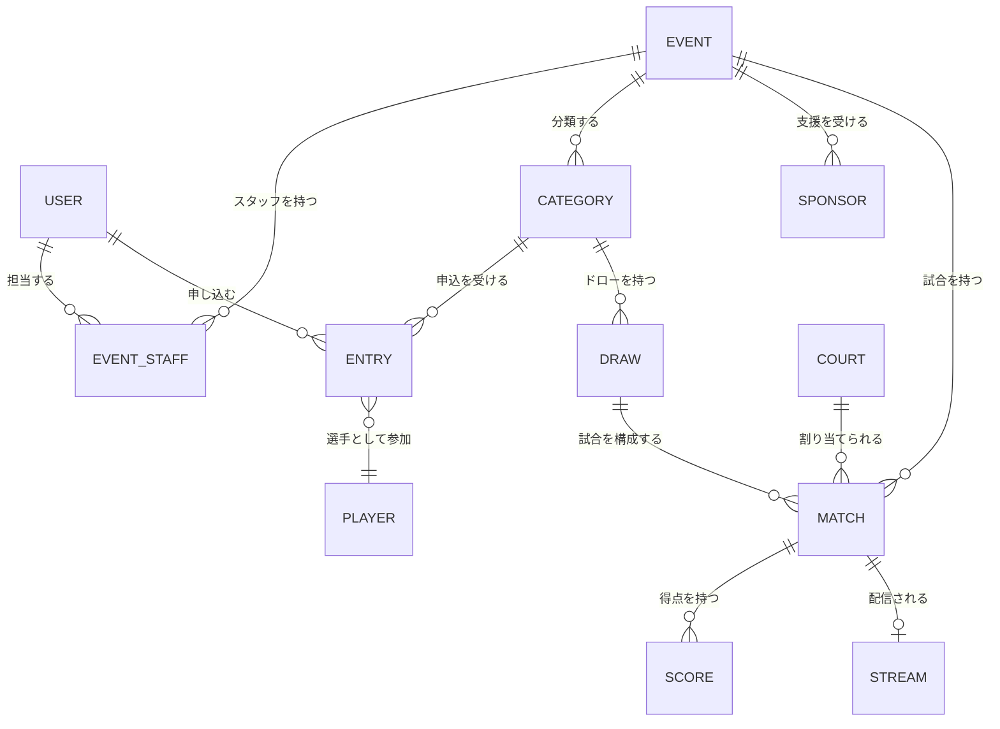

# サービス・業務領域計画

## 1. 方針

本書は、現在想定している機能を業務領域ごとに整理したものです。画面、データ項目、権限、処理手順の詳細は検討中です。

## 2. ユーザー・認証

| 機能 | 目的・概要 | 状態・検討事項 |
|---|---|---|
| ユーザー登録 | できるだけ少ない入力で登録できるようにする | 必須項目、本人確認、重複判定は検討中 |
| ユーザーIDを忘れた方 | ユーザーIDを確認・回復するためのフォーム | 確認方法と通知先は検討中 |
| パスワードを忘れた方 | パスワード再設定フォーム | 再設定トークン、有効期限等は検討中 |
| ログイン認証 | ユーザーID等による認証 | 認証項目とセキュリティ要件は検討中 |
| 自動ログイン | 次回以降のログイン操作を簡略化 | 有効期間、端末管理、解除方法は検討中 |

ユーザーIDとメールアドレスの関係、外部認証の利用、二要素認証、退会・利用停止は検討中です。

## 3. メニュー・ダッシュボード

ログイン後に、利用者に関係する情報へすぐ移動できる画面を提供します。

- 最近利用したイベント
- 開催中または近日開催予定の注目試合
- 担当中の業務
- 重要な通知

「注目試合」の選定基準、表示順、利用者ごとの出し分けは検討中です。

## 4. イベント管理

イベントの基本情報と運営に必要な関連情報を一元管理します。

### 4.1 イベント基本情報

- イベント名
- 開催日・開催期間
- 申込受付期間
- 開催場所・使用コート
- 主催者・運営担当
- 公開状態

上記以外の項目、公開・非公開の状態遷移は検討中です。

### 4.2 カテゴリー

イベント内に複数のカテゴリーを作成します。

例:

- 選手権
- フレンドシップ
- 新人戦
- 男子・女子

年齢、レベル、性別、定員、参加資格をどのように組み合わせるかは検討中です。

### 4.3 エントリー受付

- 選手申込フォーム
- 申込期間の制御
- カテゴリー選択
- 受付状況の確認

参加費、決済、キャンセル、定員、キャンセル待ち、団体戦は検討中です。

### 4.4 選手管理

- 申し込まれた選手の確認・管理
- 申込状態の管理
- ドロー公開等の通知
- 開催状況等の通知

通知手段、配信条件、連絡先管理、重複選手の統合は検討中です。

### 4.5 ドロー作成

- カテゴリーごとのドロー作成
- 選手の配置
- 公開

シード、BYE、予選・本戦、コンソレーション、組合せの自動生成方式は検討中です。

### 4.6 試合管理

- 試合当日の進行表
- コート・開始予定時刻の割当
- 試合状態の更新
- 結果の確定

試合状態の種類、遅延時の再配置、棄権・失格等の扱いは検討中です。

### 4.7 試合状況モニター

試合管理で更新した内容を、大型モニターへ表示します。

- コートごとの進行状況
- 現在の試合
- 次の試合
- 呼出・案内

画面分割、表示件数、切替方法、広告との表示割合は検討中です。

### 4.8 スポンサー管理

- イベントを支援するスポンサーの登録
- スポンサー名・ロゴ・表示順・表示状態の管理
- 観客画面と配信画面への掲出
- 画面下部のスポンサーロール
- スクロール速度の設定

スポンサー区分、表示回数、リンク、掲載期間、画像仕様は検討中です。

### 4.9 スタッフ管理

ユーザー登録済みの人をイベントスタッフとして関連付けます。

- スタッフの追加・解除
- 担当業務の設定
- 対象イベント・コートの設定

役割ごとの権限、招待・承認、当日のシフト管理は検討中です。

## 5. コート管理

各地のスカッシュコートと会場の詳細を管理します。

- 施設名・コート名
- 所在地
- コート数
- イベントで使用するコート
- 配信・表示機器との対応

営業時間、設備、連絡先、予約、施設管理者の権限は検討中です。

## 6. マーカー・表示・配信

| 機能 | 概要 |
|---|---|
| マーカー | 選手名、ゲーム数、得点、サービス等を入力・確認 |
| 大型モニター表示 | 得点や試合状況を観客向けに全画面表示 |
| ライブ配信 | OBSを介してコートごとのYouTube Liveへ配信 |

マーカーの詳細ルール、スカッシュのスコア形式、訂正操作、試合終了処理は検討中です。

## 7. 概念モデル

この図は要件整理のための概念図であり、テーブル設計ではありません。イベントと大会、ユーザーと選手、ゲームと試合の用語・関係は検討中です。
