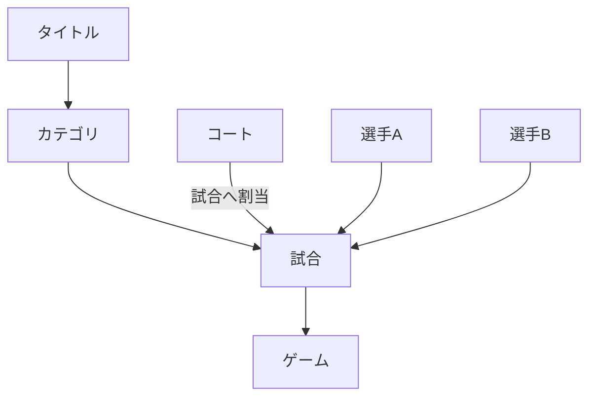
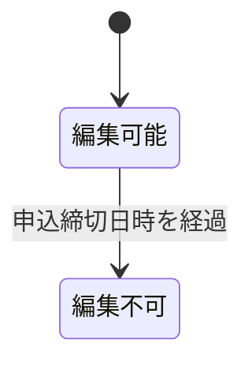
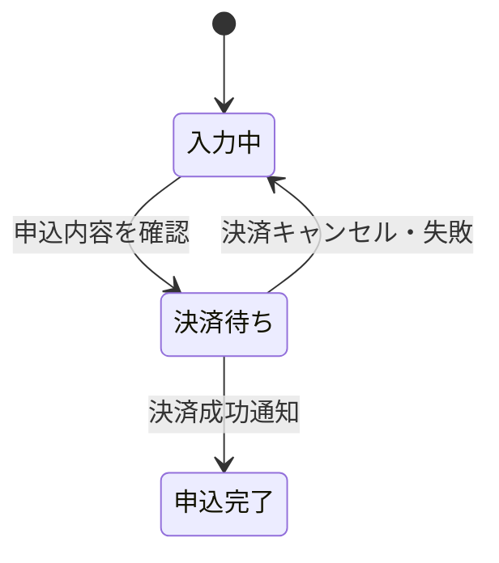
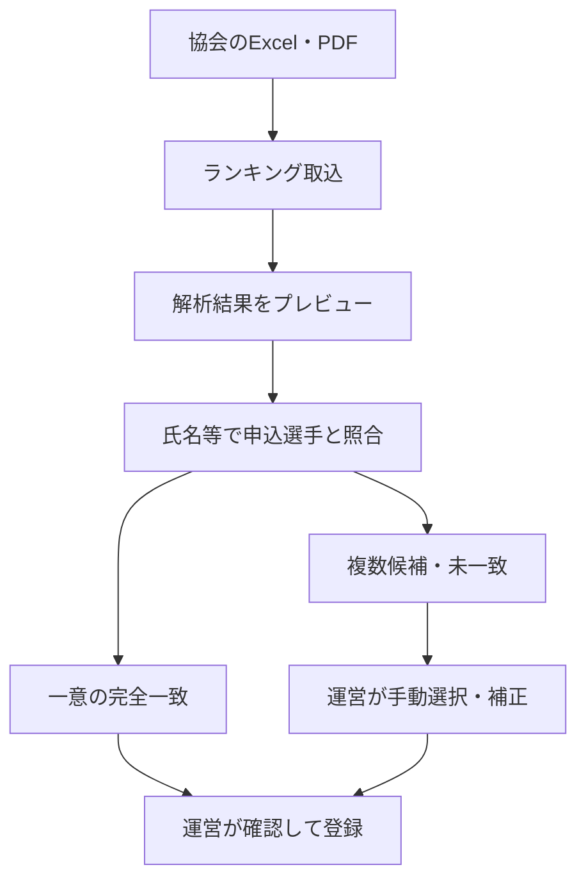
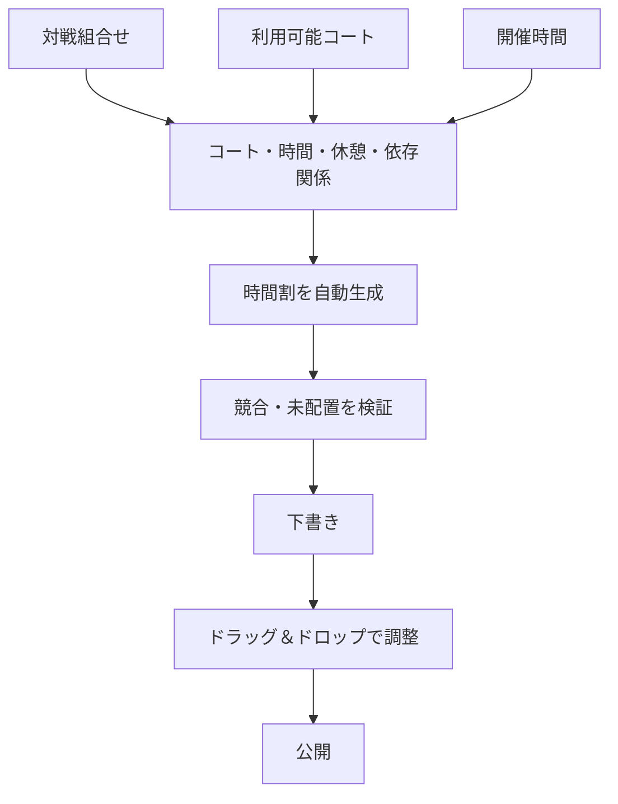
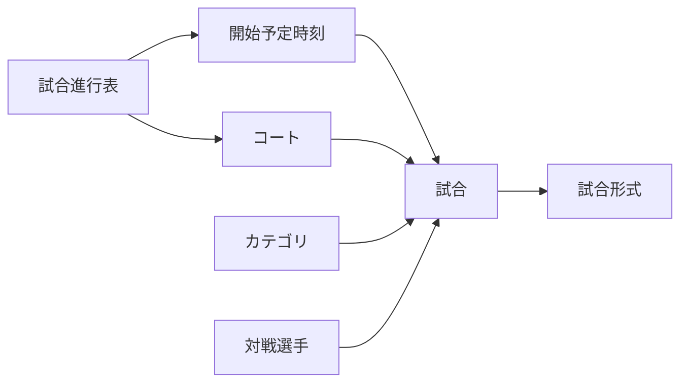
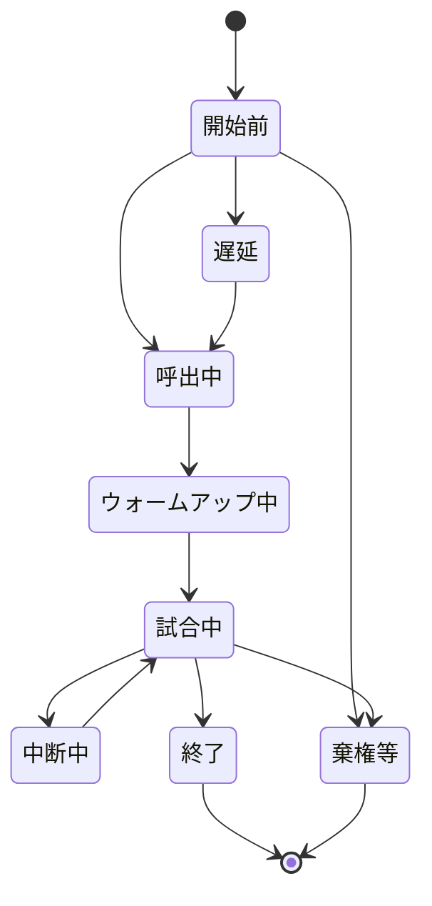
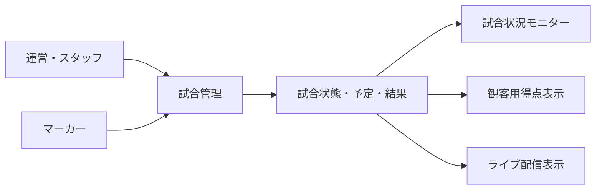
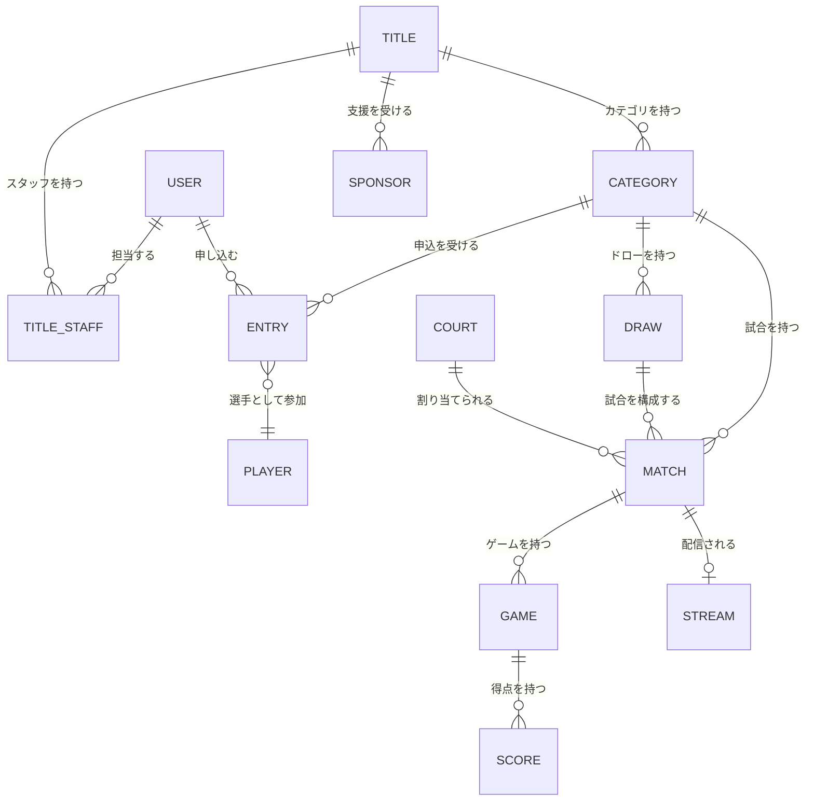

# サービス・業務領域計画

## 1. 方針

本書は、現在想定している機能を業務領域ごとに整理したものです。画面、データ項目、権限、処理手順の詳細は検討中です。

### 1.1 用語定義

業務データの階層を次のように定義します。「イベント」は業務上のデータ名称として使用せず、最上位を「タイトル」と呼びます。

| 用語 | 定義 | 例 |
|---|---|---|
| タイトル | 一つの大会・開催単位を表す最上位データ | S-NICK OPEN 2026 |
| カテゴリ | タイトル内の競技区分 | 選手権男子、フレンドシップ女子 |
| 試合 | カテゴリ内で選手同士が対戦する単位 | 選手権男子 予選1試合目 Aさん vs Bさん |
| ゲーム | 一つの試合を構成する得点単位 | 5ゲームマッチを構成する各ゲーム |
| コート | 試合を実施する場所 | Aコート |



関係は次のとおりです。

- 一つのタイトルは複数のカテゴリを持ちます。
- 一つのカテゴリは複数の試合を持ちます。
- 一つの試合は複数のゲームを持ちます。
- 一つの試合には、実施するコートと開始予定時刻を割り当てます。
- 5ゲームマッチ等の試合形式は、試合に設定します。

例:

```text
タイトル
└─ 選手権男子
   └─ 予選1試合目: Aさん vs Bさん
      ├─ 試合形式: 5ゲームマッチ
      ├─ コート: Aコート
      └─ ゲーム: 最大5ゲーム
```

## 2. ユーザー・認証

| 機能 | 目的・概要 | 状態・検討事項 |
|---|---|---|
| ユーザー登録 | できるだけ少ない入力で登録できるようにする | 必須項目、本人確認、重複判定は検討中 |
| ユーザーIDを忘れた方 | ユーザーIDを確認・回復するためのフォーム | 確認方法と通知先は検討中 |
| パスワードを忘れた方 | パスワード再設定フォーム | 再設定トークン、有効期限等は検討中 |
| ログイン認証 | ユーザーID等による認証 | 認証項目とセキュリティ要件は検討中 |
| 自動ログイン | 次回以降のログイン操作を簡略化 | 有効期間、端末管理、解除方法は検討中 |

ユーザーIDとメールアドレスの関係、外部認証の利用、二要素認証、退会・利用停止は検討中です。

### 2.1 アカウント設定

すべての利用者は共通のユーザーアカウントでログインします。選手専用の認証情報は作成せず、タイトルごとの参加・運営・スタッフの関係に応じた機能を表示します。

- プロフィール編集
- メールアドレス変更
- パスワード変更
- パスワードを忘れた場合
- 自動ログインの管理
- ログイン端末管理（将来機能）
- 退会申請

パスワードを忘れた場合の再設定は、選手、運営、スタッフで共通の機能を使用します。

### 2.2 プロフィール編集

プロフィールはユーザー本人だけが編集できます。サイト管理者によるユーザーの停止・削除は、プロフィール編集とは別の管理機能として扱います。

| 項目 | 必須 | 仕様 |
|---|:---:|---|
| プロフィール写真 | - | 顔写真等をアップロード可能 |
| マイカラー | - | カラーピッカーから選択 |
| 苗字・名前 | ○ | 氏名 |
| 苗字カナ・名前カナ | ○ | 全角カタカナ |
| メールアドレス | ○ | 登録済み情報を表示し、専用画面から変更 |
| 性別 | ○ | 男性、女性、その他、回答しない |
| 郵便番号 | - | 7桁 |
| 都道府県 | - | 一覧から選択 |
| 住所1 | - | 市区町村、町名、番地 |
| 住所2 | - | 住所の補足 |
| 建物・部屋番号 | - | 建物名、マンション名、部屋番号 |
| 電話番号 | - | 本人の連絡先 |
| 緊急連絡先氏名 | - | 緊急時の連絡相手 |
| 緊急連絡先との関係 | - | 続柄・関係 |
| 緊急連絡先電話番号 | - | 緊急時の電話番号 |

メールアドレス変更とパスワード変更は、プロフィール編集とは別画面で行います。新しいメールアドレスは確認用URLによる確認が完了してから有効にします。

#### プロフィール写真

- 端末内の画像選択またはカメラ撮影から登録できます。
- 正方形に切り抜き、プレビューしてから保存します。
- 画像の変更と削除ができます。
- JPEG、PNG、WebPを対応候補とし、最大ファイルサイズは5MBを候補とします。
- サーバー側で画像形式とサイズを検証し、表示用の縮小画像を生成します。
- 撮影場所等が含まれる可能性がある画像メタデータを削除して保存します。
- 未登録または削除時は、マイカラーと氏名の頭文字から初期アイコンを表示します。
- 本人、運営・スタッフ、一般公開画面のどこまで表示するかは、公開範囲の設定とあわせて検討します。

## 3. メニュー・ダッシュボード

ログイン後に、利用者に関係する情報へすぐ移動できる画面を提供します。

- 最近利用したタイトル
- 開催中または近日開催予定の注目試合
- 担当中の業務
- 重要な通知

「注目試合」の選定基準、表示順、利用者ごとの出し分けは検討中です。

## 4. タイトル管理

タイトルの基本情報と運営に必要な関連情報を一元管理します。

### 4.1 タイトル基本情報

| 項目 | 必須 | 仕様 |
|---|:---:|---|
| タイトル名 | ○ | タイトルの名称 |
| サブタイトル | ○ | タイトル名を補足する名称 |
| 開催期間 | ○ | 開催開始日時と開催終了日時 |
| 申込期間 | ○ | 申込開始日時と申込締切日時 |
| 場所・使用コート | ○ | コート管理で登録されたコートを一覧表示し、複数選択可能 |
| 代表メールアドレス | ○ | タイトルに関する代表連絡先メールアドレス |
| 連絡先 | - | 電話番号等の連絡先 |
| タイトル画像 | - | タイトルを表す画像 |
| 備考 | - | 補足事項 |

開催終了日時は開催開始日時以降、申込締切日時は申込開始日時以降とします。申込期間と開催期間の前後関係に関する追加制約は検討中です。

#### 申込締切後の編集制限

現在日時が申込締切日時を過ぎたタイトルは、タイトル基本情報を修正できません。



- 編集画面を読み取り専用で表示します。
- 更新APIでも申込締切日時を再確認し、画面を経由しない更新を拒否します。
- 申込締切後の管理者による例外解除、訂正方法、変更履歴の扱いは検討中です。
- 公開状態と公開・非公開の状態遷移は検討中です。

### 4.2 カテゴリ

タイトル内に複数のカテゴリを作成します。

例:

- 選手権男子
- 選手権女子
- フレンドシップ男子
- フレンドシップ女子
- 新人男子
- 新人女子

カテゴリでは、配下の試合へ適用する試合形式を設定します。

| 項目 | 仕様 |
|---|---|
| カテゴリ名 | カテゴリの名称 |
| 参加費 | カテゴリへ参加するための金額。無料の場合は0円 |
| 対戦方式 | トーナメントまたは総当たり戦 |
| 最大ゲーム数 | 1試合を構成する最大ゲーム数 |
| ゲーム勝利点 | 各ゲームで基本となる勝利点 |
| タイブレーク方式 | 2点差またはサドンデスから選択 |
| ウォームアップ時間 | 試合前のウォームアップ時間を秒単位で設定 |
| ゲーム間休止時間 | ゲーム間の休止時間を秒単位で設定 |
| 予定試合枠 | 時間割で1試合に確保する時間 |
| 最低休憩時間 | 同じ選手の連続試合間で確保する時間 |

初期設定例:

| 設定 | 値 |
|---|---:|
| 試合形式 | 3ゲームマッチ（2ゲーム先取） |
| ゲーム勝利点 | 11点 |
| タイブレーク | 2点差またはサドンデス |
| ウォームアップ時間 | 240秒（4分） |
| ゲーム間休止時間 | 90秒 |

タイブレーク方式は次のいずれかを選択します。

- **2点差（two clear points）**: 10対10以降、2点差がつくまで継続します。
- **サドンデス（sudden death）**: 10対10以降、次の1点を取った選手がゲームを獲得します。

カテゴリに設定した試合形式を、そのカテゴリに属する試合へ適用します。カテゴリ作成後に試合形式を変更した場合の既存試合への反映方法は検討中です。

年齢、レベル、性別、定員、参加資格をどのように組み合わせるかは検討中です。

### 4.3 エントリー受付

選手申込フォームはログイン済みユーザーが利用します。未ログインの場合はログイン画面へ遷移し、認証後に申込フォームへ戻ります。パスワードはログイン認証にだけ使用し、エントリー情報には保存しません。

| 項目 | 仕様 |
|---|---|
| 苗字・名前 | ユーザープロフィールの登録内容を初期表示 |
| 苗字カナ・名前カナ | ユーザープロフィールの登録内容を初期表示 |
| 所属団体番号 | 対象年度の所属団体マスターから選択 |
| 所属団体名 | 選択した団体番号に対応する名称を表示 |
| 郵便番号 | ユーザープロフィールの登録内容を初期表示 |
| 都道府県 | ユーザープロフィールの登録内容を初期表示 |
| 住所1 | 市区町村、町名、番地 |
| 住所2 | 住所の補足 |
| 建物・部屋番号 | 建物名、マンション名、部屋番号 |
| 連絡先 | 電話番号等 |
| メールアドレス | ユーザープロフィールの登録内容を初期表示 |
| カテゴリ | タイトルで受付中のカテゴリから選択 |
| 個人情報取扱いへの同意 | 内容へのリンクを表示し、必須チェックボックスで同意を取得 |

申込フォームで確定した氏名、所属、住所、連絡先、メールアドレスは、後からプロフィールや団体マスターが変更されても当時の申込内容を確認できるよう、申込時点の情報として保持します。申込フォーム上の変更をユーザープロフィールにも反映するかは検討中です。

#### 所属団体マスター

所属団体番号と所属団体名はスカッシュ協会から毎年提供される情報を使用します。

- 年度ごとに団体番号、団体名、有効状態を管理します。
- 申込者は自由入力せず、対象年度の一覧から所属団体を選択します。
- 申込記録には年度、団体番号、団体名を保存します。
- データの提供形式、取込方法、年度切替手順は検討中です。

#### 個人情報の取扱い

- 選手申込フォームに個人情報取扱いページへのリンクを表示します。
- 申込確定には同意チェックを必須とします。
- 同意日時と、同意した個人情報取扱い文書のバージョンを記録します。
- 個人情報取扱いページの内容、改定手順、保存期間は検討中です。

#### カード決済

参加費は選択したカテゴリの設定から計算し、カード決済へ進める構成を候補とします。



- S-NICK Platformではカード番号やセキュリティコードを保存しません。
- 外部決済サービスのホスト型決済画面へ遷移する方式を基本候補とします。
- 画面からの戻りだけで決済成功と判断せず、決済サービスからのサーバー通知で申込を確定します。
- S-NICK Platformには決済サービスの取引ID、金額、通貨、決済状態、決済日時を保存します。
- [Stripe Checkout](https://docs.stripe.com/payments/checkout)を候補の一つとしますが、採用する決済サービスは検討中です。
- キャンセル、返金、領収書、決済手数料、重複決済防止、支払期限は検討中です。

申込期間の制御、受付状況、定員、キャンセル待ち、団体戦、同一選手の複数カテゴリ申込は検討中です。

### 4.4 選手管理

運営とタイトルのスタッフは、対象タイトルへ申し込んだ選手を一覧で確認します。住所、緊急連絡先等の詳細な個人情報は、担当業務に必要な権限を持つユーザーだけに表示します。

選手一覧の主な表示・操作項目:

| 項目 | 内容 |
|---|---|
| 選択 | 一斉操作の対象選手を選択 |
| プロフィール写真 | 登録されている場合に表示 |
| 氏名・カナ | 選手名と検索用のカナ |
| 所属 | 申込時点の団体番号・団体名 |
| カテゴリ | 申し込んだカテゴリ |
| 申込状態 | 受付、決済待ち、受付完了、キャンセル等 |
| 決済状態 | 未決済、決済済み、返金済み等 |
| ランキング | 順位、ポイント、基準日、照合状態 |
| 連絡 | 個別メール送信 |

カテゴリ、申込状態、決済状態、所属、ランキング照合状態等で検索・絞り込みできるようにします。

#### ランキング登録

[公益社団法人日本スカッシュ協会のランキングページ](https://squash.or.jp/ranking/)では、男子、女子、ジュニア等のランキングがPDFとExcelで公開されています。運営がランキング資料を取り込み、申込選手へランキングを設定できるようにします。



取込方針:

- データ構造を読み取りやすいExcelを優先し、PDFは補助的な取込形式とします。
- ランキング種別、基準年月、性別・区分、出典URL、取込日時、取込担当者を記録します。
- 元ファイルとファイル識別情報を保持し、どの資料から登録したか追跡できるようにします。
- 取込前に列と解析結果をプレビューし、運営が確定するまでランキングへ反映しません。
- Excel・PDFの形式変更を考慮し、解析できない行をエラー一覧へ表示します。

氏名照合方針:

- 全角・半角、前後の空白、氏名内の空白等を正規化して比較します。
- 正規化した氏名が一意に完全一致した場合だけ、自動照合候補とします。
- 同姓同名、表記揺れ、旧字体、漢字違い、複数候補、未一致は運営が手動確認します。
- 資料にカナ、所属、会員番号等が含まれる場合は補助照合に使用します。
- あいまい一致だけで自動確定せず、誤った選手へのランキング設定を防ぎます。

ランキングは選手プロフィールを直接上書きせず、タイトルまたはカテゴリで使用する基準日時点のランキングとして保存します。運営による個別設定・修正を可能にし、変更前後の値、変更者、変更日時、理由を記録します。

#### 選手へのメール

- 一覧から1人を選択して個別メールを送信できます。
- 複数選手または絞り込み結果へ一斉メールを送信できます。
- 件名、本文、送信者名、返信先を設定します。
- 返信先の初期値にはタイトルの代表メールアドレスを使用します。
- カテゴリ、申込状態、決済状態等を宛先条件にできます。
- 送信前に対象人数と宛先を確認し、テストメールを送信できます。
- 一斉メールでも受信者ごとに個別送信し、他の選手のメールアドレスを表示しません。
- 送信日時、送信者、対象選手、送信状態、失敗理由を履歴として記録します。
- 大量送信はキューで順次処理し、送信上限や一時的な失敗に対応します。

メール送信サービス、添付ファイル、テンプレート、再送、配信停止、保存期間は検討中です。

### 4.5 ドロー作成

カテゴリに設定された対戦方式と選手ランキングを参照し、対戦組合せとコート別時間割を自動生成します。自動生成結果は下書きとして保存し、運営が確認・修正してから公開します。

#### 生成前の設定

- 対象カテゴリ
- 対戦方式（トーナメント・総当たり戦）
- 参加選手と受付状態
- 使用するランキングの種別・基準日
- シード数
- 同順位・ランキングなしの選手を並べる規則
- 使用可能なコート
- 開催日ごとのコート利用時間
- 予定試合枠
- 選手の最低休憩時間

ランキング同順位・0ポイントの選手はエントリー完了順で扱う方法を初期候補とします。実際の大会でもこの運用例がありますが、タイトルごとに変更可能とします。

#### トーナメント

- ランキング上位者をシードとして離れた位置へ配置し、上位選手同士が序盤で対戦しにくい組合せを作ります。
- 参加人数に応じてドローサイズを決定し、必要なBYEを配置します。
- シード以外は、設定した抽選規則に従って配置します。
- 予選、本戦、3位決定戦、コンソレーションの利用はカテゴリごとに設定します。
- シード配置規則と抽選方法は生成前に表示し、運営が確認できるようにします。

#### 総当たり戦

- 同一グループ内の選手が1回ずつ対戦する組合せを生成します。
- 参加人数が多い場合は複数グループへ分割できます。
- 複数グループの場合、ランキング順を蛇行させて振り分ける等、グループ間のランキングバランスを取ります。
- 順位決定方法、同率時の優先順位、決勝トーナメントの有無は検討中です。

#### コート別時間割の自動生成

時間割は、横軸にコート、縦軸に開始予定時刻を配置します。

必ず守る制約:

- 同じコートへ同時刻に複数の試合を割り当てない
- 同じ選手の試合を重複させない
- 同じ選手の試合間に最低休憩時間を確保する
- 前の試合の勝者が進む試合は、前の試合終了後に配置する
- コートの利用可能日・時間内に配置する
- 試合形式に応じた予定試合枠を確保する

できるだけ満たす条件:

- コートごとの試合数を均等にする
- 選手ごとの休憩時間の偏りを減らす
- 大会全体の終了時刻を早める
- 同じカテゴリの進行が極端に分散しないようにする
- 決勝等の重要試合を指定コート・時間帯へ配置する



すべての試合を配置できない場合は無理に確定せず、未配置試合と原因を一覧表示します。

#### ドラッグ＆ドロップ編集

- 試合カードを別のコートまたは開始時刻へ移動できます。
- 移動中に割当先のコートと時刻を強調表示します。
- コート重複、選手重複、最低休憩時間不足、前後試合の順序違反を即時検証します。
- 重大な競合は保存を禁止し、注意が必要な変更は警告して運営の確認を求めます。
- 移動前の状態へ戻す操作と変更履歴を用意します。
- 公開済み時間割を変更した場合は再公開し、対象選手への変更通知を行えるようにします。

ドローと時間割には下書き・公開済み等の版を持たせ、誰がいつ生成・変更・公開したかを記録します。具体的なシード配置規則、最適化方式、予定試合枠の初期値は検討中です。

### 4.6 試合管理

試合当日の進行表を確認し、各試合のコート、開始予定時刻、進行状態、結果を編集します。ドロー作成で公開された時間割を当日運営用の初期データとして使用します。

#### 進行表

試合進行表は、横軸にコート、縦軸に開始予定時刻を配置し、各交点に試合を表示する形式を基本候補とします。

- タイトル・開催日を選択して進行表を表示
- カテゴリ、コート、試合状態による絞り込み
- 所属するタイトル・カテゴリ
- ラウンド・試合順（例: 予選1試合目）
- 対戦する選手
- 試合形式（例: 5ゲームマッチ）
- コート・開始予定時刻
- 実際の開始時刻・終了時刻
- 現在の試合状態
- 確定した結果



試合カードを選択すると詳細画面または編集パネルを開き、進行状態等を更新できるようにします。スマートフォンやタブレットでも、当日のスタッフが少ない操作数で状態を更新できる画面とします。

#### 当日の編集操作

- 試合状態の更新
- 実際の開始時刻・終了時刻の記録
- コートまたは開始予定時刻の変更
- 遅延時間の記録
- 対戦選手・試合形式等の確認
- 試合結果の入力・確認・確定
- 運営用メモの記録

コートや時刻を変更する場合は、ドロー作成画面と同じ競合検証を行います。選手またはコートの重複、最低休憩時間不足、前後試合の順序違反がある場合は保存を制限し、理由を表示します。

#### 試合状態

次の状態を初期候補とし、正式な名称と遷移条件は検討中です。

| 状態候補 | 意味 |
|---|---|
| 開始前 | 時間割へ配置済みで、まだ呼出を行っていない |
| 呼出中 | 選手を呼び出している |
| ウォームアップ中 | 試合前のウォームアップ中 |
| 試合中 | 得点入力を開始している |
| 中断中 | 一時的に試合を中断している |
| 終了 | 結果が確定している |
| 遅延 | 開始予定時刻を過ぎても開始していない |
| 棄権・失格・中止 | 通常終了以外の理由で試合を終了している |



#### 結果確定と連携

- 試合結果を確定すると、トーナメントでは勝者を次の試合へ反映します。
- 総当たり戦では勝敗と順位計算に反映します。
- 現在の試合と次の試合を試合状況モニターへ反映します。
- ライブ配信画面、観客用得点表示、結果公開画面へ同じ状態を反映します。
- 確定後の結果を訂正する場合は、後続試合への影響を表示して運営の確認を求めます。

#### 遅延対応

試合が遅延した場合は、後続試合を一括して繰り下げる操作と、個別にコート・時刻を変更する操作を候補とします。自動繰り下げの範囲、途中コートへの振替、選手への通知方法は検討中です。

試合状態、コート、予定・実績時刻、結果を変更した場合は、変更者、変更日時、変更前後の内容を履歴として記録します。試合管理を操作できるスタッフの権限範囲は検討中です。

### 4.7 試合状況モニター

試合管理で更新した当日の進行状況を、会場内の大型モニターへ自動表示します。観客と選手が、現在の試合、次の試合、遅延、呼出等を離れた場所から確認するための閲覧専用画面です。

#### 表示内容

- タイトル名・開催日・会場名
- 現在時刻と最終更新時刻
- コート名
- 現在の試合と試合状態
- 対戦選手名・カテゴリ・ラウンド
- 次の試合と開始予定時刻
- 遅延時間
- 選手の呼出・運営からの案内
- 大会ロゴ
- スポンサーロール

個人の住所、電話番号、メールアドレス等、進行確認に不要な情報は表示しません。

#### 基本レイアウト

コートごとに列またはカードを分け、現在の試合を最も大きく表示します。次の試合はその下へ表示し、呼出中・試合中・遅延等の状態を文字と色の両方で区別します。

```text
┌──────────────────────────────────────────────┐
│ タイトル名                         現在時刻 │
├──────────────┬──────────────┬──────────────┤
│ Aコート      │ Bコート      │ Cコート      │
│ 現在の試合   │ 現在の試合   │ 遅延 10分    │
│ 選手A - B    │ 選手C - D    │ 選手E - F    │
│              │              │              │
│ 次の試合     │ 次の試合     │ 次の試合     │
│ 選手G - H    │ 選手I - J    │ 選手K - L    │
├──────────────────────────────────────────────┤
│ 呼出・運営案内 ／ スポンサーロール          │
└──────────────────────────────────────────────┘
```

表示コート数が多い場合は、文字を小さくしすぎず、複数ページを一定間隔で自動切替する方法を候補とします。画面分割、1画面あたりのコート数、切替間隔は検討中です。

#### 試合管理との連携



- 試合状態、コート、予定時刻、結果の変更を画面再読込なしで反映します。
- 試合終了後は、次の試合を現在の試合欄へ繰り上げます。
- コート変更や遅延が発生した場合は、変更箇所を一定時間強調表示します。
- 呼出や緊急案内は、通常の進行情報より優先して表示します。
- 表示データには更新日時を持たせ、古い情報かどうかを判断できるようにします。

更新方式は、レンタルサーバーの制約を踏まえて、WebSocket、Server-Sent Events、短い間隔のAPIポーリングから選定します。

#### モニター端末での運用

- タブレット、PC、大型モニター内蔵ブラウザ等で専用URLを開きます。
- ブラウザの全画面表示またはホーム画面からの専用起動に対応します。
- 表示画面から試合情報を編集できない閲覧専用構成とします。
- ページ起動後は、担当者の操作なしで継続表示・自動更新します。
- 一時的な通信切断時は最後に取得した情報を残し、切断中であることを画面へ表示します。
- 通信復旧後は自動的に最新情報を取得します。

表示URLの公開範囲、アクセス制御、画面解像度、縦横の向き、文字サイズ、配色、音声による呼出、複数言語対応は検討中です。

### 4.8 スポンサー管理

- タイトルを支援するスポンサーの登録
- スポンサー名・ロゴ・表示順・表示状態の管理
- 観客画面と配信画面への掲出
- 画面下部のスポンサーロール
- スクロール速度の設定

スポンサー区分、表示回数、リンク、掲載期間、画像仕様は検討中です。

### 4.9 スタッフ管理

ユーザー登録済みの人を、運営からの招待と本人の承諾によってタイトルのスタッフとして関連付けます。

- スタッフの追加・解除
- 担当業務の設定
- 対象タイトル・コートの設定

役割ごとの権限、招待・承認、当日のシフト管理は検討中です。

## 5. コート管理

各地のスカッシュコートと会場の詳細を管理します。

- 施設名・コート名
- 所在地
- コート数
- タイトルで使用するコート
- 配信・表示機器との対応

営業時間、設備、連絡先、予約、施設管理者の権限は検討中です。

## 6. マーカー・表示・配信

| 機能 | 概要 |
|---|---|
| マーカー | 選手名、ゲーム数、得点、サービス等を入力・確認 |
| 大型モニター表示 | 得点や試合状況を観客向けに全画面表示 |
| ライブ配信 | OBSを介してコートごとのYouTube Liveへ配信 |

マーカーの詳細ルール、スカッシュのスコア形式、訂正操作、試合終了処理は検討中です。

## 7. 概念モデル



この図は要件整理のための概念図であり、テーブル設計ではありません。ドローを使用しない形式や団体戦への対応は検討中です。
