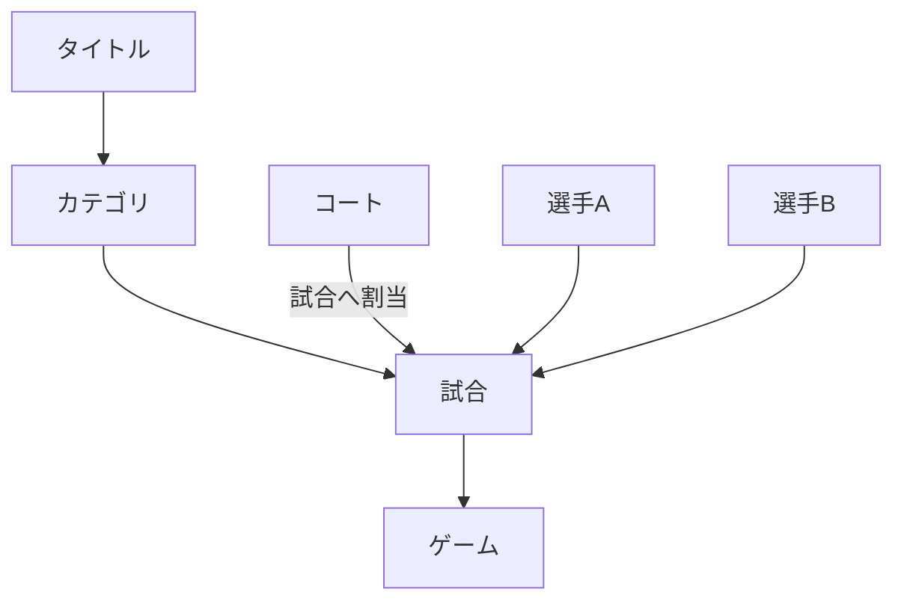
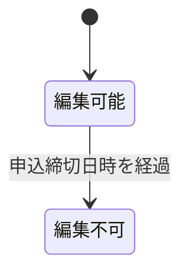
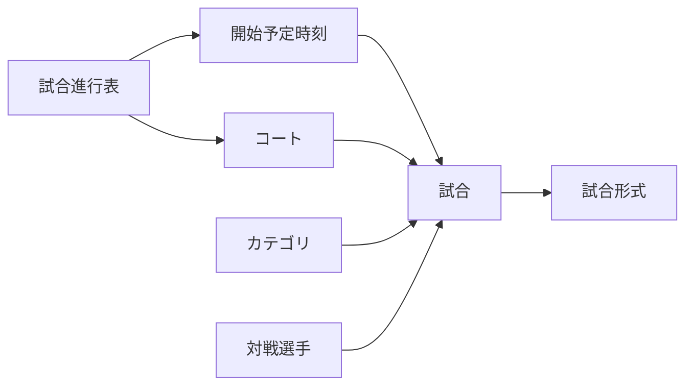
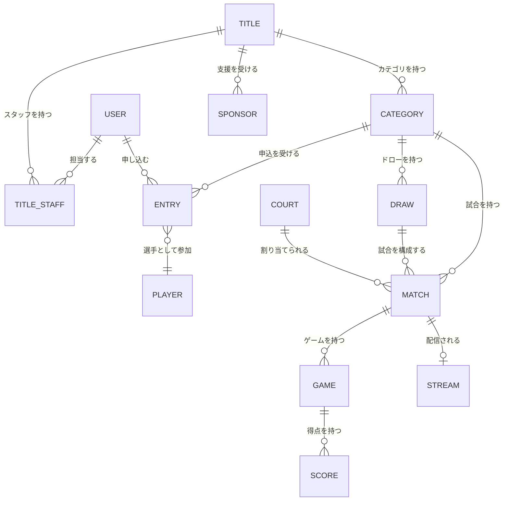

# サービス・業務領域計画

## 1. 方針

本書は、現在想定している機能を業務領域ごとに整理したものです。画面、データ項目、権限、処理手順の詳細は検討中です。

### 1.1 用語定義

業務データの階層を次のように定義します。「イベント」は業務上のデータ名称として使用せず、最上位を「タイトル」と呼びます。

| 用語 | 定義 | 例 |
|---|---|---|
| タイトル | 一つの大会・開催単位を表す最上位データ | S-NICK OPEN 2026 |
| カテゴリ | タイトル内の競技区分 | 選手権男子、フレンドシップ女子 |
| 試合 | カテゴリ内で選手同士が対戦する単位 | 選手権男子 予選1試合目 Aさん vs Bさん |
| ゲーム | 一つの試合を構成する得点単位 | 5ゲームマッチを構成する各ゲーム |
| コート | 試合を実施する場所 | Aコート |



関係は次のとおりです。

- 一つのタイトルは複数のカテゴリを持ちます。
- 一つのカテゴリは複数の試合を持ちます。
- 一つの試合は複数のゲームを持ちます。
- 一つの試合には、実施するコートと開始予定時刻を割り当てます。
- 5ゲームマッチ等の試合形式は、試合に設定します。

例:

```text
タイトル
└─ 選手権男子
   └─ 予選1試合目: Aさん vs Bさん
      ├─ 試合形式: 5ゲームマッチ
      ├─ コート: Aコート
      └─ ゲーム: 最大5ゲーム
```

## 2. ユーザー・認証

| 機能 | 目的・概要 | 状態・検討事項 |
|---|---|---|
| ユーザー登録 | できるだけ少ない入力で登録できるようにする | 必須項目、本人確認、重複判定は検討中 |
| ユーザーIDを忘れた方 | ユーザーIDを確認・回復するためのフォーム | 確認方法と通知先は検討中 |
| パスワードを忘れた方 | パスワード再設定フォーム | 再設定トークン、有効期限等は検討中 |
| ログイン認証 | ユーザーID等による認証 | 認証項目とセキュリティ要件は検討中 |
| 自動ログイン | 次回以降のログイン操作を簡略化 | 有効期間、端末管理、解除方法は検討中 |

ユーザーIDとメールアドレスの関係、外部認証の利用、二要素認証、退会・利用停止は検討中です。

## 3. メニュー・ダッシュボード

ログイン後に、利用者に関係する情報へすぐ移動できる画面を提供します。

- 最近利用したタイトル
- 開催中または近日開催予定の注目試合
- 担当中の業務
- 重要な通知

「注目試合」の選定基準、表示順、利用者ごとの出し分けは検討中です。

## 4. タイトル管理

タイトルの基本情報と運営に必要な関連情報を一元管理します。

### 4.1 タイトル基本情報

| 項目 | 必須 | 仕様 |
|---|:---:|---|
| タイトル名 | ○ | タイトルの名称 |
| サブタイトル | ○ | タイトル名を補足する名称 |
| 開催期間 | ○ | 開催開始日時と開催終了日時 |
| 申込期間 | ○ | 申込開始日時と申込締切日時 |
| 場所・使用コート | ○ | コート管理で登録されたコートを一覧表示し、複数選択可能 |
| 代表メールアドレス | ○ | タイトルに関する代表連絡先メールアドレス |
| 連絡先 | - | 電話番号等の連絡先 |
| タイトル画像 | - | タイトルを表す画像 |
| 備考 | - | 補足事項 |

開催終了日時は開催開始日時以降、申込締切日時は申込開始日時以降とします。申込期間と開催期間の前後関係に関する追加制約は検討中です。

#### 申込締切後の編集制限

現在日時が申込締切日時を過ぎたタイトルは、タイトル基本情報を修正できません。



- 編集画面を読み取り専用で表示します。
- 更新APIでも申込締切日時を再確認し、画面を経由しない更新を拒否します。
- 申込締切後の管理者による例外解除、訂正方法、変更履歴の扱いは検討中です。
- 公開状態と公開・非公開の状態遷移は検討中です。

### 4.2 カテゴリ

タイトル内に複数のカテゴリを作成します。

例:

- 選手権男子
- 選手権女子
- フレンドシップ男子
- フレンドシップ女子
- 新人男子
- 新人女子

カテゴリでは、配下の試合へ適用する試合形式を設定します。

| 項目 | 仕様 |
|---|---|
| カテゴリ名 | カテゴリの名称 |
| 参加費 | カテゴリへ参加するための金額。無料の場合は0円 |
| 最大ゲーム数 | 1試合を構成する最大ゲーム数 |
| ゲーム勝利点 | 各ゲームで基本となる勝利点 |
| タイブレーク方式 | 2点差またはサドンデスから選択 |
| ウォームアップ時間 | 試合前のウォームアップ時間を秒単位で設定 |
| ゲーム間休止時間 | ゲーム間の休止時間を秒単位で設定 |

初期設定例:

| 設定 | 値 |
|---|---:|
| 試合形式 | 3ゲームマッチ（2ゲーム先取） |
| ゲーム勝利点 | 11点 |
| タイブレーク | 2点差またはサドンデス |
| ウォームアップ時間 | 240秒（4分） |
| ゲーム間休止時間 | 90秒 |

タイブレーク方式は次のいずれかを選択します。

- **2点差（two clear points）**: 10対10以降、2点差がつくまで継続します。
- **サドンデス（sudden death）**: 10対10以降、次の1点を取った選手がゲームを獲得します。

カテゴリに設定した試合形式を、そのカテゴリに属する試合へ適用します。カテゴリ作成後に試合形式を変更した場合の既存試合への反映方法は検討中です。

年齢、レベル、性別、定員、参加資格をどのように組み合わせるかは検討中です。

### 4.3 エントリー受付

- 選手申込フォーム
- 申込期間の制御
- カテゴリ選択
- 受付状況の確認

参加費、決済、キャンセル、定員、キャンセル待ち、団体戦は検討中です。

### 4.4 選手管理

- 申し込まれた選手の確認・管理
- 申込状態の管理
- ドロー公開等の通知
- 開催状況等の通知

通知手段、配信条件、連絡先管理、重複選手の統合は検討中です。

### 4.5 ドロー作成

- カテゴリごとのドロー作成
- 選手の配置
- 公開

シード、BYE、予選・本戦、コンソレーション、組合せの自動生成方式は検討中です。

### 4.6 試合管理

- 試合当日の進行表
- 所属するタイトル・カテゴリ
- ラウンド・試合順（例: 予選1試合目）
- 対戦する選手
- コート・開始予定時刻の割当
- 試合形式（例: 5ゲームマッチ）
- 試合状態の更新
- 結果の確定

試合状態の種類、遅延時の再配置、棄権・失格等の扱いは検討中です。

試合進行表は、横軸にコート、縦軸に開始予定時刻を配置し、各交点に試合を表示する形式を基本候補とします。



ドロー画面ではタイトルを選択した後、カテゴリごとに試合と選手の組合せを表示します。各試合は、試合進行表上のコートと開始予定時刻へ割り当てられます。

### 4.7 試合状況モニター

試合管理で更新した内容を、大型モニターへ表示します。

- コートごとの進行状況
- 現在の試合
- 次の試合
- 呼出・案内

画面分割、表示件数、切替方法、広告との表示割合は検討中です。

### 4.8 スポンサー管理

- タイトルを支援するスポンサーの登録
- スポンサー名・ロゴ・表示順・表示状態の管理
- 観客画面と配信画面への掲出
- 画面下部のスポンサーロール
- スクロール速度の設定

スポンサー区分、表示回数、リンク、掲載期間、画像仕様は検討中です。

### 4.9 スタッフ管理

ユーザー登録済みの人を、運営からの招待と本人の承諾によってタイトルのスタッフとして関連付けます。

- スタッフの追加・解除
- 担当業務の設定
- 対象タイトル・コートの設定

役割ごとの権限、招待・承認、当日のシフト管理は検討中です。

## 5. コート管理

各地のスカッシュコートと会場の詳細を管理します。

- 施設名・コート名
- 所在地
- コート数
- タイトルで使用するコート
- 配信・表示機器との対応

営業時間、設備、連絡先、予約、施設管理者の権限は検討中です。

## 6. マーカー・表示・配信

| 機能 | 概要 |
|---|---|
| マーカー | 選手名、ゲーム数、得点、サービス等を入力・確認 |
| 大型モニター表示 | 得点や試合状況を観客向けに全画面表示 |
| ライブ配信 | OBSを介してコートごとのYouTube Liveへ配信 |

マーカーの詳細ルール、スカッシュのスコア形式、訂正操作、試合終了処理は検討中です。

## 7. 概念モデル



この図は要件整理のための概念図であり、テーブル設計ではありません。ドローを使用しない形式や団体戦への対応は検討中です。
