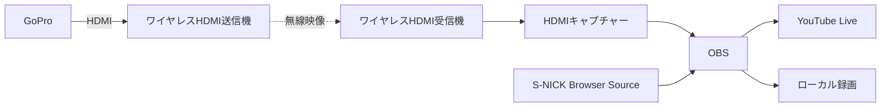

# ライブ配信

## 1. 目的

コートごとに独立したYouTubeライブを作成し、試合映像とS-NICK Platformの試合情報を組み合わせて配信します。

初期目標は**2コートの同時配信**です。

## 2. 映像構成



GoProの機種、HDMI出力に必要なMedia Mod等の機材、ワイヤレスHDMI製品は検討中です。

## 3. コート単位の運用

各コートには、個別のYouTubeライブURL、OBS設定、S-NICKオーバーレイURLを割り当てます。

```text
コート1: GoPro 1 → OBS 1 → YouTube Live 1
コート2: GoPro 2 → OBS 2 → YouTube Live 2
```

1台のPCで2配信を処理するか、コートごとにPCを用意するかは、機材検証後に決定します。

## 4. OBSで合成する情報

OBSのBrowser Sourceを使用し、カメラ映像の上に次の情報を表示します。

- 選手名
- 現在の得点
- ゲーム数・ゲームカウント
- コート番号・試合情報
- 大会名・大会ロゴ
- スポンサーロール

サービス表示、試合時間、インターバルタイマー、次の試合案内、QRコード等は検討中です。

## 5. オーバーレイ

- コートまたは試合ごとに異なるURLを用意します。
- 映像に重ねる領域以外は背景を透過します。
- 得点入力後に自動更新します。
- OBSを再起動しても同じURLを利用できる構成を目指します。
- 誤操作防止のため、オーバーレイ画面では編集を行いません。

URL形式、アクセス制御、更新方式は検討中です。

## 6. スポンサー表示

大会ロゴは画面上部等に固定表示し、スポンサーは画面下部で横方向へ継続的にスクロールする構成を基本候補とします。

管理候補:

- ロゴ画像
- スポンサー名
- 表示・非表示
- 表示順
- スクロール速度
- ロゴの高さ・間隔
- 背景色
- スポンサー区分

スポンサーロールは観客用表示とOBS用表示で共通の登録情報を使用する想定です。

## 7. 配信品質

初期候補:

| 項目 | 候補値 |
|---|---|
| 解像度 | 1280 × 720 |
| フレームレート | 60 fps |
| 映像ビットレート | 1コートあたり約6 Mbpsを目安に検証 |
| レート制御 | CBR候補 |
| キーフレーム間隔 | 2秒候補 |

これらは確定値ではありません。YouTubeの最新要件、PC性能、回線、映像品質を確認して決定します。

## 8. 本番前の検証

- 実際の会場と大会予定時間帯で実施
- 2コートを同時に限定公開配信
- 2～3時間以上の連続試験から開始し、本番相当時間へ延長
- OBSのドロップフレーム、再接続、CPU・GPU負荷、温度を確認
- 得点更新と映像のずれを確認
- ワイヤレスHDMIの混信、遮蔽物、距離を確認
- 配信と同時にローカル録画

試験の合格基準は検討中です。
