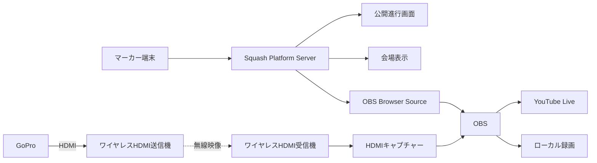

# ライブ配信

## 1. 位置づけ

引き継ぎ元「YouTubeライブ配信設定」で合意した、YouTube Live、OBS、映像入力、Squash Platform表示、会場ネットワークの要件を整理する。

Squash Platform上の配信一覧・設定機能（`SCR-OPR-281`）はフェーズ3とする。本書のSquash Platform管理項目はフェーズ3の検討用構想として保持する。YouTube Studio、OBS、映像機材を使った手動配信の技術検証・運用とは分けて扱う。

## 2. 目的と決定事項

コートごとに独立したYouTubeライブを作成し、試合映像とSquash Platformの試合情報を組み合わせて配信する。

### 決定済み

- 初期目標は**2コートの同時配信**とする。
- コートごとにYouTubeライブURL、配信枠、OBS設定、Squash PlatformオーバーレイURLを分ける。
- OBSは配信用PCにインストールし、YouTubeへ送信する。
- GoPro映像はBluetoothでは送信せず、HDMIとワイヤレスHDMIを基本構成とする。
- マーカー入力をSquash Platformへ集約し、公開画面、会場表示、OBSオーバーレイへ反映する。
- インターネット停止時にも映像を残すため、OBSでローカル録画を併用する。

### 検討中

- YouTubeチャンネルの所有形態と運用担当者
- 1台のPCで2配信を処理するか、コートごとにPCを用意するか
- GoPro、Media Mod等、ワイヤレスHDMI、キャプチャー機器の製品
- 自動化にYouTube Data API / Live Streaming APIを利用する範囲

## 3. 全体構成



BluetoothはGoProの操作・設定等に使用できるが、リアルタイム映像伝送には使用しない。

## 4. コート単位の運用

```text
コート1: GoPro 1 → OBS 1 → YouTube Live 1
コート2: GoPro 2 → OBS 2 → YouTube Live 2
```

各コートを独立させ、1コートの映像・PC・配信障害が他コートへ波及しにくい構成を優先する。大会ポータルにはコート別の視聴ボタンを配置し、視聴者が見たいコートを選択できるようにする。

Squash Platformでは、配信をイベント、開催日、会場、コート、試合へ関連付ける。試合の割当変更後も、コート配信の固定公開URLから現在の対象試合へ案内できるようにする。

## 5. YouTubeチャンネルの準備

### 5.1 所有と権限

- 個人アカウントへの依存を避け、大会または運営組織が継続管理できるチャンネルを使用する。
- 所有者、管理者、配信担当者の役割と、退任時の引継ぎ手順を定める。
- 多要素認証、復旧手段、緊急連絡先を設定する。
- パスワード、ストリームキー、復旧コードを文書やGitへ記載しない。

チャンネルの具体的な所有形態、権限付与方式、秘密情報の保管先は検討中。

### 5.2 ライブ配信の有効化

- YouTube Studioでライブ配信を利用可能な状態にする。
- 初回有効化には待ち時間が発生し得るため、大会直前ではなく事前に完了する。
- 同時配信数、埋込、公開範囲等が利用チャンネルで満たせることを本番前に確認する。

YouTubeの画面、制限、推奨設定は変更され得るため、実装・運用開始時に公式情報を再確認する。

## 6. 配信枠とストリームキー

### 6.1 コート別配信枠

YouTube Studioでコートごとに別のライブ配信枠を作成する。

| 項目 | 設定・管理内容 |
|---|---|
| タイトル | 大会名、開催日、コート名が識別できる名称 |
| 説明 | 大会ページ、他コート、日程・結果へのリンク |
| サムネイル | 大会・コートが識別できる画像 |
| 公開設定 | テスト時は限定公開、本番は大会方針に従う |
| 配信予定時刻 | 当日の準備時間を含めて設定 |
| チャット | 有効・無効、モデレーション方針を大会ごとに設定 |
| 埋込 | Squash Platform公開ページでの視聴方式に合わせて確認 |
| アーカイブ | 終了後の公開・非公開、保持方針を設定 |

子ども向け設定、著作権、音源、肖像・配信同意等は大会の運用・法務方針に従う。

### 6.2 ストリームキー

- コートごとに異なるストリームキーを使用し、OBSと1対1で対応させる。
- キーは秘密情報として扱い、Squash Platformの一般画面、設計書、ログ、Gitへ保存しない。
- OBSのプロファイルや大会運用台帳では「コート1」等の識別名で管理し、キーそのものを転記しない。
- 漏えい、誤送信、担当者変更時はYouTube側でキーを再発行する。
- 配信枠の再利用と毎回新規作成のどちらを採るかは、アーカイブ運用を含めて検証後に決定する。

## 7. OBS設定

### 7.1 シーン構成

初期候補は次のとおりとする。

- 配信待機（Starting Soon）
- 試合映像＋Squash Platformオーバーレイ
- インターバル
- 次の試合案内
- 配信終了案内
- 障害・一時中断案内

各コートのOBSでは、誤送信防止のため対象コート名をプロファイル、シーンコレクション、画面内確認表示で識別できるようにする。

インターバル専用シーンは手動運用時の候補として残すが、Squash Platform標準オーバーレイではシーン切替を必須とせず、試合状態に応じてスポンサー主表示へ自動的に切り替える。

### 7.2 Browser Source

カメラ映像の上に、背景透過のSquash Platform画面を重ねる。

試合中の標準オーバーレイで常時表示する主情報は次のとおりとする。

- 左右の選手名
- 現在ゲームの得点
- 左右のゲーム獲得数
- 左右の選手色

選手色は左右の帯、背景またはアクセントへ使用する。色だけに依存せず、左右の配置と選手名でも識別できるようにし、現在得点とゲーム獲得数は別の数値領域として位置と大きさで明確に区別する。ゲーム獲得数は補助情報として現在得点および選手名より小さく表示する。離れた位置から読みにくい小さな補助ラベルは表示しない。オーバーレイ以外の領域は透過する。

次の情報は、試合状態またはイベント設定に応じて表示する。

- サービス表示
- コート番号・試合情報
- 大会名・大会ロゴ
- スポンサーロール
- 試合状態、タイマー、次の試合案内
- `YES LET`、`NO LET`、`STROKE`の判定結果ダイアログ
- ウォームアップ・インターバルの残り時間と次ゲーム案内

オーバーレイURLはコートまたは試合を識別し、閲覧専用とする。得点更新方式、再接続、アクセス制御は [共通基盤](specifications/600_CommonPlatform.md) と [マーカー機能](specifications/300_Marker.md) で詳細化する。

判定結果は、OBSシーンを操作せず、背景透過の標準オーバーレイ内に中央ダイアログとして表示する。判定結果は確定から3秒間表示し、新しい判定で置き換える。取消時は直ちに閉じ、通信復旧後に有効期限を過ぎた判定は再表示しない。

ウォームアップ、試合開始前インターバル、ゲーム間インターバルでは、スポンサーのロゴと表示コメントを主表示とする。`WARM-UP`または`INTERVAL`、残り時間、必要に応じて次のゲーム番号を画面下部へ表示する。残り時間はサーバーに保存した終了予定日時から復元し、タイマー停止中は `PAUSED` を併記する。残り時間が0になった場合、または次ゲーム開始時に下部表示を閉じる。

OBSオーバーレイは、約10種類を目標とするプリセットレイアウトからイベントごとに1種類を選択する。各プリセットは試合中、ウォームアップ・インターバル中、判定結果表示時のレイアウトを一組として持つ。イベント設定ではサムネイルと実データによるプレビューを表示する。正確な提供数と各デザインはUI設計で確定する。

どのプリセットでも、試合中は選手名、現在得点、ゲーム獲得数、選手色を必須表示とし、ウォームアップ・インターバル中は「スポンサー主表示＋状態・タイマー下部表示」の情報優先順位を維持する。

### 7.3 スポンサー表示

- 大会ロゴは上部等へ固定表示する。
- 試合中のスポンサーのロゴは画面下部の高さ約10％で横方向へ連続スクロールし、得点、選手名、試合状態等の主要情報を覆わない。
- 大会単位のスポンサー情報を会場表示とOBSで共用する。
- スポンサー管理で設定した共通の表示重みを使用し、表示セッション内の概算累計時間が重みの比率へ近づくようにする。広告実績証明を目的とした厳密な視聴時間の計測は行わない。
- スポンサー1件の表示枠は会場表示と同じ3秒とする。
- 表示順、表示・非表示、ロゴサイズ、間隔、背景色、スクロール速度を設定対象とする。
- 速度は「遅い・標準・速い」のような運営者向け選択肢と、内部の周回時間を対応させる候補とする。具体値は検討中。

### 7.4 配信品質の初期候補

| 項目 | 候補値 |
|---|---|
| 解像度 | 1280 × 720 |
| フレームレート | 60 fps |
| 映像ビットレート | 1コートあたり約6 Mbpsを目安に検証 |
| 音声 | 128 Kbps候補 |
| レート制御 | CBR候補 |
| キーフレーム間隔 | 2秒候補 |
| 自動再接続 | 有効 |

確定値ではない。YouTubeの最新要件、PC性能、会場回線、映像の動き、2コート同時配信・録画時の負荷を確認して決定する。

## 8. Squash Platformの配信情報

本章はフェーズ3の`SCR-OPR-281`で管理する候補であり、現時点では画面、データ項目、状態遷移を確定しない。フェーズ3で実装する場合も、秘密のストリームキーは管理対象に含めない。

- 配信サービス
- 公開視聴URL、埋込用識別情報
- イベント、開催日、会場、コート、試合との関連
- 配信予定、開始、終了日時
- 状態（予定、まもなく開始、配信中、終了、アーカイブ、配信中止）
- サムネイル
- 公開・非公開
- 運営メモ（公開情報と分離）

視聴URLは [パブリック仕様](specifications/100_Public.md) へ連携する。YouTube側の配信枠作成をSquash Platformから自動化するかは将来検討とする。

## 9. 当日の運用手順

### 配信前

1. 対象コート、配信枠、公開設定、視聴URLを照合する。
2. GoPro、ワイヤレスHDMI、キャプチャー、音声、給電、録画容量を確認する。
3. OBSのプロファイル、シーン、配信先、オーバーレイURLを確認する。
4. 限定公開で映像・音声・得点更新・スポンサー表示を確認する。
5. OBS録画を開始し、配信開始後にYouTube側の受信状態と公開映像を別端末で確認する。

### 配信中

- OBSのドロップフレーム、回線状態、CPU・GPU負荷、温度、録画残容量を監視する。
- YouTube側の配信状態と、Squash Platform公開ページのコート・試合対応を確認する。
- 得点と映像のずれ、オーバーレイ再接続、スポンサー表示を確認する。
- 通信断時もローカル録画を継続し、回線復旧後に再接続する。

### 配信終了

1. 終了案内へ切り替える。
2. YouTube配信を終了し、その後OBS側の配信・録画を停止する。
3. アーカイブの公開状態、タイトル、説明、サムネイルを確認する。
4. `SCR-OPR-281`導入後は、Squash Platformの配信状態を「終了」または「アーカイブ」へ更新する。導入前はYouTube Studio側だけで確認する。
5. ローカル録画を退避し、障害・ドロップフレーム等を運用記録へ残す。

開始・終了操作の厳密な順番は実機テストで確認し、運用手順書として確定する。

## 10. 本番前の検証

- 実際の会場と大会予定時間帯で実施する。
- 2コートを同時に限定公開配信する。
- 2～3時間以上の連続試験から開始し、本番相当時間へ延長する。
- OBSのドロップフレーム、再接続、CPU・GPU負荷、温度を確認する。
- 得点更新と映像のずれを確認する。
- ワイヤレスHDMIの混信、遮蔽物、距離を確認する。
- 配信とローカル録画を同時実行する。
- 主回線から予備回線への切替と復旧を試験する。
- 配信終了後のアーカイブとSquash Platformからの視聴導線を確認する。

試験の合格基準は検討中。ネットワークと機材の詳細は [ネットワーク・機材](05_network-and-hardware.md) を参照する。

## 11. 障害時の基本方針

| 障害 | 初期対応 |
|---|---|
| インターネット断 | ローカル録画を継続し、予備回線へ切替 |
| YouTube送信断 | OBS自動再接続、配信枠とキー対応を確認 |
| Squash Platform表示断 | カメラ映像と録画を継続し、障害案内シーンへ切替 |
| ワイヤレスHDMI断 | 再接続し、必要に応じて予備HDMIケーブルへ切替 |
| OBS-PC障害 | 対象コートのみ停止し、他コートへの影響を限定 |
| 誤ったコートへ配信 | 配信停止、対応表を再確認し、必要に応じて視聴案内を訂正 |

具体的な復旧手順、担当分担、連絡経路、予備機材は検討中。
