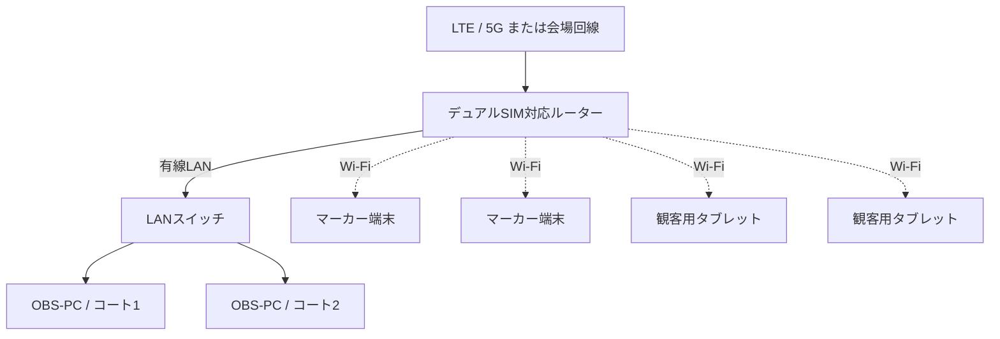

# ネットワーク・機材

## 1. 基本方針

- OBS-PCはルーターへ有線LANで接続します。
- マーカー端末と観客用タブレットはWi-Fiで接続します。
- インターネット回線は会場固定回線を優先し、利用できない場合はLTE/5Gルーターを使用します。
- 異なるキャリアのSIMを使用し、回線障害への備えを検討します。
- 配信停止時にも映像が残るよう、OBSでローカル録画します。

## 2. 初期構成



LANスイッチの要否は、採用ルーターの有線ポート数で決定します。

## 3. デュアルSIMの考え方

初期構成では、デュアルSIMを回線ボンディングではなく**切替型フェイルオーバー**として扱います。

```text
通常時: SIM 1
障害検知: SIM 1 → SIM 2へ切替
```

- SIM 1とSIM 2には異なるキャリアを使用することを推奨します。
- SIM切替時には短時間の通信断が発生する可能性があります。
- OBSの自動再接続設定を有効にします。
- SIMの同時利用や無停止切替が必要になった場合、ボンディング製品を将来検討します。

ルーター機種、SIM契約、切替条件、切替時間は検討中です。

## 4. 回線容量の初期見積り

720p/60fps、映像6 Mbpsを候補とした場合:

```text
約6 Mbps × 2コート = 約12 Mbps
```

音声、通信オーバーヘッド、速度変動を考慮し、12 Mbpsを超える安定した上り余力が必要です。必要速度と安全率は会場試験で決定します。

概算通信量は、映像6 Mbpsの場合、1コート1時間あたり約2.7 GBです。2コートを8時間配信すると、映像だけで約43 GBとなるため、SIMの容量・速度制限を事前確認します。

## 5. 映像機材

初期構成で想定する機材:

| 機材 | 数量候補 | 備考 |
|---|---:|---|
| GoPro | 2 | 機種は検討中 |
| HDMI出力用機材 | 2 | GoPro機種によりMedia Mod等を確認 |
| ワイヤレスHDMI送受信セット | 2 | 遅延・距離・混信を検証 |
| HDMIキャプチャーデバイス | 2 | OBSとの互換性を確認 |
| OBS-PC | 1～2 | 1台集約かコート別か検討中 |
| LTE/5Gルーター | 1 | デュアルSIM候補 |
| LANスイッチ | 0～1 | ポート数により判断 |
| マーカー端末 | コート数と同数 | コートごとにタブレット1台 |
| コート別得点ボード端末 | コートごとに1～2台 | 閲覧専用のタブレットまたは大型モニター |
| その他の観客表示端末 | 必要数 | 試合状況一覧等を表示するタブレットまたは大型モニター |

## 6. 会場で確認する事項

- 各キャリアの電波強度と上り速度
- 来場者が多い時間帯の基地局混雑
- 長時間の上り速度とパケット損失
- 有線LANケーブルの導線と安全対策
- Wi-Fiの混雑と利用可能な周波数帯
- ワイヤレスHDMIとの電波干渉
- 電源容量、給電、予備バッテリー
- マーカー端末のホーム画面ショートカット、画面自動ロック、回転、通知音・振動の設定
- GoPro、送信機、PC、ルーターの発熱
- 予備回線への切替とOBS再接続
- ローカル録画の保存容量

## 7. 障害時の基本方針

| 障害 | 初期対応案 |
|---|---|
| 主SIMの通信障害 | 予備SIMへ切替、OBS自動再接続 |
| インターネット断 | ローカル録画を継続 |
| ワイヤレスHDMI断 | 再接続、必要に応じて予備ケーブルへ切替 |
| OBS-PC障害 | 対象コートのみ停止し、他コートへの影響を限定 |
| Squash Platform表示障害 | 大型モニターの代替表示は設けず、大会進行を継続する。マーカー端末を利用できない場合は紙のマーカー用紙へ切り替える |

フェーズ1では、サーバーまたはマーカー端末の重大障害時は紙のマーカー用紙で試合を継続します。大型モニター停止時の代替表示は設けません。紙の結果を復旧後にまとめて登録する機能、データベースを指定時点へ戻す仕組み、具体的な予備機材は将来導入とします。大会当日の緊急判断はイベント所有者または大会運営管理者が行い、メール送信障害だけの場合はスケジュール公開と大会進行を継続します。
