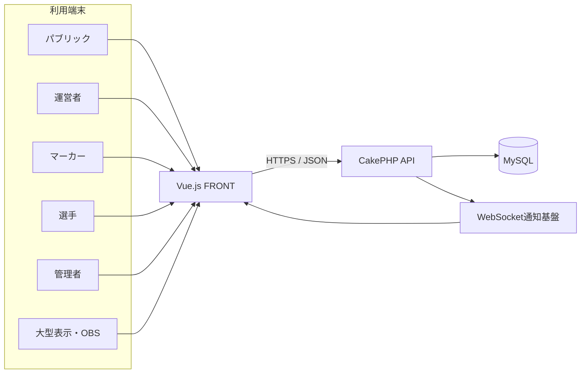

# システム構成

## 位置づけ

本書は、Squash Platformのシステム全体像と採用技術を示す入口である。ディレクトリ、インフラ、データ、FRONT、API、デプロイ等の詳細は、`docs/architecture/`配下の各資料を正本とする。

## 決定済みの技術構成

| 区分 | 採用内容 |
|---|---|
| 本番ホスティング | お名前.com レンタルサーバー RSプラン |
| バックエンド | PHP 8.5 / CakePHP 5.4 |
| フロントエンド | Vue.js 3.5 / Bootstrap 5.3 / Vite 8 |
| データベース | MySQL |
| 地図・位置情報 | Google Maps Platform Map Tiles API / Geocoding APIまたはPlaces API / OpenLayers |
| リアルタイム連携 | WebSocketを基本とし、切断・利用不可時はHTTPS APIポーリングへ切替 |
| 配信 | OBS / YouTube Live |
| ソース管理 | GitHub |
| 本番デプロイ | GitHub Actions / SSH / rsync |

ローカル開発ではNode.js 24、MySQL 8.4 LTSを使用する。本番MySQLのバージョン、WebSocket基盤およびRSプラン上での実行方式は接続試験後に確定する。

## 論理構成

初期構成は、CakePHPによる単一API、単一MySQLデータベース、利用者区分ごとに分けたVue.js FRONTから構成する。FRONTとAPIは同一リポジトリで管理するが、目標構成ではソース、依存関係、ビルドおよび配備単位を分離する。

`public`、`operator`、`marker`、`player`、`admin`等は、URL、画面、権限および配備対象を分ける利用者区分である。業務データや試合状態を利用者区分ごとに複製せず、APIとデータベースを共有する。

## 本番ドメイン

| 用途 | URL | 状態 |
|---|---|---|
| ホーム | `https://squash-platform.com` | 決定済み |
| 大会運営 | `https://operator.squash-platform.com` | 決定済み |
| エントリー | `https://entry.squash-platform.com` | 決定済み |
| 選手用 | `https://player.squash-platform.com` | 決定済み |
| マーカー | `https://marker.squash-platform.com` | 決定済み |
| ライブ | `https://live.squash-platform.com` | 決定済み |
| 大型表示 | `https://display.squash-platform.com` | 決定済み |
| 管理者 | `https://admin.squash-platform.com` | 決定済み |
| API | `https://api.squash-platform.com/api/v1/...` | 決定済み |

各FRONTの配置先、TLS証明書、DNSおよびCookieの詳細は[サーバ・インフラ構成](103_infrastructure.md)と[認証・権限](08_authentication.md)で管理する。

## データ更新とリアルタイム通知

- 得点や判定等の更新はHTTPS APIへJSONで送信し、MySQLへ保存した状態を正式状態とする。
- WebSocketは保存済み状態の更新通知に使用し、正式データの唯一の保存先にはしない。
- WebSocket切断中は表示側がHTTPS APIポーリングへ切り替え、再接続時に最新状態をAPIから再取得する。
- マーカー端末は必要なデータと操作履歴をブラウザ内へ永続保存し、通信断中も操作を継続する。
- オフライン操作は復旧後に順序を維持して再送し、複数端末の競合はサーバー側で検出する。

## 資料の役割

| 資料 | 管理する内容 |
|---|---|
| [認証・権限](08_authentication.md) | 認証区分、セッション、Cookie、認可 |
| [ディレクトリ構成](102_directory-structure.md) | APIとFRONTのソース配置、ビルド境界 |
| [サーバ・インフラ構成](103_infrastructure.md) | 本番ホスティング、ドメイン、会場ネットワーク・機材 |
| [データベース](201_database.md) | DBMS、接続、マイグレーション、バックアップ方針 |
| [ER](202_er.md) | エンティティとリレーション |
| [データモデル](203_model.md) | 業務概念、集約、状態と履歴 |
| [フロントエンド](301_frontend.md) | 画面構成、遷移、UI設計 |
| [バックエンド](302_backend.md) | CakePHPの責務、業務処理、保存境界 |
| [API](303_api.md) | URL、HTTP、JSON、エラー、同期 |
| [クラス設計](304_class_design.md) | Application Service、Policy等の責務 |
| [デプロイ](901_deployment.md) | GitHub Actions、本番配備、マイグレーション |
| [ローカル開発環境](902_development.md) | Docker Composeと開発手順 |

## 検討中

- お名前.com RSプランで利用するWebSocketの実行方式または外部配信基盤
- 開発、検証、本番環境の具体的な分離方法
- 本番MySQLのバージョン、TLS接続、ポートおよび照合順序
- 性能目標、監視、バックアップ、復旧およびメンテナンス方式
- APIと利用者別FRONTを分離配備するための移行手順
