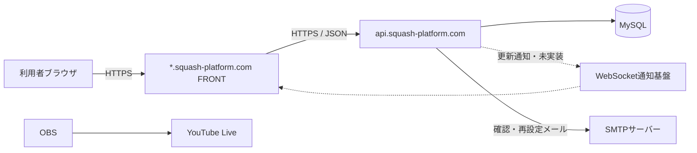
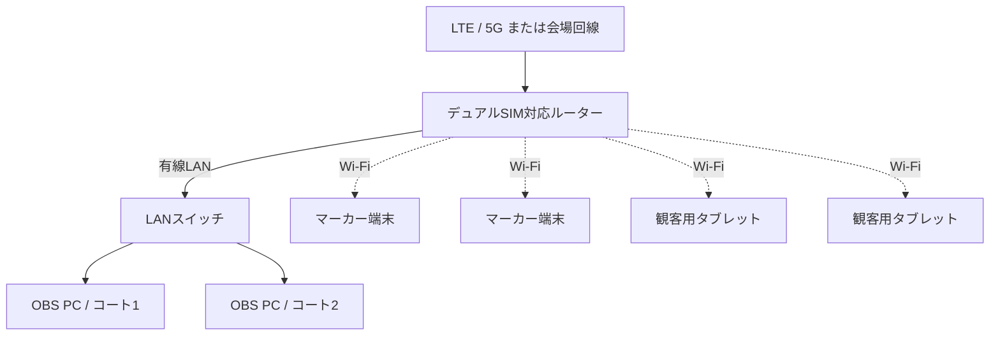

# サーバ・インフラ構成

## 位置づけ

本書は、本番ホスティング、ドメイン、通信経路、会場ネットワークおよび配信機材の構成を管理する。アプリケーション内部は[システム構成](101_system-architecture.md)、配備手順は[デプロイ](901_deployment.md)を参照する。

## 本番ホスティング

| 項目 | 構成 | 状態 |
|---|---|---|
| ホスティング | お名前.com レンタルサーバー RSプラン | 決定済み |
| Web・PHP | nginx / Apache、PHP 8.5 | RSプランの提供仕様を確認済み |
| 外部公開 | HTTPS | 決定済み。証明書設定は検討中 |
| 配備 | GitHub ActionsからSSH・rsync | 単一配置は実装済み、サブドメイン別配置は未実装 |
| API | CakePHP / PHP 8.5 | 実装中 |
| FRONT | Vue.js / Viteの静的成果物 | `operator`・`admin`を実装中 |
| データベース | MySQL 5.7 | RSプランの提供仕様。契約サーバーで要確認 |
| リアルタイム | WebSocket、利用不可時はHTTPS APIポーリング | 設計方針。基盤は未実装 |

本番サーバーの実ホスト、SSHユーザー、配置パス、データベース接続情報および鍵は、GitHub EnvironmentまたはGit管理外の環境別設定で管理し、本書へ実値を記載しない。

2026年8月25日時点の公式仕様では、RSプランのMySQLは5.7と案内されている。ローカル開発のMySQL 8.4 LTSとはバージョン差があるため、照合順序、SQLモード、JSON型、日時型、インデックスおよびマイグレーションの互換性を本番接続前に確認する。現在のComposeで指定する`utf8mb4_0900_ai_ci`はMySQL 8系の照合順序であり、本番MySQL 5.7へそのまま適用する前提にはしない。本番で使用する照合順序は接続試験後に確定する。実際の契約サーバーの表示を優先し、異なる場合は本書とローカル環境を更新する。

- [RSプランのサーバースペック](https://help.onamae.com/answer/20165)
- [SSHで利用できるコマンド](https://help.onamae.com/answer/20700)
- [RSプランのSSL](https://help.onamae.com/answer/20251)
- [MySQL 5.7と8.0の既定照合順序の違い](https://dev.mysql.com/doc/mysql-g11n-excerpt/8.0/en/charset-connection.html)

## ドメイン・通信経路

次の図はサブドメイン分離後の目標通信経路である。現在のGitHub ActionsはAPIとFRONTを単一の配置先へ同期しており、サブドメイン別配備は未実装である。



使用する本番ドメインは次のとおりとする。

- `squash-platform.com`
- `operator.squash-platform.com`
- `entry.squash-platform.com`
- `player.squash-platform.com`
- `marker.squash-platform.com`
- `live.squash-platform.com`
- `display.squash-platform.com`
- `admin.squash-platform.com`
- `api.squash-platform.com`

ドメイン名は決定済みだが、DNSレコード、TLS証明書、各FRONTのドキュメントルートおよびAPIの実配置先は検討中である。CORSは許可するFRONTオリジンを環境別に完全一致で管理する。Cookie境界は[認証・権限](104_authentication.md)で管理する。

## 永続データ・運用基盤

- 業務データの正式な保存先はMySQLとする。
- アップロードファイルは`app/webroot/uploads/`へ保存する現在方針とし、デプロイ時の削除対象から除外する。外部ストレージへの移行は検討中である。
- `app/logs/`と`app/tmp/`は本番で書き込み可能にし、Webから直接参照させない。
- SMTPの認証情報と送信元設定は環境別設定で管理し、Gitへ保存しない。
- データベースとアップロードファイルのバックアップ頻度、保存期間、暗号化、復旧試験および監視・通知方式は検討中である。
- 本番サーバーの容量、PHPエラー、HTTPエラー、応答時間および証明書期限を監視対象候補とする。

## WebSocket

WebSocket通知基盤は未実装である。目標構成では、通常時はWebSocketで保存済み状態の更新を通知する。お名前.com RSプランで常駐プロセスを利用できない場合は外部配信基盤を候補とする。採用ライブラリ、接続URL、認証、同時接続数、再接続、監視および費用は接続試験後に確定する。

## 会場ネットワークの基本方針

- OBS PCはルーターへ有線LANで接続する。
- マーカー端末と観客用タブレットはWi-Fiで接続する。
- インターネット回線は会場固定回線を優先し、利用できない場合はLTE/5Gルーターを使用する。
- 異なるキャリアのSIMを使用し、回線障害への備えを検討する。
- 配信停止時にも映像が残るよう、OBSでローカル録画する。
- 運営用ネットワークは来場者向けWi-Fiから分離し、ルーター管理画面を運営端末以外へ公開しない。
- ルーターの初期管理パスワードを変更し、不要な外部管理機能とポート転送を無効にする。

## 会場の初期構成



この図は2コート開催時の構成例であり、OBS PCの台数を確定するものではない。LANスイッチの要否は、採用ルーターの有線ポート数で決定する。

## デュアルSIM

初期構成では、デュアルSIMを回線ボンディングではなく切替型フェイルオーバーとして扱う。

```text
通常時: SIM 1
障害検知: SIM 1からSIM 2へ切替
```

- SIM 1とSIM 2には異なるキャリアを使用することを推奨する。
- SIM切替時には短時間の通信断が発生する可能性がある。
- OBSの自動再接続設定を有効にする。
- 無停止切替が必要になった場合は、ボンディング製品を将来検討する。

ルーター機種、SIM契約、切替条件および切替時間は検討中である。

## 回線容量の初期見積り

720p/60fps、映像6 Mbpsを候補とした場合、2コートで約12 Mbpsとなる。音声、通信オーバーヘッド、速度変動を考慮し、これを超える安定した上り余力が必要である。

映像6 Mbpsでは1コート1時間あたり約2.7 GB、2コートを8時間配信すると映像だけで約43 GBとなる。必要速度、安全率、SIM容量および速度制限は会場試験で確認する。

## 映像・会場機材

| 機材 | 数量候補 | 状態・備考 |
|---|---:|---|
| GoPro | 2 | 機種は検討中 |
| HDMI出力用機材 | 2 | GoPro機種に応じて確認 |
| ワイヤレスHDMI送受信セット | 2 | 遅延、距離、混信を検証 |
| HDMIキャプチャーデバイス | 2 | OBSとの互換性を確認 |
| OBS PC | 1～2 | 1台集約かコート別か検討中 |
| LTE/5Gルーター | 1 | デュアルSIM候補 |
| LANスイッチ | 0～1 | ポート数により判断 |
| マーカー端末 | コート数と同数 | コートごとにタブレット1台 |
| コート別得点ボード端末 | コートごとに1～2台 | タブレットまたは大型モニター |
| その他の観客表示端末 | 必要数 | 試合状況一覧等を表示 |

## 会場試験

- 各キャリアの電波強度、上り速度、パケット損失および混雑時の変動
- 有線LANケーブルの導線、安全対策およびWi-Fi混雑
- ワイヤレスHDMIとの電波干渉
- 電源容量、給電、予備バッテリーおよび機材の発熱
- マーカー端末の画面ロック、回転、通知音・振動
- 予備回線への切替とOBS再接続
- ローカル録画の保存容量

## 障害時の基本方針

| 障害 | 初期対応 |
|---|---|
| 主回線の障害 | 予備SIMまたは予備回線へ切替 |
| インターネット断 | ローカル録画を継続し、取得済みデータでマーカー操作を継続 |
| ワイヤレスHDMI断 | 再接続し、必要に応じて予備ケーブルへ切替 |
| OBS PC障害 | 対象コートのみ停止し、他コートへの影響を限定 |
| マーカー機能の重大障害 | 紙のマーカー用紙へ切替 |
| 大型表示障害 | 代替表示を設けず、大会進行を継続 |

マーカーのオフライン継続と再同期は設計方針であり、2026年8月25日時点では未実装である。紙の結果を復旧後に一括登録する機能、指定時点復旧および具体的な予備機材は将来導入とする。
