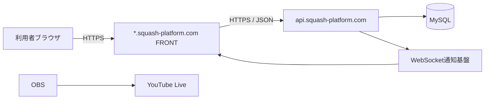
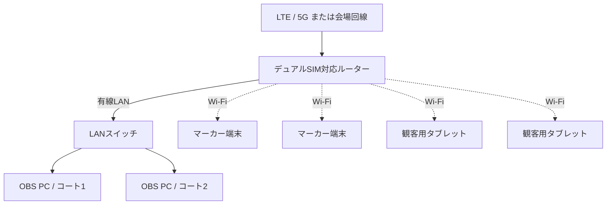

# サーバ・インフラ構成

## 位置づけ

本書は、本番ホスティング、ドメイン、通信経路、会場ネットワークおよび配信機材の構成を管理する。アプリケーション内部は[システム構成](101_system-architecture.md)、配備手順は[デプロイ](901_deployment.md)を参照する。

## 本番ホスティング

| 項目 | 方針 |
|---|---|
| ホスティング | お名前.com レンタルサーバー RSプラン |
| 外部公開 | HTTPS |
| 配備 | GitHub ActionsからSSH・rsync |
| API | CakePHP / PHP 8.5 |
| FRONT | Vue.js / Viteの静的成果物 |
| データベース | MySQL |
| リアルタイム | WebSocketを基本とし、利用不可時はHTTPS APIポーリング |

本番サーバーの実ホスト、SSHユーザー、配置パス、データベース接続情報および鍵は、GitHub EnvironmentまたはGit管理外の環境別設定で管理し、本書へ実値を記載しない。

## ドメイン・通信経路



使用する本番ドメインは次のとおりとする。

- `squash-platform.com`
- `operator.squash-platform.com`
- `entry.squash-platform.com`
- `player.squash-platform.com`
- `marker.squash-platform.com`
- `live.squash-platform.com`
- `display.squash-platform.com`
- `admin.squash-platform.com`
- `api.squash-platform.com`

DNSレコード、TLS証明書の方式、各FRONTのドキュメントルートおよびAPIの配置先は検討中である。CORSは許可するFRONTオリジンを環境別に完全一致で管理する。Cookie境界は[認証・権限](08_authentication.md)で管理する。

## WebSocket

通常時はWebSocketで保存済み状態の更新を通知する。お名前.com RSプランで常駐プロセスを利用できない場合は外部配信基盤を使用する候補とする。採用ライブラリ、接続URL、認証、同時接続数、再接続および監視方式は接続試験後に確定する。

## 会場ネットワークの基本方針

- OBS PCはルーターへ有線LANで接続する。
- マーカー端末と観客用タブレットはWi-Fiで接続する。
- インターネット回線は会場固定回線を優先し、利用できない場合はLTE/5Gルーターを使用する。
- 異なるキャリアのSIMを使用し、回線障害への備えを検討する。
- 配信停止時にも映像が残るよう、OBSでローカル録画する。

## 会場の初期構成



LANスイッチの要否は、採用ルーターの有線ポート数で決定する。

## デュアルSIM

初期構成では、デュアルSIMを回線ボンディングではなく切替型フェイルオーバーとして扱う。

```text
通常時: SIM 1
障害検知: SIM 1からSIM 2へ切替
```

- SIM 1とSIM 2には異なるキャリアを使用することを推奨する。
- SIM切替時には短時間の通信断が発生する可能性がある。
- OBSの自動再接続設定を有効にする。
- 無停止切替が必要になった場合は、ボンディング製品を将来検討する。

ルーター機種、SIM契約、切替条件および切替時間は検討中である。

## 回線容量の初期見積り

720p/60fps、映像6 Mbpsを候補とした場合、2コートで約12 Mbpsとなる。音声、通信オーバーヘッド、速度変動を考慮し、これを超える安定した上り余力が必要である。

映像6 Mbpsでは1コート1時間あたり約2.7 GB、2コートを8時間配信すると映像だけで約43 GBとなる。必要速度、安全率、SIM容量および速度制限は会場試験で確認する。

## 映像・会場機材

| 機材 | 数量候補 | 状態・備考 |
|---|---:|---|
| GoPro | 2 | 機種は検討中 |
| HDMI出力用機材 | 2 | GoPro機種に応じて確認 |
| ワイヤレスHDMI送受信セット | 2 | 遅延、距離、混信を検証 |
| HDMIキャプチャーデバイス | 2 | OBSとの互換性を確認 |
| OBS PC | 1～2 | 1台集約かコート別か検討中 |
| LTE/5Gルーター | 1 | デュアルSIM候補 |
| LANスイッチ | 0～1 | ポート数により判断 |
| マーカー端末 | コート数と同数 | コートごとにタブレット1台 |
| コート別得点ボード端末 | コートごとに1～2台 | タブレットまたは大型モニター |
| その他の観客表示端末 | 必要数 | 試合状況一覧等を表示 |

## 会場試験

- 各キャリアの電波強度、上り速度、パケット損失および混雑時の変動
- 有線LANケーブルの導線、安全対策およびWi-Fi混雑
- ワイヤレスHDMIとの電波干渉
- 電源容量、給電、予備バッテリーおよび機材の発熱
- マーカー端末の画面ロック、回転、通知音・振動
- 予備回線への切替とOBS再接続
- ローカル録画の保存容量

## 障害時の基本方針

| 障害 | 初期対応 |
|---|---|
| 主回線の障害 | 予備SIMまたは予備回線へ切替 |
| インターネット断 | ローカル録画を継続し、取得済みデータでマーカー操作を継続 |
| ワイヤレスHDMI断 | 再接続し、必要に応じて予備ケーブルへ切替 |
| OBS PC障害 | 対象コートのみ停止し、他コートへの影響を限定 |
| マーカー機能の重大障害 | 紙のマーカー用紙へ切替 |
| 大型表示障害 | 代替表示を設けず、大会進行を継続 |

紙の結果を復旧後に一括登録する機能、指定時点復旧および具体的な予備機材は将来導入とする。
