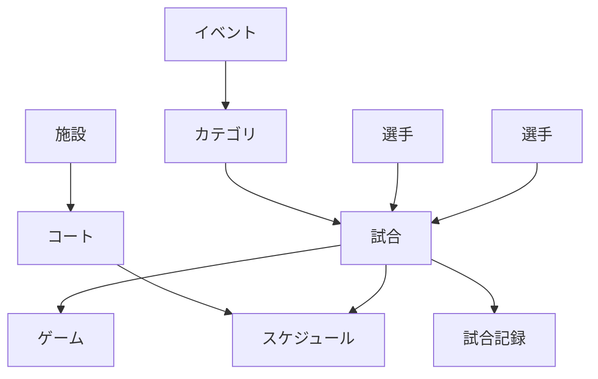

# データモデル

## 位置づけ

本書は、Squash Platformの主要な業務概念、境界、状態および履歴の考え方を整理する。テーブル候補とリレーションの詳細は[ER](202_er.md)、処理責務は[クラス設計](304_class_design.md)を参照する。

## 基本用語

| 用語 | 定義 |
|---|---|
| イベント | 一つの大会・開催単位を表す最上位の業務データ |
| カテゴリ | イベント内の競技区分 |
| 試合 | カテゴリ内で選手同士が対戦する単位 |
| ゲーム | 一つの試合を構成する得点単位 |
| コート | 試合を実施する施設内の場所 |
| スケジュール | 試合を開催日、開始予定時刻およびコートへ割り当てたもの |
| 試合記録 | 得点、判定、サーブ、タイマー等の操作と確定状態 |

## アカウントと選手

- 通常ユーザーは`USER`、プラットフォーム管理者は`ADMIN`として分離する。
- 運営者が通常ユーザー登録のない選手も大会へ登録できるため、選手を表す`PLAYER`は`USER`と分離し、関連を任意とする。
- イベント所有者とスタッフは、イベント、通常ユーザー、固定ロールおよび担当範囲の関係として表す。
- 管理者をイベント所有者、スタッフ、マーカーまたは選手として関連付けない。

## イベント集約

イベントは、カテゴリ、開催日、使用施設・コート、参加選手、スタッフ、スポンサー、ドロー、スケジュールおよび試合を束ねる業務上の起点とする。ただし、すべてを単一トランザクションで同時更新する巨大な集約とはせず、更新単位は詳細設計で分ける。

## ドローとスケジュール

- ドローはカテゴリ内の組合せと進出関係を管理する。
- スケジュール候補、編集用下書き、公開版を区別する。
- 公開するまではマーカー画面、パブリック画面および大型表示へ反映しない。
- 公開後の変更は版と履歴を保持し、通知処理と分離する。

## 試合状態と記録

- 試合状態の正本は[試合状態遷移](../specifications/yaml/state-machine.yaml)とする。
- 得点や判定は結果だけでなく操作履歴を保持し、UNDO、訂正および監査に利用する。
- MySQLへ保存された正式記録をサーバー上の正式状態とする。
- オフライン中に複数端末へ記録が分岐した場合、自動で混在させず、権限を持つ運営者が記録全体から正式な1本を選択する。
- 採用されなかった記録も監査用に保持する。

## 表示モデル

パブリック、運営者、マーカー、大型表示およびOBSは同じ正式データを利用する。用途ごとに返却項目や表示形式を変えるが、独立した試合状態を持たない。必要に応じて読取用のQuery Serviceまたは投影を設ける。

## 履歴と監査

- 結果確定、訂正、権限変更、公開、競合解決等は操作者と日時を記録する。
- 論理削除後も大会記録と監査に必要な表示値を保持する。
- 個人情報と公開用データを分離し、APIで利用者権限に応じて返却範囲を制御する。

## 検討中

- 各集約とトランザクション境界
- 現在値を保持する範囲と操作履歴から再計算する範囲
- 公開版の世代管理と差分保持方法
- 個人情報、試合記録、監査履歴の保存期間
- フェーズ2以降の申込、決済、通知および配信データの境界

## 関連資料

- [データベース](201_database.md)
- [ER](202_er.md)
- [API](303_api.md)
- [クラス設計](304_class_design.md)
