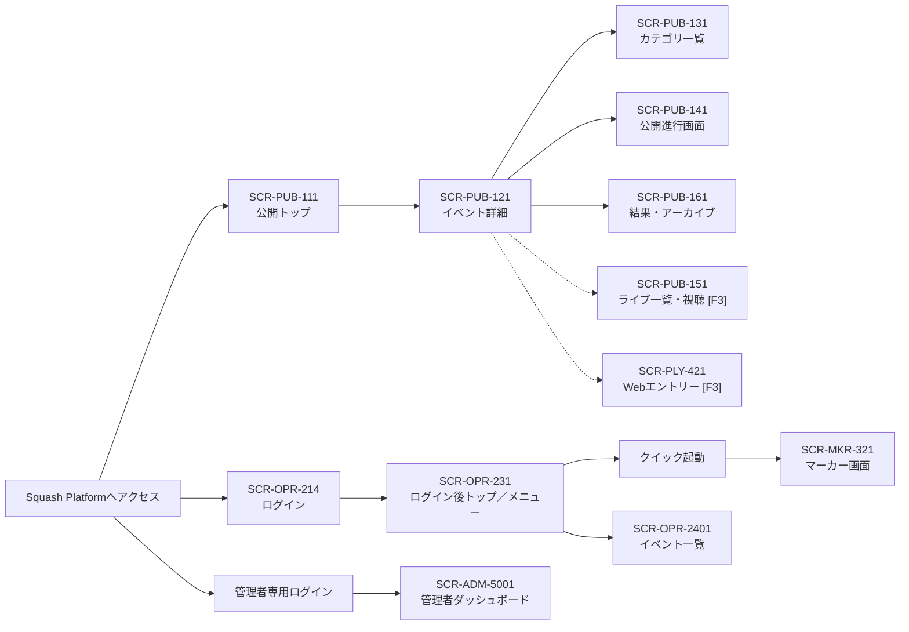
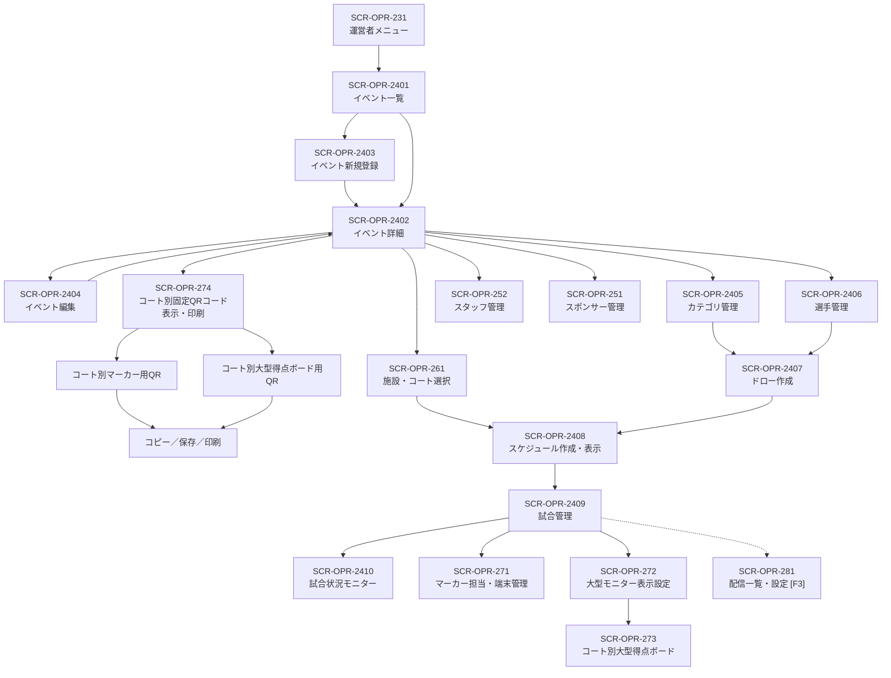
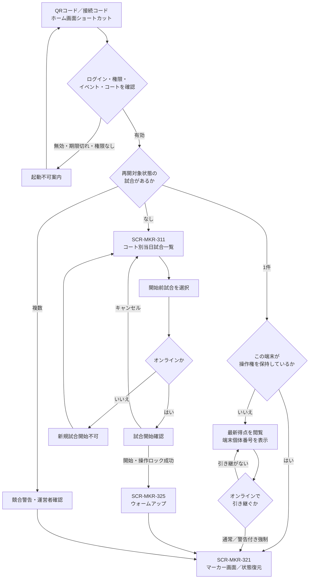
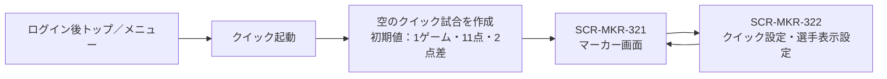
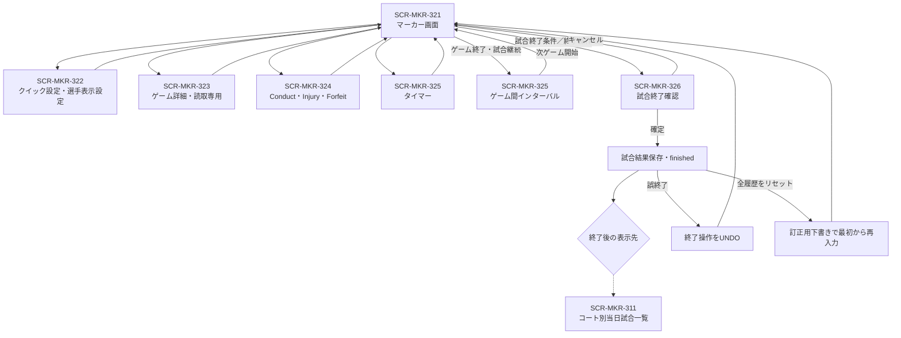
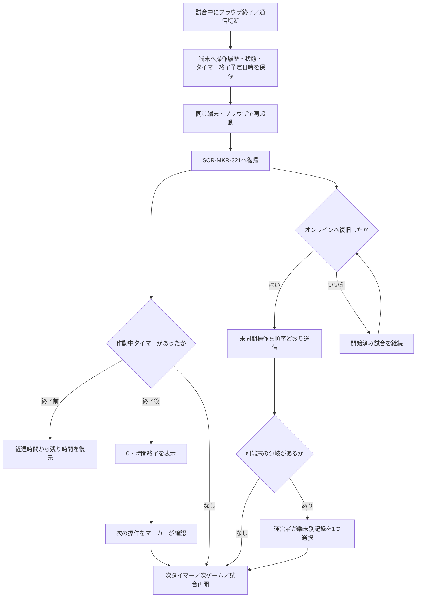
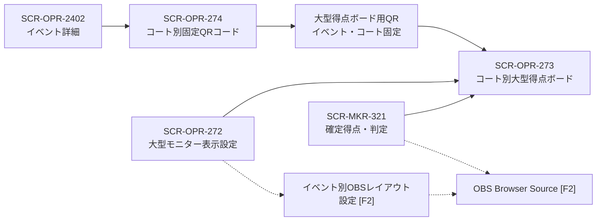
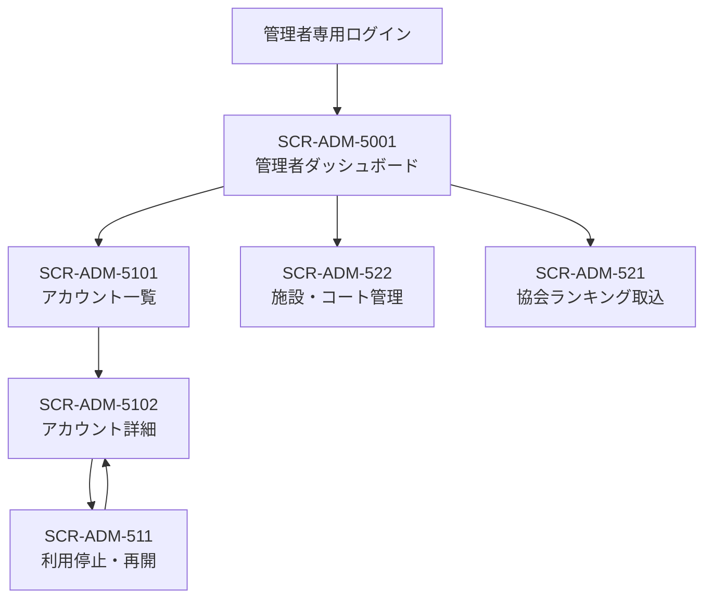
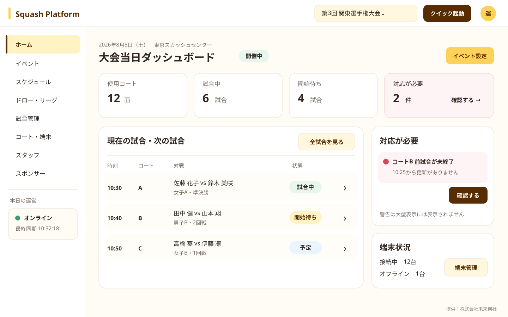
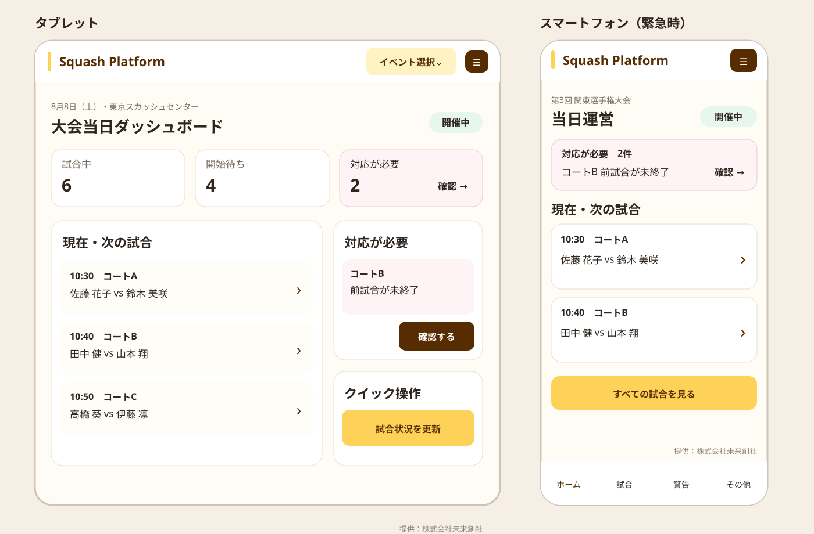

# フロントエンド構成

## 位置づけ

本書は、利用者別仕様に定義された画面の入口と主要な遷移を横断的に確認するための資料である。画面内の操作、試合状態および業務ルールの詳細は各仕様書を正本とする。

利用者区分ごとのViteエントリーと共通ソースの配置は[ディレクトリ構成](102_directory-structure.md)、APIとの通信規約は[API](303_api.md)を参照する。

- 確認時点：2026年8月7日
- 実線：決定済みの主要遷移
- 破線：後続フェーズ、または詳細が検討中の遷移
- `[F1]`、`[F2]`、`[F3]`：提供フェーズ
- 画面IDのない確認ダイアログは、遷移元画面の一部として扱う

## 1. 全体入口

公開画面、通常ユーザー画面およびプラットフォーム管理者画面は、認証経路を分離する。クイック起動だけはフェーズ1のログイン後トップへ必ず表示し、ダッシュボードのその他の構成はフェーズ2で拡張する。

## 2. 運営者による大会準備・当日運営

フェーズ1でもドローとスケジュールは下書きへ保存し、運営者が確認してから公開する。フェーズ2のスケジュール自動生成では、`SCR-OPR-2408`内で複数候補を比較し、選択した1案を下書きへ複製して手動調整・公開する。候補および下書きは、公開するまでマーカー画面や公開画面へ反映しない。

イベントに設定した施設・コートは大会準備時点で確定しているため、イベント詳細の直下から`SCR-OPR-274`を開く。各コートのマーカー用QRコードと大型得点ボード用QRコードは固定とし、マーカー割当画面や試合管理画面を経由しない。

## 3. マーカー起動

### 3.1 通常モード

再開対象として使用する正式な試合状態は、`warmup`、`preparing`、`in_progress`、`interval`、`injury_time`、`suspended`である。独自の包括状態コードは使用しない。

### 3.2 クイックモード

クイックモードは事前入力画面と`SCR-MKR-311`を経由しない。イベント名、カテゴリ名、ラウンド名、コート番号および選手名は空欄のまま開始し、後から設定できる。

## 4. マーカー画面内の遷移

試合終了確定後に自動的に一覧へ戻すか、結果を表示したまま「一覧へ戻る」を押させるかは検討中とする。誤終了後のUNDOと全履歴リセット・再入力は、担当マーカーまたはイベント運営者が実行できる。

## 5. ブラウザ終了・オフラインからの復帰

ブラウザ不在中は、閉じた時点で動作していた1つのタイマーが0になるまでだけ経過させる。次のタイマー、ゲームまたは試合へ自動遷移しない。

## 6. 大型表示・OBSの入口

大型得点ボード用QRコードは、マーカー用とは別の固定コードとしてイベント・コートごとに作成し、同じコートの1～2台の表示端末でイベント開催終了まで再利用する。

## 7. 管理者画面

## 8. 画面遷移として残る検討事項

1. 試合終了確定後に`SCR-MKR-311`へ自動遷移するか、結果確認画面に留まるか。
2. 得点入力後にクイック設定で最大ゲーム数、ゲーム終了点または必要点差を変更した場合の確認画面と適用方法。
3. ドロー・スケジュールの公開取消を許可する条件と、取消後に表示する公開版。
4. フェーズ3のWebエントリー、決済、キャンセル待ちおよび選手マイページの詳細遷移。
5. フェーズ3の配信設定、YouTube連携および配信終了後のアーカイブ遷移。

## 画面遷移の関連資料

- [開発ロードマップ・フェーズ](../02_development-roadmap.md#3-製品リリースフェーズ)
- [運営者仕様](../specifications/200_Operator.md)
- [マーカー仕様](../specifications/300_Marker.md)
- [パブリック仕様](../specifications/100_Public.md)
- [選手仕様](../specifications/400_Player.md)
- [管理者仕様](../specifications/500_Admin.md)
- [試合状態遷移](../specifications/yaml/state-machine.yaml)

## UIデザインの目的

Squash Platformの全画面について、操作性と視認性を最優先にしながら、清潔感があり、丸みを帯びた優しい印象へ統一する。本書はパブリック、運営者、マーカー、選手および管理者画面に共通するデザイン方針を定める。

マーカー、大型得点ボードおよびOBS等、用途固有の優先順位がある画面は各仕様書を優先し、色、文字、余白、操作部品の基本的な考え方は本書を参照する。

## 決定済みのデザイン方針

### 優先順位

1. 操作対象と現在状態を迷わず判別できること
2. 誤操作を防ぎ、主要操作を少ない手順で実行できること
3. PCでも文字とボタンを過度に小さくしないこと
4. 十分な余白、角丸、穏やかな配色により清潔感と親しみやすさを表現すること
5. Squash Platformとして一貫した配色を使用し、提供元であるS-NICKの表示へ依存しないこと

情報量を増やすために文字、行間またはボタンを極端に小さくしない。画面へ収まらない場合は、情報のグループ化、段階表示、タブ、絞込みおよび適切なスクロールを使用する。

### 画面全体の印象

- 背景は白またはわずかに暖かい明色を基本とする。
- カード、入力欄、ダイアログおよびボタンへ統一した角丸を使用する。
- 枠線と影は弱くし、太い黒枠や強い立体表現を常用しない。
- 重要度は色の多用ではなく、文字サイズ、余白、配置および面の濃淡で表現する。
- 1画面で使用する強いアクセント色を絞り、落ち着いた運営画面を維持する。

## UIカラーパレット

添付されたキャラクター`Pattern1.png`から抽出した代表色を、Squash Platformの初期UIカラーパレットとして参考利用する。配色を使用する場合もS-NICKの名称、ロゴまたはキャラクターを併記する必要はない。正式なシステムカラーが別途定められた場合は、その値へ置き換える。

| 用途 | 初期基準色 | 使用方針 |
|---|---|---|
| メインイエロー | `#FED258` | 選択状態、見出しの一部、穏やかな強調面。文字色には濃茶を使用する |
| メインブラウン | `#572C00` | 主要文字、主要操作、見出し等 |
| アクセントピンク | `#FF008F` | 注目させる小さなアクセントへ限定し、広い背景面には常用しない |
| アクセントブルー | `#00A6FF` | リンク、補助的な選択状態、情報表示等 |
| 基本背景 | `#FFFCF5` | 画面背景の候補。純白のカードと組み合わせる |
| 基本文字 | `#2E261F` | 本文と主要情報。真黒より柔らかいが十分な可読性を確保する |
| 境界線 | `#E7DED1` | カード、表、入力欄等の控えめな区切り |

- メインイエロー上には濃い文字を使用し、白文字を基本としない。
- ピンクと青は補助的なアクセントとし、同じ画面内で大面積に競合させない。
- 成功、警告、エラー、情報等の状態色は意味を優先し、メインカラーだけで代用しない。
- 色だけで状態や操作可否を伝えず、文字、アイコン、形またはラベルを併用する。
- 実装前に通常、ホバー、フォーカス、無効、選択およびエラー状態の文字コントラストを確認する。

## 文字と操作部品

以下は初期レイアウト作成時の推奨値とし、主要画面のプロトタイプと実機確認後に確定する。

| 対象 | PCでの推奨値 | タッチ端末での推奨値 |
|---|---:|---:|
| 本文 | 16～18 CSS px | 17～20 CSS px |
| 入力欄・ボタン文字 | 16～18 CSS px | 18 CSS px以上 |
| 画面タイトル | 28～32 CSS px | 26～32 CSS px |
| セクション見出し | 20～24 CSS px | 20～24 CSS px |
| 補助情報 | 14～16 CSS px | 15～16 CSS px |
| 主要ボタン高さ | 48 CSS px以上 | 56 CSS px以上 |
| 表・一覧の標準行高 | 48～56 CSS px | 52～60 CSS px |

- PC画面でも、主要ボタンを小さなテキストリンクやアイコンだけの操作へ置き換えない。
- 頻繁に使う主要操作は、画面右上だけでなく対象情報の近くへ配置する。
- アイコンだけでは意味が伝わりにくい操作には、短い文字ラベルを付ける。
- 破壊的操作と通常操作を隣接させる場合は、間隔、色および確認手順で誤操作を防止する。
- キーボードフォーカスを明確に表示し、フォーカス枠をデザイン上の理由だけで消さない。
- 試合一覧の行・カードから詳細へ移動する場合は、行・カード全体をリンクとしてクリック・タップ・キーボード操作できるようにし、重複する「詳細」ボタンを設置しない。
- 対戦選手を1行で示す場合は`Player A vs Player B`形式に統一し、言語にかかわらず区切りへ`vs`を使用する。

## 角丸・余白・レイアウト

- 基本間隔は8 CSS pxの倍数を基準とし、関連要素は近く、異なるグループは広く離す。
- ボタンと入力欄の角丸は10～14 CSS px、カードとダイアログは14～20 CSS pxを初期候補とする。
- 状態ラベル等を除き、すべての部品を完全なカプセル形状にはしない。
- PCでは内容幅を無制限に広げず、読み物・入力フォーム・一覧等の用途に応じて最大幅を設ける。
- 一覧画面は余白を確保しつつ、検索、絞込み、主要操作、一覧結果の順序を画面間で統一する。
- レスポンシブ表示では情報の優先順位を維持し、画面幅だけを理由に主要操作を隠さない。

## 提供元・キャラクターの使用方針

通常画面ではSquash Platform、イベント、大会主催者、選手および競技情報を主役とし、S-NICKの名称、ロゴまたはキャラクターを前面に出さない。提供元は法人名で控えめに表示する。

### 控えめに表示できる場所

- 日本語画面のフッターに表示する`提供：株式会社未来創社`
- 英語画面のフッターに表示する`Provided by Miraisosha Co., Ltd.`。正式な英文商号の確認後に確定する
- 提供元情報、利用規約、プライバシーポリシー、問い合わせ先
- マニュアルの提供元・著作権情報
- S-NICK自体を説明する専用ページ

### 表示しない場所

- 通常画面の共通ヘッダー、メインナビゲーションおよびページタイトル
- ログイン画面の主見出し、初回案内、空表示および操作完了表示
- 運営者・マーカーの主要操作領域
- 得点、試合状態、警告または重要な確認ダイアログの背景
- 大型得点ボード、OBSオーバーレイおよび大会の観客向け表示
- イベント主催者や選手の情報より目立つ位置
- 全画面背景、大きな透かし、常時表示される大型イラスト

通常画面ではキャラクターを表示しない。提供元情報等の限定された場所で使用する場合も、本文やSquash Platformの名称より目立たない寸法とし、キャラクターがなくても情報、操作性および画面デザインが成立する構成とする。

### フッター表示

- 提供元表記は12～13 CSS px程度の補助文字とし、本文より弱いグレーを使用する。
- ロゴ、キャラクター、背景色および装飾枠を付けず、文字だけで表示する。
- PCとタブレットでは画面またはコンテンツ領域の右下、スマートフォンでは主要内容と下部ナビゲーションの間を基本位置とする。
- 主要操作に追従する固定表示にはせず、スクロール末尾または画面フッターとして表示する。
- 大型得点ボード、OBSオーバーレイおよび大会主催者が使用する会場表示には表示しない。

## 画面種別ごとの適用

| 画面種別 | 適用方針 |
|---|---|
| パブリック | イベントや選手を主役とし、明るく読みやすいカードと大きめの導線を使用する |
| 運営者 | PCを主用途としながら、緊急時にはタブレット・スマートフォンでも主要操作を継続できる構成とする。多数の項目を扱う場合も文字・行高を確保する |
| マーカー | 本書よりもさらに大きなタップ領域を使用し、得点と判定の操作性を最優先する |
| 選手 | スマートフォンを優先し、申込状態、支払状態、次の予定を大きく表示する |
| 管理者 | 情報密度を確保しつつ、PCでも小さすぎる表、ボタン、入力欄を使用しない |
| 大型表示・OBS | 競技情報とスポンサーを主役とし、キャラクターを表示しない |

## 今後の確認

- PC、10インチ前後、12インチ前後、スマートフォンでの文字・ボタンサイズ
- システムカラーの正式値と、通常・選択・フォーカス・無効状態の派生色
- 主要画面における色のコントラストと色覚多様性への対応
- 提供元表記の必要箇所、文言、表示寸法およびキャラクターを例外的に使用する範囲
- 株式会社未来創社の正式な英文商号
- 運営者画面、310コート別試合一覧、スケジュール、結果訂正画面の共通部品とレイアウト
- 運営者の主要画面について、PC・タブレット・スマートフォンそれぞれの情報配置と操作手順

## 運営者画面の初期デザイン案

以下は、運営者が大会当日の状況を確認するダッシュボードを例にした初期デザイン案である。画面構成、情報の優先順位、レスポンシブ時の変形および共通部品の方向性を確認するための資料とし、各項目、件数、文言および遷移先は画面ごとの詳細設計で調整する。

### PCブラウザ

- 左側へ主要機能のナビゲーション、上部へイベント選択と利用者情報を配置する。
- 画面上部で大会状態と対応件数を把握し、その下で現在・次の試合と警告を確認する。
- 試合一覧は行全体をクリック・タップすると詳細へ遷移する。「詳細」ボタンは設置せず、ホバー、フォーカスおよび右端の矢印で遷移可能であることを示す。
- 対戦選手は`Player A vs Player B`形式で表示し、`対`は使用しない。
- S-NICKの名称・ロゴ・キャラクターは表示せず、黄、茶、角丸および余白でSquash Platformの統一感を表現する。
- 画面下部へ装飾のない補助文字で`提供：株式会社未来創社`を表示する。

### タブレット・スマートフォン

- タブレットでは主要一覧と警告・クイック操作を2列で表示し、メニューを上部へ集約する。
- スマートフォンでは警告を最初に表示し、試合を1件ずつカード表示する。
- 試合カード全体をタップすると詳細へ遷移し、カード内へ「詳細」ボタンを設置しない。
- PCの表を単純に縮小せず、狭い画面では縦積みへ変形する。
- スマートフォン下部には当日運営で頻繁に使う移動先を固定し、片手でも主要画面へ移動しやすくする。
- 端末ごとに情報の並び方は変えるが、表示する状態、操作権限および監査対象は変えない。
