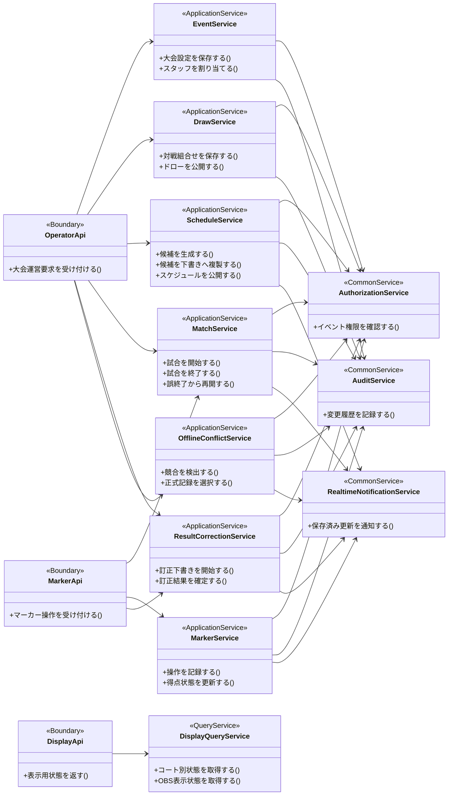
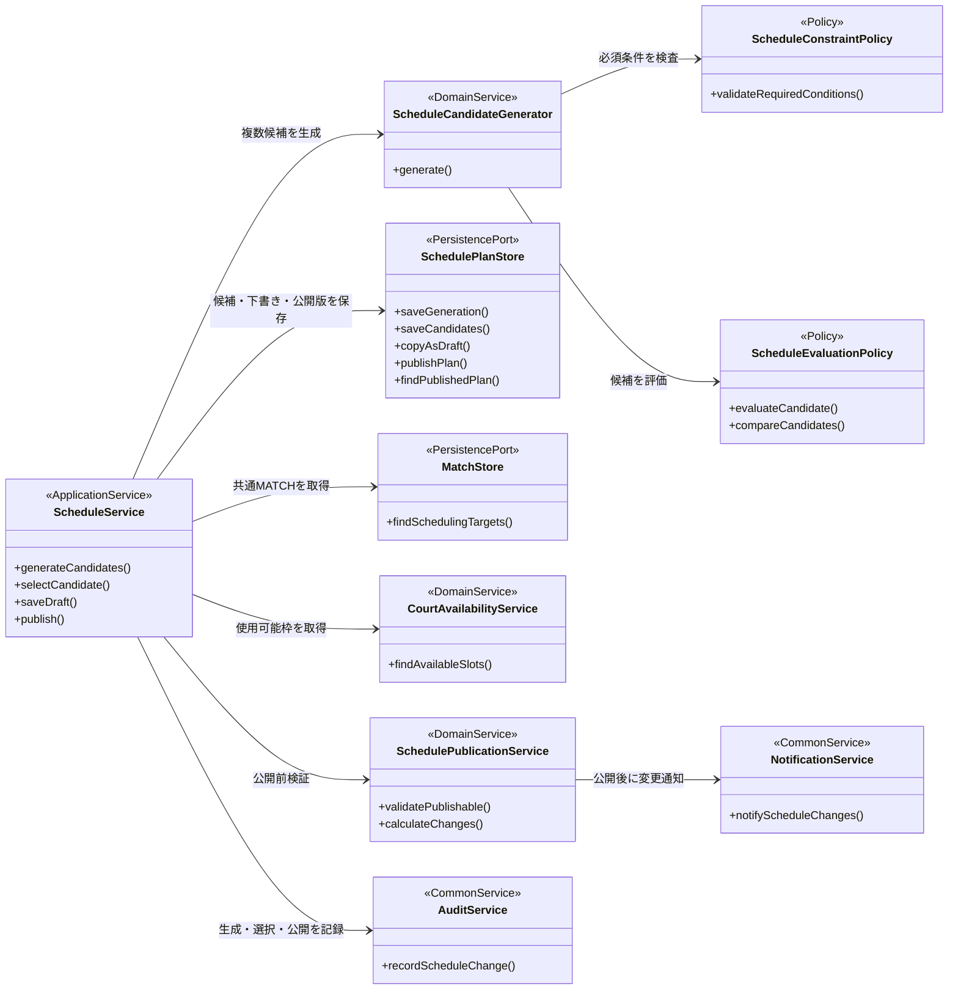
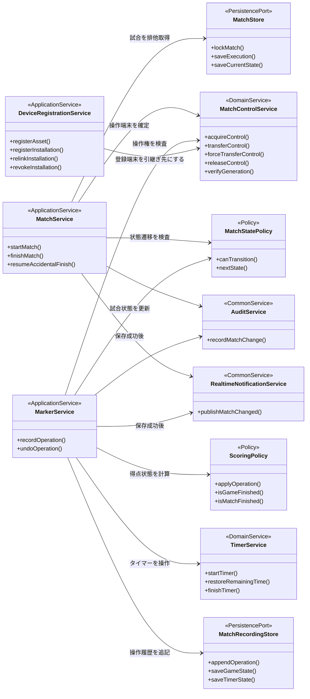
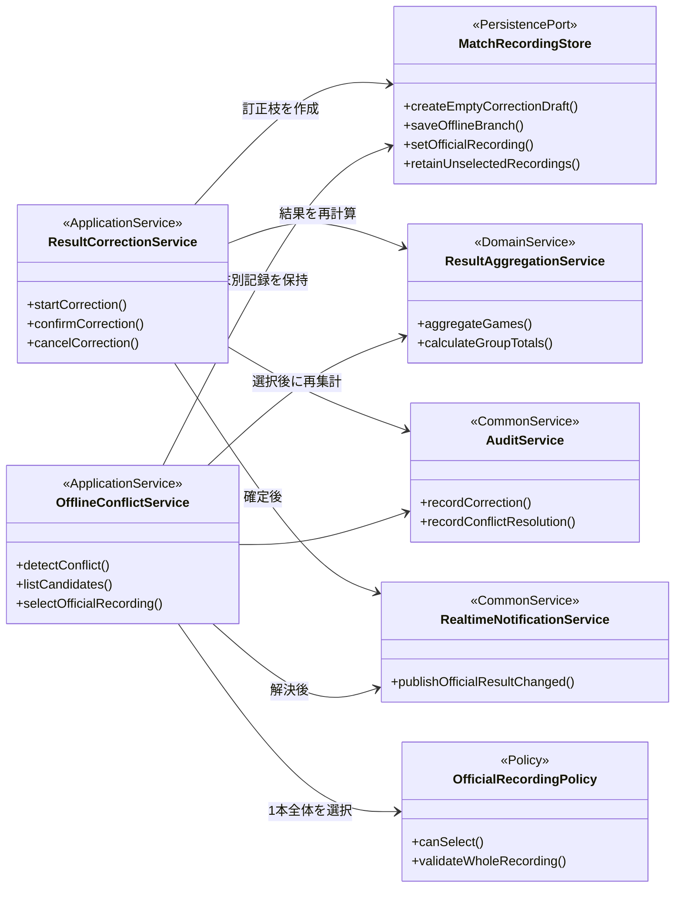
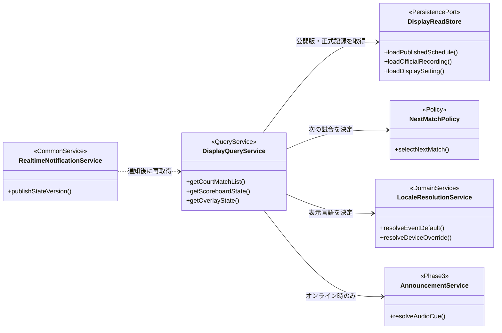

# クラス設計

## 位置づけ

本書は、Squash Platformの主要な業務処理について、責務と依存関係を整理するための概念クラス図である。現在は要件整理段階のため、CakePHPの`Table`、`Entity`、ControllerおよびVueコンポーネントをテーブル単位で定義しない。

- 確認時点：2026年8月7日
- 対象：フェーズ1の大会運営、スケジュール、マーカー、試合結果、リアルタイム表示
- クラス名と分割単位：設計候補。実装開始時の詳細設計で確定する
- データ構造：[データモデル](203_model.md)
- 画面遷移：[フロントエンド](301_frontend.md)

## 設計方針

1. Controllerは入力受付と応答変換を担当し、試合進行や得点判定を直接実装しない。
2. 業務処理は用途別のApplication Serviceへまとめる。
3. 得点、状態遷移、スケジュール評価等の規則はPolicyとして分離する。
4. CakePHPの`Table`と`Entity`は永続化の実装詳細として扱い、概念クラス図には個別列挙しない。
5. 得点等の保存はHTTPS APIで確定し、保存成功後にリアルタイム通知を送る。
6. 試合状態遷移は[`state-machine.yaml`](../specifications/yaml/state-machine.yaml)を正本とし、クラス内に別の状態一覧を持たない。
7. 権限確認と監査記録は、変更系Application Serviceから共通利用する。

## 1. 全体クラス構成

## 2. スケジュール候補・公開

### 責務の境界

- `ScheduleCandidateGenerator`は、同じ`MATCH`集合から複数の配置候補を作る。試合自体は複製しない。
- `ScheduleConstraintPolicy`は、コート重複、選手重複、最低休憩時間、依存試合順、利用可能時間等の必須条件を判定する。
- `ScheduleEvaluationPolicy`は、連続試合、休憩時間の偏り、コート空き時間、大会終了予定時刻等を評価する。具体的な重みは検討中とする。
- `SchedulePlanStore`は保存方法を隠し、Application ServiceがCakePHP ORMの詳細へ依存しないための境界候補とする。
- `SchedulePublicationService`は、公開可否の検査と直前の公開版との差分作成を担当する。

## 3. 試合開始・マーカー・タイマー

`MatchService.startMatch()`は、試合の排他取得、操作端末の確定、ルールスナップショット、実施コート・開始日時の保存および状態遷移を一つの処理として確定する。二重タップ、複数タブ、別端末からの同時開始は`MatchControlService`とデータベース制約の両方で防止する。

`DeviceRegistrationService`は、物理端末へ固定の端末個体番号を発行し、その端末で使用するブラウザごとのインストールIDを関連付ける。`MatchControlService.transferControl()`は通常引継ぎ、`forceTransferControl()`は旧端末の未同期状態を確認できない場合の警告付き強制引継ぎを担当する。どちらも試合記録を維持したまま操作権の世代番号を更新し、旧世代からの更新を拒否する。

`TimerService.restoreRemainingTime()`は、保存した終了予定日時と、オンライン時に記録したサーバー時刻との差分を利用して残時間を再計算する。オフライン復帰時は最後に保存した時刻差で端末時刻を補正して継続し、端末時刻との差が5秒以上検出された場合は補正確認ダイアログを表示する。タイマー終了だけを理由に次ゲームまたは試合を自動開始しない。

## 4. 結果訂正・オフライン競合

- 結果訂正は正式記録を直接消去せず、新しい訂正用記録へ全操作を再入力する。
- オフライン中に複数端末で記録された操作は混在させず、`OfflineConflictService`が記録枝全体から正式な1本を選択する。
- 採用されなかった記録も監査用に保持する。

## 5. 表示・リアルタイム通知

WebSocketは変更内容すべてを正式データとして運ばず、対象IDと状態バージョンを通知する。大型表示、OBSおよび310コート別試合一覧は、通知受信後に必要な最新状態をAPIから取得する。切断時はAPIポーリングへ切り替える。

## 6. CakePHP・Vue.jsへの対応方針

| 概念上の役割 | CakePHP／Vue.jsでの配置候補 |
|---|---|
| Boundary | CakePHP Controller、API Controller、Vue画面 |
| Application Service | CakePHPの業務サービスクラス |
| Policy・Domain Service | 状態遷移、得点、制約等を扱う副作用の少ないクラス |
| Persistence Port | CakePHP Table／Repositoryを包む保存境界 |
| Query Service | 一覧・大型表示・OBS向けの読取処理 |
| Common Service | 権限、監査、通知、言語解決 |

この対応表はクラスの配置候補であり、現時点でディレクトリ構成、名前空間、継承関係またはインターフェース実装を確定するものではない。

## 7. 詳細設計時の検討事項

1. Application Serviceを画面単位と業務操作単位のどちらで分割するか。
2. `PersistencePort`を明示的なRepositoryインターフェースにするか、CakePHP Tableを直接利用するか。
3. 得点状態を操作履歴から毎回再計算する範囲と、現在値を保存する範囲。
4. トランザクション境界とリアルタイム通知を確実に保存後へ送る方法。
5. Vue側の状態管理、オフライン保存、再送キューおよび画面コンポーネントのクラス・モジュール構成。
6. フェーズ3の固定音声、言語ファイルおよびDB翻訳データの責務分担。

## 関連資料

- [ER](202_er.md)
- [データモデル](203_model.md)
- [フロントエンド](301_frontend.md)
- [システム構成](101_system-architecture.md)
- [運営者仕様](../specifications/200_Operator.md)
- [マーカー仕様](../specifications/300_Marker.md)
- [試合状態遷移](../specifications/yaml/state-machine.yaml)
