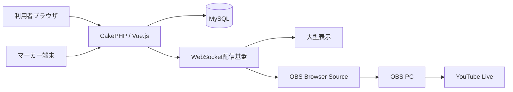

# 010 システムアーキテクチャ

## 技術構成

| 区分 | 採用候補・決定内容 |
|---|---|
| バックエンド | PHP 8.5、CakePHP |
| フロントエンド | Vue.js、Bootstrap |
| データベース | MySQL |
| ソース管理 | GitHub |
| 本番環境 | お名前.com レンタルサーバー RSプラン |
| リアルタイム連携 | WebSocket（JSON）を基本とし、切断・利用不可時はHTTPS APIポーリングへ自動切替 |
| 配信 | OBS、YouTube Live |

初期構成は単一のCakePHPバックエンドと単一のMySQLデータベースを使用する。利用者コードはURL、画面、権限を分けるためのものであり、利用者ごとに独立したアプリケーションや試合状態を作らない。Vue.jsの共通部品と共通APIを利用者別画面から使用する。

### 本番データベース接続

| 項目 | 設定 |
|---|---|
| データベース種別 | MySQL |
| ホスト | `mysql18.onamae.ne.jp` |
| データベース名 | `492th_snick_platform` |
| ユーザー名 | `492th_snick_platform` |
| 文字コード | `utf8mb4` |
| パスワード | 環境変数またはGit管理外の環境別設定から取得 |

- CakePHPの本番接続情報は環境別設定として管理する。
- データベースパスワードは設計書、通常の設定ファイル、ログ、Gitへ記載しない。
- 開発・検証・本番で接続情報を分離する。
- MySQLへの接続方式、TLS対応、ポート、照合順序は接続試験後に確定する。

## 論理構成

## 設計方針

- URL、利用者ロール、仕様書の章、画面構成を対応させる。
- 運営者、スタッフ、マーカー、選手等の通常ユーザーは、同一人物が大会ごとに異なる役割を持てる共通アカウント方式とする。プラットフォーム管理者は通常ユーザーとは別の管理者テーブル、認証ガード、ログイン画面およびセッションで管理する。
- スコア変更は履歴を保持し、訂正可能かつ監査可能にする。
- 外部公開と運営操作を権限で分離する。
- マーカー端末は必要なテーブルセットと操作履歴をブラウザ内へ永続保存し、通信断中も操作を中断させない。
- 同じ端末・ブラウザでは、ブラウザを閉じても最後に保存した状態から直ちに再開できるようにする。
- 未同期の操作は通信復旧後に順序を維持して再送し、二重登録と複数端末競合をサーバー側で検出する。
- 得点・判定等の更新要求はHTTPS APIへJSONで送信し、MySQLへ保存した結果を正式状態とする。
- WebSocketは保存済み状態の更新通知に使用し、通知メッセージはJSON形式とする。通知には少なくともイベント種別、対象ID、状態バージョンおよび発生日時を含める。
- WebSocketの切断時または利用不可時はHTTPS APIポーリングへ自動的に切り替え、再接続時に最新状態をAPIから再取得する。
- 本番では`wss://`を使用する。採用ライブラリ、常駐プロセスまたは外部配信基盤と、お名前.com RSプランでの実行可否は基本設計時の接続試験で確定する。

主要な業務処理の責務、依存関係およびCakePHPへの配置候補は、[概念クラス設計](ClassDesign.md)を参照する。現在は要件整理段階のため、CakePHPの`Table`、`Entity`およびControllerをテーブル単位で定義せず、Application Service、Policy、保存境界および共通サービスの責務を先に整理する。
