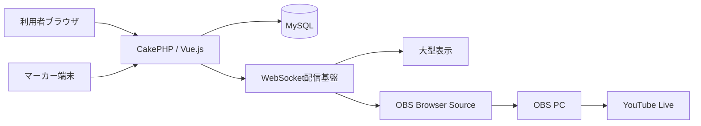

# 010 システムアーキテクチャ

## 技術構成

| 区分 | 採用候補・決定内容 |
|---|---|
| バックエンド | PHP 8.5、CakePHP 5.4 |
| フロントエンド | Vue.js 3.5、Bootstrap 5.3、Vite 8 |
| データベース | MySQL |
| ソース管理 | GitHub |
| 本番環境 | お名前.com レンタルサーバー RSプラン |
| リアルタイム連携 | WebSocket（JSON）を基本とし、切断・利用不可時はHTTPS APIポーリングへ自動切替 |
| 配信 | OBS、YouTube Live |

### ローカル開発環境

Docker Composeを使用し、PHP 8.5＋Apache、MySQL、Node.jsの開発環境を分離して起動する。本番のお名前.com レンタルサーバー RSプランへDockerコンテナを配置することは前提としない。

- MySQL 8.4 LTSをローカル開発用の暫定バージョンとする（2026-08-18時点）。本番MySQLのバージョン確認後に互換性を再評価する。
- Node.js 24をローカル開発用バージョンとする（2026-08-18時点）。
- ローカルの認証情報はGit管理外の`.env`に保持し、本番の認証情報を流用しない。
- 詳細な構築・操作手順は[ローカル開発環境](../07_local-development.md)を参照する。

### 本番デプロイ

`main`へのマージ後、GitHub ActionsでPHPテスト、コーディング規約確認、Vue.js・BootstrapのViteビルドおよび本番用Composer依存関係の構築を行い、成功した成果物をSSH・rsyncでお名前.com RSプランへ同期する。

- SSH認証情報と実際の配置パスはGitHubの`production` Environmentに保存し、Gitへ記録しない。
- 本番の`config/app_local.php`、ログ、一時ファイルおよびアップロードファイルを同期・削除対象から除外する。
- 配置先の目印ファイルと絶対パスを検証し、誤ったディレクトリへの同期・削除を防止する。
- 本番マイグレーションはバックアップ・復旧手順の確定まで無効とする。
- 詳細は[GitHub Actionsによる本番デプロイ](../08_deployment.md)を参照する。

初期構成は単一のCakePHPバックエンドと単一のMySQLデータベースを使用する。利用者コードはURL、画面、権限を分けるためのものであり、利用者ごとに独立したアプリケーションや試合状態を作らない。Vue.jsの共通部品と共通APIを利用者別画面から使用する。

### ディレクトリとAPI・FRONTの分離

**決定済み**

- アプリケーション全体はCakePHP 5の標準ディレクトリ構成に従い、CakePHPプロジェクトを`app/`に配置する。
- ブラウザ画面を`FRONT`、JSONを入出力するバックエンドインターフェースを`API`と呼ぶ。
- FRONTのURLは`/`、`/operator`、`/marker`、`/player`、`/admin`等の利用者別URLとする。
- APIのURLは`/api/v1/...`とし、URLへバージョンを含める。API Controllerは`App\\Controller\\Api\\V1`名前空間へ配置する。
- APIはCakePHPの自動フォールバックルートへ依存せず、エンドポイント実装時にHTTPメソッドを含むルートを明示する。
- Vue.jsは`resources/js/front`を画面のエントリーポイント、`resources/js/api`をAPIクライアント、`resources/js/shared`を画面とAPIクライアントで共有する定数・型・補助処理の配置先とする。
- Vueの画面は利用者区分ごとに`views/public`、`views/operator`、`views/marker`、`views/player`、`views/admin`へ分ける。複数区分で使用するUIは`components/common`、画面枠は`components/layout`へ配置する。
- API Controllerのテストは、本体と対応する`tests/TestCase/Controller/Api/V1`へ配置する。

```text
app/
├─ config/
│  └─ routes.php
├─ src/
│  ├─ Controller/
│  │  ├─ Api/V1/              # JSON API Controller
│  │  └─ ...                   # FRONT用Controller
│  ├─ Model/                   # CakePHP Entity・Table
│  └─ ...                      # その他のCakePHP標準配置
├─ templates/                  # CakePHP FRONTテンプレート
├─ resources/js/
│  ├─ api/                     # APIクライアント
│  ├─ front/
│  │  ├─ components/
│  │  │  ├─ common/
│  │  │  └─ layout/
│  │  ├─ composables/
│  │  ├─ router/
│  │  ├─ stores/
│  │  ├─ views/
│  │  │  ├─ public/
│  │  │  ├─ operator/
│  │  │  ├─ marker/
│  │  │  ├─ player/
│  │  │  └─ admin/
│  │  ├─ App.vue
│  │  └─ main.js
│  └─ shared/                  # 共通定数・型・補助処理
├─ tests/TestCase/Controller/
│  └─ Api/V1/                 # API Controllerテスト
└─ webroot/build/              # Vite生成物（直接編集しない）
```

FRONTとAPIはソースとURLの責務を分離するが、初期段階では同一CakePHPアプリケーションとして配備する。別ドメイン、別リポジトリ、別デプロイ単位への分割は行わない。

### 本番データベース接続

| 項目 | 設定 |
|---|---|
| データベース種別 | MySQL |
| ホスト | `mysql18.onamae.ne.jp` |
| データベース名 | `492th_snick_platform` |
| ユーザー名 | `492th_snick_platform` |
| 文字コード | `utf8mb4` |
| パスワード | 環境変数またはGit管理外の環境別設定から取得 |

- CakePHPの本番接続情報は環境別設定として管理する。
- データベースパスワードは設計書、通常の設定ファイル、ログ、Gitへ記載しない。
- 開発・検証・本番で接続情報を分離する。
- MySQLへの接続方式、TLS対応、ポート、照合順序は接続試験後に確定する。

## 論理構成



## 設計方針

- URL、利用者ロール、仕様書の章、画面構成を対応させる。
- 運営者、スタッフ、マーカー、選手等の通常ユーザーは、同一人物が大会ごとに異なる役割を持てる共通アカウント方式とする。プラットフォーム管理者は通常ユーザーとは別の管理者テーブル、認証ガード、ログイン画面およびセッションで管理する。
- スコア変更は履歴を保持し、訂正可能かつ監査可能にする。
- 外部公開と運営操作を権限で分離する。
- マーカー端末は必要なテーブルセットと操作履歴をブラウザ内へ永続保存し、通信断中も操作を中断させない。
- 同じ端末・ブラウザでは、ブラウザを閉じても最後に保存した状態から直ちに再開できるようにする。
- 未同期の操作は通信復旧後に順序を維持して再送し、二重登録と複数端末競合をサーバー側で検出する。
- 得点・判定等の更新要求はHTTPS APIへJSONで送信し、MySQLへ保存した結果を正式状態とする。
- WebSocketは保存済み状態の更新通知に使用し、通知メッセージはJSON形式とする。通知には少なくともイベント種別、対象ID、状態バージョンおよび発生日時を含める。
- WebSocketの切断時または利用不可時はHTTPS APIポーリングへ自動的に切り替え、再接続時に最新状態をAPIから再取得する。
- 本番では`wss://`を使用する。採用ライブラリ、常駐プロセスまたは外部配信基盤と、お名前.com RSプランでの実行可否は基本設計時の接続試験で確定する。

主要な業務処理の責務、依存関係およびCakePHPへの配置候補は、[概念クラス設計](ClassDesign.md)を参照する。現在は要件整理段階のため、CakePHPの`Table`、`Entity`およびControllerをテーブル単位で定義せず、Application Service、Policy、保存境界および共通サービスの責務を先に整理する。
