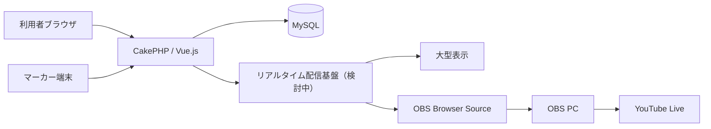

# 010 システムアーキテクチャ

## 技術構成

| 区分 | 採用候補・決定内容 |
|---|---|
| バックエンド | PHP 8.5、CakePHP |
| フロントエンド | Vue.js、Bootstrap |
| データベース | MySQL |
| ソース管理 | GitHub |
| 本番環境 | お名前.com レンタルサーバー RSプラン |
| リアルタイム連携 | WebSocket等を候補として検討中 |
| 配信 | OBS、YouTube Live |

初期構成は単一のCakePHPバックエンドと単一のMySQLデータベースを使用する。利用者コードはURL、画面、権限を分けるためのものであり、利用者ごとに独立したアプリケーションや試合状態を作らない。Vue.jsの共通部品と共通APIを利用者別画面から使用する。

### 本番データベース接続

| 項目 | 設定 |
|---|---|
| データベース種別 | MySQL |
| ホスト | `mysql18.onamae.ne.jp` |
| データベース名 | `492th_snick_platform` |
| ユーザー名 | `492th_snick_platform` |
| 文字コード | `utf8mb4` |
| パスワード | 環境変数またはGit管理外の環境別設定から取得 |

- CakePHPの本番接続情報は環境別設定として管理する。
- データベースパスワードは設計書、通常の設定ファイル、ログ、Gitへ記載しない。
- 開発・検証・本番で接続情報を分離する。
- MySQLへの接続方式、TLS対応、ポート、照合順序は接続試験後に確定する。

## 論理構成

## 設計方針

- URL、利用者ロール、仕様書の章、画面構成を対応させる。
- 同一人物が大会ごとに選手・運営者・スタッフ等の異なる役割を持てる共通アカウント方式とする。
- スコア変更は履歴を保持し、訂正可能かつ監査可能にする。
- 外部公開と運営操作を権限で分離する。
- マーカー端末は必要なテーブルセットと操作履歴をブラウザ内へ永続保存し、通信断中も操作を中断させない。
- 同じ端末・ブラウザでは、ブラウザを閉じても最後に保存した状態から直ちに再開できるようにする。
- 未同期の操作は通信復旧後に順序を維持して再送し、二重登録と複数端末競合をサーバー側で検出する。
