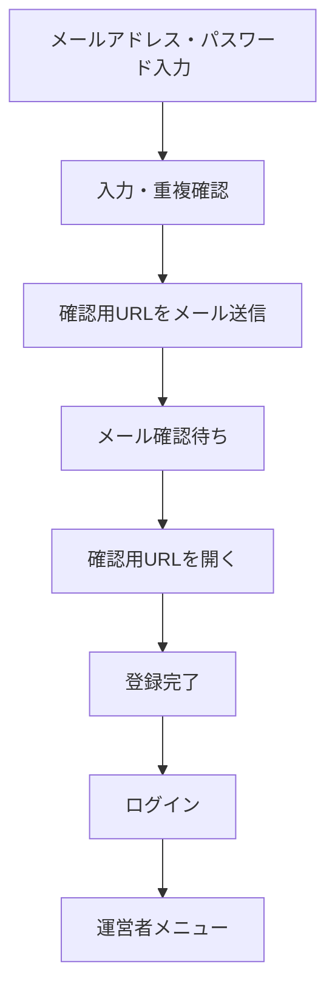

# 運営者新規登録

## SCR-OPR-211 ユーザー登録

### 初期登録項目

登録を簡単にするため、初期画面では次の項目だけを必須候補とする。

| 項目 | 必須 | 仕様 |
|---|:---:|---|
| メールアドレス | ○ | 確認メールとアカウント復旧に使用。重複不可を初期方針とする |
| パスワード | ○ | 確認入力を含む。画面・メール・ログへ平文を残さない |
| 利用規約・個人情報取扱いへの同意 | ○ | 同意した文書の版と日時を記録する |

システム内部のユーザーIDは登録受付時に自動生成し、利用者には入力させない。ログインにはメールアドレスを使用するため、ユーザーIDを忘れた場合のリマインダー画面は設けない。

氏名、住所、電話番号等はメール確認後のユーザー設定で登録する。イベント作成や選手申込の開始前に必要項目が不足している場合は、ユーザー設定へ案内する。

### パスワード文字と保存方式

| 項目 | 仕様 |
|---|---|
| 最小長 | 8文字 |
| 使用可能文字 | 半角英大文字、半角英小文字、数字、記号 `!#$%&\|_-` |
| 文字種の組合せ | 特定の文字種を必須とせず、使用可能文字から8文字以上入力する |
| 最大長 | 64文字 |
| 保存方式 | Argon2idによる一方向ハッシュ |
| データベース列 | 将来の方式変更を考慮し、255文字以上を格納可能な列を使用 |

入力可能な記号を画面に明示する。パスワードはArgon2idでハッシュ化し、運営者・管理者を含め誰も元の文字列を閲覧できないようにする。ソルトは安全なライブラリに自動生成させ、独自実装しない。

> プロジェクト決定（2026年8月26日時点）：利用者が覚えやすいことと安全性のバランスを考慮し、最小長は8文字とする。パスワード単独認証ではより長いパスワードが推奨されるため、頻出・漏えいパスワードの禁止、ログイン試行制限、信頼済み端末および将来のパスキー対応を組み合わせる。

パスワード登録・変更・再設定時は、一般的なパスワード判定として、広く使用されているパスワード、既知の漏えいパスワード、サービス名やメールアドレス等から容易に推測できる値を禁止リストで照合する。禁止理由は利用者へ示すが、禁止リストの全内容は公開しない。単純な連番・同一文字だけの値も拒否し、拒否された場合は別のパスワードを入力するよう案内する。禁止リストの入手元、更新頻度、照合方式は実装時に選定する。

Argon2idの負荷パラメータはCakePHPの設定から変更できるようにする。初期値は次のとおりとし、本番サーバー上の負荷試験結果に応じて調整する。

| 設定 | 初期値 |
|---|---:|
| メモリ量 `memory_cost` | 19,456 KiB（19 MiB） |
| 反復回数 `time_cost` | 2 |
| 並列度 `threads` | 1 |

- パラメータ名と値はCakePHPのアプリケーション設定へまとめ、登録、ログイン、パスワード変更、再設定で同じ設定を使用する。
- 設定変更後は、ログイン成功時に既存ハッシュの再ハッシュ要否を判定し、必要な場合は新しい設定で更新する。
- 負荷パラメータ自体は秘密情報ではないが、環境ごとに上書きできる構成とする。
- 最小8文字、最大64文字は将来変更可能なシステム設定値として管理する。
- パスワードマネージャー、自動入力および貼り付けを妨げない。画面には入力内容を一時的に表示できる切替を設け、周囲から見られる可能性があることを利用者へ伝える。
- 初期運用は同時利用者が少ない想定のため、上記の安全側の初期値から開始する。リリース前に本番相当サーバーで登録・ログイン時間を測定し、著しい性能問題がある場合だけ安全性を下げない範囲で調整する。

### 登録フロー

- 確認用URLは推測困難な使い捨てトークンとし、有効期限は発行から60分とする。
- 確認完了前はイベント管理等を利用できない状態とする。
- 初回登録時の確認メールは、登録受付後に即時送信する。
- 確認メールが届かない場合に再送できるようにし、再送ボタンは直前の送信から60秒後に有効化する。
- 同一アカウントへの確認メールは、初回送信を含めて直近24時間に5回までとする。
- 送信上限へ達した場合はメールを送信せず、次に送信可能となる時刻を表示する。
- 確認メールを再送した場合は、それ以前に発行した未使用URLを無効化する。
- 期限切れの場合は登録内容を再入力させず、確認メールの再送へ案内する。
- 確認されないアカウントは24時間経過後に論理削除する。
- 論理削除後も、同じメールアドレスによるアカウントの重複作成を防ぐために必要な最小限の照合情報と登録試行履歴を保持する。
- 登録試行履歴は30日間保持し、保存期間経過後に削除または個人を識別できない形へ加工する。

### 同一メールアドレスによる再登録

- メールアドレスは前後の空白や大文字小文字等を正規化して照合する。
- 有効、確認待ち、論理削除済みを含め、同じメールアドレスから新しいアカウント行を重複作成しない。
- 確認待ちのメールアドレスで登録操作が繰り返された場合は、新規アカウントを作成せず、既存アカウントの確認メール再送として扱い、60秒間隔・直近24時間5回までの制限を適用する。
- 24時間経過により論理削除されている場合は、本人がメール確認できることを条件に既存アカウントを再有効化し、新しい確認URLを発行する。
- 再登録のたびに、日時、結果、接続元等の不正利用対策に必要な情報を登録試行履歴へ記録する。
- 同じメールアドレスに対する登録試行が30日以内に100回へ達した場合は、通常の新規登録・再送を停止し、追加の本人確認または管理者対応へ案内する。
- 100回未満でも、短時間に集中する場合はメールアドレス、接続元、端末情報等を組み合わせて一時的に制限する。
- 第三者が他人のメールアドレスを繰り返し入力して本人を締め出さないよう、メールアドレスだけを根拠に永久停止しない。
- 制限中でも、すでに本人へ送信済みで有効な確認URLの使用を妨げない。

接続元情報の保持範囲、追加本人確認の方法、短時間制限の閾値はセキュリティ・個人情報保護設計で決定する。

## SCR-OPR-212 メール確認結果

- 確認成功時は登録完了を表示し、確認URLを開いた端末で自動ログインして運営者メニューへ遷移する。特に携帯電話で追加のログイン操作を求めないようにする。
- 期限切れ・使用済み・無効なURLの場合は理由を必要以上に公開せず、確認メール再送へ案内する。

