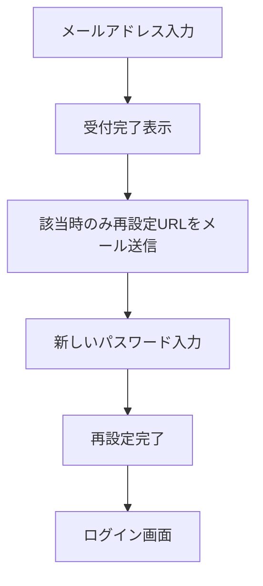

# パスワード再設定

## SCR-OPR-213 パスワードを忘れた方

- パスワードそのものをメールで送信しない。
- 登録の有無にかかわらず、画面には同じ受付メッセージを表示する。
- 初回の再設定メールは受付後に即時送信する。
- 再送は直前の送信から60秒後に可能とし、初回を含めて直近24時間に5回までとする。
- 再設定URLは推測困難な使い捨てトークンとし、有効期限は発行から60分とする。
- 再送時は、それ以前に発行した未使用の再設定URLを無効化する。
- 新しいパスワードと確認入力が一致し、パスワード規則を満たす場合だけ登録する。
- 再設定完了画面にログイン画面へのリンクを設ける。
- 使用済みトークンを再利用できないようにする。
- 再設定完了時に、自動ログインを含む既存の全端末セッションを無効化する。

### 確認・再設定トークンの保存

- 確認トークンとパスワード再設定トークンの本体はデータベースへ保存しない。
- トークンをSHA-256でハッシュ化した値を保存し、URLから受け取ったトークンを同じ方法でハッシュ化して照合する。
- 有効期限、使用日時、無効化日時、発行目的を記録する。
- トークン本体を画面、アクセスログ、アプリケーションログへ不用意に残さない。

