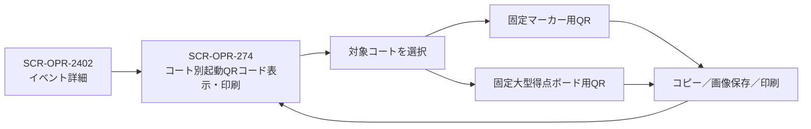

# マーカー担当・起動QRコード

## SCR-OPR-271 マーカー担当・端末管理

- イベント、開催日、コート、試合へマーカー担当者を割り当てる。
- 担当者には必要な試合だけを表示し、担当外試合の更新を制限する。
- コートごとにマーカー操作用タブレット1台を設置する運用を基本とする。
- 物理端末はイベント・コートとは独立して事前登録し、Squash Platformが全体で一意な`TAB-0001`形式の端末個体番号を発行する。端末本体へ同じ番号のラベルを貼付し、本番用と予備用の両方を大会前に登録する。
- 端末個体番号とは別に、ブラウザまたはブラウザプロファイルごとのインストールIDを自動発行する。MACアドレス、IPアドレスおよびUser-Agentは本人確認や端末識別の主キーとして使用しない。
- QRコードを読み取った担当者は、ログインと権限確認を経て担当コートの `SCR-MKR-311` を起動する。担当コートに進行中の試合がある場合は `SCR-MKR-321` へ自動復帰する。
- 初回割当後は同じ端末・同じブラウザへ割当を保存し、ホーム画面ショートカットから再起動できるようにする。
- 運営者は端末個体番号、端末名、ブラウザ登録状態、担当者、割当イベント、開催日、コート、最終接続日時、接続状態、現在の操作権を確認し、割当変更、解除、ブラウザ再登録、操作引き継ぎを行えるようにする。
- 代替端末でもコート前に掲示した同じQRコードまたは接続コードを使用し、代替端末専用QRコードは発行しない。
- 代替端末への引き継ぎはオンライン時だけ許可する。通常引継ぎは旧端末に未同期操作がなく、代替端末がサーバーの最新状態を取得できた場合に実行する。
- 旧端末が故障・消失して未同期操作の有無を確認できない場合は、権限を持つ担当マーカー、担当範囲のスタッフ、運営責任者またはイベント所有者が警告を確認し、理由を入力して強制引継ぎできる。代替端末はサーバー上の最新状態を起点とし、旧端末から後日届いた操作は自動混在させず端末別記録として競合処理する。
- 引継ぎ完了後は操作権の世代番号を更新し、旧端末を閲覧専用にする。新端末には「`TAB-0001` → `TAB-0003`」の切替結果、旧端末には操作先が移動したことを表示する。
- 引継ぎ履歴にはイベント、コート、試合、変更前後の端末個体番号、実行者、通常・強制の区分、理由、得点・試合状態、状態バージョン、実行日時および旧端末の最終接続日時を保存する。端末切替は大型得点ボード、OBSおよび観客向け画面へ表示しない。
- 同じ試合について複数端末のオフライン操作が検出された場合は、端末ごとの操作履歴を混在させず、競合として運営者へ通知する。
- 権限を持つ運営者は、端末名、操作者、更新日時、最終得点、ゲーム数、試合状態および操作件数を比較し、正式記録とする端末別記録を1つ選択する。選択されなかった記録は監査用に保持する。
- QRコードを読み取れない場合は、掲示された接続コードを共通のマーカー起動ページへ入力し、ログインと権限確認後に同じコートを起動する。
- 得点、判定、ゲーム、試合状態を試合管理へ反映する。

マーカー操作と状態遷移は[マーカー仕様](../5000_marker/README.md)を参照する。

## SCR-OPR-274 コート別起動QRコード表示・印刷

イベント開催前に、そのイベントで使用する全コートの固定起動QRコードを確認・出力する専用画面とする。イベント設定で施設・コートが確定した時点で、各コートのマーカー用QRコードとコート別大型得点ボード用QRコードを自動的に準備する。

- `SCR-OPR-2402 イベント詳細`の直下に配置し、イベント詳細の「コート別起動QRコード」から直接開く。`SCR-OPR-271 マーカー担当・端末管理`および`SCR-OPR-2409 試合管理`は経由しない。
- 対象イベントに設定されているコートを一覧表示し、各コートに「マーカー用」と「大型得点ボード用」の2種類を明確に分けて表示する。
- コートごとの手動発行操作は設けない。イベントへコートを追加した場合はそのコートの固定コードを自動作成し、コートをイベントから外した場合は対応するコードを使用不可にする。
- 各コートについて、イベント名、会場名、コート名、開催終了日時、用途、QRコード、短い接続コードを表示する。
- マーカー用QRコードはログイン・権限確認後に`SCR-MKR-311`または再開対象の`SCR-MKR-321`を開く。大型得点ボード用QRコードはログインを要求せず、対象コート固定の閲覧専用`SCR-OPR-273`を開く。
- 同じコートへ大型得点ボードを1～2台設置する場合は、すべて同じ大型得点ボード用QRコードを読み取って同じ表示を開く。
- どちらのQRコードも発行元のイベント・コート以外では使用できず、イベント設定の開催終了日時まで繰り返し利用できる。
- 読み取り、端末での初回起動、試合終了、ブラウザ終了、日ごとのコート利用終了では失効させない。イベントの開催終了日時を変更した場合は、変更後の日時を同じコードの有効期限とする。
- QRコードと接続コードはイベント、コートおよび用途を識別する起動情報とし、利用者の認証情報を含めない。マーカーの操作権限は起動後のログイン・権限確認で判定する。
- 1コートを大きく表示する個別表示と、複数コートを選択してまとめて出力する一括表示を用意する。
- 「QRコード画像をコピー」「画像を保存」「このコートを印刷」「選択したコートを一括印刷」を用途ごとに提供する。
- 印刷物はコート前へ掲示した状態で、イベント名、コート名、「マーカー用」または「大型得点ボード用」、QRコードおよび接続コードを離れた位置から判別できる構成とする。用紙サイズ、1ページ当たりのコート数および余白は印刷レイアウト設計で確定する。
- 開催終了日時を過ぎたコードには「期限切れ」を表示し、コピー、保存および印刷操作を無効化する。
- 紛失、漏えいまたは誤掲示時だけ「無効化して再発行」を使用できる。実行前に、印刷済みの旧QRコードがすべて使用不可になることを警告して確認を求める。
- マーカー用QRコードと大型得点ボード用QRコードは別の固定コードとし、相互に用途を切り替えない。

### 画面遷移

