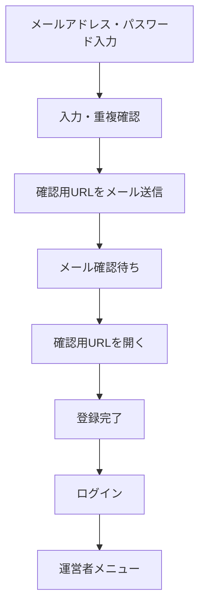
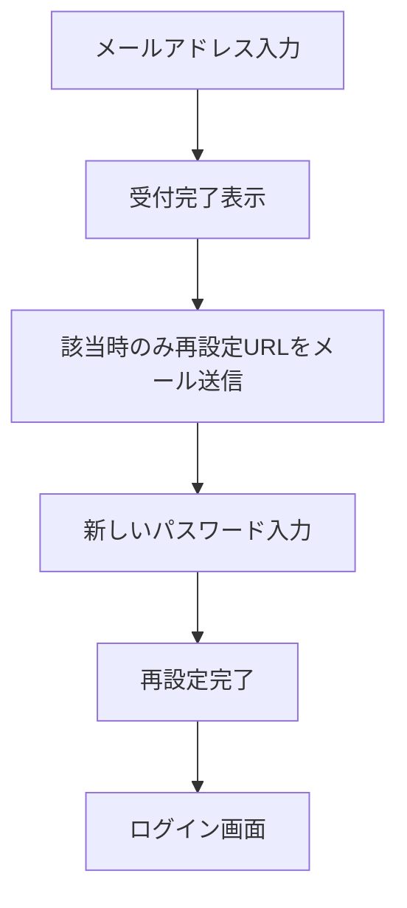

# 200 運営者

## 位置づけ

運営者が共通アカウントを登録し、イベントの準備、募集、ドロー、当日進行、会場表示、ライブ配信、結果確定までを管理するための要件を定義する。

大会・開催単位を表す画面表示名と業務用語は「イベント」に統一する。「タイトル」はYouTubeの配信タイトルやHTMLタイトル等、一般的な名称欄を指す場合にだけ使用する。

## 目的

- 初めて利用する人が少ない入力でアカウントを作成できるようにする。
- 運営者が最近利用したイベントや対応が必要な試合へすぐ移動できるようにする。
- イベント情報、カテゴリ、エントリー、選手、ドロー、試合進行を一貫して管理する。
- スポンサー、スタッフ、コート、マーカー、会場表示、ライブ配信をイベントへ関連付ける。
- 個人情報と重要操作を権限・履歴により安全に管理する。

## 機能構成

| コード | 機能 | 主な画面 |
|---|---|---|
| OPR-210 | 認証・アカウント | ユーザー登録、メール確認、ログイン、パスワード再設定 |
| OPR-220 | ユーザー設定 | プロフィール、メールアドレス変更、パスワード変更 |
| OPR-230 | メニュー・ダッシュボード（フェーズ2） | 内容は他機能の確定後に再設計 |
| OPR-240 | イベント管理（フェーズ1～3） | フェーズ1は手動運用、フェーズ2は自動化、フェーズ3は申込・決済・状態拡張 |
| OPR-250 | スポンサー・スタッフ管理 | スポンサー素材、スタッフ招待、担当・権限 |
| OPR-260 | コート管理 | 施設、個別コート、所在地、利用情報 |
| OPR-270 | マーカー・大型表示 | マーカー割当、進行・得点連携、会場表示 |
| OPR-280 | ライブ配信管理（フェーズ3） | YouTube配信、OBS、公開URL、配信状態 |

## 210 認証・アカウント

選手、運営者、スタッフで共通のユーザーアカウントを使用する。登録時点でサイト全体の強い運営権限を自動付与せず、作成したイベントまたは招待されたイベントの範囲で権限を付与する。

### SCR-OPR-211 ユーザー登録

#### 初期登録項目

登録を簡単にするため、初期画面では次の項目だけを必須候補とする。

| 項目 | 必須 | 仕様 |
|---|:---:|---|
| メールアドレス | ○ | 確認メールとアカウント復旧に使用。重複不可を初期方針とする |
| パスワード | ○ | 確認入力を含む。画面・メール・ログへ平文を残さない |
| 利用規約・個人情報取扱いへの同意 | ○ | 同意した文書の版と日時を記録する |

システム内部のユーザーIDは登録受付時に自動生成し、利用者には入力させない。ログインにはメールアドレスを使用するため、ユーザーIDを忘れた場合のリマインダー画面は設けない。

氏名、住所、電話番号等はメール確認後のユーザー設定で登録する。イベント作成や選手申込の開始前に必要項目が不足している場合は、ユーザー設定へ案内する。

#### パスワード文字と保存方式

| 項目 | 仕様 |
|---|---|
| 最小長 | 6文字 |
| 使用可能文字 | 半角英大文字、半角英小文字、数字、記号 `!#$%&\|_-` |
| 文字種の組合せ | 特定の文字種を必須とせず、使用可能文字から6文字以上入力する |
| 最大長 | 64文字 |
| 保存方式 | Argon2idによる一方向ハッシュ |
| データベース列 | 将来の方式変更を考慮し、255文字以上を格納可能な列を使用 |

入力可能な記号を画面に明示する。パスワードはArgon2idでハッシュ化し、運営者・管理者を含め誰も元の文字列を閲覧できないようにする。ソルトは安全なライブラリに自動生成させ、独自実装しない。

> セキュリティ確認（2026年8月4日時点）：プロジェクト決定値は最小6文字のままとするが、NIST SP 800-63Bの現行基準は、パスワード単独認証で15文字以上、二要素認証の一要素として使用する場合でも8文字以上としている。本番実装前に最小長を再評価する。

パスワード登録・変更・再設定時は、一般的なパスワード判定として、広く使用されているパスワード、既知の漏えいパスワード、サービス名やメールアドレス等から容易に推測できる値を禁止リストで照合する。禁止理由は利用者へ示すが、禁止リストの全内容は公開しない。単純な連番・同一文字だけの値も拒否し、拒否された場合は別のパスワードを入力するよう案内する。禁止リストの入手元、更新頻度、照合方式は実装時に選定する。

Argon2idの負荷パラメータはCakePHPの設定から変更できるようにする。初期値は次のとおりとし、本番サーバー上の負荷試験結果に応じて調整する。

| 設定 | 初期値 |
|---|---:|
| メモリ量 `memory_cost` | 19,456 KiB（19 MiB） |
| 反復回数 `time_cost` | 2 |
| 並列度 `threads` | 1 |

- パラメータ名と値はCakePHPのアプリケーション設定へまとめ、登録、ログイン、パスワード変更、再設定で同じ設定を使用する。
- 設定変更後は、ログイン成功時に既存ハッシュの再ハッシュ要否を判定し、必要な場合は新しい設定で更新する。
- 負荷パラメータ自体は秘密情報ではないが、環境ごとに上書きできる構成とする。
- 最小6文字、最大64文字は将来変更可能なシステム設定値として管理する。
- 初期運用は同時利用者が少ない想定のため、上記の安全側の初期値から開始する。リリース前に本番相当サーバーで登録・ログイン時間を測定し、著しい性能問題がある場合だけ安全性を下げない範囲で調整する。

#### 登録フロー



- 確認用URLは推測困難な使い捨てトークンとし、有効期限は発行から60分とする。
- 確認完了前はイベント管理等を利用できない状態とする。
- 初回登録時の確認メールは、登録受付後に即時送信する。
- 確認メールが届かない場合に再送できるようにし、再送ボタンは直前の送信から60秒後に有効化する。
- 同一アカウントへの確認メールは、初回送信を含めて直近24時間に5回までとする。
- 送信上限へ達した場合はメールを送信せず、次に送信可能となる時刻を表示する。
- 確認メールを再送した場合は、それ以前に発行した未使用URLを無効化する。
- 期限切れの場合は登録内容を再入力させず、確認メールの再送へ案内する。
- 確認されないアカウントは24時間経過後に論理削除する。
- 論理削除後も、同じメールアドレスによるアカウントの重複作成を防ぐために必要な最小限の照合情報と登録試行履歴を保持する。
- 登録試行履歴は30日間保持し、保存期間経過後に削除または個人を識別できない形へ加工する。

#### 同一メールアドレスによる再登録

- メールアドレスは前後の空白や大文字小文字等を正規化して照合する。
- 有効、確認待ち、論理削除済みを含め、同じメールアドレスから新しいアカウント行を重複作成しない。
- 確認待ちのメールアドレスで登録操作が繰り返された場合は、新規アカウントを作成せず、既存アカウントの確認メール再送として扱い、60秒間隔・直近24時間5回までの制限を適用する。
- 24時間経過により論理削除されている場合は、本人がメール確認できることを条件に既存アカウントを再有効化し、新しい確認URLを発行する。
- 再登録のたびに、日時、結果、接続元等の不正利用対策に必要な情報を登録試行履歴へ記録する。
- 同じメールアドレスに対する登録試行が30日以内に100回へ達した場合は、通常の新規登録・再送を停止し、追加の本人確認または管理者対応へ案内する。
- 100回未満でも、短時間に集中する場合はメールアドレス、接続元、端末情報等を組み合わせて一時的に制限する。
- 第三者が他人のメールアドレスを繰り返し入力して本人を締め出さないよう、メールアドレスだけを根拠に永久停止しない。
- 制限中でも、すでに本人へ送信済みで有効な確認URLの使用を妨げない。

接続元情報の保持範囲、追加本人確認の方法、短時間制限の閾値はセキュリティ・個人情報保護設計で決定する。

### SCR-OPR-212 メール確認結果

- 確認成功時は登録完了を表示し、確認URLを開いた端末で自動ログインして運営者メニューへ遷移する。特に携帯電話で追加のログイン操作を求めないようにする。
- 期限切れ・使用済み・無効なURLの場合は理由を必要以上に公開せず、確認メール再送へ案内する。

### SCR-OPR-213 パスワードを忘れた方



- パスワードそのものをメールで送信しない。
- 登録の有無にかかわらず、画面には同じ受付メッセージを表示する。
- 初回の再設定メールは受付後に即時送信する。
- 再送は直前の送信から60秒後に可能とし、初回を含めて直近24時間に5回までとする。
- 再設定URLは推測困難な使い捨てトークンとし、有効期限は発行から60分とする。
- 再送時は、それ以前に発行した未使用の再設定URLを無効化する。
- 新しいパスワードと確認入力が一致し、パスワード規則を満たす場合だけ登録する。
- 再設定完了画面にログイン画面へのリンクを設ける。
- 使用済みトークンを再利用できないようにする。
- 再設定完了時に、自動ログインを含む既存の全端末セッションを無効化する。

#### 確認・再設定トークンの保存

- 確認トークンとパスワード再設定トークンの本体はデータベースへ保存しない。
- トークンをSHA-256でハッシュ化した値を保存し、URLから受け取ったトークンを同じ方法でハッシュ化して照合する。
- 有効期限、使用日時、無効化日時、発行目的を記録する。
- トークン本体を画面、アクセスログ、アプリケーションログへ不用意に残さない。

### SCR-OPR-214 ログイン認証

| 項目 | 内容 |
|---|---|
| メールアドレス | 確認済みの登録メールアドレスを入力 |
| パスワード | 登録済みパスワードを入力 |
| 自動ログイン | 利用者が明示的に選択した端末だけで有効化 |
| 補助導線 | ユーザー登録、パスワード忘れ |

- 認証成功後は運営者メニューへ移動する。
- 申込、招待、特定イベント等からログインした場合は、権限確認後に元の画面へ戻す。
- ログイン失敗理由は、メールアドレスとパスワードのどちらが誤っているか特定できない共通メッセージとする。
- 同一アカウントで連続5回ログインに失敗した場合は、30分間ログインを停止する。
- 認証に成功した場合は連続失敗回数を0へ戻す。
- 停止時間経過後は自動解除する。停止中に同じアカウントへの認証がさらに失敗した場合は、その失敗時刻から30分後まで停止期限を延長する。
- 接続元単位のレート制限と監査記録も併用し、第三者による意図的なアカウント停止を抑制する。

#### 複数端末・セッション

- 同じアカウントで、PC、スマートフォン、タブレット等の複数端末から同時に閲覧・操作できる。
- 同時に有効にできる端末セッションは、1アカウントにつき最大5件とする。
- 同じブラウザ内の複数タブは1件の端末セッションとして数える。
- 別ブラウザ、シークレットモード、Cookieを共有しないブラウザプロファイルは別端末セッションとして数える。
- 6件目のログインに成功した場合は直ちに新しいセッションを開始せず、現在有効な端末セッションを表示する。
- 利用者が既存セッションを1件選んでログアウトした後、新しい端末のセッションを開始する。既存セッションを自動的に切断しない。
- セッション一覧には、取得可能な範囲で端末種別、OS、ブラウザ、初回ログイン日時、最終利用日時、IPアドレス、IPアドレスから推定できる国・地域、現在の端末か、自動ログインが有効かを表示する。
- 正確な端末名や位置を取得できない場合は「不明」または概算であることを表示する。GPS等の正確な位置情報や永続的な端末指紋は、この機能のためだけには取得しない。
- 利用者はユーザー設定から、現在の端末以外の個別ログアウトと全端末ログアウトを実行できる。
- パスワード再設定時は、これらの端末セッションと自動ログインをすべて無効化する。
- 無効化された端末で次に操作した場合はログイン画面へ移動し、セッションが終了したことを表示する。

通常セッションは最後の操作から9時間で無操作タイムアウトとする。画面の単なる表示継続や自動更新だけでは操作とみなさず、利用者による操作または明示的なセッション更新を基準とする。セッションの最大継続時間は自動ログインの30日とは分けて引き続き検討する。

#### 自動ログイン

- パスワードを端末へ保存せず、取消可能な自動ログイン用トークンを使用する。
- トークンはサーバー側で安全に照合できる形式とし、紛失時に無効化できるようにする。
- ログアウト時は対象端末の自動ログインを解除する。
- 共用端末では使用しない旨を表示する。
- 有効期間は発行または更新から30日とする。
- 自動ログインにより復元されたログインも、最大5件の端末セッションへ含める。

#### 二要素認証

二要素認証は導入する方針とする。ただし、PCだけに要求すると端末種別の偽装によって回避されるため、適用条件はセキュリティ設計で確定する。スマートフォン・タブレットの入力を減らす要望に対しては、初回または未信頼端末で二要素認証を行い、その後は取消可能な信頼済み端末として一定期間省略する方式を推奨候補とする。認証方式、信頼期間、復旧コード、端末紛失時の解除方法は検討中とする。

### SCR-OPR-215 メール送信基盤

- ユーザー登録確認、パスワード再設定、アカウント変更通知等はSMTPで送信する。
- SMTPメールサーバーはWebサーバーとは別に用意する。
- SMTP認証と暗号化通信を使用する。
- 接続先、ポート、認証情報等は環境設定で管理し、設計書、ログ、Gitへ保存しない。
- 送信日時、宛先種別、メール種別、結果、失敗理由を記録する。パスワードやトークン本体は記録しない。

#### お名前.com SMTP設定

| 項目 | 設定 |
|---|---|
| SMTPサーバー | `mail71.onamae.ne.jp` |
| SMTPポート | `465` |
| 暗号化 | SSL/TLS |
| SMTP認証 | 使用する |
| SMTPユーザー名 | `info@s-nick.com` |
| 送信元メールアドレス | `info@s-nick.com` |
| SMTPパスワード | 環境変数またはGit管理外の環境別設定から取得 |

- ポート587はSSL接続なしの場合の代替候補とするが、通常運用では認証情報を暗号化できる465／SSL/TLSを使用する。
- SMTPパスワードはCakePHPの通常設定ファイル、設計書、ログ、Gitへ記載しない。
- 開発・検証・本番で認証情報を分離し、環境変数またはGit管理外のローカル設定から読み込む。
- 接続タイムアウト、送信失敗時の再試行回数と間隔はCakePHPのSMTP・キュー設定として実装時に定義し、本番相当環境で試験する。
- SPF、DKIM、DMARC等の送信ドメイン認証はCakePHPだけでは完結しないため、お名前.com側のメールサーバーとDNSで設定・確認する。

## 220 ユーザー設定

### SCR-OPR-221 プロフィール表示・編集

プロフィールは本人が編集する。サイト管理者による停止・権限変更は管理者機能として分離する。

| 項目 | 必須 | 入力・表示仕様 |
|---|:---:|---|
| アイコン画像 | - | 画像選択または撮影、プレビュー、変更、削除 |
| マイカラー | - | カラーピッカー |
| 氏名 | ○ | 姓名を分割せず、本人が自分の言語・文化に合った順序と文字で入力 |
| 表示名 | - | ドロー、得点表示、ライブ配信等の公開表示に使用。未入力時は氏名を使用 |
| 氏名読み | - | 読み方・発音を補助する任意入力。カタカナに限定しない |
| 音声読み上げ名 | - | フェーズ3。日本語・英語・韓国語ごとの任意入力。マーカー音声コール用 |
| メールアドレス | ○ | 確認済みの登録内容を表示。変更は専用画面 |
| 性別 | ○ | 男、女、どちらともいえない |
| 国・地域 | - | 住所を入力する場合に選択。国・地域コードと表示名を管理 |
| 郵便番号 | - | 国・地域により形式が異なるため文字列として保持 |
| 住所 | - | 市区町村、番地、建物名等を複数行で自由入力 |
| 電話番号 | - | 国番号を含めて入力可能な本人の連絡先 |
| 緊急連絡先氏名 | - | 緊急時の連絡相手。氏名を分割しない |
| 本人との関係 | - | 続柄・関係を自由入力または選択 |
| 緊急連絡先電話番号 | - | 国番号を含めて入力可能 |

- 氏名、表示名、氏名読みには、特定言語の文字種や姓名順を強制しない。
- 表示名が未入力の場合は氏名を公開用表示へ使用する。
- 住所はプロフィール登録時の必須項目にしない。
- イベント申込で住所が必要な場合だけ、その申込フォームで必須化する。
- 申込時点の氏名、表示名、氏名読み、住所、連絡先は、後からプロフィールが変更されても確認できるよう申込情報へ保持する。
- フェーズ3の音声読み上げ名は音声テストで確認できるようにし、選手本人または必要な権限を持つ運営者が修正できるようにする。

#### アイコン画像

- 正方形に切り抜いて保存できるようにする。
- JPEG、PNG、WebP、最大5 MBを初期候補とする。
- サーバー側で形式と容量を検証し、表示用縮小画像を生成する。
- 位置情報等の画像メタデータを削除する。
- 未登録時はマイカラーと氏名の頭文字から既定アイコンを生成する候補とする。

アイコン画像は、将来パブリック画面へ表示可能な公開用プロフィール画像として扱う。ただし、初期リリースでは運営者のアイコン画像を表示するパブリック画面を設けず、プロフィール編集画面の確認表示だけを対象とする。

将来、イベント詳細の主催者紹介、運営者紹介、スタッフ紹介等を追加した場合は、このアイコン画像を使用できる。公開画面への表示を開始する際は、表示場所と目的を画面上で案内する。

### SCR-OPR-222 メールアドレス変更

1. 現在のメールアドレスを表示する。
2. 新しいメールアドレスを入力する。
3. 新しいメールアドレスへ確認用URLを送信する。
4. URL確認完了後に新しいメールアドレスを有効化する。
5. 変更前のメールアドレスへ変更完了通知を送信する。

確認完了前は現在のメールアドレスを維持する。重複判定、確認URL、再送制限、未確認時の扱いは `SCR-OPR-211 ユーザー登録` と同じ仕様を適用する。

- 新しいメールアドレスは前後の空白や大文字小文字等を正規化して照合する。
- 有効、確認待ち、論理削除済みを含め、他のアカウントで使用されているメールアドレスへ変更できない。
- 確認URLの有効期限は発行から60分とする。
- 初回の確認メールは即時送信し、再送は直前の送信から60秒後に可能とする。
- 確認メールは初回を含めて直近24時間に5回までとする。
- 再送時は、それ以前に発行した未使用URLを無効化する。
- 確認が完了しない変更要求は24時間後に取消状態として論理削除し、現在のメールアドレスを維持する。
- 利用者は確認完了前であれば、ユーザー設定画面から変更要求を取り消せる。取消時は未使用の確認URLを直ちに無効化する。
- 同じ新メールアドレスに対する変更試行が30日以内に100回へ達した場合は、ユーザー登録と同じ追加本人確認または管理者対応へ案内する。
- メールアドレス変更の確認トークンは、本体ではなくSHA-256ハッシュをデータベースへ保存する。

### SCR-OPR-223 パスワード変更

プロフィール編集とは別画面とし、現在のパスワード、新しいパスワード、確認入力を求める。変更完了をメール等で通知する。変更後の他端末セッションの扱いは検討中。

### SCR-OPR-224 退会

- 運営者向けユーザー設定から、共通の退会画面へ移動できるようにする。
- 退会によるログイン停止、イベント運営権限、選手申込、試合結果等への影響を確認画面へ表示する。
- 誤操作防止のため再認証と最終確認を行い、退会完了後は全端末セッションと自動ログインを無効化する。
- 選手画面にも同じ共通退会機能への入口を設ける。退会後のデータ保持、匿名化、再登録の扱いは別途確定する。

## 230 メニュー・ダッシュボード

### 検討状態

本機能は、イベント管理、試合管理、スタッフ権限、通知等の仕様に応じて表示内容と優先順位が変わるため、現段階では詳細化を行わず**検討保留**とする。他の主要機能が固まった段階で再設計する。

以下は確定仕様ではなく、再検討時の参考候補とする。

### SCR-OPR-231 運営者メニュー

ログイン後に次を表示する。

- 最近利用したイベント
- 運営中・開催間近のイベント
- 開催中または近日開催予定の注目試合
- 自分が担当する本日の業務・コート
- 申込締切、未決済、ドロー未公開、試合遅延等の要対応件数
- 招待、運営連絡、システム通知
- イベント新規作成、コート管理、ユーザー設定への導線

「最近利用した」の判定方法、「注目試合」の選定基準、表示件数、表示順、手動固定を含め、画面の構成・表示項目・優先順位はすべて検討保留とする。

## 240 イベント管理

### SCR-OPR-2401 イベント一覧

- 自分が所有またはスタッフとして参加するイベントを一覧表示する。
- イベント名、開催日、会場、申込状態、公開状態、担当権限を表示する。
- キーワード、開催期間、状態、会場で検索・絞り込みを行う。
- 新規作成、詳細、編集、複製への導線を設ける。

### SCR-OPR-2402 イベント基本情報・詳細

| 項目 | 内容 |
|---|---|
| イベント名・サブタイトル | 公開する名称 |
| 開催期間 | 開始日時・終了日時 |
| 申込期間 | 申込開始日時・締切日時 |
| 開催場所・使用コート | コート管理から複数選択 |
| 代表メールアドレス・連絡先 | 問い合わせ先 |
| 代表画像・画像ギャラリー | パブリック画面に表示 |
| 説明・要項・注意事項 | 公開情報と添付資料 |
| 公開設定 | 非公開、URL限定、トップ掲載、公開予約、公開終了 |

日時の前後関係を検証する。フェーズ1の公開設定は登録時の自動公開だけとし、非公開、URL限定、トップ掲載、公開予約、公開終了はフェーズ3で導入する。申込開始後・締切後・公開後の編集制限と訂正方法は項目ごとに詳細化する。

### SCR-OPR-2403 イベント新規登録

- イベント一覧の「新規登録」から開く。
- 初期表示では新規イベント用の既定値を設定し、既存イベントの情報を混在させない。
- フェーズ1では下書き保存を設けず、イベント基本情報の必須項目を入力して「登録して公開」を実行する。
- 入力検証後にイベントを作成し、公開状態を自動的に「公開」へ設定してカテゴリ管理等の次の設定画面へ移動する。
- 作成した利用者をイベント所有者として登録し、イベント管理に必要な権限を付与する。
- 保存前の取消では入力内容を破棄してイベント一覧へ戻る。
- 同じ名称・開催期間・会場のイベントが存在する場合は重複候補を表示するが、正当な連続開催等を考慮して一律には禁止しない。

将来、下書き、申込受付中、申込締切、ドロー公開、開催中、結果確定、終了・アーカイブ、中止、延期、再開を追加できる状態構造とする。フェーズ1では画面から状態を選択させず、登録時の自動公開だけを使用する。新規登録時の必須項目と複製登録の対象範囲は詳細設計で確定する。

### SCR-OPR-2404 イベント編集

- イベント詳細または一覧の「編集」から開く。
- 編集権限を持つ運営者・スタッフだけが利用できる。
- 現在の登録内容、公開状態、最終更新者、最終更新日時を表示する。
- 入力値を保存する前に、必須項目、日時の前後関係、会場・コート、公開条件を再検証する。
- 「保存」では変更内容を反映して詳細画面へ戻り、「取消」では未保存の変更を破棄する。
- 公開中のイベントを変更する場合は、パブリック画面へ影響する項目を明示し、保存前に変更内容を確認できるようにする。
- 申込期間や開催期間等、選手・ドロー・試合へ影響する項目を変更する場合は影響範囲と警告を表示する。
- 使用コートは施設マスターに登録された個別コートから複数選択する。
- 開催日ごと・使用コートごとに利用開始時刻と利用終了時刻を登録する。日によって使用するコートや利用時間が異なる設定を許可する。
- 登録したコート別利用時間を、事前時間割と大会当日スケジュールの自動配置可能範囲として使用する。
- OBSオーバーレイのレイアウトをイベント単位で設定する。約10種類を目標とするプリセットのサムネイルと、実際の選手名・得点を使用したプレビューから1種類を選択できるようにする。正確な提供数と各デザインはUI設計で確定する。
- 各プリセットは試合中、ウォームアップ・インターバル中、判定結果表示時のレイアウトを一組として扱う。ウォームアップ・インターバル中は、どのプリセットでもスポンサーを主表示とし、状態とタイマーを画面下部へ表示する。
- 試合中のOBSレイアウトを変更しても、左右の選手名、現在得点、ゲーム獲得数、選手色は必須表示とし、イベント設定で非表示にはできない。
- プリセットの自由編集、個別部品の移動、独自レイアウト作成は段階的な拡張とする。
- 同時に別の利用者が更新した場合は上書きせず、最新内容を確認してから再編集するよう案内する。
- 変更者、変更日時、変更前後の値を履歴へ記録する。
- 申込締切後等の編集制限は画面と更新処理の両方で適用する。

イベント削除、公開済みイベントの訂正承認、申込締切後の例外解除は別途検討する。

### SCR-OPR-2405 カテゴリ管理

イベント基本情報・詳細に紐づくカテゴリを管理する。イベント詳細からカテゴリ一覧を開き、登録、編集、削除を行う。

#### カテゴリ一覧

- 対象イベントに登録されたカテゴリを表示順に一覧表示する。
- カテゴリ名、性別、年齢範囲、レベル、参加費、定員、申込期間、公開状態を表示する。
- 「カテゴリ登録」から新規登録画面または入力パネルを開く。
- 各行から編集、削除、公開・非公開の切替を行う。
- 表示順を変更し、パブリック画面のカテゴリ表示へ反映する。

#### カテゴリ登録・編集

| 項目 | 必須 | 入力形式・仕様 |
|---|:---:|---|
| カテゴリ名 | ○ | テキスト入力。同一イベント内で重複不可 |
| 性別 | ○ | 男性、女性、なしから選択 |
| 年齢・自 | - | 数値入力。参加可能な最低年齢 |
| 年齢・至 | - | 数値入力。参加可能な最高年齢 |
| レベル | - | テキスト入力。例：プロ、選手権、フレンドシップ、新人 |
| スカッシュ協会登録 | ○ | 必須、不要から選択。必須の場合は協会ランキングをドローへ適用 |
| 参加資格 | - | テキストエリア |
| 参加費 | ○ | 数値入力。単位は円、無料は0円 |
| 定員 | ○ | 1以上の整数。単位は人 |
| 申込開始日時 | ○ | 日時選択（DateTime Picker） |
| 申込締切日時 | ○ | 日時選択（DateTime Picker） |
| キャンセル待ち | ○ | 可、不可から選択 |
| 試合形式 | ○ | トーナメント、リーグ戦（総当たり）から選択 |
| 最大ゲーム数 | ○ | 1以上の奇数。画面では「nゲームマッチ（過半数ゲーム先取）」と表示 |
| 勝利点 | ○ | 1以上の整数。単位は点 |
| タイブレーク | ○ | 2点差 |
| 予想ゲーム時間 | ○ | 1ゲームあたりの予想時間を1以上の整数で入力。単位は分 |
| ウォームアップ | ○ | 片側あたり0以上の整数。単位は秒。左右2回実施 |
| インターバル | ○ | 0以上の整数。単位は秒。ウォームアップ後と各ゲーム間に適用 |
| 最低休憩時間 | ○ | 0以上の整数。単位は秒 |
| 表示順 | ○ | 0以上の整数。未指定時は一覧の最後を自動設定 |
| 公開状態 | ○ | 公開、非公開から選択。初期値は非公開 |
| 備考 | - | 複数行テキスト入力 |

#### 入力・業務ルール

- 年齢は一方だけの入力を許可し、最低年齢だけ、または最高年齢だけの条件も設定できる。
- 最低年齢と最高年齢の両方を入力した場合は、最低年齢が最高年齢以下でなければならない。
- 年齢判定基準日はイベント開催開始日とし、カテゴリごとの変更はできない。
- 申込締切日時は申込開始日時以降でなければならない。
- カテゴリの申込期間は、イベント基本情報で設定した申込期間外にも設定できる。
- カテゴリ固有の申込期間が設定されている場合は、その期間を当該カテゴリの受付可否とパブリック表示の判定に使用する。
- レベルは自由入力とするが、過去に入力した値や「プロ」「選手権」「フレンドシップ」「新人」等を候補表示できるようにする。
- 金額、人数、ゲーム数、得点、秒数、表示順は画面上の入力欄であっても、文字列ではなく数値として保存・検証する。
- タイブレークは初期仕様では2点差に固定する。将来、サドンデス等を追加する場合は選択式へ変更する。
- 予想ゲーム時間は1ゲームあたりの時間とし、カテゴリごとに設定する。
- 最大ゲーム数は奇数とし、勝利に必要なゲーム数は `(最大ゲーム数 + 1) ÷ 2` で自動算出する。3ゲームマッチは2ゲーム先取、5ゲームマッチは3ゲーム先取となる。
- ウォームアップは片側の設定時間を左右で1回ずつ実施する。
- インターバルはウォームアップ終了後から第1ゲーム開始前に1回、その後は試合が継続する各ゲーム間に実施する。
- 時間割作成用の予定試合時間は直接入力せず、次の式で自動算出する。

```text
予定試合時間（秒）
  = ウォームアップ片側（秒）× 2
  + 最大ゲーム数 × 予想ゲーム時間（分）× 60
  + 最大ゲーム数 × インターバル（秒）
```

- 算出結果は分単位へ切り上げて画面に表示し、時間割作成の試合枠として使用する。
- 実際の試合が最大ゲーム数より少なく終了した場合でも、時間割作成時は最大ゲーム数を使って算出する。

#### 3ゲームマッチの進行例

```text
ウォームアップ 左側：120秒
ウォームアップ 右側：120秒
インターバル：120秒
第1ゲーム
インターバル：120秒
第2ゲーム
├─ どちらかが2ゲーム先取 → 試合終了
└─ 1対1 → インターバル：120秒 → 第3ゲーム → 試合終了
```

時間割の予定試合時間は、第3ゲームまで実施する最大ケースで算出する。

#### 削除

- 削除前にカテゴリ名と影響範囲を表示して確認する。
- エントリー、ドロー、試合等から参照されていないカテゴリは削除できる。
- 関連データがあるカテゴリは物理削除せず、削除を禁止して非公開・受付停止へ変更するよう案内する。
- 削除したカテゴリは履歴確認のため論理削除し、削除者と削除日時を記録する。

### SCR-OPR-2406 選手管理

- 申込選手、所属、カテゴリ、申込状態、決済状態、ランキングを一覧表示する。
- カテゴリ、状態、所属、ランキング照合状態等で検索・絞り込みを行う。
- 住所、電話番号、緊急連絡先は必要な権限を持つ担当者だけに表示する。
- スカッシュ協会ランキングExcelの取込は管理者機能で行い、運営者は取込済みランキングマスターを参照する。
- スカッシュ協会登録が必須のカテゴリでは、申込選手の氏名とランキングマスターの氏名を照合する。
- 全角・半角、前後・氏名内の空白等を正規化した氏名が一意に完全一致した場合だけ、ランキングを自動適用する。
- 同姓同名、複数一致、表記揺れ、旧字体、未一致の場合は自動適用せず、運営者が確認する。
- 適用したランキングは選手プロフィールを上書きせず、イベント・カテゴリで使用するランキングとして保持する。
- スカッシュ協会登録が不要なカテゴリでは、ランキングを適用せずランダム配置の対象とする。
- ドロー公開、開催状況、変更等を選手へ通知する。
- フェーズ3では、対象選手の言語別音声読み上げ名を確認・編集し、マーカーで使用する音声を大会前にテストできるようにする。
- 一斉メールも受信者ごとに個別送信し、他の選手の宛先を表示しない。
- 送信者、対象、日時、結果、失敗理由を履歴へ残す。

#### ドロー順位の編集

- カテゴリごとに、ドロー生成へ使用する選手の「ドロー順位」を1位から連番で表示する。
- スカッシュ協会登録が必須のカテゴリでは、照合済みの協会順位を初期ドロー順位へ反映する。
- スカッシュ協会登録が不要なカテゴリでは、ランダムに生成した順序を初期ドロー順位とする。
- 協会順位は出典に基づく参照値、ドロー順位は当該イベント・カテゴリで運営者が確定する順序として、別項目で表示・保存する。
- 運営者は次のいずれの方法でもドロー順位を編集できる。
  - 選手行をドラッグ＆ドロップして移動する。
  - 選手の順位番号から移動先順位を選択する。
  - 選手ごとの上・下ボタンで1順位ずつ移動する。
- 順位番号を選択した場合は、対象選手を選択順位へ移動し、その間の選手を1順位ずつ繰り下げまたは繰り上げる。
- どの操作方法でも、順位は重複や欠番のない1からの連番になるよう自動更新する。
- 並べ替え後は保存前に変更内容を確認し、保存者、保存日時、変更前後の順位を履歴へ記録する。
- 受付完了選手の追加・取消があった場合は順位未確定として通知し、運営者に再確認を求める。
- ドロー生成済みの場合、順位変更だけで既存ドローを自動変更せず、再生成が必要であることと影響範囲を表示する。
- 公開済みドローは直接上書きせず、新しい下書き版を生成して確認・再公開する。
- ドラッグ＆ドロップを利用できない端末や利用者のため、順位番号選択と上下ボタンを常に提供する。

### SCR-OPR-2407 ドロー作成

#### フェーズ分割

- フェーズ1では、運営者が選手の順序、トーナメント枠またはリーグ対戦セルを手動で設定・変更し、システムは対戦表の表示、整合性検査、保存、公開を行う。
- フェーズ2では、ランキング、ドロー順位、所属、乱数シード等を使用した以下の自動生成を追加する。

- カテゴリごとにトーナメントまたはリーグ戦（総当たり）を選択して組合せを生成する。
- ドロー生成では、選手管理で運営者が保存したカテゴリ別のドロー順位を正本として使用する。
- スカッシュ協会登録が必須のカテゴリでは、照合済みランキングの上位者をシードとして分散配置する。
- ランキング未照合・未掲載の選手は未ランキング選手として扱い、生成前に運営者へ確認を求める。
- スカッシュ協会登録が不要なフレンドシップ、新人等のカテゴリでは、参加選手をランダムに配置する。
- ランダム配置では、同じクラブ・所属の選手同士が初戦で対戦しないことを、可能な範囲で満たす優先条件とする。
- 参加人数や所属の偏りにより同一クラブ対戦を避けられない場合は生成を許可し、該当する初戦を確認事項として表示する。
- ランダム結果を再現・監査できるよう、生成に使用した乱数シード、生成日時、生成者、条件を記録する。
- トーナメントではドロー順位をシード順・配置順へ使用し、リーグ戦ではマトリクスの行・列の初期表示順へ使用する。
- リーグ戦の試合結果から算出する順位は「リーグ成績順位」とし、組合せ作成前のドロー順位とは別に管理する。
- 初期仕様のトーナメントは「本選のみ」を対象とする。
- 予選ドロー、予選通過者の決定、本選進出人数、本選枠への自動配置等の予選から本選への連携は検討保留とする。
- BYE、3位決定戦、コンソレーション等の利用範囲を設定する。
- 対戦組合せの確定後、使用コート、コート別利用時間、予定試合枠、最低休憩時間を用いて大会前の時間割を生成する。
- 大会前の時間割では、選手へ事前に案内する開催日、開始予定時刻、予定終了時刻、コートを各試合へ割り当てる。
- 自動生成結果は下書きとし、運営者が確認してから公開する。
- 未配置試合がある場合は、無理に確定せず理由を表示する。
- ドラッグ＆ドロップ変更時に、コート・選手重複、休憩不足、試合順を再検査する。

`SCR-OPR-2407` の時間割は大会前の計画・選手への事前案内を目的とする。大会当日の欠場、交通機関の乱れ、進行遅延等による調整は、同じ配置規則を利用する `SCR-OPR-2408` で行う。

#### トーナメントのカテゴリ・ラウンド優先順位

- トーナメントでは、カテゴリとラウンドの組合せごとに時間割作成の優先順位を設定する。
- 優先順位は重複・欠番のない1からの連番とし、ドラッグ＆ドロップ、順位番号選択、上下ボタンで変更できるようにする。
- 自動生成では優先順位の小さいカテゴリ・ラウンドから試合枠を確保する。
- 例として、男子選手権1回戦を1番、女子選手権1回戦を2番、男子選手権2回戦を3番、女子選手権2回戦を4番と設定できる。
- 後続ラウンドの出場選手が未確定でも、進出元試合と進出する可能性がある全選手の最低休憩時間を満たす位置へ試合枠を確保する。

#### トーナメント表示

- 初期仕様では本選ブラケットを表示する。将来、予選機能を追加した場合は本選・予選をタブまたは切替ボタンで選択できるようにする。
- ラウンドを左から右へ列として並べ、試合の勝者が次ラウンドの試合へ進む関係を接続線で表す。
- ラウンド見出しには、予選ラウンド、1回戦、2回戦、準々決勝、準決勝、決勝等を表示する。
- 各試合カードには、選手の表示名、公開対象のアイコン画像、シード番号、ゲームカウント、各ゲーム得点、試合状態を表示する。
- 試合予定がある場合は、試合番号、開催日、開始予定時刻、コートを表示する。
- BYEは選手名の代わりに明確に表示し、対象選手を次ラウンドへ自動進出させる。
- 試合確定後は勝者を次ラウンドへ自動反映し、未確定枠は進出元の試合を識別できる表示とする。
- PCでは横方向のブラケットを基本とし、ラウンド数が画面幅を超える場合は横スクロールできるようにする。
- スマートフォンではラウンド切替または横スクロールを提供し、選手名と結果を読める最小幅を維持する。
- 運営画面では試合カードから試合詳細・時間割編集を開き、パブリック画面では閲覧専用とする。

#### リーグ戦表示

- 参加選手を行と列の両方へ同じ順序で配置した対戦マトリクスとして表示する。
- 行見出し・列見出しには選手の表示名と所属を表示する。
- 同一選手が交差する対角セルは斜線または無効表示とし、試合を作成しない。
- 同じ対戦を重複表示しないよう、対角線の片側だけを試合セルとして使用し、反対側は無効表示とする。
- 初期状態では、対角セルと重複側セルを除くすべての組合せを「対戦を行う」として試合生成対象にする。
- 各試合セルに×ボタンを配置し、運営者が対戦を行わない組合せへ切り替えられるようにする。
- ×ボタンを選択した場合は確認を表示し、確定後はセルを「対戦なし」としてグレー表示する。
- 「対戦なし」のセルには再有効化ボタンを表示し、対戦を行う状態へ戻せるようにする。
- ×印だけに依存せず、ボタンには「この対戦を行わない」等のラベルと支援技術向け名称を設定する。
- 試合前のセルには、試合番号、コート、開始予定時刻を表示する。
- 試合終了後のセルには、勝敗、ゲームカウント、各ゲーム得点を表示し、試合詳細を開けるようにする。
- マトリクスの右端に、各選手の有効な試合数を自動計算して常時表示する。
- 試合数は、その選手について試合対象となっている対戦セルの件数とし、「対戦なし」、同一選手の対角セルおよび重複表示側のセルは数えない。
- 対戦セルを「対戦なし」または再有効化へ変更したときは、該当選手の試合数を即時再計算して表示へ反映する。
- 勝、敗、得失ゲーム、得失点、順位等のその他の集計列を右端に表示する候補とする。
- 選手数が画面幅を超える場合は、行見出しを固定して横スクロールできるようにする。
- スマートフォンではマトリクス表示に加え、選手別または試合別の一覧表示へ切り替えられるようにする。

#### リーグ戦の対戦除外ルール

- 「対戦なし」にした組合せは、試合作成、コート別時間割、試合数、勝敗、得失ゲーム、得失点、順位計算の対象外とする。
- ドロー生成前に除外した場合は、その組合せの試合データを作成しない。
- 下書きの試合がすでに作成されている場合は、コート・日時の割当を解除したうえで対戦除外状態にする。
- 公開済みで未開始の試合を除外する場合は、影響範囲と対象選手を表示し、確認後に新しい下書き版として保存・再公開する。
- 開始済み、終了済み、結果登録済みの試合は×ボタンから除外できない。中止・棄権等の試合状態として処理する。
- 除外・再有効化の操作者、日時、変更前後の状態を履歴へ記録する。
- 対戦数が選手ごとに異なる場合のリーグ順位計算方法は検討中とし、公開前に警告を表示する。

リーグ戦の順位決定方法、同率時の優先順位、対戦数が異なる場合の計算方法は検討中。予選から本選への連携は仕様全体を検討保留とする。

### SCR-OPR-2408 スケジュール作成・表示

`SCR-OPR-2407` で作成・公開した大会前の時間割を初期状態として読み込み、大会当日の欠場、交通機関の乱れ、進行遅延等に応じて、未開始試合のコートと開始予定時刻を調整し、当日スケジュールとして表示する。自動配置機能は大会前の時間割作成と共通の規則を使用する。

- フェーズ1では、運営者がフォーム指定またはドラッグ＆ドロップで試合をコート・日時へ手動配置し、重複・休憩時間・前後関係を検査する。
- フェーズ2では、イベント全体・開催日・カテゴリを対象とする自動配置、再生成、最適化を追加する。

#### 遅延判定

- 試合が未開始のまま、現在有効な開始予定時刻から5分以上経過した場合に「遅延」と判定する。
- 判定に使用する現在時刻はS-NICKサーバー時刻とする。
- 開始予定時刻を変更した場合は、変更後の開始予定時刻を遅延判定の基準とする。
- 開始済み、終了済み、棄権、失格、中止の試合は、新たな遅延判定の対象外とする。
- 遅延時間は、現在有効な開始予定時刻から実際の開始時刻までの時間とし、未開始中はS-NICKサーバーの現在時刻までの時間を表示する。

#### 表示形式

- 画面上部にイベント名、開催日、会場、公開状態を表示する。
- 横軸にコート、縦軸に時刻を配置する。
- 開催日が複数ある場合は日付タブまたは日付選択で切り替える。
- 各試合を、開始予定時刻から予定終了時刻までの試合カードとして該当コート列へ表示する。
- 試合カードの高さは、カテゴリから算出した予定試合時間に対応させる。
- 試合カードには、開始・終了予定時刻、両選手のアイコンと表示名、カテゴリ、ラウンドまたはリーグ名、試合番号、状態を表示する。
- 選手アイコンが未登録の場合は、選手のマイカラーと表示名または氏名の頭文字から生成した既定アイコンを表示する。
- 対戦相手が前試合の結果待ちで未確定の場合は、進出元試合を示すプレースホルダーアイコンと表示名を使用する。
- BYE、棄権、未定等は通常の選手アイコンと区別できる共通アイコンまたはラベルで表示する。
- アイコン表示によって選手名や時刻が省略されすぎないよう、試合カードの高さと表示密度に応じてサイズを調整する。
- 時刻の目盛間隔は10分単位とする。
- コート数や時間帯が画面に収まらない場合は、横・縦スクロールを可能にする。
- 現在時刻、試合中、遅延、終了等を文字と色の両方で識別できるようにする。

#### 自動生成の共通必須条件

- 同じコートへ時間が重なる複数試合を配置しない。
- 同じ選手が同じ時間帯に複数試合へ出場する配置を禁止する。
- 前の試合結果で出場者が決まる試合は、依存する試合より後へ配置する。
- カテゴリで設定した最低休憩時間を選手の試合間に確保する。
- コートの利用可能日・時間内へ配置する。
- 昼休み、表彰式、コート整備等の「その他の枠」と時間が重なるコートへ試合を配置しない。
- カテゴリから自動算出した予定試合時間の枠を確保する。
- すべての必須条件を満たせない試合は無理に配置せず、未配置一覧へ理由とともに表示する。

#### トーナメントの配置

- カテゴリ・ラウンドごとに設定した優先順位の順に試合枠を確保する。
- 優先対象となったカテゴリ・ラウンド内の試合を、利用可能な各コートへ開始可能時刻の早い順に割り当てる。
- 同一ラウンド内では、コートの空き時間を使用して順次配置する。
- 優先順位により後続ラウンドを配置する場合も、その進出元試合より後の試合枠に限る。
- 次ラウンドの出場選手が未確定の場合は、進出する可能性がある全選手について、進出元試合の終了予定時刻から最低休憩時間を確保できる試合枠を割り当てる。
- BYEで進出が確定している選手についても、直前に別試合がある場合は最低休憩時間を適用する。

#### リーグ戦の配置

- 「対戦なし」を除いた有効な試合だけを配置する。
- 同じ選手の試合時間が重ならないことを必須条件とする。
- マトリクス左上側の最初の有効な対戦を、時間割作成時の最初の優先試合とする。
- その後はマトリクスを単純な横方向順には処理せず、ラウンドロビン方式で、同一ラウンドに各選手が最大1試合だけ登場する対戦グループを生成する。
- 選手数が奇数の場合は各ラウンドに1人の休みを設け、休みが特定選手へ偏らないようにする。
- コート数が1ラウンドの試合数より少ない場合は複数の時間帯へ分割し、現時点の試合数が少ない選手、最後の試合からの経過時間が長い選手を優先して配置する。
- 同じ選手が連続する試合枠へ配置されないよう、可能な限り試合間隔を広げる。
- カテゴリの最低休憩時間は必ず確保し、それを超える休憩時間も選手間で偏りが少なくなるようにする。
- 同じ選手の試合が特定の時間帯へ集中しないことと、各コートの稼働率のバランスを優先する。
- 全条件を同時に最適化できない場合は、必須条件を守ったうえで、連続試合、休憩時間の偏り、コートの空き時間を警告・評価として表示する。

リーグ戦の最適化では、次の順に条件を評価する。

1. 選手の同時刻重複、コート重複、最低休憩時間不足を発生させない。
2. 選手ごとの連続試合回数を最小化する。
3. 選手ごとの試合間隔の最小値をできるだけ大きくする。
4. 選手間の平均休憩時間と試合数の偏りを小さくする。
5. コートの空き時間と大会全体の終了時刻を抑える。
6. 上記条件が同等の場合は、マトリクスの左上から横方向への表示順を優先する。

#### 手動編集・公開

- 自動生成結果は下書きとして保存する。
- 自動生成の対象は、イベント全体、開催日、カテゴリから選択できるようにする。
- 試合カードをドラッグ＆ドロップして別コート・別時刻へ移動できる。
- ドラッグ＆ドロップを利用しない操作として、試合カードの編集画面から開催日、コート、開始予定時刻を直接選択できるようにする。
- 移動中と保存時に、コート重複、選手重複、最低休憩時間、前後ラウンドの依存関係を再検査する。
- 試合カードから開始・終了予定時刻、コート、試合情報の詳細を確認できる。
- 未配置試合は一覧から空き枠へドラッグ＆ドロップできる。
- 手動配置した試合は固定指定できるようにし、再生成時は固定試合を維持して、それ以外の対象試合だけを再配置する。
- 昼休み、表彰式、コート整備等は「その他の枠」として、名称、開催日、対象コート、開始・終了時刻、備考を登録する。
- 「その他の枠」は全コートまたは選択したコートへ設定でき、試合カードと区別できる表示にする。
- 開始済み・終了済みの試合は固定し、移動、再配置、自動生成の対象にできない。
- 下書きは必須条件違反や未配置試合がある状態でも保存できるが、理由と件数を表示する。
- 必須条件をすべて満たし、未配置試合がない場合だけ公開できる。最適化上の警告だけが残る場合は、内容を確認したうえで公開できる。
- 運営者が公開すると、パブリック日程、選手マイページ、試合状況モニターへ反映する。
- 公開済みスケジュールの変更は新しい下書き版として保存し、影響する選手とスタッフへの通知対象を表示する。
- 新しい版を公開するまでは、直前の公開済み版を継続して表示する。

#### 試合当日の選手通知

本通知機能はフェーズ2で導入する。フェーズ1では、変更後の最新スケジュールをパブリック画面へ反映するが、選手への自動メール送信は行わない。

- 公開済みの試合について、開催日、開始予定時刻またはコートを変更した場合は、対象試合の選手へ個別に通知する。
- 本通知機能はフェーズ2で導入し、通知手段は選手の確認済みメールアドレスへの個別メールとする。
- 下書きの編集、ドラッグ＆ドロップ中、保存前の変更では通知せず、変更したスケジュールを公開した時点で通知処理を開始する。
- 同じ公開操作で1試合を複数回変更していても、選手ごと・試合ごとに最終的な変更内容を1通へまとめる。
- 通知には、イベント名、カテゴリ、ラウンドまたはリーグ名、試合番号、変更前後の開催日・開始予定時刻・コート、変更理由、最新スケジュールへのリンクを記載する。
- 開始予定時刻が早まった場合は「予定より早まりました」、遅くなった場合は「予定より遅くなりました」と明示し、変更時間差を表示する。
- 通知対象選手と変更内容を公開前の確認画面に表示し、運営者が送信対象を確認できるようにする。
- トーナメントの後続試合で出場者が未確定の場合は、不特定の進出候補者全員へメールを送らない。すでに確定している出場者だけに通知し、もう一方の選手は進出確定後に最新予定を通知・表示する。
- メール送信は受信者ごとに行い、他の選手のメールアドレスを表示しない。
- 通知予定、送信中、送信済み、送信失敗の状態と、対象試合、対象選手、変更前後、公開者、公開日時、送信日時、失敗理由を履歴へ記録する。
- 送信失敗はスケジュール公開自体を取り消さず、運営者へ警告し、個別再送できるようにする。
- メールは通信状況等により即時到着を保証できないため、選手マイページとパブリックスケジュールにも同じ最新情報を表示する。
- 将来、Webプッシュ通知およびLINE等のメッセージ通知を追加できる共通通知データとして管理する。
- 将来の通知手段では、選手本人による利用開始、外部アカウント連携、通知先の確認、解除、通知設定を必要とする。メールとの優先順位や併用方法は検討中とする。

リーグ戦の評価項目に使用する具体的な重み、同点候補の選択方法、計算時間の上限は詳細設計で検討する。

### SCR-OPR-2409 試合管理

- コート×開始予定時刻の進行表を表示する。
- カテゴリ、コート、状態で絞り込む。
- 予定時刻、実際の開始・終了時刻、状態、コート、結果を更新する。
- 遅延時に後続試合の繰下げ候補と影響範囲を表示する。
- 結果確定後、次試合または総当たり順位へ反映する。
- 結果訂正時は後続試合への影響を示し、変更履歴を残す。
- 確定済み結果を訂正できるのは、対象イベントのイベント所有者または大会運営管理者とする。受付・進行担当、マーカー、その他のスタッフ、選手は訂正できない。
- プラットフォーム管理者は通常の結果訂正を行わず、システム障害等への保守対応に限定する。
- マーカーが未終了警告を確認して後続試合を開始した場合は、前の試合へ「未終了のまま後続試合開始」警告を表示し、対象コート、後続試合、確認者、確認日時を表示する。
- 試合状態は「予定」「未開始」「試合中」「終了」「中止」等を表示し、現在ゲーム番号とインターバルは試合状態とは別の進行詳細として表示する。
- 誤って通常終了した試合を再開した場合は、終了結果を使用する後続試合への影響を表示する。後続試合が開始済みの場合はイベント所有者または大会運営管理者の確認を必要とする。

### SCR-OPR-2410 試合状況モニター

選手、観客、関係者へ試合進行状況を伝えるため、当日スケジュールとマーカーで更新した情報を会場モニターへ閲覧専用で表示する。編集操作や運営者向け操作は表示しない。

#### 画面構成

- レスポンシブ表示に対応し、基本レイアウトは横に長い16:9等の横長モニターを対象とする。
- 横軸へコート、縦軸へ時間の流れを配置する。
- 一日の全時間割を縮小表示せず、現在時刻を中心とするローリング表示とする。
- 1画面で同時に表示するコートは最大5コートとする。
- 表示対象が6コート以上の場合は、最大5コートずつのグループに分け、10秒ごとに自動切替する方式、または複数のモニターへ表示対象コートを分ける方式を選択できるようにする。
- 自動切替では現在表示中のコート範囲とグループ番号を表示し、すべてのグループを順番に繰り返し表示する。
- 複数モニター方式では、各モニターに割り当てるコートを大型モニター表示設定で指定する。
- コートごとに、直前に終了した試合を原則1カード、現在の試合、次の試合を2件または3件、常に確認できる範囲で表示する。
- 次試合の表示件数は利用者が固定設定せず、画面の高さ、解像度、表示倍率およびカード内情報量から自動決定する。
- 選手名、試合状態、開始予定時刻等の可読性を保ったまま収まる場合は次の3試合を表示し、収まらない場合は次の2試合を表示する。予定されている次試合が2件未満の場合は存在する試合だけを表示する。
- 3件表示のために文字や選手アイコンを過度に縮小せず、端末の画面サイズが変化した場合は表示件数を再計算する。具体的な画面幅・高さの判定値はUI詳細設計で決定する。
- 試合カードには、選手アイコンと表示名、カテゴリ、ラウンドまたはリーグ名、開始予定時刻、試合状態、遅延時間を表示する。
- 終了済み、試合中、開始前、遅延等を文字、アイコン、カード装飾で区別し、色だけに依存しない。
- 現在時刻の位置には、全コート列を横切る目立つ赤色の横線を表示する。線の端に「現在 HH:mm」等のラベルを付け、色だけに依存しない。
- 現在時刻と赤い現在時刻線は、TV・タブレット・PC等の端末時計ではなく、S-NICKサーバーの時刻を基準にする。
- 試合状況モニター用APIのレスポンスへ、レスポンス生成時点のS-NICKサーバー時刻を含める。
- サーバー時刻はタイムゾーンを判別できるISO 8601形式で返す。具体的なAPI項目名と精度は詳細設計で決定する。
- 表示端末はAPI取得時にサーバー時刻と端末の経過時間を同期し、画面上の時計を進める。時計表示のために毎秒APIを呼び出さない。
- モニターデータの定期更新、画面再表示、通信復旧時にサーバー時刻を再取得して補正する。
- サーバー時刻を新たに取得できない場合は、最後の同期時刻からの経過時間で表示を継続し、既存の通信切断・最終更新表示によって情報が古い可能性を示す。
- 通常は予定時刻または変更後の開始予定時刻を基準にカードを縦方向へ配置し、表示範囲を時間経過に合わせて自動追従させる。
- 現在進行中の試合カードは、カードの表示領域が現在時刻の赤い横線と重なる位置へ表示する。
- 現在有効な開始予定時刻から5分以上経過しても未開始の遅延試合は、過去の予定位置へ残さず、現在時刻線より下へ繰り下げて表示する。
- 遅延試合カードには、当初の予定開始時刻、遅延状態、遅延時間または開始見込時刻を表示する。
- 同じコートに複数の遅延・未開始試合がある場合は、試合順を維持して現在時刻線より下へ並べる。
- 終了済み試合は現在時刻線より上へ表示し、各コートについて直前に終了した1試合を残す。
- 遅延時は厳密な時刻目盛上の位置より、終了済み、試合中、遅延・未開始、次試合の進行順が正しく伝わることを優先する。
- 試合終了時は終了したカードを直前試合として上側へ残し、次のカードを現在位置へ繰り上げる。
- コートによって進行差がある場合も、現在時刻線は全コートで共通とし、各カードに遅延・進行状態を明示する。
- 画面が小さい端末では、最大5コートの範囲内で同時表示するコート列数、次試合の表示件数およびカード内情報を自動調整するが、選手名、試合状態、現在時刻、少なくとも次の2試合を優先して省略しない。

#### 共通表示情報

- イベント名、開催日、会場、現在時刻、最終更新時刻
- イベントロゴ、スポンサーロール
- 試合進行中のスポンサーロールは画面下部の高さ約10％を使用し、スポンサーのロゴを横方向へ連続して流す。試合カード、現在時刻線、通信状態表示を覆わない。

大型モニターへ選手呼出や緊急案内を掲出する機能は将来候補とし、初期リリースでは実装しない。入力方法、表示対象、表示時間、優先順位、音声併用は導入時に検討する。

通信切断時は最後の情報と切断中表示を残し、復旧後に自動更新する。個人の住所、電話番号、メールアドレス等は表示しない。

## 250 スポンサー・スタッフ管理

### SCR-OPR-251 スポンサー管理

- イベントを支援するスポンサー名、支援情報、ロゴ画像を登録する。
- スポンサー情報はイベントごとに個別登録し、初期リリースではイベント間で再利用する共通スポンサー台帳を設けない。
- 同じスポンサーが別イベントを支援する場合も、対象イベントで名称、ロゴ画像、表示コメント、表示重み、掲載設定を改めて登録する。
- あるイベントのスポンサー変更・削除は、他イベントのスポンサー情報へ影響させない。
- イベント複製時にスポンサー情報を自動コピーする機能は初期リリースの対象外とする。
- 大型モニターへ表示する公開用の「表示コメント」を登録できる。表示コメントは任意、1行のプレーンテキスト、最大20文字とする。
- 初期リリースのスポンサー表示素材はロゴ画像と表示コメントだけを対象とし、動画は将来機能とする。
- スポンサーごとに1以上の整数で表示重みを設定する。設定できる最大値は詳細設計で決定する。
- 表示重みは、表示対象となっている全スポンサーの重みの合計に対する相対値として扱う。
- 例として、スポンサーAの重みを3、スポンサーBを1とした場合、長時間ではAがBのおおよそ3倍表示されるようにする。
- 表示重みは、試合状況モニター、コート別大型得点ボード、タブレット、TVモニター、OBS等のすべての表示先で同じ値を使用する。
- 重みの達成状況は表示回数ではなく累計表示時間で評価する。
- 表示セッションとは、表示端末で対象イベントの表示を開始してから、画面終了、割当変更またはイベント表示終了までの連続した表示単位をいう。
- 短時間の表示回数を完全な確率任せにせず、表示セッション内の概算表示時間と設定重みを比較して、累計表示時間が設定比率へ近づくようにローテーションする。
- 表示順、表示・非表示、スポンサー区分、掲載期間を管理する候補とする。非表示または掲載期間外のスポンサーは重み計算から除外する。
- 登録・編集画面内に、ロゴ画像と表示コメントを組み合わせた簡易HTMLプレビューを表示する。
- プレビューは入力内容に応じて更新し、ロゴの収まり、背景とのコントラスト、最大20文字の表示コメントを登録前に確認できるようにする。
- 簡易HTMLプレビューは代表的な表示イメージの確認を目的とし、TV、タブレット、OBSごとの実機表示や完全なピクセル一致は保証しない。
- ロゴ画像の差替え、削除を可能にする。
- 登録情報を試合状況モニター、得点表示、OBSオーバーレイで共用する。
- 支援金額等の運営用情報と一般公開情報を分離する。
- 表示実績は広告契約上の証明を目的とした厳密な計測対象とせず、重み付きローテーションを調整するための内部的な概算値として扱う。
- 端末別の詳細実績、厳密な表示回数・秒数、CSV出力、長期保存は初期リリースの対象外とする。

#### 表示方法

- 試合中は画面下部の高さ約10％をスポンサー表示領域とし、ロゴを横方向へ連続して流す。得点、選手名、試合状態等の主要情報を覆わない。
- 横ロールの表示順と各ロゴが見える概算時間は、スポンサーの表示重みと累計表示時間を考慮して調整する。
- ウォームアップ中およびゲーム間インターバル中は、ロゴと最大20文字の表示コメントを全画面のスポンサー表示へ切り替える。
- 全画面表示は画面全体を覆うオーバーレイ、または全画面に近いダイアログ風パネルとして実装できる。具体的な見せ方はUI詳細設計で決定する。
- 全画面スポンサー表示中も、現在状態とウォームアップまたはインターバルの残り時間を画面下部へ表示する。通信切断、Injury Time等の状態情報はスポンサーより優先する。
- 次ゲーム開始、試合再開または得点入力開始時は、全画面表示を直ちに終了して通常表示へ戻す。

#### 削除・変更履歴

- スポンサー情報はイベント単位で削除できるようにする。
- 削除前にスポンサー名と、大型モニター・OBS等の表示対象から除外されることを確認表示する。
- 削除は物理削除せず論理削除とし、削除後は表示状態・掲載期間にかかわらず、すべてのスポンサー表示対象と重み計算から直ちに除外する。
- 論理削除後も、スポンサー名、ロゴ画像、表示コメント、表示重み、掲載設定、登録者、登録日時、最終更新者、最終更新日時、削除者、削除日時を履歴確認用に保持する。
- 登録、編集、表示状態変更、掲載期間変更、表示重み変更、削除について、操作者、日時、変更前後を記録する。
- 削除済みスポンサーは通常一覧に表示せず、「削除済みを表示」の切替から履歴を確認できるようにする。
- 削除済みスポンサーを元へ戻す復元機能は検討中とする。

### SCR-OPR-252 スタッフ管理

登録済みユーザーをイベントのスタッフとして招待し、イベント単位で紐付ける。

イベント所有者とスタッフはいずれも個人の共通アカウントとする。メール確認済みのユーザーであればイベントを作成して運営者になり、別イベントから招待されてスタッフになることもできる。スタッフになるには事前のユーザー登録を必須とし、未登録メールアドレスをスタッフとして直接登録しない。

1. メールアドレス等で対象者を指定する。内部ユーザーIDは画面入力に使用しない。
2. 固定ロールから担当業務を1つ以上選択する。
3. 開催日、担当コート、担当カテゴリ、担当時間帯等の担当範囲を設定する。
4. 招待を通知し、本人の承諾後に有効化する。

招待中、有効、辞退、取消、解除の状態と履歴を保持する。第三者がユーザーを無制限に検索できないよう、検索結果に表示する情報を制限する。

#### 固定ロール

フェーズ1では業務ごとに必要な権限をまとめた固定ロールを使用し、任意の権限を組み合わせるカスタムロール作成は将来機能とする。同じスタッフへ複数ロールを付与でき、付与されたロールの権限を担当範囲内で併用できるようにする。

| ロール | 主な操作範囲 |
|---|---|
| イベント所有者 | イベントの全機能、スタッフ管理、所有者変更 |
| 大会運営管理者 | イベント、カテゴリ、選手、ドロー、スケジュール、進行、結果確認 |
| 受付・進行担当 | 選手管理、申込・決済・チェックイン状態、当日スケジュール変更、呼出、選手通知 |
| マーカー | 担当コート・担当試合のマーカー機能 |
| スポンサー・表示担当 | スポンサー管理、大型モニター端末の接続・割当・解除 |
| 配信担当 | YouTube、OBS、配信状態、公開視聴URL |
| 閲覧担当 | 担当範囲の運営情報の閲覧のみ |

#### 担当範囲

- すべてのロールは対象イベントに限定して付与する。
- 必要に応じて、開催日、担当コート、担当カテゴリ、担当時間帯で操作対象を限定する。
- 担当範囲外の情報は、ロールの権限があっても更新できないようにする。
- マーカーは割り当てられたコート・試合だけを表示・操作できるようにする。
- 複数ロールを持つ場合も、各ロールに設定された担当範囲を超えて権限を拡張しない。

#### 受付・進行担当の権限

- 選手一覧、所属、カテゴリ、申込状態、決済状態、チェックイン状態を確認・更新できる。
- 当日スケジュールを確認し、未開始試合の予定時刻・コートを変更できる。
- 遅延、コート変更、選手呼出、変更対象選手への通知を行える。
- 選手への個別・一斉通知機能を利用できる。
- 住所、緊急連絡先等は表示せず、業務上必要な連絡先の具体的な表示範囲は個人情報設計で確定する。
- スタッフの招待・権限変更、イベント・カテゴリの削除、ドロー再生成、確定済み試合結果の訂正、所有者変更はできない。

#### 権限管理ルール

- スタッフの招待・ロール変更・解除はイベント所有者だけが行える。
- イベント所有者以外は、他のスタッフへロールや担当範囲を付与できない。
- 現在のイベント所有者を直接解除できないようにする。
- 所有者変更は、後任者の承諾後に完了する。
- スタッフ解除時はイベントへの権限を直ちに無効化するが、過去の操作履歴とスタッフ関係は解除状態で保持し、物理削除しない。
- 担当中のマーカー・配信・当日進行業務があるスタッフを解除する場合は、未引継ぎ業務を表示して確認を求める。
- 招待、承諾、辞退、取消、ロール・担当範囲変更、解除、所有者変更について、操作者、日時、変更前後を履歴へ記録する。

## 260 コート管理

### SCR-OPR-261 コート施設一覧・選択

管理者が登録したスカッシュコート施設を運営者が参照し、イベント作成・編集時に使用施設と個別コートを選択する。

- 施設名、住所、都道府県
- 緯度・経度、地図リンク
- ホームページURL、連絡先
- コート数
- 個別コート名・識別子
- 設備、利用可能時間、備考（詳細範囲は検討中）

施設名で検索し、イベントで使用する施設と個別コートを選択する。運営者は施設マスターと個別コートを登録・編集・削除できない。施設・コートの管理は [500_Admin.md](500_Admin.md) の管理者機能で行う。

## 270 マーカー・大型表示

### SCR-OPR-271 マーカー割当・起動

- イベント、開催日、コート、試合へマーカー担当者を割り当てる。
- 担当者には必要な試合だけを表示し、担当外試合の更新を制限する。
- コートごとにマーカー操作用タブレット1台を設置する運用を基本とする。
- 運営画面からイベント、開催日、コートを指定し、マーカー端末の起動用QRコードを発行できるようにする。
- 起動用QRコードは短時間・1回限りとし、秘密情報や恒久的な認証情報を直接含めない。具体的な有効時間は検討中とする。
- QRコードを読み取った担当者は、ログインと権限確認を経て担当コートの `SCR-MKR-311` を起動する。担当コートに進行中の試合がある場合は `SCR-MKR-321` へ自動復帰する。
- 初回割当後は同じ端末・同じブラウザへ割当を保存し、ホーム画面ショートカットから再起動できるようにする。
- 運営者は端末名、担当者、割当イベント、開催日、コート、最終接続日時、接続状態を確認し、割当変更、解除、操作引き継ぎを行えるようにする。
- 運営者または担当範囲を持つスタッフがログイン済みのブラウザから、代替端末用の短時間・1回限りのQRコードを発行できるようにする。
- 代替端末への引き継ぎはオンライン時だけ許可し、旧端末に未同期操作がなく、代替端末がサーバーの最新状態を取得できた場合に限り、旧端末の操作ロックを無効化して新端末へ移す。
- QRコードを読取りできない場合の短い接続コードまたは運営画面からの直接割当は候補とし、詳細は検討中とする。
- 得点、判定、ゲーム、試合状態を試合管理へ反映する。

マーカー操作と状態遷移は [300_Marker.md](300_Marker.md) を参照する。

### SCR-OPR-272 大型モニター表示設定

- 表示対象イベント、開催日、1つ以上のコートを設定する。
- 試合状況一覧またはコート別得点画面を選択する。
- 試合状況一覧で6コート以上を対象とする場合は、10秒ごとのコートグループ自動切替、またはモニターごとのコート分割を選択する。
- コートグループ自動切替では表示順を設定し、モニター分割では各端末へ最大5コートを割り当てる。
- コート別大型得点ボードに表示する判定結果ダイアログの表示時間を設定できるようにする。初期値は3秒とし、設定可能な最小値・最大値はUI詳細設計で決定する。
- イベントロゴ、スポンサー、案内に関するその他の切替設定は詳細設計で決定する。
- 共通の固定表示ページをブラウザで全画面表示し、表示側から編集できないようにする。
- 試合状況モニターとコート別得点画面は、TVモニター、タブレット、PC等を共通の閲覧専用表示端末として登録して使用する。
- イベント、開催日、コート、表示種別は端末への割当情報として管理し、利用者にコート別の長いURLを入力させない。

#### 閲覧専用表示端末の接続

- 表示端末へイベント・コートごとの長いURL、メールアドレス、パスワードを入力させない。
- すべての表示端末はS-NICKの固定表示ページと共通の端末ペアリング機能を使用する。
- TV、PC、HDMI接続した表示端末では、固定表示ページをブックマークまたは起動ページとして一度だけ設定する。
- 未登録端末で固定表示ページを開くと、10分間有効かつ1回だけ使用できる6桁の接続コードとQRコードを表示する。
- 運営者はスマートフォンまたはPCの大型モニター表示設定で接続コードを入力またはQRコードを読み取り、対象イベント、開催日、コート、表示種別を割り当てる。
- タブレットでは、運営画面でイベント、開催日、コート、表示種別を選択して発行した10分間有効・1回限りのQRコードを、タブレットの標準カメラで読み取って接続できるようにする。
- QRコードを読み取れない場合は、6桁の接続コードを代替手段として使用できるようにする。
- 割当完了後、表示端末は画面再読込やURL再入力を必要とせず、指定された試合状況モニターまたはコート別大型得点ボードへ切り替わる。
- 初回接続のQRコードまたは接続コードは、使用後ただちに無効化する。
- 接続後は1回限りの接続情報を閲覧専用の端末キーへ交換し、端末へ保存する。次回起動時は同じ端末設定を復元する。
- 運営者は表示端末の名称、最終接続日時、割当先、接続状態を確認し、割当変更、接続解除、端末キー無効化を行えるようにする。
- 登録済み端末を別コートや別表示へ変更する場合は、端末側で再接続させず、運営画面から割当を変更できるようにする。
- タブレットでは横画面・全画面表示を基本とし、必要に応じてホーム画面へ固定表示ページを追加できるようにする。
- TVブラウザの操作性や自動起動が不十分な場合は、固定表示ページを自動起動できるHDMI接続の小型ブラウザ端末を使用する。
- 端末キーは表示専用権限とし、試合情報の登録・更新・運営画面へのアクセスを許可しない。

### SCR-OPR-273 コート別大型得点ボード

対象コートで現在行われている試合の得点を、選手、観客、関係者向けにタブレット、TVモニターまたはPCへ大きく表示する閲覧専用画面とする。表示対象は `SCR-OPR-272` の共通端末ペアリングと割当設定で決定する。

コートごとに1～2台のコート別大型得点ボードを設置する想定とする。同じコートへ複数の閲覧専用端末を割り当てることを許可し、いずれも同じ確定状態を表示する。

#### 表示項目

- イベント名、開催日、コート名
- カテゴリ名、ラウンド名またはリーグ名
- 左右の選手アイコンと表示名
- 左右の選手が獲得済みのゲーム数
- 現在進行中のゲーム番号
- 現在進行中のゲームの左右の得点
- サーブ権、試合状態、タイマーは得点より小さい補助情報として表示する
- 最終更新時刻と通信状態

#### レイアウト・表示ルール

- 現在ゲームの得点を画面内で最も大きく表示し、離れた位置から左右の得点を判別できるようにする。
- 左右の選手領域を明確に分け、選手アイコン、表示名、ゲーム獲得数をそれぞれの得点側へ配置する。
- 選手アイコン未登録時は、マイカラーと表示名または氏名の頭文字による既定アイコンを表示する。
- 選手のマイカラーを背景またはアクセントへ使用できるが、得点と文字は十分なコントラストを確保する。
- 得点、ゲーム獲得数、選手名を色だけで識別させず、左右の位置とラベルでも識別できるようにする。
- タブレットとTVモニターに対応するレスポンシブ表示とし、横画面を基本とする。縦画面では上下配置等へ切り替えて得点の視認性を維持する。
- ウォームアップ中、ゲーム間、試合中、中断中、試合終了等の状態を明示する。
- 試合開始前は対象試合の選手情報と開始予定を表示し、試合終了後は最終ゲーム数と最終得点を表示する。

#### 判定結果ダイアログ

- 審判・マーカーによる判定がマーカー画面で確定された場合、コート別大型得点ボードの中央へ判定結果をダイアログ表示する。
- 初期対象は `YES LET`、`NO LET`、`STROKE` とし、英大文字で大きく表示する。その他のConduct、Injury、Forfeit等を同じ方法で表示する範囲は詳細設計で決定する。
- 表示時間の初期値は3秒とし、`SCR-OPR-272` の大型モニター表示設定から変更可能とする。設定可能な最小値・最大値はUI詳細設計で決定する。
- ダイアログ表示中は背面の得点・選手情報を保持したまま暗くし、判定文字との十分なコントラストを確保する。判定種別を色だけで区別しない。
- 表示時間が経過したら自動的に閉じ、閲覧端末側には閉じるボタンや操作機能を設けない。
- ダイアログ表示中に新しい判定が確定した場合は最新の判定へ置き換え、表示時間を先頭から数え直す。
- 表示中の判定がマーカーで取り消された場合は直ちにダイアログを閉じ、訂正後の得点・サーブ状態を反映する。
- 判定結果ダイアログはスポンサー表示より優先し、表示中は画面下部のスポンサーロールを一時停止する。

#### スポンサー表示モード

- 試合中は得点表示を最優先し、画面下部の高さ約10％にスポンサーのロゴを横方向へ連続して流す。スポンサーの全面表示へは切り替えない。
- 試合開始前の待機中、ウォームアップ中、ゲーム間インターバル中は、現在得点の大型表示から、登録されたロゴと表示コメントを中心とする全画面スポンサー表示へ自動的に切り替えられるようにする。
- 全画面表示は画面全体を覆うオーバーレイ、または全画面に近いダイアログ風パネルとする。方式はUI詳細設計で決定する。
- 全画面スポンサー表示中も、現在の状態、ウォームアップまたはインターバルの残り時間を画面下部へ表示する。インターバル中は次のゲーム番号も表示する。コート名、カテゴリ、ラウンドまたはリーグ名を常時残すかはUI詳細設計で決定する。
- 次ゲーム開始、試合再開またはマーカーによる得点入力開始を検知した場合は、直ちに得点表示へ戻す。
- 中断、Injury Time、通信切断等、運営・安全上の情報が必要な状態ではスポンサー表示より状態表示を優先する。
- 表示するスポンサーは `SCR-OPR-251` の表示対象・掲載期間・表示重みを使用して選択する。
- 複数スポンサーがある場合は、表示重みに応じたローテーションで切り替え、可能な限り同じスポンサーを連続表示しない。
- スポンサーが未登録または全件非表示の場合はスポンサー表示へ切り替えず、通常の選手情報、状態、タイマーを表示する。
- スポンサー表示モードとレイアウトはイベント設定で管理する。選択したOBSプリセットにかかわらず、ウォームアップ・インターバル中は「スポンサー主表示＋状態・タイマー下部表示」とする。
- 1スポンサーの1回あたりの表示枠は3秒とする。90秒のインターバルでは最大30枠、120秒では最大40枠を確保できる。
- スポンサー表示可能時間が3秒未満になった場合は、新しいスポンサーの表示を開始しない。
- ゲーム開始等により3秒未満で表示を終了した場合は、その表示セッション内で取得できる範囲の経過時間を概算表示時間へ加算する。通信・描画状況まで含む厳密な視聴時間は計測しない。
- 3秒で認識できるよう、ロゴと最大20文字の表示コメントを基本とする。表示コメントは改行やHTMLを許可せず、未入力の場合はロゴだけを表示する。切替効果は詳細設計で決定する。

#### リアルタイム連携

- マーカー端末で確定した得点、ゲーム獲得数、サーブ権、試合状態、タイマー、判定結果を画面再読込なしで反映する。
- マーカーの取消操作が確定した場合も、訂正後の得点と状態を反映する。
- 大型得点ボードは独自の得点状態や操作機能を持たず、サーバーに保存された確定状態を表示する。
- 一時的な通信切断時は最後に確定した得点を残し、「更新停止」「最終更新 HH:mm:ss」等を目立つように表示する。
- 通信復旧後は自動的に最新の確定状態へ同期する。

## 280 ライブ配信管理

### SCR-OPR-281 配信一覧・設定

**状態：フェーズ3**

S-NICK上でYouTube配信枠、視聴URL、公開状態、OBSとの対応を管理する機能はフェーズ3で導入する。以下はフェーズ3の詳細設計候補として保持し、現時点では画面、データ項目、状態遷移を確定しない。YouTube StudioとOBSを使用した手動の配信運用とは分けて扱う。

- イベント、開催日、会場、コート、試合へYouTube配信を関連付ける。
- 公開視聴URL、サムネイル、配信予定・開始・終了日時、公開状態を管理する。
- 状態を予定、まもなく開始、配信中、終了、アーカイブ、配信中止から設定する。
- OBSプロファイル、コート、YouTube配信枠の対応を確認できるようにする。
- 配信映像へマーカー得点、選手名、イベントロゴ、スポンサーを重ねる。
- ストリームキーは秘密情報として扱い、S-NICKの一般データ、ログ、Gitへ保存しない。

YouTube・OBS・機材・当日運用の検討資料は [ライブ配信設計](../04_live-streaming.md) を参照する。

## 共通業務ルール

| ID | ルール |
|---|---|
| BR-OPR-001 | 共通アカウントを使用し、イベント単位の役割・権限で操作範囲を制限する。 |
| BR-OPR-002 | メール確認完了前のアカウントへ運営機能を許可しない。 |
| BR-OPR-003 | ユーザー登録・パスワード再設定画面では、アカウントの存在有無を第三者へ必要以上に明かさない。 |
| BR-OPR-004 | パスワード、確認トークン、ストリームキー等の秘密情報を平文で保存・記録しない。 |
| BR-OPR-005 | 個人情報は担当業務に必要な最小範囲だけ表示する。 |
| BR-OPR-006 | 公開済みドロー、試合結果、権限等の重要変更は変更者・日時・変更前後を記録する。 |
| BR-OPR-007 | 大型表示とOBS表示は閲覧専用とし、表示画面から試合情報を更新させない。 |
| BR-OPR-008 | イベント・試合で参照中のコート、カテゴリ、スタッフ等は影響確認なしに削除しない。 |
| BR-OPR-009 | 未確認アカウントは24時間後に論理削除し、同じメールアドレスの再登録では重複作成せず既存レコードを再利用する。 |
| BR-OPR-010 | 登録試行制限はメールアドレスだけで永久停止せず、接続元・端末・期間と本人確認手段を組み合わせる。 |
| BR-OPR-011 | ログインにはメールアドレスを使用し、内部ユーザーIDはシステムが自動生成する。 |
| BR-OPR-012 | パスワード再設定後は自動ログインを含む全端末セッションを無効化する。 |

## 未決定事項

- メニュー・ダッシュボードの画面構成、表示項目、優先順位
- 通常セッションの最大継続時間
- 二要素認証の方式、適用条件、信頼済み端末の有効期間、復旧方法
- 退会後の同じメールアドレスによる再登録方法。退会アカウントは論理削除し、過去の試合結果と操作履歴は保持する
- スケジュール、マーカー、試合状況モニター、公開画面で共通利用する試合状態の正式名称と遷移条件
- フェーズ3で導入する決済サービス、申込・決済・キャンセル待ちの状態遷移
- Webプッシュ通知・LINE等の将来通知チャネル、通知対象、送信タイミング、利用者設定
