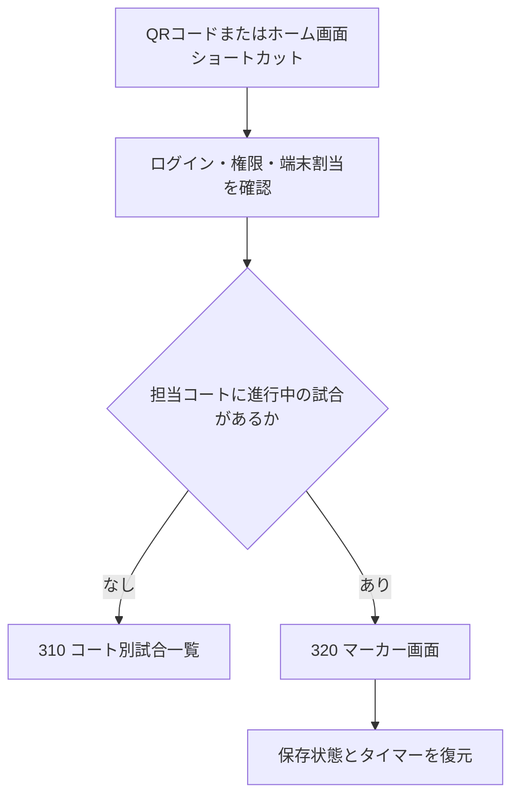

# 300 マーカー

> Document Status: Draft
>
> Inherited From: 「マーカー機能設計」
>
> Requirements Version: 1.0

## 目的

担当試合を安全かつ素早く進行し、得点、サーブ、判定、タイマー、試合結果を記録する。確定した状態は、大型表示、観客画面、OBSオーバーレイへリアルタイムに反映する。

マーカー機能はS-NICK Platformの中核機能とし、操作の速さよりも、誤操作時に完全に復元できること、通信障害やブラウザ終了で状態を失わないことを優先する。

## 301 基本方針

### 対象端末

- スマートフォン、タブレットのブラウザを主対象とする。
- 大会運用ではコートごとにマーカー操作用タブレットを1台設置する。
- コート別大型得点ボードは、コートごとに1～2台の閲覧専用端末を設置する想定とし、マーカー操作用タブレットとは分離する。
- タッチ操作を前提とし、ボタン、文字、タップ領域を大きくする。
- 縦画面と横画面に対応し、回転しても試合状態を維持する。
- 主要操作は可能な限り一画面に収める。
- フォントは日本語・英語・韓国語で視認性の高いサンセリフ体を使用する。
- 色だけで状態や対象選手を識別させず、名前、ラベル、アイコンを併用する。

### 動作モード

| モード | 内容 |
|---|---|
| 通常モード | 登録済みのイベント、カテゴリ、試合、選手情報から開始する |
| クイックモード | イベントを作成せず、選手名、試合方式等を入力してマーカーだけを利用する |

クイックモードでは、選手名、Best of 3／Best of 5、得点方式、コート番号、選手色を設定できる。大会名、カテゴリ、ラウンドは任意とする。

## 310 コート別試合一覧

### 端末の起動・コート割当

- マーカー用タブレットは、運営画面で発行したQRコードを標準カメラで読み取り、ブラウザからS-NICKのマーカー起動ページを開く。
- QRコードには秘密情報や恒久的な認証情報を直接格納せず、イベント、開催日、コートの割当を開始するための短時間・1回限りの起動情報を使用する。具体的な有効時間は検討中とする。
- 未ログインの場合はログイン後に起動処理を継続し、ログイン済みの場合は権限と担当範囲を確認して対象コートを割り当てる。QRコードの読取りだけでマーカー権限を付与しない。
- 割当完了後は、同じ端末・同じブラウザにイベント、開催日、コートの割当を保存し、通常はQRコードを再読取りせず起動できるようにする。
- 割当の変更・解除は運営画面から行い、解除後は保存済みの起動情報だけで対象コートを操作できないようにする。
- QRコードを読取りできない場合の代替起動方法は、短い接続コードまたは運営画面からの直接割当を候補とし、詳細は検討中とする。

#### 代替端末への引き継ぎ

- 運営者または担当範囲を持つスタッフがログイン済みのブラウザから、対象イベント、開催日、コート、進行中試合を確認して代替端末用QRコードを発行できるようにする。
- 代替端末用QRコードは短時間・1回限りとし、指定したコートまたは進行中試合以外の操作権限を付与しない。具体的な有効時間は検討中とする。
- 代替端末がQRコードを読み取った時点で、サーバーに保存された最新状態を取得し、旧端末の操作ロックを無効化して代替端末へ操作権限を移す。発行者、旧端末、新端末、引継ぎ日時を監査ログへ記録する。
- 引き継ぎにはサーバー接続を必須とする。旧端末に未同期操作が残っている場合、または代替端末が最新状態を取得できない場合は引き継ぎを完了せず、旧端末の復旧または紙のマーカー用紙への切替を案内する。

### ショートカット起動

- 初回割当後は、ブラウザの「ホーム画面に追加」でマーカー起動ページのショートカットを作成する方法を推奨する。
- ショートカットはコート別の秘密情報をURLへ埋め込まず、保存済みの端末割当を読み出して起動する共通URLとする。
- PWA（Webサイトを端末上でアプリのように起動できる仕組み）としてインストール可能にし、対応端末ではホーム画面のアイコンから全画面に近い表示で即時起動できる構成を候補とする。
- 大会当日は、端末の自動ロック時間、画面回転、通知音・振動、バッテリー、Wi-Fiを事前確認する。OSごとの設定手順は運用手順書で定める。

### 起動時の遷移



- 起動後は、保存された割当の `310 コート別試合一覧` を基本の入口とする。
- 担当コートに進行中の試合がある場合は、一覧操作を待たず `320 マーカー画面` を表示する。
- 進行中には、ウォームアップ中、試合開始前インターバル中、ゲーム間インターバル中、試合中、中断中、Injury Timeを含む。
- 複数の進行中試合が検出された場合は自動選択せず、競合警告と対象試合を表示して運営者確認を求める。
- 保存済み割当が無効、期限外、解除済み、または権限不足の場合は操作画面へ進めず、再割当または運営者への確認を案内する。

起動判定に使用する正式な内部コードは `yaml/state-machine.yaml` の `match_state_machine.states` とし、マーカー機能独自の別名を作らない。

| 内部コード | 画面表示 | 320への自動復帰対象 |
|---|---|---|
| `warmup` | ウォームアップ中 | ○ |
| `preparing` | 試合開始前インターバル | ○ |
| `in_progress` | 試合中 | ○ |
| `interval` | ゲーム間インターバル | ○ |
| `injury_time` | Injury Time | ○ |
| `suspended` | 中断中 | ○ |

### 画面

| 画面ID | 画面名 | 端末 | アクセス |
|---|---|---|---|
| SCR-MKR-311 | コート別当日試合一覧 | スマートフォン／タブレット | Write |

選択されたコートについて、当日に予定されている試合だけを表示する。

ここでいう「当日」は単純な0時から24時までではなく、イベント設定で登録した開催日と、その開催日・コートごとの利用開始時刻から利用終了時刻までの範囲とする。310は選択中の開催日・コート利用時間へ配置された公開済みスケジュールを表示する。

### 参照するスケジュール

- 310は公開済みスケジュールの最新版だけを参照する。
- 運営者がスケジュールまたはドローを下書き編集中の場合、変更内容を310へ反映しない。新しい版を公開した時点で表示を切り替える。
- 公開済みスケジュールで対戦選手が未確定の場合は進出元試合を表示し、BYE、棄権、試合授与、中止等は専用ラベルで通常の選手と区別する。

### 表示項目

- 大会名、コート番号、現在時刻
- 予定開始・終了時刻
- カテゴリ、ラウンド
- 左右の選手名
- 試合状態
- 現在ゲーム番号またはインターバル等の進行詳細
- 終了済みの場合はゲームカウント
- 最終更新時刻、通信・同期状態

### 表示順と「次の試合」

- 試合は運営者が公開したコート内の試合順を優先し、同順位の場合は有効な開始予定時刻の早い順に表示する。
- 「次の試合」は、進行中または終了済みの試合を除く開始可能な試合のうち、公開済みの試合順が最も早い1件とする。
- 運営者がスケジュールの試合順、開始予定時刻またはコートを変更して公開した場合は、その最新版に基づいて「次の試合」を再計算する。
- 終了済み試合も一覧から折りたたまず、試合順を保ったままグレー等の低い強調度で表示し、ゲームカウントと試合結果を表示する。

### 一覧の自動更新

- スケジュール公開、コート変更、選手確定・変更、棄権、試合授与、中止、試合状態、結果を、ページ再読込なしで一覧へ反映する。
- 更新方式はWebSocket等のサーバー通知、または数秒間隔のAPIポーリングを使用する。採用方式とポーリング間隔は基本設計で決定する。
- 通信切断時は最後に取得した一覧を残し、オフライン表示と最終更新時刻を明示する。通信復旧後は公開済み最新版へ自動同期する。

### 表示ルール

| 状態・区分 | 表示 |
|---|---|
| 予定 | 開始予定時刻前の未開始試合として通常表示 |
| 未開始 | 開始予定時刻を過ぎても開始していないことを表示。5分以上経過した場合は遅延も併記 |
| 次の試合 | 強調表示と「次の試合」ラベル |
| ウォームアップ／準備中 | 状態ラベルを表示し、320への復帰対象とする |
| 試合中 | 強調色と「試合中」ラベルを表示し、`第1ゲーム`、`第2ゲーム`等の現在ゲーム番号を併記 |
| インターバル | 「インターバル」と直前または次のゲーム番号を表示 |
| 中断中／Injury Time | 理由またはタイマーを表示し、320への復帰対象とする |
| 終了 | グレー等で目立たなくし、ゲームカウントと試合結果を表示 |
| 中止 | 中止ラベルと、登録されている場合は理由を表示 |
| 棄権・試合授与 | 終了種別を明示 |

`予定`と`未開始`は内部状態を増やさず、どちらも `scheduled` とする。表示時点が有効な開始予定時刻より前なら`予定`、開始予定時刻以降なら`未開始`と表示する。`遅延`は共通仕様に従い、未開始のまま開始予定時刻から5分以上経過した場合に併記する。

試合状態と進行詳細は分けて扱う。例えば内部状態 `in_progress` を「試合中」、現在ゲーム番号を「第2ゲーム」として同時に表示する。内部状態 `interval` は「インターバル」とし、どのゲーム間かを補助表示する。

カテゴリ名、ラウンド名、選手名、状態等は表示枠内で折返しできる場合は折り返す。操作性を損なう場合は末尾を`…`で省略し、試合カードの詳細表示で全文を確認できるようにする。

### 試合開始

開始前の試合をタップすると、選手、コート、予定時刻を含む確認ダイアログを表示する。

- キャンセル：状態を変えず一覧へ戻る。
- 開始：対象試合の開始確定と操作端末ロックをサーバー側の一つの処理として実行し、成功後にマーカー画面へ遷移してウォームアップを開始する。
- 二重タップ、同一ブラウザの複数タブ、別端末から同時に開始された場合も、同じ試合を重複開始しない。同じ開始要求は一度だけ処理する。
- オフライン中は新しい試合を開始できない。310で新規試合を開始するにはサーバー接続と最新の公開済みスケジュールの確認を必須とする。
- オフライン対応は、オンラインで試合開始を確定して必要データを端末へ保存した後から、その試合を終了するまでの継続操作を対象とする。
- 同じコートで別の試合に有効な操作端末ロックが残っている場合は開始不可とする。
- 前の試合が未終了状態でも、有効な操作端末ロックがなく実際には終了している場合は警告後に開始できる。警告には未終了試合、状態、予定時刻を表示する。
- 未終了警告を確認して後続試合を開始した場合は、前の試合を「未終了のまま後続試合開始」として運営者側のスケジュールへ表示し、確認者、後続試合、開始日時を記録する。

### 誤終了した試合の再開

- マーカーが誤って通常の試合終了を確定した場合は、終了済み試合から再開操作を選択できるようにする。
- 再開時は対象試合、終了結果、再開後に復元するゲーム・得点・サーブ状態を表示して確認を求め、再開操作を監査ログへ記録する。
- 再開後は、誤終了直前のマーカー状態へ戻して320を表示する。
- 終了結果によって未開始の後続試合へ勝者が仮反映されている場合は、再開確認画面へ影響を表示し、再開確定時にその反映を取り消して進出元試合の結果待ちへ戻す。公開結果と表示端末も再開状態へ同期する。
- 同じコートで別の試合がすでに進行中の場合、または確定結果を使用する後続試合がすでに開始している場合は、マーカー単独では再開せず、イベント所有者または大会運営管理者による確認を必要とする。
- 棄権、試合授与、中止からの再開は通常の誤終了再開に含めず、イベント所有者または大会運営管理者が試合管理から処理する。

## 320 マーカー画面

### 画面

| 画面ID | 画面名 | 内容 |
|---|---|---|
| SCR-MKR-321 | マーカー画面 | 得点・判定・試合進行 |
| SCR-MKR-322 | 選手表示設定 | 選手色、クイック時の選手名 |
| SCR-MKR-323 | ゲーム詳細 | 過去ゲームの結果とボード |
| SCR-MKR-324 | その他判定 | Conduct、Injury、Forfeit |
| SCR-MKR-325 | タイマー | ウォームアップ、準備、休憩、Injury |
| SCR-MKR-326 | 試合終了確認 | 勝者、ゲーム数、終了理由 |

### 試合情報ヘッダー

- イベント名
- カテゴリ
- ラウンド
- コート番号
- 左右の選手名
- 左右のゲーム獲得数
- 通信・同期状態

端末OSが表示する時刻、アンテナ、Wi-Fi、バッテリー等のステータスバーはアプリの表示項目に含めない。

### 選手表示

- 初期色は左選手を青、右選手を赤とする。
- 選手枠のタップで表示色を変更できる。
- 通常モードの選手名は登録済み試合情報から取得する。
- クイックモードでは選手名も変更できる。
- 選手間の数字は現在得点ではなくゲーム獲得数とし、ゲーム結果から自動計算する。
- 選手色はマーカー、大型表示、OBS、履歴、ダイアログで統一する。

### 画面デザイン方針

提示された縦画面・横画面案を、`SCR-MKR-321` のレイアウト基準とする。見た目の再現そのものではなく、試合中に迷わず操作できること、得点と操作対象を瞬時に判別できること、誤操作後に直ちに戻せることを優先する。

#### 参考画像（初期デザイン案・調整中）

以下の画像は、画面構成、情報の優先順位、ボタンと文字の大きさを確認するための初期デザイン案である。色、余白、文字サイズ、ボタン位置、マーカーボードの幅等は、実機での操作確認後に調整する。

**横画面**


**縦画面**


#### 情報の優先順位

| 優先度 | 情報・操作 | 方針 |
|---|---|---|
| 1 | 左右の現在得点 | 画面内で最も大きく表示し、得点領域全体を該当選手への加点ボタンとする |
| 2 | `YES LET`、`NO LET`、`STROKE`、その他判定 | 左右の対象選手との位置関係を崩さず、大型ボタンで表示する |
| 3 | 選手名、ゲーム獲得数、サーブ権、サービスボックス | 得点の近くへ固定し、色だけでなく位置と文字でも識別できるようにする |
| 4 | 現在ゲームのマーカーボード、終了ゲーム結果 | 得点操作を妨げない中央領域または下部へ配置する |
| 5 | イベント名、カテゴリ、ラウンド、コート、同期状態 | 画面上部へまとめ、試合操作領域を圧迫しない高さにする |

#### 共通レイアウト

- 左選手は常に画面の左側、右選手は常に画面の右側とし、端末回転時にも左右を入れ替えない。
- 左右の得点領域は同じ大きさとし、現在得点、選手名、ゲーム獲得数、サーブ権、`L`／`R`を一つの選手領域として視覚的にまとめる。
- 現在得点は1桁・2桁で欠けたり重なったりしないようにする。3桁以上になった場合は領域内で自動縮小するが、改行や省略はしない。
- 得点数字には、遠目でも`0`、`6`、`8`、`9`等を識別しやすく、桁幅が変化しにくい数字書体を使用する。7セグメント風の表現を採用する場合も装飾より判読性を優先する。
- 選手色は識別補助として背景またはアクセントへ使用する。文字と背景のコントラストを確保し、サーブ権は`Serving`等の文字とアイコンを併記する。
- 得点タップ後は、得点数字の短い視覚変化と必要に応じた振動で入力受付を通知する。効果によって次の操作を待たせない。
- 画面端、ノッチ、ホームインジケーター等のセーフエリアを避け、重要なボタンを端末のシステム操作と重ねない。
- 主要な試合操作はスクロールなしで使用できるようにする。マーカーボードの履歴部分だけは領域内スクロールを許可する。

#### 横画面

```text
┌──────────────── 試合情報ヘッダー ────────────────┐
│ 左選手・ゲーム数 │ 中央情報 │ 右選手・ゲーム数 │
├──────────────┬────────┬──────────────┤
│              │マーカー│              │
│  左得点領域  │ボード  │  右得点領域  │
│              │        │              │
├──────────────┼────────┼──────────────┤
│ 左判定ボタン │ 戻る等 │ 右判定ボタン │
└──────────────┴────────┴──────────────┘
```

- 左右の得点領域を画面幅の大部分へ配置し、中央に縦長のマーカーボードを表示する。
- `YES LET`、`NO LET`、`STROKE`、その他判定は、対象となる選手側の得点領域直下に横並びで配置する。
- 横幅が不足する場合は判定ボタンの間隔、補助情報、中央ボード幅の順で調整し、得点文字とボタン文字を先に小さくしない。

#### 縦画面

```text
┌──────────── 試合情報ヘッダー ────────────┐
│ 左選手・ゲーム数 │ 右選手・ゲーム数 │
├──────────────────────────────┤
│      左得点領域 │ 右得点領域       │
├─────────┬──────────┬─────────┤
│左判定   │マーカー  │右判定   │
│ボタン列 │ボード    │ボタン列 │
├─────────┴──────────┴─────────┤
│ 終了ゲーム結果・戻る・補助操作             │
└──────────────────────────────┘
```

- 左右の得点領域を上段へ同じ幅で並べ、縦方向にも十分な高さを確保する。
- 得点領域の下は、左判定ボタン列、中央マーカーボード、右判定ボタン列の3列とする。
- 各選手側の`YES LET`、`NO LET`、`STROKE`、その他判定を縦に並べ、片手でも押しやすい高さを確保する。
- 終了ゲームの結果と「戻る」等の補助操作は下部へ配置し、現在得点と判定操作より目立たせない。

#### ボタン・文字サイズ

- 主要ボタンのタップ領域は最小56×56 CSSピクセル（ブラウザ上の論理的な表示単位）とし、縦画面の判定ボタンは利用可能な高さを均等に使用して、これより大きくする。
- 主要ボタン間には最小8 CSSピクセル相当の間隔を確保し、隣接ボタンの押し間違いを防ぐ。
- 得点数字は領域内で可能な限り最大化する。選手名は24 CSSピクセル相当以上、判定ボタン文字は20 CSSピクセル相当以上、主要な状態文字は18 CSSピクセル相当以上、補助情報は16 CSSピクセル相当以上を基準とする。
- OSやブラウザの文字拡大を妨げない。文字拡大時は補助情報を折り返しまたは省略できるが、得点、選手名、判定、サーブ権、同期エラーは隠さない。
- 画面サイズと文字倍率の組合せにより基準を満たせない場合は、主要操作を保った簡略表示へ切り替える。対象端末の最小画面サイズと簡略表示の境界値はUI詳細設計で決定する。

#### 操作安全性

- 得点領域は大きくする一方、選手名、ゲーム獲得数、ヘッダー、マーカーボードのタップでは加点しない。
- 得点入力時は確定対象側を短時間強調し、直前操作の内容を「戻る」ボタン付近へ常時表示する。
- `YES LET`は得点を変更しないため確認なしで記録できる。得点や試合状態を大きく変更する判定は既存の確認ルールに従う。
- 無効な操作はボタンを消すだけでなく、無効状態として表示し、現在押せない理由を確認できるようにする。
- 横画面と縦画面で機能、左右の意味、ボタン名を変えず、配置変更だけで操作を継続できるようにする。

## 330 得点・サーブ・マーカーボード

### 得点入力

左右の大きな得点表示領域をタップすると、該当選手へ1ポイントを加算する。

### サーブ権とサービスボックス

| 条件 | サーブ権 | 次のサービスボックス | 手動変更 |
|---|---|---|---|
| サーバーが得点 | 維持 | `L`と`R`を自動反転 | 不可 |
| レシーバーが得点（ハンドアウト） | 得点者へ移動 | 初期値`R` | ハンドアウト直後のみ可 |
| YES LET | 維持 | 同じボックス | 不可 |

- `Serving`はサーブ権を持つ選手側だけに表示する。
- サーブ権を持たない側の`L`／`R`は操作不可とする。
- ゲーム開始時のサーバーとサービスボックスを確定してから試合を開始する。

### マーカーボード

マーカーボードは読み取り専用とし、紙のスコアシートに近い4列構成とする。

| 左選手 | 左選手 | 右選手 | 右選手 |
|---|---|---|---|
| ポイント | サービスボックス | ポイント | サービスボックス |

- 1行は、次にサーブを行う状態または判定イベントを表す。
- ゲーム開始時は、サーバーの`0`点とサービスボックスから記録する。
- 通常行はサーバー側の現在ポイントと`L`／`R`を表示する。
- 直接入力、直接変更、行削除、並べ替えはできない。
- 新規行追加時は、過去行を閲覧中でない限り最新行へ自動スクロールする。
- 現在ゲームのボードだけを表示し、過去ゲームはゲーム詳細から参照する。

## 340 アピール・ペナルティ

左右の判定ボタンは、通常判定ではその側をストライカーとして扱う。Conduct系では、その側をペナルティ対象選手として扱うため、確定前に対象選手名、色、処理結果を必ず表示する。

### 基本判定

| 操作 | 処理 | サーブ処理 |
|---|---|---|
| YES LET | 得点変更なし、`YES_LET`を記録 | 同じサーバー、同じボックス |
| NO LET | アピールした選手の相手へ1点 | 通常のポイント処理 |
| STROKE | ストライカーへ1点 | 通常のポイント処理 |

### その他判定

| 操作 | 処理 | 確認 |
|---|---|---|
| CONDUCT WARNING | 対象選手への警告と理由を記録 | 対象選手を表示 |
| CONDUCT STROKE | 対象選手の相手へ1点 | 対象選手と加点先を表示 |
| CONDUCT GAME | 対象選手の相手へ現在ゲームを授与 | 必須 |
| CONDUCT MATCH | 対象選手の相手へ試合を授与して終了 | 必須 |
| INJURY TIME | 対象選手と選択時間でカウントダウン | 必須 |
| FORFEIT MATCH | 相手を勝者として試合終了 | 必須、理由入力 |

Conduct Gameの確定スコア表現とInjury Timeの正式な時間区分は、大会規則を確認して確定する。

### マーカーボード上の判定表示

- 判定は対象側の2列を結合した専用行として表示する。
- 表示文字は`YES LET`、`NO LET`、`STROKE`、`WARNING`、`C.STROKE`、`C.GAME`、`C.MATCH`、`INJURY`、`FORFEIT`等とする。
- 判定種別ごとに背景を区別するが、色だけに依存しない。
- 得点を伴う判定では、判定行に続けて次のサーブ状態を通常行で表示する。

## 350 ウォームアップ・試合準備・タイマー

### 設定値

| 項目 | 初期候補 |
|---|---:|
| ウォームアップ左側 | 120秒 |
| ウォームアップ右側 | 120秒 |
| 試合開始前インターバル | 120秒 |
| ゲーム間インターバル | 120秒 |

設定値は大会単位を基本とし、必要に応じてコート単位で上書き可能な設計とする。

### 表示・動作

- 円が時間経過に伴って欠けるカウントダウンを表示する。
- 数字の残り時間も併記する。
- 一時停止、スキップ、終了操作を用意する。
- タイマー終了時は設定に応じて音・振動・画面表示で通知する。
- 左側ウォームアップ終了後は右側ウォームアップへ進む。
- 右側ウォームアップ終了後は試合開始前インターバルへ進む。
- 試合開始前インターバル終了後は自動開始せず、マーカーが`試合開始`を押して第1ゲームを開始する。
- 各ゲーム終了後、試合が継続する場合はゲーム間インターバルへ進む。必要ゲーム数を先取して試合が終了した場合はインターバルを開始しない。
- タイマーは単純な1秒減算ではなく、終了予定時刻と現在時刻から残り時間を計算する。

### ブラウザ終了後のタイマー復元

- タイマーの開始、一時停止、再開、スキップ、終了の各操作時に、タイマー種別、状態、設定時間、開始日時、終了予定日時、一時停止時の残り時間、最終更新日時をサーバーと端末内へ直ちに保存する。
- 作動中にブラウザを閉じてもタイマーを一時停止したものとは扱わず、終了予定日時までは実時間が経過したものとして扱う。
- 同じ端末・同じブラウザで再起動した場合、作動中タイマーの残り時間は `max(0, 終了予定日時 - 現在日時)` で再計算し、320 マーカー画面へ表示する。
- 一時停止中にブラウザを閉じた場合は、保存した残り時間のまま復元し、再開操作後に新しい終了予定日時を設定する。
- 再起動時点ですでに終了予定日時を過ぎている場合は残り時間を0とし、タイマー終了を明示する。ブラウザが閉じていた間の通知音・振動は再現せず、復帰時に画面上で未確認の終了を通知する。
- ウォームアップの左右切替など複数の連続タイマーをブラウザ不在中にどこまで自動進行させるかは、誤った試合進行を避けるため検討中とする。少なくとも保存中のタイマーの経過時間と終了状態は復元する。
- オンライン時はサーバー時刻との差を考慮し、端末時計が大きく変更された疑いがある場合はタイマーを自動補正または確定せず、警告を表示する。許容差と補正方法は基本設計で決定する。

## 360 ゲーム管理・UNDO

### ゲームスコア

- 最大5ゲーム分を表示する。
- 終了ゲームは最終ポイントを表示する。
- 現在ゲームは枠、ラベル等で明確に強調する。
- 未開始ゲームは`- / -`で表示する。
- 過去ゲームをタップすると、ゲーム結果と読み取り専用マーカーボードをダイアログ表示する。
- 過去ゲームは編集・UNDO不可とする。

### ゲーム・試合終了

- 得点方式と必要ゲーム数に基づいてゲーム決着を自動判定する。
- 試合の必要ゲーム数に到達した場合は、即時確定せず試合終了確認を表示する。
- 確定時に勝者、終了時刻、ゲーム結果、終了種別を保存する。
- キャンセル時は現在ゲームへ戻り、必要に応じてUNDOできる。

### UNDO

画面表示は「戻る」または「取消」、内部イベント名は`UNDO`とする。ブラウザの戻る操作とは明確に区別する。

- 直前の1イベントだけを確認なしで取り消す。
- 得点だけでなく、サーブ権、サービスボックス、ボード行、ゲーム数、試合状態を操作前へ完全復元する。
- 判定イベントでは、判定行と関連する得点・サーブ状態を一括して取り消す。
- 取消対象がない場合はボタンを無効化する。
- 取消対象の概要をボタン付近に表示する。
- 操作履歴は読み取り専用で参照できるが、途中のイベントだけを選んで取り消すことはできない。
- 試合終了後の取消権限と運用手順は検討中とする。

## 370 大型表示連携

- マーカーの確定操作を大型得点表示へリアルタイム反映する。
- 大型得点表示は、TVモニター、タブレット、PC等で共通の閲覧専用端末ペアリングを使用し、登録後に割り当てられたコートをブラウザで全画面表示する。利用者にコート別の長いURLを入力させない。
- イベント名、コート名、カテゴリ、ラウンドまたはリーグ名、左右の選手アイコンと表示名を表示する。
- 現在進行中のゲームの左右の得点を最も大きく表示し、左右のゲーム獲得数、現在ゲーム番号、サーブ権、試合状態、タイマーを同期する。
- 選手アイコン未登録時はマイカラーと表示名または氏名の頭文字による既定アイコンを表示する。
- 横画面を基本とするレスポンシブ表示とし、縦画面でも得点、ゲーム獲得数、選手名を優先して表示する。
- マーカーの取消操作が確定した場合は、訂正後の得点と状態を大型表示へ反映する。
- 大型表示は読み取り専用とし、独自の試合状態を持たない。
- `YES LET`、`NO LET`、`STROKE`を確定した場合は、対象コートの大型得点表示へ判定イベントを送信し、中央の判定結果ダイアログへ反映する。
- 判定結果ダイアログの初期表示時間は3秒とし、大型モニター表示設定の値を使用する。表示中に新しい判定が確定した場合は最新の判定へ置き換えて表示時間を数え直す。
- 表示中の判定イベントを取り消した場合は大型得点表示のダイアログを直ちに閉じ、訂正後の得点とサーブ状態を同期する。
- 試合中は得点表示を最優先し、画面下部の高さ約10％でスポンサーのロゴを横方向へ連続して流す。
- 試合開始前の待機中、ウォームアップ中、ゲーム間インターバル中は、大型得点表示をロゴと表示コメントを中心とする全画面スポンサー表示へ自動切替できるようにする。
- 全画面スポンサー表示はオーバーレイまたは全画面に近いダイアログ風パネルとし、現在状態とウォームアップまたはインターバルの残り時間を画面下部へ表示する。
- スポンサー表示時のレイアウトはイベント設定を使用し、初期値を「スポンサー主表示＋状態・タイマー下部表示」とする。
- 次ゲーム開始、試合再開または得点入力開始時は直ちに得点表示へ戻す。
- 試合中、中断中、Injury Time、通信切断時はスポンサー全面表示を行わず、得点・状態・安全上の情報を優先する。
- スポンサー表示の選択は、スポンサー管理で設定した掲載期間、表示状態、表示重みに従う。
- 通信切断時は最後に確定した得点と最終更新時刻を残し、更新停止中であることを明示する。復旧後は自動同期する。
- スポンサー表示、写真・アイコン表示等は共通表示仕様を参照する。

### 判定結果アニメーション（大型画面・OBS共通）

`YES LET`、`NO LET`、`STROKE`の判定結果は、文字だけを切り替えるのではなく、スカッシュボールがコート奥から画面手前へ飛来し、中央の判定ウインドウへ変化する短いアニメーションで表示する。

- 表示時間は全体で約3秒とし、試合再開を妨げる長い待機や溜めを設けない。
- 判定ウインドウには`DECISION`と、`YES LET`、`NO LET`または`STROKE`の判定名だけを表示する。判定名の下に説明文は表示しない。
- 判定名は英大文字で表示し、色だけで判定を識別させない。
- アニメーションはHTML、CSS、SVG等のブラウザで描画できる要素を基本とし、クロマキー前提の動画素材を標準方式としない。
- 大型得点ボードでは、得点表示を一時的に暗くした上へ判定ウインドウを重ねる。
- OBSでは背景透過のBrowser Sourceとして表示し、カメラ映像へ直接合成する。クロマキーは使用せず、HTMLのアルファ透過を使用する。
- 低性能端末または`prefers-reduced-motion`が指定された環境では、ボールの飛来を省略し、判定ウインドウの短い表示・非表示へ簡略化できる。

| 経過時間 | 表示 |
|---:|---|
| 0.0～1.2秒 | スカッシュボールがコート奥から画面手前へ飛来する |
| 1.0～1.5秒 | ボールの到達に合わせて衝撃リングを表示し、背景を暗くする |
| 1.3～2.6秒 | 中央に判定ウインドウと判定名を表示する |
| 2.6～3.0秒 | 判定ウインドウと背景効果をフェードアウトする |

表示中に新しい判定が確定した場合は、前の表示を終了して最新の判定へ置き換え、約3秒の表示を最初から開始する。表示対象の判定がUNDOされた場合は、判定ウインドウとアニメーションを直ちに閉じる。再接続または画面再読込時に有効期限を過ぎた判定イベントを再生しない。

初期デザインと動作の確認には、[判定結果アニメーションのサンプル](samples/marker/decision-animation-sample.html)を使用する。サンプルは演出方向を確認するための参考資料であり、最終的な色、寸法、速度およびイージングは大型画面とOBSの実機確認後に確定する。

## 380 OBSオーバーレイ連携

- コートまたは試合ごとのURLをOBS Browser Sourceで利用できるようにする。
- OBS連携はフェーズ2で導入し、約10種類を目標とするプリセットレイアウトからイベントごとに1種類を選択できるようにする。正確な提供数と各デザインはUI設計で確定する。
- 各プリセットは、試合中、ウォームアップ・インターバル中、判定結果表示時のレイアウトを一組として持つ。
- 帯の形状、画面内の配置、文字の見せ方、枠・アクセント、選手色の適用方法をプリセットごとに変更できるようにする。
- イベント設定では、プリセットのサムネイルと実際の選手名・得点を使ったプレビューを確認して選択できるようにする。
- テーマ、任意表示項目のON／OFF、アニメーションの個別調整は段階的な拡張とする。選手名、現在得点、ゲーム獲得数、選手色はすべてのプリセットの必須表示項目とし、非表示にはしない。
- マーカー画面と同じ確定状態を表示し、配信画面から試合状態を変更できないようにする。
- OBSのシーンを判定のたびに切り替えず、背景透過の標準オーバーレイ内で中央ダイアログを表示・非表示にする。

### 試合中の標準オーバーレイ

- 配信映像へ常時重ねる標準オーバーレイには、左右の選手名、現在ゲームの得点、左右のゲーム獲得数、左右の選手色を表示する。
- 左右の選手色は、各選手領域の背景、帯またはアクセントとして使用し、どちらの選手の情報かを瞬時に識別できるようにする。
- 選手色だけに依存せず、左右の配置、選手名、数値の位置でも選手を識別できるようにする。文字と背景は十分なコントラストを確保する。
- 現在得点とゲーム獲得数は別の数値領域に表示し、混同しないよう位置と大きさで区別する。離れた位置から読みにくい小さな補助ラベルは表示しない。
- 表示の優先順位は、現在得点、選手名、ゲーム獲得数の順とし、ゲーム獲得数は現在得点および選手名より小さく表示する。
- オーバーレイ以外の領域は透過し、カメラ映像を必要以上に隠さない。配置、帯の形状、余白等はイベント設定で選択したレイアウトを使用する。

#### 参考画像（OBSオーバーレイの構成例）


参考画像は、左右の選手情報と中央の数値を横長の帯へまとめる構成例である。色、形状、文言、寸法をそのまま採用するものではなく、S-NICKの実画面では現在得点とゲーム獲得数をそれぞれ判別できるように配置する。

#### 参考サンプル（プリセット候補01）


- 仮称：シンプルスコア帯
- 左右に選手名とゲーム獲得数、中央に現在得点を配置する。
- 離れた位置から読みにくい小さな補助ラベルは表示せず、選手名と数値を大きく表示する。
- ゲーム獲得数は補助情報として左右端へ小さく表示し、中央の現在得点を最も大きくする。
- 直線的な5区画を基本とし、斜め形状、立体表現、影、グラデーション等の装飾を使用しない。
- 左選手を青、右選手を赤のアクセントで区別するが、左右位置と選手名でも識別できる。
- 画像の背景は透過済みであり、OBSのカメラ映像へ重ねた状態を確認できる。
- この画像をプリセット候補01の参考サンプルとする。最終的な寸法、配色、文字サイズは配信映像へ重ねた実機確認後に調整する。
- 実装時は固定画像ではなく、Browser Source上のHTML等で選手名、得点、ゲーム獲得数、選手色を動的に反映する。

### 判定結果ダイアログ

- `YES LET`、`NO LET`、`STROKE`の確定時は、英大文字の判定結果を配信映像の中央へ大きく表示する。
- 初期表示時間は3秒とする。表示中に新しい判定が確定した場合は、最新の判定へ置き換えて表示時間を数え直す。
- 表示中の判定イベントを取り消した場合は、ダイアログを直ちに閉じ、訂正後の得点とサーブ状態を反映する。
- 一時的な判定イベントにはイベントID、発生日時、有効期限を持たせ、通信復旧またはBrowser Source再読込後に有効期限を過ぎた判定を再表示しない。

### ウォームアップ・インターバル表示

- `warmup`、`preparing`、`interval`の間はスポンサーのロゴと表示コメントを主表示とし、状態とタイマーを中央へ重ねない。
- `WARM-UP`または`INTERVAL`、残り時間を画面下部の状態表示領域へ表示する。インターバル中は次のゲーム番号も表示する。
- 残り時間はサーバーに保存された終了予定日時と現在日時の差から計算し、Browser Sourceを再読込または再接続した場合も復元する。
- タイマーが一時停止されている場合は、停止時点の残り時間と `PAUSED` を下部へ表示する。
- 残り時間が0になった場合、または次ゲーム開始により試合状態が `in_progress` へ遷移した場合は、ウォームアップ・インターバル用の下部表示を直ちに閉じる。
- OBSオーバーレイのレイアウトはイベント設定で選択する。初期レイアウトは「スポンサー主表示＋状態・タイマー下部表示」とし、選択肢の追加は段階的な拡張とする。
- どのプリセットを選択した場合も、ウォームアップ・インターバル中はスポンサーを主表示とし、状態・タイマーを下部へ表示する情報優先順位を維持する。

## 390 状態保存・復元・同期

### サーバーを正とする

操作ごとにイベントと現在状態を自動保存し、サーバーに確定した状態を正式な状態とする。保存ボタンは設けない。

復元対象には次を含む。

- 現在ゲームとポイント
- ゲーム獲得数
- サーブ権とサービスボックス
- マーカーボードと判定履歴
- Conduct、Injury、終了状態
- タイマー種別、動作状態、開始日時、終了予定日時、一時停止時の残り時間
- 選手色と表示情報
- 状態バージョン、最終更新日時

ブラウザを閉じる、更新する、戻る、端末を回転する等があっても、再度同じ試合を開けば最後に確定した状態を復元する。

### オフライン

- フェーズ1から完全オフライン対応とする。担当試合、選手、競技設定、現在状態等の操作に必要なテーブルセットを、試合開始前に端末へ取得してブラウザ内へ永続保存する。
- 通信断中も得点、判定、タイマー、ゲーム・試合終了等の通常操作を継続できるようにし、通信エラーのダイアログや操作停止によってマーカー業務を妨げない。
- 未送信イベントと状態スナップショットをIndexedDB等へ永続保存し、ブラウザの更新・終了後も同じ端末・ブラウザで直前状態から再開できるようにする。
- 通信復旧時に未送信イベントを発生順に再送する。各操作へ一意のイベントIDと基準状態バージョンを付け、サーバー側で二重処理と競合を検出する。
- マーカーの操作を妨げない小さな状態表示として「同期済み／同期中／オフライン／同期エラー」を文字とアイコンで表示する。未同期データがある事実は隠さない。
- オフライン中に同じ試合を別端末から同時更新した場合の自動統合・運営者確認・端末引継ぎ手順は基本設計で確定する。
- ブラウザデータの消去、端末故障、未取得端末でのサーバー停止等により再開できない場合は、紙のマーカー用紙へ切り替える。

### 操作端末ロック

- 1試合につき1台だけを操作端末としてロックする。
- 別端末で開いた場合は閲覧のみ、または確認付きの操作引き継ぎを選択する。
- 大型表示、OBS、観客画面は読み取り専用のためロック対象外とする。

## 監査ログ

得点、判定、UNDO、タイマー、試合終了、端末引き継ぎ等について、イベントID、試合ID、操作者、対象選手、発生日時、端末、変更前後の状態を追跡できるようにする。

## 多言語

- マーカー画面の多言語対応はフェーズ3で導入する。フェーズ1・2は日本語を基本とするが、フェーズ3で作り直しにならない画面構造とする。
- フェーズ3の初期対象言語は日本語`ja`、英語`en`、韓国語`ko`とする。
- 固定文言をソースへ直接埋め込まず、翻訳キーで管理する。
- ラウンド等は共通管理コードと表示名を分離する。
- ボタンは翻訳後の文字列が日本語の約1.3倍になっても、主要文字サイズを下げずに表示できる余白を確保する。収まらない場合は2行までの折返しを許可し、省略記号だけで操作名を隠さない。
- 得点、ゲーム数、`L`／`R`等の競技記号は言語変更の影響を受けない領域として扱い、翻訳文字列の長さで得点領域が縮まないようにする。
- 言語の選択方法、利用者単位または端末単位の保存範囲、右から左へ記述する言語への将来対応は検討中とする。
- 大型得点ボードへ表示する`YES LET`、`NO LET`、`STROKE`は英大文字に固定する。その他の競技判定を英語固定とするかは検討中。

## 396 音声コール・読み上げ

**状態：フェーズ3**

マーカー操作で確定した得点、判定、ゲーム・試合状態から、スカッシュのマーカーコールを自動生成して端末から読み上げられるようにする。音声は補助機能とし、再生できない場合も得点入力、状態遷移、画面表示、監査記録を停止しない。

### 読み上げ対象

- 試合開始時の選手紹介、サーバー、レシーバー、最大ゲーム数、`Love-All`
- ラリー終了後の得点。サーバー側の得点を先に読む
- サーブ権が移動した場合の`Hand Out`
- 同点時の`All`、0点の`Love`
- あと1点でゲームを取る場合の`Game Ball`
- あと1点で試合に勝つ場合の`Match Ball`
- 各ゲームで初めて10オールになった場合の「2点差が必要」の案内
- `YES LET`、`NO LET`、`STROKE`等の確定判定
- ゲーム終了、試合終了、ゲームカウント、勝者

コールの順序は、得点へ影響する判定、サーバー側を先にした得点、`Game Ball`または`Match Ball`等の得点コメントの順とする。例えば画面上の左右得点が`7–10`でも、右選手がサーバーなら`10–7`の順で読み上げる。10点側が次の1点で試合に勝つ場合は`Match Ball`、ゲームだけを取る場合は`Game Ball`とする。

コール内容は [World Squash OfficiatingのRules of Squash](https://worldsquashofficiating.com/rules-of-squash/) に従う。確認時点は2026年8月5日とし、実装時に採用する大会ルール版との差分を再確認する。

### 選手名

- 表示名とは別に、言語別の任意項目として「音声読み上げ名」を保持できるようにする。
- フェーズ3の初期対象は日本語、英語、韓国語とし、登録された言語の読み上げ名を優先する。
- 対象言語の読み上げ名が未登録の場合は、氏名読み、表示名、氏名の順に使用可能な値へフォールバックする。
- 試合開始前に左右の選手名を音声テストし、権限を持つ運営者または選手本人が読み上げ名を修正できるようにする。
- 得点ごとには原則として選手名を読まず、試合紹介、選手を特定する判定、ゲーム終了、試合終了等で使用する。

### 再生方式・操作

- ブラウザのWeb Speech APIによる音声合成と、発音を統一した固定・事前生成音声の組合せを候補とする。正式な採用方式はフェーズ3の基本設計で決定する。
- `Love`、`All`、`Hand Out`、`Game Ball`、`Match Ball`等の定型語は、端末差を避けるため固定音声として端末へ事前保存する方式を優先候補とする。
- 選手名等の可変部分は、読み上げ名から音声合成するか、大会前に生成して端末へ保存する。
- ブラウザの自動再生制限へ対応するため、試合開始前に「音声を有効にする」または「音声テスト」を利用者が操作する。
- 音声ON／OFF、音声テスト、読み上げ速度、対象言語、直前コールの再生を設定できるようにする。音量は端末側音量を基本とし、画面内音量設定の要否は検討中とする。
- 短時間に複数操作された場合は古い未再生コールを無制限に蓄積せず、得点・状態と一致する最新の有効なコールを優先する。
- オフライン中も利用する音声の範囲、端末ごとの音声品質、Bluetoothスピーカー等の外部出力はフェーズ3の実機検証で決定する。

## 要件ID

| ID | 要件 |
|---|---|
| MRK-001 | スマートフォン・タブレットの縦横画面で利用できる |
| MRK-002 | 得点表示のタップで1点を加算する |
| MRK-003 | サーブ権とサービスボックスを得点結果に従って更新する |
| MRK-004 | 4列の読み取り専用マーカーボードを表示する |
| MRK-005 | YES LET、NO LET、STROKEを記録できる |
| MRK-006 | Conduct、Injury、Forfeitを対象選手付きで記録できる |
| MRK-007 | 直前イベントを完全にUNDOできる |
| MRK-008 | 過去ゲームの結果とボードを読み取り専用で確認できる |
| MRK-009 | ブラウザ終了・更新後も試合状態を復元できる |
| MRK-010 | オフライン操作を保持し、通信復旧後に同期できる |
| MRK-011 | 同一試合の複数端末操作を制御する |
| MRK-012 | 大型表示とOBSへ確定状態をリアルタイム反映する |
| MRK-013 | YES LET、NO LET、STROKEの確定・取消を大型得点ボードの約3秒の判定結果アニメーションへリアルタイム反映する |
| MRK-014 | QRコードまたは保存済み端末割当から担当コートのマーカー機能を起動できる |
| MRK-015 | 担当コートに進行中の試合がある場合は320 マーカー画面へ自動復帰できる |
| MRK-016 | ブラウザ終了中も終了予定日時に基づいて作動中タイマーの経過を復元できる |
| MRK-017 | 縦画面・横画面で得点と主要操作を大きく表示し、回転後も左右と操作内容を維持できる |
| MRK-018 | 主要ボタンのタップ領域、文字サイズ、間隔の下限を満たし、誤操作を防止できる |
| MRK-019 | フェーズ3で日本語・英語・韓国語を切り替えても主要操作を省略せず表示できる |
| MRK-020 | 310で公開済みスケジュールだけを表示し、公開された変更を再読込なしで反映できる |
| MRK-021 | 公開された試合順と開始予定時刻から「次の試合」を一意に決定できる |
| MRK-022 | 新しい試合の開始と操作端末ロックをオンラインで重複なく確定できる |
| MRK-023 | オンラインで開始した試合を終了までオフラインで継続でき、オフライン中は新規試合を開始できない |
| MRK-024 | 前の試合が未終了でも警告後に後続試合を開始し、運営者画面へ未終了警告を表示できる |
| MRK-025 | 誤って通常終了した試合を条件付きで直前状態から再開できる |
| MRK-026 | ログイン済みの運営者またはスタッフがQRコードで代替端末へ操作を引き継げる |
| MRK-027 | フェーズ3で得点、判定、ゲーム・試合状態、選手名から音声コールを生成して再生できる |
| MRK-028 | YES LET、NO LET、STROKEの確定・取消を、クロマキーを使わない背景透過のOBS判定結果アニメーションへリアルタイム反映できる |
| MRK-029 | ウォームアップ・インターバル中はOBSでスポンサーを主表示とし、状態・残り時間・次ゲームを下部へ表示して、再読込・再接続後も残り時間を復元できる |
| MRK-030 | 試合中のOBS標準オーバーレイに左右の選手名、現在得点、ゲーム獲得数、選手色を判別可能な形で表示できる |
| MRK-031 | イベント設定で約10種類を目標とするOBSプリセットをプレビューし、イベントへ適用するレイアウトを選択できる |

## 検討中

- 正式なスカッシュルール版と大会ごとのルール差分
- PAR11／PAR15等の対応範囲とゲーム終了条件
- Conduct Gameの確定スコア表現
- Injury Timeの正式な区分と時間
- オフライン中に同じ試合が複数端末で更新された場合の最終的な競合解決手順
- 誤終了からの再開操作以外に、試合終了後のUNDOまたは結果訂正をマーカーへ許可する範囲
- WebSocket等のリアルタイム通信方式
- 初期リリースでのクイックモード提供範囲
- マーカー起動用QRコードと代替端末用QRコードの有効時間、接続コードによる代替手順
- ブラウザ不在中に連続タイマーを自動遷移させる範囲
- 端末時計変更の検出基準とタイマー補正方法
- 対象端末の最小画面サイズと簡略表示へ切り替える境界値
- 多言語設定を利用者単位または端末単位のどちらで保存するか
- 右から左へ記述する言語への将来対応範囲
- 音声合成と固定・事前生成音声の採用範囲、音声機能の初期ON／OFF
- オフラインへ事前保存する音声範囲と対応端末・外部スピーカーの実機要件
