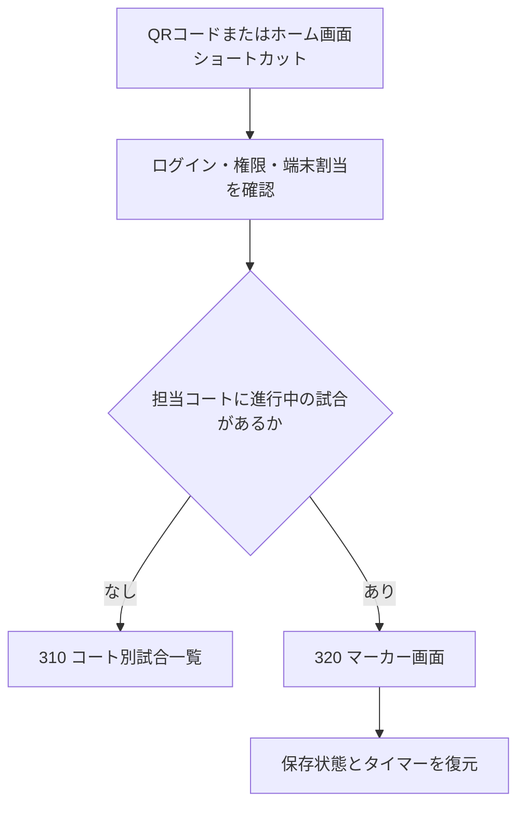

# コート別試合一覧

# 310 コート別試合一覧

## 端末の起動・コート割当

- 運営画面でイベントとコートを指定し、イベントごと・コートごとに有効なマーカー起動用QRコードを1つ発行する。QRコードは発行元のイベントとコートにだけ使用でき、別のイベントまたは別のコートの起動には使用できない。複数日イベントでも同じイベント・コートでは同じQRコードを使用する。
- QRコードは繰り返し利用できる固定の起動用QRコードとし、端末を起動するたびに発行しない。イベント設定の開催終了日時まで有効とし、開催終了日時を過ぎた場合は自動的に使用不可とする。
- QRコードは、読み取り、端末割当、試合終了、ブラウザ終了、日ごとのコート利用終了では失効しない。イベントの開催終了日時が変更された場合は、変更後の開催終了日時を有効期限として同じQRコードを継続利用する。
- 運営者はQRコードを画像としてコピーまたは印刷し、コート前のマーカー用テーブルへ掲示できるようにする。マーカー用タブレットは掲示されたQRコードを標準カメラで読み取り、ブラウザからSquash Platformのマーカー起動ページを開く。
- QRコードには秘密情報、認証情報または操作権限を直接格納せず、イベントとコートを識別する推測困難な起動識別子だけを含める。
- 未ログインの場合はログイン後に起動処理を継続し、ログイン済みの場合は権限と担当範囲を確認して対象コートを割り当てる。QRコードの読取りだけでマーカー権限を付与しない。
- 割当完了後は、同じ端末・同じブラウザにイベント、開催日、コートの割当を保存し、通常はQRコードを再読取りせず起動できるようにする。
- 割当の変更・解除は運営画面から行い、解除後は保存済みの起動情報だけで対象コートを操作できないようにする。
- マーカー端末は事前登録された`TAB-0001`形式の端末個体番号と、ブラウザごとのインストールIDで識別する。端末個体番号はイベント・コートとは独立して固定し、マーカー画面には常時確認できる大きさで表示する。
- MACアドレス、IPアドレスおよびUser-Agentは端末の主識別子として使用しない。ブラウザデータ消去後は権限を持つ運営者が新しいインストールIDを同じ端末個体番号へ再登録する。
- QRコードの下へ同じイベント・コートを示す短い接続コードを併記する。QRコードを読み取れない場合は、共通のマーカー起動ページで接続コードを入力し、ログインと権限確認後に同じコートを起動する。接続コード自体は操作権限を付与しない。
- QRコードまたは接続コードの漏えい・誤掲示等があった場合に限り、運営者が開催終了前でも現在のコードを無効化して再発行できる。再発行後は以前のQRコードと接続コードを無効とし、イベント・コートごとに有効な組を常に1つだけとする。

### 代替端末への引き継ぎ

- 代替端末専用QRコードは発行せず、コート前に掲示した同じマーカー起動用QRコードまたは接続コードを使用する。
- 進行中試合に別端末の操作ロックがある場合、QRコードを読み取っただけでは操作権を移さず、代替端末を閲覧専用で起動して引き継ぎ確認を表示する。
- 引き継ぎにはサーバー接続を必須とする。通常引継ぎでは、旧端末に未同期操作がないことと、代替端末がサーバーの最新状態を取得できたことを確認してから操作権を移す。
- 旧端末の故障等で未同期操作の有無を確認できない場合は、担当マーカー、担当範囲のスタッフ、運営責任者またはイベント所有者が警告を確認し、理由を入力して強制引継ぎできる。代替端末はサーバーの最新状態を起点として操作を継続する。
- 引継ぎ完了時に操作権の世代番号を更新する。新端末には「`TAB-0001` → `TAB-0003`」の切替結果を表示し、旧端末には「操作は`TAB-0003`へ移動しました」と表示して閲覧専用にする。
- 旧端末から後日届いた未同期操作は新端末の記録へ自動混在させず、独立した端末別記録として競合処理する。
- QRコード読取りから進行中試合、サーバー上の最新得点、引継ぎ確認、`SCR-MKR-321`表示までを短い一連の操作とし、目標所要時間を20～30秒とする。

## ショートカット起動

- 初回割当後は、ブラウザの「ホーム画面に追加」でマーカー起動ページのショートカットを作成する方法を推奨する。
- ショートカットはコート別の秘密情報をURLへ埋め込まず、保存済みの端末割当を読み出して起動する共通URLとする。
- PWA（Webサイトを端末上でアプリのように起動できる仕組み）としてインストール可能にし、対応端末ではホーム画面のアイコンから全画面に近い表示で即時起動できる構成を候補とする。
- 大会当日は、端末の自動ロック時間、画面回転、通知音・振動、バッテリー、Wi-Fiを事前確認する。OSごとの設定手順は運用手順書で定める。

## 起動時の遷移

- 起動後は、保存された割当の `310 コート別試合一覧` を基本の入口とする。
- 担当コートに進行中の試合がある場合は、一覧操作を待たず `320 マーカー画面` を表示する。
- 進行中には、ウォームアップ中、試合開始前インターバル中、ゲーム間インターバル中、試合中、中断中、Injury Timeを含む。
- 複数の進行中試合が検出された場合は自動選択せず、競合警告と対象試合を表示して運営者確認を求める。
- 保存済み割当が無効、期限外、解除済み、または権限不足の場合は操作画面へ進めず、再割当または運営者への確認を案内する。

起動判定に使用する正式な内部コードは `yaml/state-machine.yaml` の `match_state_machine.states` とし、マーカー機能独自の別名を作らない。複数の進行状態をまとめる独自コードは設けず、必要な判定では以下の正式コードを明示する。

| 内部コード | 画面表示 | 320への自動復帰対象 |
|---|---|---|
| `warmup` | ウォームアップ中 | ○ |
| `preparing` | 試合開始前インターバル | ○ |
| `in_progress` | 試合中 | ○ |
| `interval` | ゲーム間インターバル | ○ |
| `injury_time` | Injury Time | ○ |
| `suspended` | 中断中 | ○ |

## 画面

| 画面ID | 画面名 | 端末 | アクセス |
|---|---|---|---|
| SCR-MKR-311 | コート別当日試合一覧 | スマートフォン／タブレット | Write |

選択されたコートについて、当日に予定されている試合だけを表示する。

ここでいう「当日」は単純な0時から24時までではなく、イベント設定で登録した開催日と、その開催日・コートごとの利用開始時刻から利用終了時刻までの範囲とする。310は選択中の開催日・コート利用時間へ配置された公開済みスケジュールを表示する。

## 参照するスケジュール

- 310は公開済みスケジュールの最新版だけを参照する。
- 運営者がスケジュールまたはドローを下書き編集中の場合、変更内容を310へ反映しない。新しい版を公開した時点で表示を切り替える。
- 公開済みスケジュールで対戦選手が未確定の場合は進出元試合を表示し、BYE、棄権、試合授与、中止等は専用ラベルで通常の選手と区別する。

## 表示項目

- 大会名、コート番号、現在時刻
- 予定開始・終了時刻
- カテゴリ、ラウンド
- 左右の選手名
- 試合状態
- 現在ゲーム番号またはインターバル等の進行詳細
- 終了済みの場合はゲームカウント
- 最終更新時刻、通信・同期状態

## 表示順と「次の試合」

- 試合は運営者が公開したコート内の試合順を優先し、同順位の場合は有効な開始予定時刻の早い順に表示する。
- 「次の試合」は、進行中または終了済みの試合を除く開始可能な試合のうち、公開済みの試合順が最も早い1件とする。
- 運営者がスケジュールの試合順、開始予定時刻またはコートを変更して公開した場合は、その最新版に基づいて「次の試合」を再計算する。
- 終了済み試合も一覧から折りたたまず、試合順を保ったままグレー等の低い強調度で表示し、ゲームカウントと試合結果を表示する。

## 一覧の自動更新

- スケジュール公開、コート変更、選手確定・変更、棄権、試合授与、中止、試合状態、結果を、ページ再読込なしで一覧へ反映する。
- 通常時はWebSocketによるサーバー通知で更新する。
- WebSocketが切断された場合は自動再接続を行い、再接続までの間は数秒間隔のAPIポーリングへ自動的に切り替える。
- WebSocket再接続時は、サーバーから公開済みの最新状態を取得してから通知の受信を再開し、切断中の更新漏れや重複反映を防ぐ。
- APIポーリングの間隔はシステム設定で変更可能とし、初期値は性能試験と会場ネットワーク試験で決定する。
- 通信切断時は最後に取得した一覧を残し、オフライン表示と最終更新時刻を明示する。通信復旧後は公開済み最新版へ自動同期する。

## 表示ルール

| 状態・区分 | 表示 |
|---|---|
| 予定 | 開始予定時刻前の未開始試合として通常表示 |
| 未開始 | 開始予定時刻を過ぎても開始していないことを表示。5分以上経過した場合は遅延も併記 |
| 次の試合 | 強調表示と「次の試合」ラベル |
| ウォームアップ／準備中 | 状態ラベルを表示し、320への復帰対象とする |
| 試合中 | 強調色と「試合中」ラベルを表示し、`第1ゲーム`、`第2ゲーム`等の現在ゲーム番号を併記 |
| インターバル | 「インターバル」と直前または次のゲーム番号を表示 |
| 中断中／Injury Time | 理由またはタイマーを表示し、320への復帰対象とする |
| 終了 | グレー等で目立たなくし、ゲームカウントと試合結果を表示 |
| 中止 | 中止ラベルと、登録されている場合は理由を表示 |
| 棄権・試合授与 | 終了種別を明示 |

`予定`と`未開始`は内部状態を増やさず、どちらも `scheduled` とする。表示時点が有効な開始予定時刻より前なら`予定`、開始予定時刻以降なら`未開始`と表示する。`遅延`は共通仕様に従い、未開始のまま開始予定時刻から5分以上経過した場合に併記する。

試合状態と進行詳細は分けて扱う。例えば内部状態 `in_progress` を「試合中」、現在ゲーム番号を「第2ゲーム」として同時に表示する。内部状態 `interval` は「インターバル」とし、どのゲーム間かを補助表示する。

カテゴリ名、ラウンド名、選手名、状態等は表示枠内で折返しできる場合は折り返す。操作性を損なう場合は末尾を`…`で省略し、試合カードの詳細表示で全文を確認できるようにする。

## 試合開始

開始前の試合をタップすると、選手、コート、予定時刻を含む確認ダイアログを表示する。

- キャンセル：状態を変えず一覧へ戻る。
- 開始：対象試合の開始確定と操作端末ロックをサーバー側の一つの処理として実行し、成功後にマーカー画面へ遷移してウォームアップを開始する。
- 二重タップ、同一ブラウザの複数タブ、別端末から同時に開始された場合も、同じ試合を重複開始しない。同じ開始要求は一度だけ処理する。
- オフライン中は新しい試合を開始できない。310で新規試合を開始するにはサーバー接続と最新の公開済みスケジュールの確認を必須とする。
- オフライン対応は、オンラインで試合開始を確定して必要データを端末へ保存した後から、その試合を終了するまでの継続操作を対象とする。
- 同じコートで別の試合に有効な操作端末ロックが残っている場合は開始不可とする。
- 前の試合が未終了状態でも、有効な操作端末ロックがなく実際には終了している場合は警告後に開始できる。警告には未終了試合、状態、予定時刻を表示する。
- 未終了警告を確認して後続試合を開始した場合は、前の試合を「未終了のまま後続試合開始」として運営者側のスケジュールへ表示し、確認者、後続試合、開始日時を記録する。

## 誤終了した試合の再開

- マーカーが誤って通常の試合終了を確定した場合は、終了済み試合から再開操作を選択できるようにする。
- 再開時は対象試合、終了結果、再開後に復元するゲーム・得点・サーブ状態を表示して確認を求め、再開操作を監査ログへ記録する。
- 再開後は、誤終了直前のマーカー状態へ戻して320を表示する。
- 終了結果によって未開始の後続試合へ勝者が仮反映されている場合は、再開確認画面へ影響を表示し、再開確定時にその反映を取り消して進出元試合の結果待ちへ戻す。公開結果と表示端末も再開状態へ同期する。
- 同じコートで別の試合がすでに進行中の場合、または確定結果を使用する後続試合がすでに開始している場合も、担当マーカーまたはイベント運営者は再開できる。ただし影響範囲を警告し、開始済みの別試合へ選手変更を自動反映しない。
- 棄権、試合授与、中止となった試合も、担当マーカーまたはイベント運営者が履歴リセット・再入力によって訂正できる。

## 試合終了後のUNDO・結果再入力

- マーカーは、終了、棄権、試合授与または中止となった試合について、試合終了後もUNDOおよび結果訂正を行える。
- 試合終了直後のUNDOでは、終了操作を取り消して終了直前の状態へ戻し、その後も通常のUNDOを続けられる。
- 結果を最初から訂正する場合は「履歴をリセットして再入力」を選択できる。対象試合、現在の結果および後続試合への影響を表示し、確認後に訂正セッションを開始する。
- 訂正セッションでは、得点、判定、サーブ権、サービスボックス、ゲーム結果、タイマー、Conduct、Injury Timeおよび終了種別を含むマーカー操作履歴をすべてリセットし、試合開始時点からスコアを入力し直せる。
- 過去ゲームの一部分だけを直接書き換える方式は採用せず、訂正時は操作履歴全体を再入力する。これにより、得点、サーブ権、判定およびゲーム結果の不整合を防ぐ。
- 再入力中の内容は下書きとして保存し、確定するまでは従来の正式結果を大型表示、OBS、観客画面、順位計算および後続試合へ使用する。
- 再入力を確定した時点で、新しい操作履歴と試合結果を正式記録へ一括反映する。確定前に中止した場合は従来の正式結果を維持する。
- 未開始の後続試合に旧結果が反映されている場合は、新しい正式結果で組合せを再計算する。後続試合が開始済みの場合は自動的に選手を入れ替えず、運営者画面へ要確認の警告を表示する。
- リセット前の操作履歴は通常画面の正式記録から除外するが、削除者、削除日時、削除理由および削除前の内容を監査記録として保存する。

