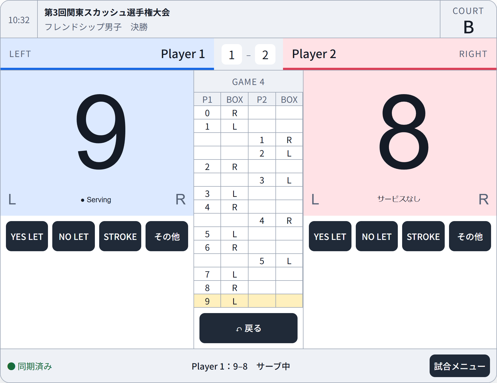
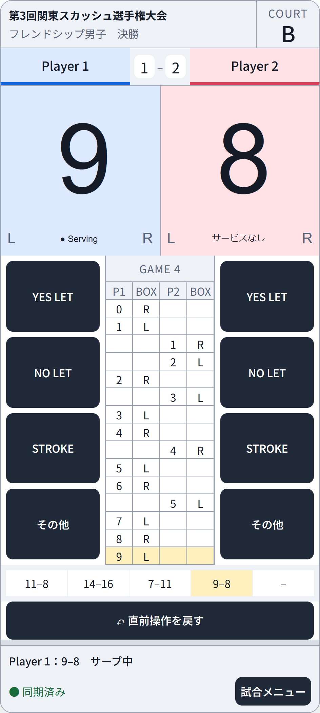

# マーカー画面

## 320 マーカー画面

### 画面

| 画面ID | 画面名 | 内容 |
|---|---|---|
| SCR-MKR-321 | マーカー画面 | 得点・判定・試合進行 |
| SCR-MKR-322 | クイック設定・選手表示設定 | クイック試合情報、試合方式、タイマー、選手名、選手色 |
| SCR-MKR-323 | ゲーム詳細 | 過去ゲームの結果とボード |
| SCR-MKR-324 | その他判定 | Conduct、Injury、Forfeit |
| SCR-MKR-325 | タイマー | ウォームアップ、準備、休憩、Injury |
| SCR-MKR-326 | 試合終了確認 | 勝者、ゲーム数、終了理由 |

### 試合情報ヘッダー

- イベント名
- カテゴリ
- ラウンド
- コート番号
- 左右の選手名
- 左右のゲーム獲得数
- 通信・同期状態

端末OSが表示する時刻、アンテナ、Wi-Fi、バッテリー等のステータスバーはアプリの表示項目に含めない。

### 選手表示

- 初期色は左選手を青、右選手を赤とする。
- 選手枠のタップで表示色を変更できる。
- 通常モードの選手名は登録済み試合情報から取得する。
- クイックモードでは選手名を空欄のまま使用でき、マーカー画面の設定から後で変更できる。
- 選手間の数字は現在得点ではなくゲーム獲得数とし、ゲーム結果から自動計算する。
- 選手色はマーカー、大型表示、OBS、履歴、ダイアログで統一する。

### 画面デザイン方針

提示された縦画面・横画面案を、`SCR-MKR-321` のレイアウト基準とする。見た目の再現そのものではなく、試合中に迷わず操作できること、得点と操作対象を瞬時に判別できること、誤操作後に直ちに戻せることを優先する。

#### 参考画像（初期デザイン案・調整中）

以下の画像は、画面構成、情報の優先順位、ボタンと文字の大きさを確認するための初期デザイン案である。色、余白、文字サイズ、ボタン位置、マーカーボードの幅等は、実機での操作確認後に調整する。

**横画面**



**縦画面**



#### 情報の優先順位

| 優先度 | 情報・操作 | 方針 |
|---|---|---|
| 1 | 左右の現在得点 | 画面内で最も大きく表示し、得点領域全体を該当選手への加点ボタンとする |
| 2 | `YES LET`、`NO LET`、`STROKE`、その他判定 | 左右の対象選手との位置関係を崩さず、大型ボタンで表示する |
| 3 | 選手名、ゲーム獲得数、サーブ権、サービスボックス | 得点の近くへ固定し、色だけでなく位置と文字でも識別できるようにする |
| 4 | 現在ゲームのマーカーボード、終了ゲーム結果 | 得点操作を妨げない中央領域または下部へ配置する |
| 5 | イベント名、カテゴリ、ラウンド、コート、同期状態 | 画面上部へまとめ、試合操作領域を圧迫しない高さにする |

#### 共通レイアウト

- 左選手は常に画面の左側、右選手は常に画面の右側とし、端末回転時にも左右を入れ替えない。
- 左右の得点領域は同じ大きさとし、現在得点、選手名、ゲーム獲得数、サーブ権、`L`／`R`を一つの選手領域として視覚的にまとめる。
- 現在得点は1桁・2桁で欠けたり重なったりしないようにする。3桁以上になった場合は領域内で自動縮小するが、改行や省略はしない。
- 得点数字には、遠目でも`0`、`6`、`8`、`9`等を識別しやすく、桁幅が変化しにくい数字書体を使用する。7セグメント風の表現を採用する場合も装飾より判読性を優先する。
- 選手色は識別補助として背景またはアクセントへ使用する。文字と背景のコントラストを確保し、サーブ権は`Serving`等の文字とアイコンを併記する。
- 得点タップ後は、得点数字の短い視覚変化と必要に応じた振動で入力受付を通知する。効果によって次の操作を待たせない。
- 画面端、ノッチ、ホームインジケーター等のセーフエリアを避け、重要なボタンを端末のシステム操作と重ねない。
- 主要な試合操作はスクロールなしで使用できるようにする。マーカーボードの履歴部分だけは領域内スクロールを許可する。

#### 横画面

```text
┌──────────────── 試合情報ヘッダー ────────────────┐
│ 左選手・ゲーム数 │ 中央情報 │ 右選手・ゲーム数 │
├──────────────┬────────┬──────────────┤
│              │マーカー│              │
│  左得点領域  │ボード  │  右得点領域  │
│              │        │              │
├──────────────┼────────┼──────────────┤
│ 左判定ボタン │ 戻る等 │ 右判定ボタン │
└──────────────┴────────┴──────────────┘
```

- 左右の得点領域を画面幅の大部分へ配置し、中央に縦長のマーカーボードを表示する。
- `YES LET`、`NO LET`、`STROKE`、その他判定は、対象となる選手側の得点領域直下に横並びで配置する。
- 横幅が不足する場合は判定ボタンの間隔、補助情報、中央ボード幅の順で調整し、得点文字とボタン文字を先に小さくしない。

#### 縦画面

```text
┌──────────── 試合情報ヘッダー ────────────┐
│ 左選手・ゲーム数 │ 右選手・ゲーム数 │
├──────────────────────────────┤
│      左得点領域 │ 右得点領域       │
├─────────┬──────────┬─────────┤
│左判定   │マーカー  │右判定   │
│ボタン列 │ボード    │ボタン列 │
├─────────┴──────────┴─────────┤
│ 終了ゲーム結果・戻る・補助操作             │
└──────────────────────────────┘
```

- 左右の得点領域を上段へ同じ幅で並べ、縦方向にも十分な高さを確保する。
- 得点領域の下は、左判定ボタン列、中央マーカーボード、右判定ボタン列の3列とする。
- 各選手側の`YES LET`、`NO LET`、`STROKE`、その他判定を縦に並べ、片手でも押しやすい高さを確保する。
- 終了ゲームの結果と「戻る」等の補助操作は下部へ配置し、現在得点と判定操作より目立たせない。

#### ボタン・文字サイズ

- 標準的なタブレットでは、主要ボタンのタップ領域を56×56 CSSピクセル以上、主要ボタン間の間隔を8 CSSピクセル以上とすることを推奨値とする。
- 標準的なタブレットでは、選手名24、判定ボタン20、主要な状態文字18、補助情報16 CSSピクセル相当以上を推奨値とし、得点数字は領域内で可能な限り最大化する。
- OSやブラウザの文字拡大を妨げない。文字拡大時は補助情報を折り返しまたは省略できるが、得点、選手名、判定、サーブ権、同期エラーは隠さない。
- 対象端末の最小画面サイズは設けず、画面サイズを理由に利用を禁止しない。簡略表示へ切り替える画面幅の境界値も設けない。
- 小さい画面では、得点、選手領域、マーカーボード、判定ボタン、UNDO、状態およびタイマーを含む画面全体を同じ比率で縮小し、機能や操作ボタンを省略せず表示領域内へ収める。
- 小さい画面では推奨するタップ領域、間隔および文字サイズを下回ることを許容する。操作性が低下しても、文字や操作を切り落としたり、別の簡略機能へ置き換えたりしない。
- 操作名と状態ラベルは折返しまたは文字縮小によって全文を表示し、省略記号だけで意味を隠さない。選手名、カテゴリ名等の可変文字列は既定の折返し・省略表示ルールを適用し、詳細表示で全文を確認できるようにする。

#### 操作安全性

- 得点領域は大きくする一方、選手名、ゲーム獲得数、ヘッダー、マーカーボードのタップでは加点しない。
- 得点入力時は確定対象側を短時間強調し、直前操作の内容を「戻る」ボタン付近へ常時表示する。
- `YES LET`は得点を変更しないため確認なしで記録できる。得点や試合状態を大きく変更する判定は既存の確認ルールに従う。
- 無効な操作はボタンを消すだけでなく、無効状態として表示し、現在押せない理由を確認できるようにする。
- 横画面と縦画面で機能、左右の意味、ボタン名を変えず、配置変更だけで操作を継続できるようにする。

