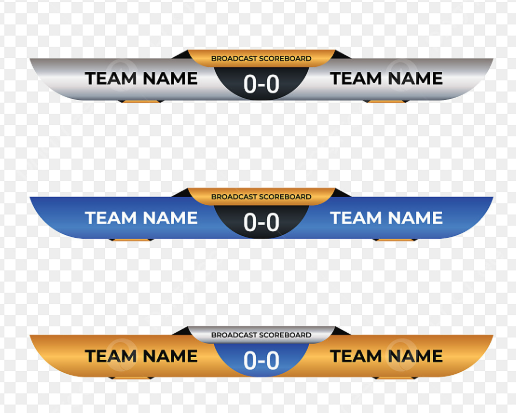
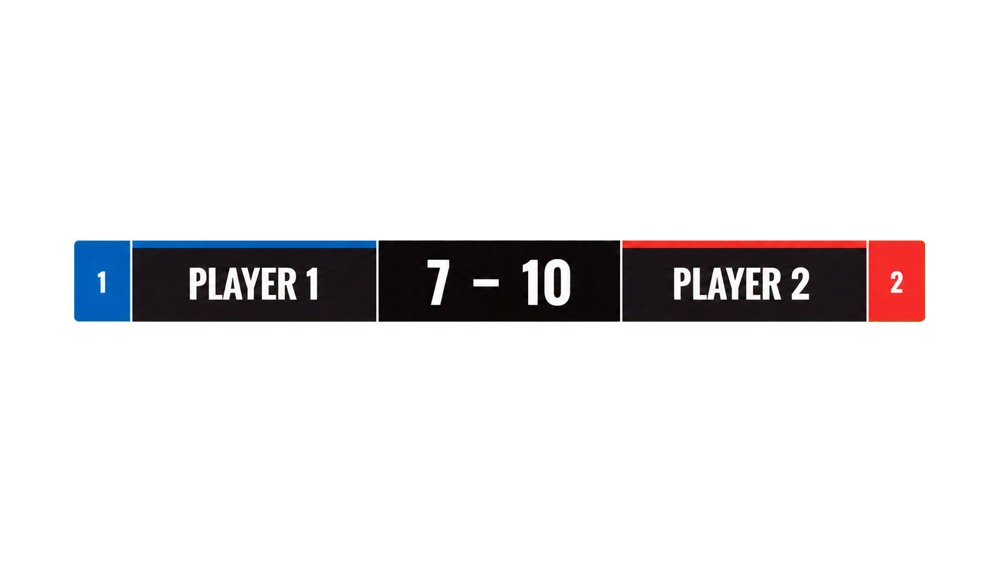

# OBSオーバーレイ連携

## 380 OBSオーバーレイ連携

- コートまたは試合ごとのURLをOBS Browser Sourceで利用できるようにする。
- OBS連携はフェーズ2で導入し、約10種類を目標とするプリセットレイアウトからイベントごとに1種類を選択できるようにする。正確な提供数と各デザインはUI設計で確定する。
- 各プリセットは、試合中、ウォームアップ・インターバル中、判定結果表示時のレイアウトを一組として持つ。
- 帯の形状、画面内の配置、文字の見せ方、枠・アクセント、選手色の適用方法をプリセットごとに変更できるようにする。
- イベント設定では、プリセットのサムネイルと実際の選手名・得点を使ったプレビューを確認して選択できるようにする。
- テーマ、任意表示項目のON／OFF、アニメーションの個別調整は段階的な拡張とする。選手名、現在得点、ゲーム獲得数、選手色はすべてのプリセットの必須表示項目とし、非表示にはしない。
- マーカー画面と同じ確定状態を表示し、配信画面から試合状態を変更できないようにする。
- OBSのシーンを判定のたびに切り替えず、背景透過の標準オーバーレイ内で中央ダイアログを表示・非表示にする。

### 試合中の標準オーバーレイ

- 配信映像へ常時重ねる標準オーバーレイには、左右の選手名、現在ゲームの得点、左右のゲーム獲得数、左右の選手色を表示する。
- 左右の選手色は、各選手領域の背景、帯またはアクセントとして使用し、どちらの選手の情報かを瞬時に識別できるようにする。
- 選手色だけに依存せず、左右の配置、選手名、数値の位置でも選手を識別できるようにする。文字と背景は十分なコントラストを確保する。
- 現在得点とゲーム獲得数は別の数値領域に表示し、混同しないよう位置と大きさで区別する。離れた位置から読みにくい小さな補助ラベルは表示しない。
- 表示の優先順位は、現在得点、選手名、ゲーム獲得数の順とし、ゲーム獲得数は現在得点および選手名より小さく表示する。
- オーバーレイ以外の領域は透過し、カメラ映像を必要以上に隠さない。配置、帯の形状、余白等はイベント設定で選択したレイアウトを使用する。

#### 参考画像（OBSオーバーレイの構成例）

参考画像は、左右の選手情報と中央の数値を横長の帯へまとめる構成例である。色、形状、文言、寸法をそのまま採用するものではなく、Squash Platformの実画面では現在得点とゲーム獲得数をそれぞれ判別できるように配置する。

#### 参考サンプル（プリセット候補01）

- 仮称：シンプルスコア帯
- 左右に選手名とゲーム獲得数、中央に現在得点を配置する。
- 離れた位置から読みにくい小さな補助ラベルは表示せず、選手名と数値を大きく表示する。
- ゲーム獲得数は補助情報として左右端へ小さく表示し、中央の現在得点を最も大きくする。
- 直線的な5区画を基本とし、斜め形状、立体表現、影、グラデーション等の装飾を使用しない。
- 左選手を青、右選手を赤のアクセントで区別するが、左右位置と選手名でも識別できる。
- 画像の背景は透過済みであり、OBSのカメラ映像へ重ねた状態を確認できる。
- この画像をプリセット候補01の参考サンプルとする。最終的な寸法、配色、文字サイズは配信映像へ重ねた実機確認後に調整する。
- 実装時は固定画像ではなく、Browser Source上のHTML等で選手名、得点、ゲーム獲得数、選手色を動的に反映する。

### 判定結果ダイアログ

- `YES LET`、`NO LET`、`STROKE`の確定時は、英大文字の判定結果を配信映像の中央へ大きく表示する。
- 初期表示時間は3秒とする。表示中に新しい判定が確定した場合は、最新の判定へ置き換えて表示時間を数え直す。
- 表示中の判定イベントを取り消した場合は、ダイアログを直ちに閉じ、訂正後の得点とサーブ状態を反映する。
- 一時的な判定イベントにはイベントID、発生日時、有効期限を持たせ、通信復旧またはBrowser Source再読込後に有効期限を過ぎた判定を再表示しない。

### ウォームアップ・インターバル表示

- `warmup`、`preparing`、`interval`の間はスポンサーのロゴと表示コメントを主表示とし、状態とタイマーを中央へ重ねない。
- `WARM-UP`または`INTERVAL`、残り時間を画面下部の状態表示領域へ表示する。インターバル中は次のゲーム番号も表示する。
- 残り時間はサーバーに保存された終了予定日時と現在日時の差から計算し、Browser Sourceを再読込または再接続した場合も復元する。
- タイマーが一時停止されている場合は、停止時点の残り時間と `PAUSED` を下部へ表示する。
- 残り時間が0になった場合、または次ゲーム開始により試合状態が `in_progress` へ遷移した場合は、ウォームアップ・インターバル用の下部表示を直ちに閉じる。
- OBSオーバーレイのレイアウトはイベント設定で選択する。初期レイアウトは「スポンサー主表示＋状態・タイマー下部表示」とし、選択肢の追加は段階的な拡張とする。
- どのプリセットを選択した場合も、ウォームアップ・インターバル中はスポンサーを主表示とし、状態・タイマーを下部へ表示する情報優先順位を維持する。

