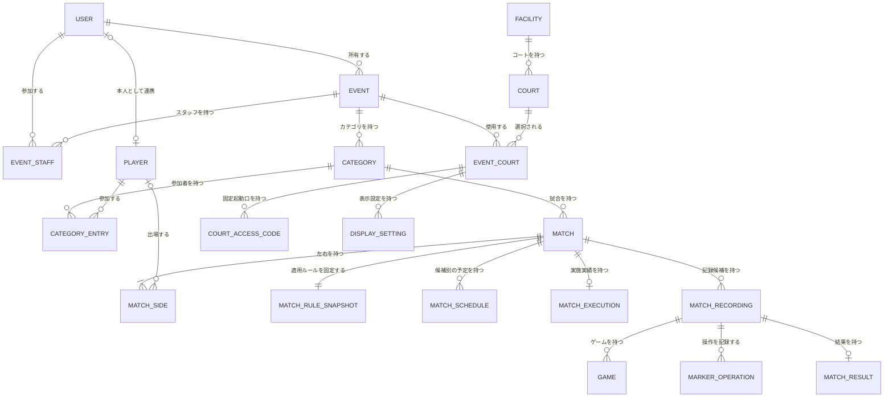
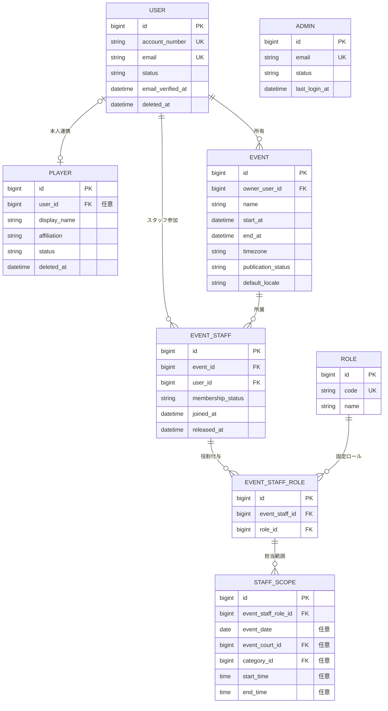
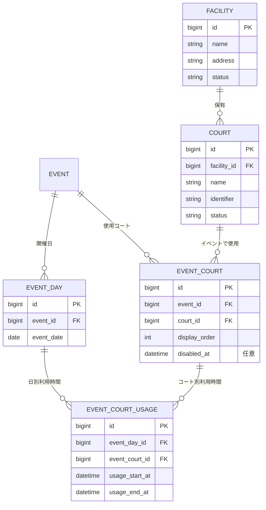
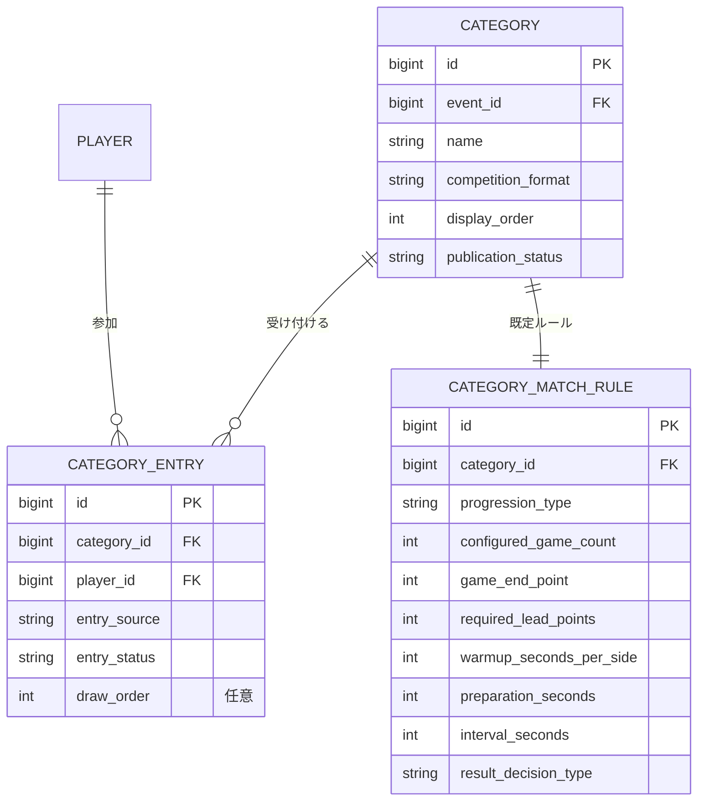
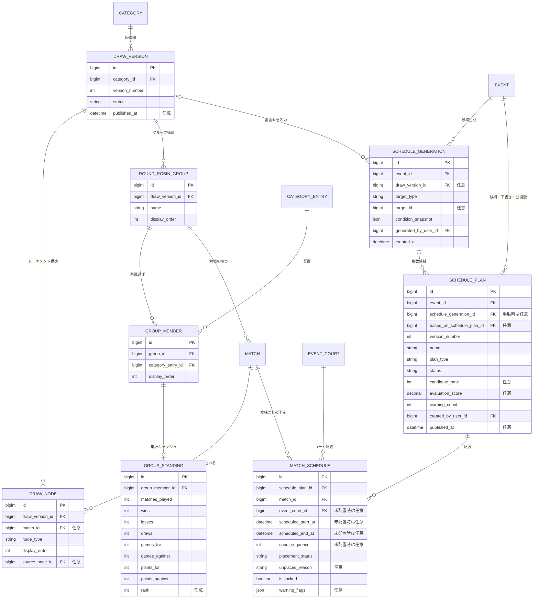
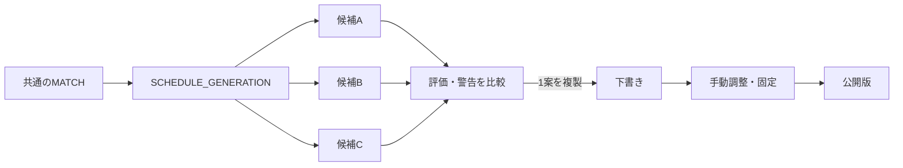
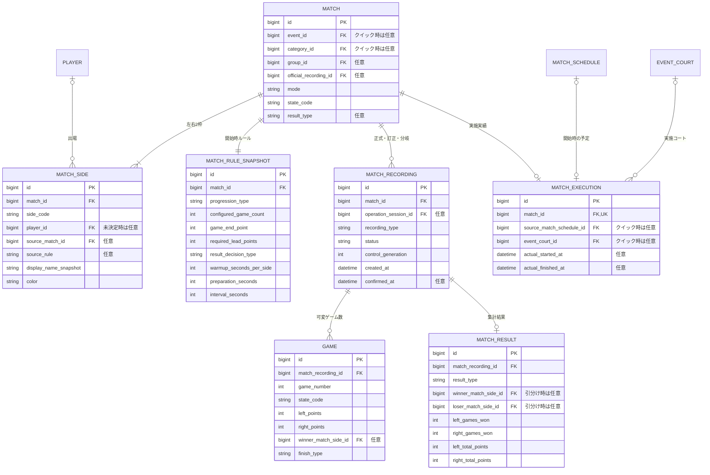
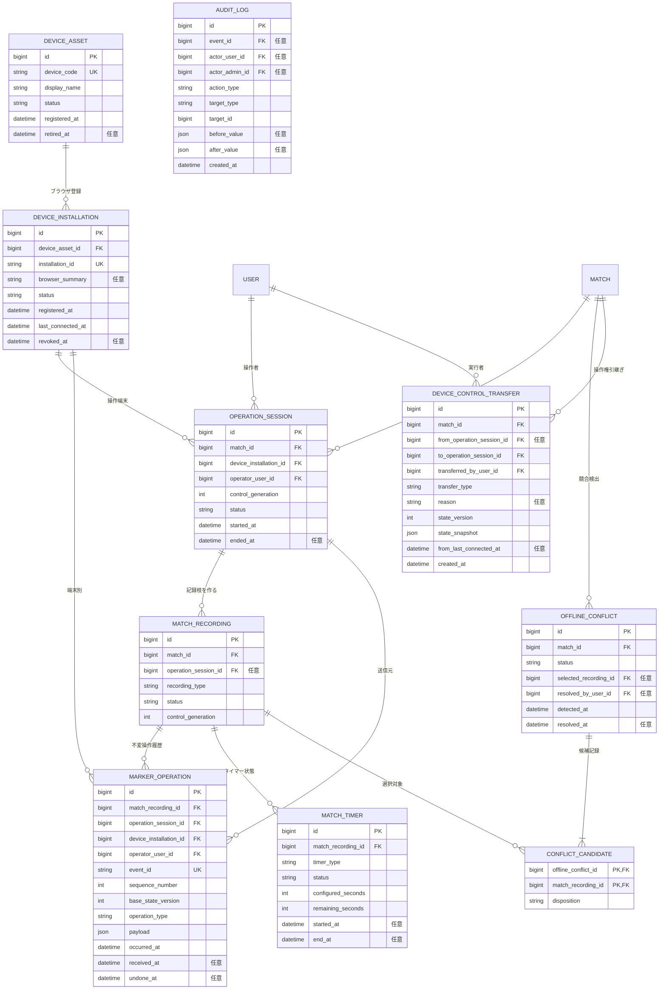
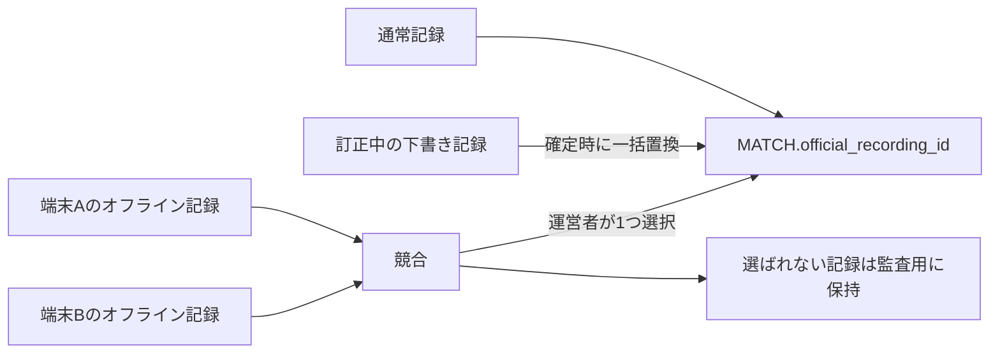
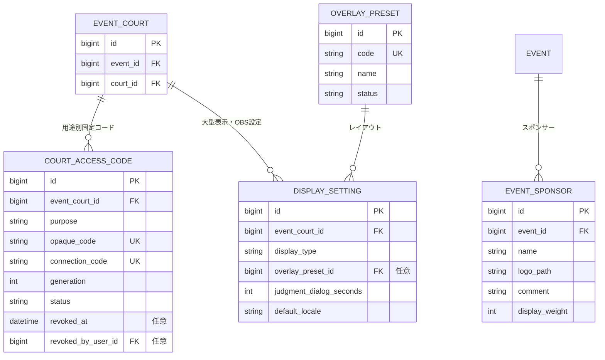

# Squash Platform 概念ER設計

## 位置づけ

本書は、要件から論理テーブル設計へ進むための概念ER設計である。エンティティ名と主要項目は論理設計の候補であり、MySQLの物理テーブル名、型、桁数、インデックスおよびマイグレーションは詳細設計で確定する。

- 確認時点：2026年8月7日
- 対象：フェーズ1の大会運営・マーカー・大型表示を中心とし、グループ戦、OBS、多言語等の拡張点を含む
- 正式な試合状態コード：[`yaml/state-machine.yaml`](yaml/state-machine.yaml)
- 画面との対応：[`ScreenFlow.md`](ScreenFlow.md)

## 決定済みの設計原則

1. 通常ユーザーとプラットフォーム管理者の認証テーブルを分離する。
2. 運営者、スタッフ、マーカー、選手は共通の通常ユーザーを使用し、イベント単位で役割を付与する。
3. 選手は通常ユーザー登録なしでも運営者が登録できるため、`PLAYER`を`USER`と分離し、利用者との関連を任意とする。
4. ゲームを`game1`～`game5`の固定列にせず、試合記録に対する複数行として保持する。
5. フェーズ1の画面は1・3・5ゲームの先取制とするが、保存構造ではゲーム数を奇数や5以下に固定しない。
6. 引き分けでは勝者・敗者を設定せず、試合状態を`finished`にできるようにする。
7. 得失ゲーム・得失点は、保存した全ゲーム得点から再計算できるようにする。
8. マーカー操作は履歴として保持し、現在得点だけを上書きする構造にしない。
9. 訂正中記録とオフライン分岐は正式記録へ自動混在させず、試合が参照する正式記録を1つ選択する。
10. マーカー用と大型得点ボード用のQRコードは、イベント・コート・用途ごとに固定し、イベント開催終了まで再利用する。

## 1. 全体構成

## 2. アカウント・イベント・権限

`PLAYER.user_id`は任意とする。運営者が登録した選手と、後から通常ユーザー登録した本人を安全に関連付ける手順は検討中とする。

## 3. 会場・コート・開催時間

イベントとコートを直接多対多にせず`EVENT_COURT`を置き、表示順、固定QRコード、表示設定、スケジュール等のイベント固有情報の親とする。

## 4. カテゴリ・参加者・ルール

`progression_type`はフェーズ1で`best_of`を使用し、将来`fixed_game_count`を追加できるようにする。`configured_game_count`は正の整数として設計し、データベースで`1`、`3`、`5`だけに制限しない。

## 5. ドロー・グループ・スケジュール

- 対戦組合せは`MATCH`へ1件だけ作成し、候補ごとに`MATCH`を複製しない。候補間で異なるコート、開始時刻、試合順は`MATCH_SCHEDULE`で表す。
- `SCHEDULE_GENERATION`は、自動生成に使用したドロー版、対象範囲、制約条件および実行者を保存する。同じ生成単位から複数の`SCHEDULE_PLAN`を作成できる。
- `SCHEDULE_PLAN.status`は少なくとも`candidate`、`draft`、`published`、`archived`を区別する。自動生成を使用しない手動下書きでは`SCHEDULE_GENERATION`を任意とする。
- 運営者が候補を選択した場合は、候補を直接変更せず、`based_on_schedule_plan_id`で元候補を示す下書きを複製して編集する。
- 公開中の`SCHEDULE_PLAN`だけをパブリック画面、310コート別試合一覧および大型表示へ反映し、新しい版を公開するまでは以前の公開版を継続表示する。
- `evaluation_score`は候補比較用の総合値とし、必須条件違反や休憩時間の偏り等の内容は`warning_count`と各配置の`warning_flags`で確認できるようにする。具体的な重みは検討中とする。
- 配置できなかった試合も`MATCH_SCHEDULE`から除外せず、`placement_status`と`unplaced_reason`を保存して候補間で比較できるようにする。
- `GROUP_STANDING`は全ゲーム結果から再生成可能な集計値またはキャッシュとし、各ゲーム得点を失った状態で順位だけを保存しない。
- 順位点、ゲーム得失差、得失点差、直接対決等の適用順は検討中であり、順位計算ルールの物理構造は確定しない。

### スケジュール候補の選択

候補A～Cの各案は同じ`MATCH`を参照する。採用されなかった候補も比較・監査のため保持できるが、公開表示や試合進行には使用しない。

## 6. 試合・ゲーム・引き分け

### 試合設計上の要点

- `MATCH_SIDE`を置き、左右の選手、色、表示名スナップショットを試合単位で保持する。
- トーナメントの後続試合で選手が未確定の場合は、`source_match_id`と進出条件を保持し、選手IDを必須にしない。
- カテゴリ設定が後から変更されても進行中・終了済み試合へ影響しないよう、試合開始時のルールを`MATCH_RULE_SNAPSHOT`へ保存する。
- `GAME`は行追加方式とし、偶数ゲームや5ゲームを超える規定ゲーム数制へ拡張できるようにする。
- `MATCH_RESULT.result_type`は少なくとも左勝利、右勝利、引き分け、棄権、試合授与、中止を区別する。
- `winner_match_side_id`と`loser_match_side_id`は引き分け・中止時に空を許可する。
- クイックモードも同じ`MATCH`以下を使用し、イベント専用の別得点構造を作らない。
- `MATCH_SCHEDULE`は公開された予定、`MATCH_EXECUTION`は実際の実施情報とする。試合開始時に参照した予定と実施コートを確定し、予定変更後も実績を失わないようにする。

## 7. マーカー操作・訂正・オフライン競合

### 端末識別と操作権引継ぎ

- `DEVICE_ASSET`は物理端末を表す。Squash Platformが全体で一意な`TAB-0001`形式の端末個体番号を発行し、端末本体へ同じ番号のラベルを貼付する。端末個体番号はイベントやコートが変わっても変更しない。
- `DEVICE_INSTALLATION`は物理端末上のブラウザまたはブラウザプロファイルを表す。初回登録時に推測困難なインストールIDを発行し、操作セッションとマーカー操作はこのIDを送信元として記録する。
- MACアドレス、IPアドレスおよびUser-Agentは端末識別の主キーに使用しない。User-Agent等を保存する場合も、運営者が状況を確認するための補助情報に限定する。
- ブラウザデータを消去した場合は、権限を持つ運営者が旧インストールを無効化し、新しいインストールを同じ端末個体番号へ関連付ける。
- 操作権引継ぎでは試合記録を作り直さず、`control_generation`を更新して新端末の操作セッションへ操作権を移す。旧世代の操作セッションは更新不可とし、旧端末には閲覧専用状態を通知する。
- `DEVICE_CONTROL_TRANSFER`には通常引継ぎ・強制引継ぎの区分、理由、変更前後の端末、実行者、状態バージョン、引継ぎ時点の得点・試合状態および旧端末の最終接続日時を保存する。
- 端末切替情報は運営画面とマーカー画面だけに表示し、大型得点ボード、OBSおよび観客向け画面には表示しない。

### 正式記録の選択

- 同一記録内の`sequence_number`と全体で一意な`event_id`により、順序と二重送信を検出する。
- 複数端末のオフライン操作は1本の時系列へ自動結合しない。
- 結果再入力は新しい`MATCH_RECORDING`へ保存し、確定するまで従来の正式記録を公開表示・順位計算へ使用する。
- `MARKER_OPERATION`の削除は行わず、UNDO、正式記録からの除外、訂正等を状態と監査ログで追跡する。

## 8. 固定QRコード・大型表示・OBS

### QRコードの制約

- `COURT_ACCESS_CODE.purpose`は少なくとも`marker`と`scoreboard`を持つ。
- イベント・コート・用途ごとに有効なコードは1つとし、同じコートの複数大型得点ボードで`scoreboard`コードを共有する。
- コードはイベントへコートを追加した時点で自動作成し、通常の手動発行操作を設けない。
- 有効期限はコード自身の固定日時ではなく、関連する`EVENT.end_at`を参照する。開催終了日時を変更した場合は同じコードの期限も追従する。
- 再発行時は`generation`を増やして旧コードを無効化し、印刷済みの旧QRコードが使えないことを監査ログへ残す。
- マーカー用コードは権限を付与せず、起動後に通常ユーザーのログインとイベント権限を確認する。
- 大型得点ボード用コードは閲覧専用とし、得点更新APIや運営画面への権限を持たせない。
- OBSのコート別URLも同じイベント・コートを参照するが、配信用URLの公開範囲と認証方式はフェーズ2の詳細設計で確定する。

## 9. 主な一意制約候補

| 対象 | 一意にする組合せ・条件 | 目的 |
|---|---|---|
| `EVENT_STAFF` | イベント＋ユーザー | 同じスタッフ関係の重複防止 |
| `EVENT_STAFF_ROLE` | イベントスタッフ＋ロール | 同じロールの重複付与防止 |
| `EVENT_COURT` | イベント＋コート | 同じ使用コートの重複防止 |
| `EVENT_DAY` | イベント＋開催日 | 開催日の重複防止 |
| `DEVICE_ASSET` | 端末個体番号 | 物理端末の重複登録防止 |
| `DEVICE_INSTALLATION` | インストールID | ブラウザ登録の重複防止 |
| `CATEGORY_ENTRY` | カテゴリ＋選手 | 同一カテゴリへの重複参加防止 |
| `MATCH_SIDE` | 試合＋左右コード | 1試合の左・右を各1枠に限定 |
| `GAME` | 試合記録＋ゲーム番号 | 同一記録内のゲーム番号重複防止 |
| `MARKER_OPERATION` | イベントID | オフライン再送時の二重登録防止 |
| `MARKER_OPERATION` | 試合記録＋連番 | 端末別操作順序の重複防止 |
| `SCHEDULE_PLAN` | イベント＋版番号 | 同じイベント内の版番号重複防止 |
| `MATCH_SCHEDULE` | スケジュール案＋試合 | 同じ案での二重配置防止 |
| `MATCH_EXECUTION` | 試合 | 1試合に対する実施実績の重複防止 |
| `COURT_ACCESS_CODE` | イベントコート＋用途＋有効世代 | 同用途の固定コード重複防止 |

コートと時間帯の重複、選手の同時刻重複、公開版が複数存在しないこと等は単純な一意キーだけでは表現できないため、保存・公開処理内の検証とトランザクションで保証する。

## 10. 削除・履歴方針

- ユーザー、選手、イベントスタッフ、施設、コート、カテゴリ等の参照済みデータは物理削除せず、状態または論理削除日時で無効化する。
- 試合、ゲーム、マーカー操作、結果訂正前の記録および監査ログは大会記録として保持する。
- ドロー版・スケジュール案は公開済み版や生成候補を上書きせず、新しい下書きと公開版を追加する。
- QRコード再発行時も旧コード行を削除せず、無効化日時、実行者、理由を保持する。
- 端末、ブラウザ登録および操作権引継ぎ履歴は物理削除しない。端末廃止またはブラウザ再登録時は状態と無効化日時を保存する。
- 個人情報、試合記録、監査ログ等の具体的な保存期間は検討中とする。

## 11. 論理テーブル設計前の検討事項

1. イベント所有者を`EVENT.owner_user_id`だけで持つか、イベントスタッフの所有者ロールと一本化するか。
2. 手動登録選手と後から登録した通常ユーザー本人を関連付ける確認手順。
3. トーナメントの進出元を`DRAW_NODE`で表す範囲と、`MATCH_SIDE.source_match_id`へ保持する範囲。
4. グループ順位の順位点、ゲーム得失差、得失点差、直接対決等の優先順とルール保存方式。
5. クイック試合の保存期間、一覧・検索・削除方針。
6. 試合状態を操作履歴から毎回再計算するか、`MATCH.state_code`へ現在値を併記するか。性能を考慮し、本書では現在値の併記を候補とする。
7. JSONで保持するマーカー操作別payloadの正式スキーマ。
8. 監査ログの保存期間、個人情報マスキング、管理者による閲覧範囲。
9. スケジュール候補の生成件数、評価点の重み、同点候補の表示順および候補の保存期間。
10. 複数コート試合状況モニター用の固定QRコード単位と表示設定の構造。
11. OBS Browser Source用URLの認証・失効方式。

## 関連資料

- [システムアーキテクチャ](010_SystemArchitecture.md)
- [利用者・権限](020_UserRoles.md)
- [運営者仕様](200_Operator.md)
- [マーカー仕様](300_Marker.md)
- [共通基盤](600_CommonPlatform.md)
- [画面遷移](ScreenFlow.md)
- [試合状態遷移](yaml/state-machine.yaml)
