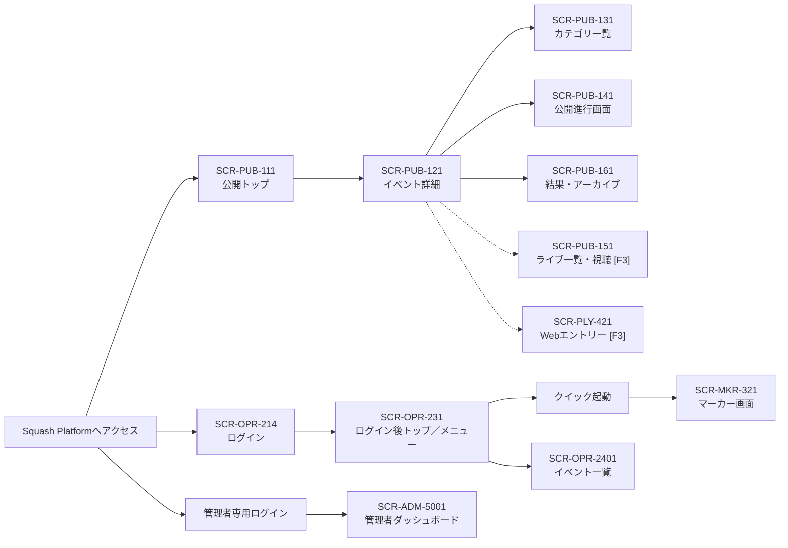
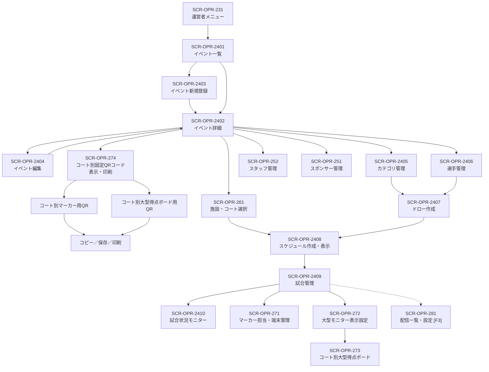
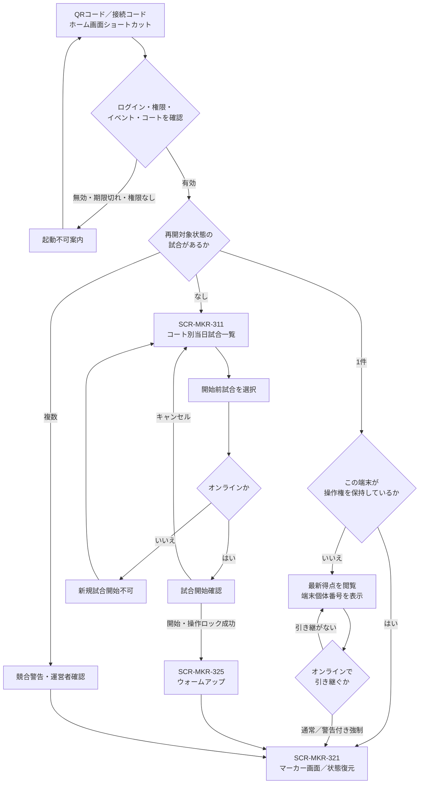
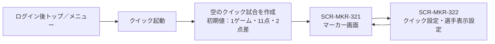
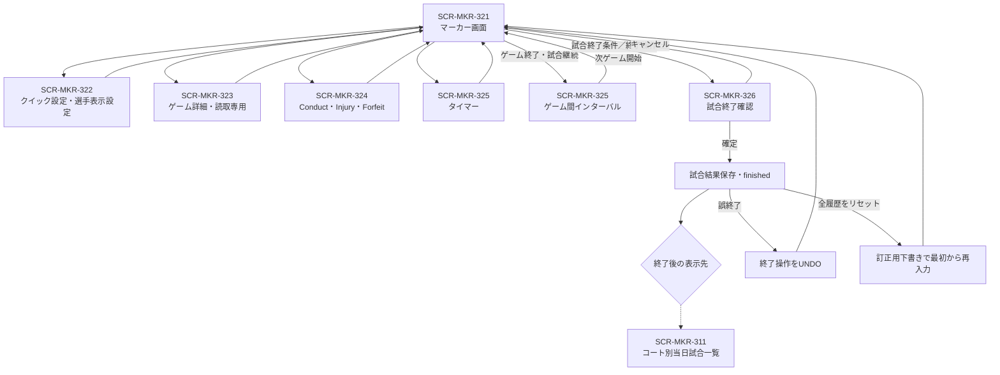
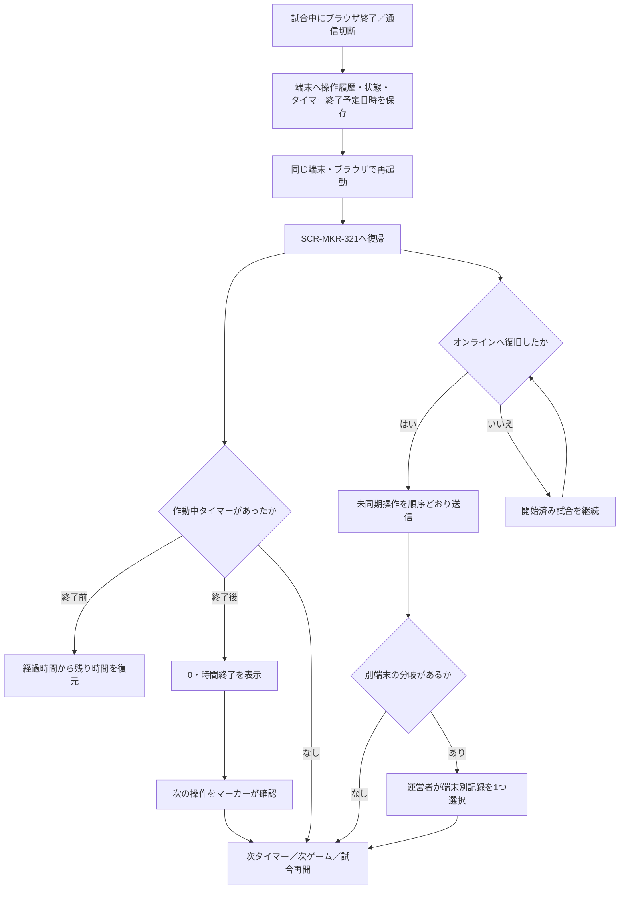
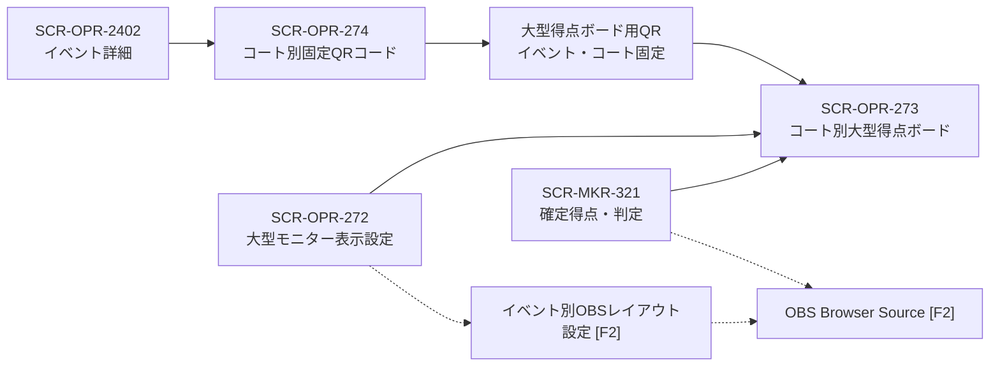
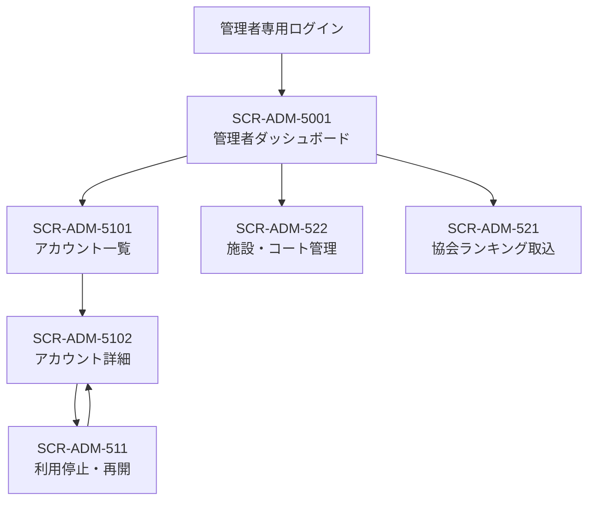

# Squash Platform 画面遷移

## 位置づけ

本書は、利用者別仕様に定義された画面の入口と主要な遷移を横断的に確認するための資料である。画面内の操作、試合状態および業務ルールの詳細は各仕様書を正本とする。

- 確認時点：2026年8月7日
- 実線：決定済みの主要遷移
- 破線：後続フェーズ、または詳細が検討中の遷移
- `[F1]`、`[F2]`、`[F3]`：提供フェーズ
- 画面IDのない確認ダイアログは、遷移元画面の一部として扱う

## 1. 全体入口

公開画面、通常ユーザー画面およびプラットフォーム管理者画面は、認証経路を分離する。クイック起動だけはフェーズ1のログイン後トップへ必ず表示し、ダッシュボードのその他の構成はフェーズ2で拡張する。

## 2. 運営者による大会準備・当日運営

フェーズ1でもドローとスケジュールは下書きへ保存し、運営者が確認してから公開する。フェーズ2のスケジュール自動生成では、`SCR-OPR-2408`内で複数候補を比較し、選択した1案を下書きへ複製して手動調整・公開する。候補および下書きは、公開するまでマーカー画面や公開画面へ反映しない。

イベントに設定した施設・コートは大会準備時点で確定しているため、イベント詳細の直下から`SCR-OPR-274`を開く。各コートのマーカー用QRコードと大型得点ボード用QRコードは固定とし、マーカー割当画面や試合管理画面を経由しない。

## 3. マーカー起動

### 3.1 通常モード

再開対象として使用する正式な試合状態は、`warmup`、`preparing`、`in_progress`、`interval`、`injury_time`、`suspended`である。独自の包括状態コードは使用しない。

### 3.2 クイックモード

クイックモードは事前入力画面と`SCR-MKR-311`を経由しない。イベント名、カテゴリ名、ラウンド名、コート番号および選手名は空欄のまま開始し、後から設定できる。

## 4. マーカー画面内の遷移

試合終了確定後に自動的に一覧へ戻すか、結果を表示したまま「一覧へ戻る」を押させるかは検討中とする。誤終了後のUNDOと全履歴リセット・再入力は、担当マーカーまたはイベント運営者が実行できる。

## 5. ブラウザ終了・オフラインからの復帰

ブラウザ不在中は、閉じた時点で動作していた1つのタイマーが0になるまでだけ経過させる。次のタイマー、ゲームまたは試合へ自動遷移しない。

## 6. 大型表示・OBSの入口

大型得点ボード用QRコードは、マーカー用とは別の固定コードとしてイベント・コートごとに作成し、同じコートの1～2台の表示端末でイベント開催終了まで再利用する。

## 7. 管理者画面

## 8. 画面遷移として残る検討事項

1. 試合終了確定後に`SCR-MKR-311`へ自動遷移するか、結果確認画面に留まるか。
2. 得点入力後にクイック設定で最大ゲーム数、ゲーム終了点または必要点差を変更した場合の確認画面と適用方法。
3. ドロー・スケジュールの公開取消を許可する条件と、取消後に表示する公開版。
4. フェーズ3のWebエントリー、決済、キャンセル待ちおよび選手マイページの詳細遷移。
5. フェーズ3の配信設定、YouTube連携および配信終了後のアーカイブ遷移。

## 関連資料

- [機能・フェーズ一覧](FunctionalIndex.md)
- [運営者仕様](200_Operator.md)
- [マーカー仕様](300_Marker.md)
- [パブリック仕様](100_Public.md)
- [選手仕様](400_Player.md)
- [管理者仕様](500_Admin.md)
- [試合状態遷移](yaml/state-machine.yaml)
